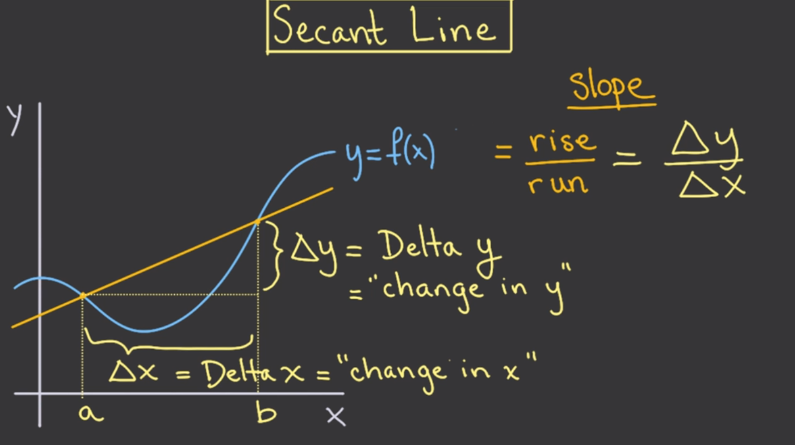
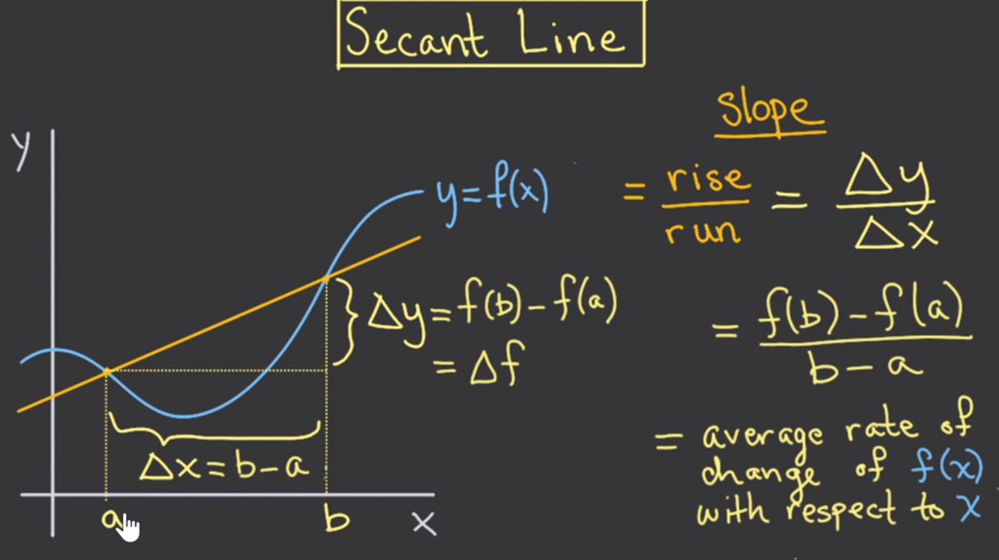
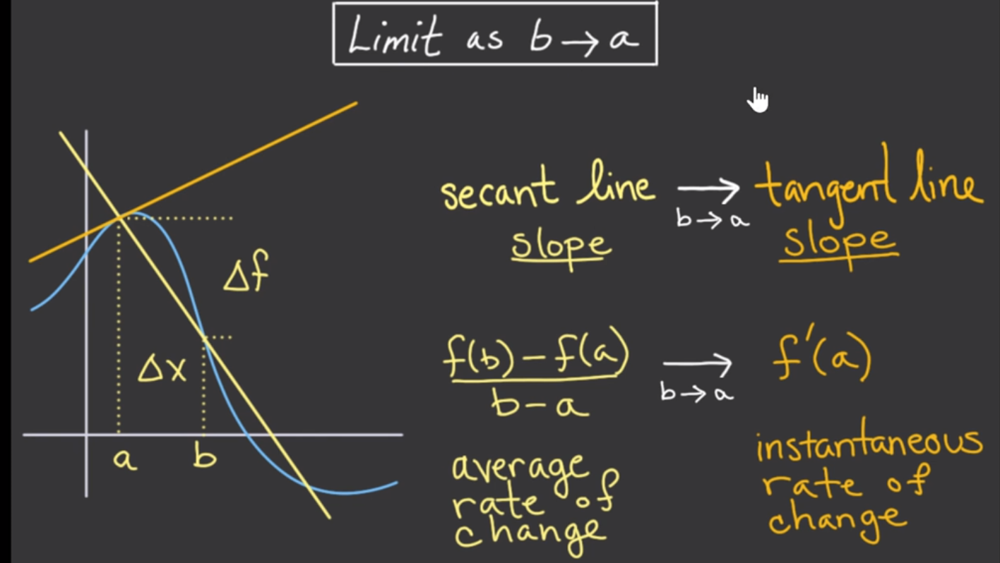
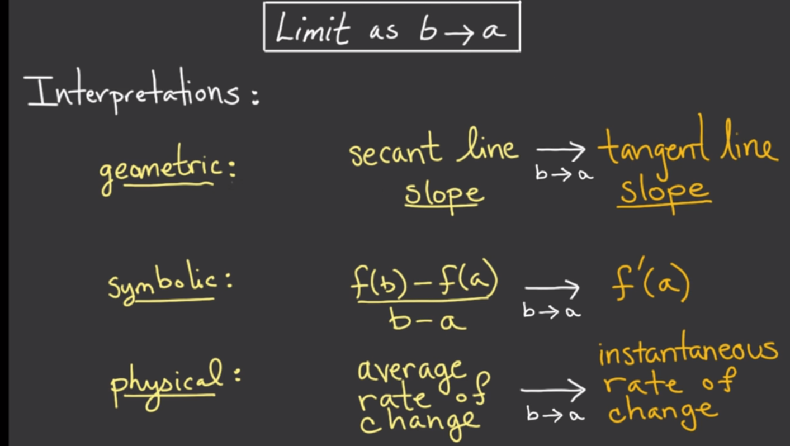

# Unit 1: The Derivative 

## Geometric interpretation of the derivative 

### Objective 
Geometric Interpretation of the Derivative: Tangent and Secant Lines

* Instantaneous rate of change

* Slope of the tangent line at that point

Objectives

At the end of this lecture, and after some practice, you should be able to:

* Understand the correspondence between rates of change (both average and instantaneous) and slopes of secant or tangent lines.

* Be able to estimate a derivative of a function at a point, given its graph.

* Determine when a derivative does not exist.

* Use$uu$ $\Delta x$ and  $\Delta y$to denote small changes.

### Tangent lines

We've seen that we can draw a tangent line. There is some sense that the tangent line goes through a point of a function in a way that it doesn't cut across the function at that point. But we have to be careful.

Let's take a moment to think about what tangent lines are not. First, though, let's start with a bad way to think about tangent lines. When first introduced to tangent lines of circles, many students learn that a tangent line is “a line that touches the curve in only one point." This is true if your curve is a circle, but for many other curves and functions, this is a terrible definition. Let's see why.

### Intuition for tangent lines

tagent line,通常意义上来说，与函数上的某个点相切的直线。

从这个角度上来说，ta是一条直线。但更及富有内涵的是，在他相切的点的附近其实与这个函数是非常吻合的，重合度很高。但随着距离这个点越来越远，不重合的程度变得越来越大。

## Secant lines

$\Delta x$,经常读作“change in x”。

### Slopes of secant lines

此处值得注意的点是，切线的斜率实际上是a,b两点的平均变化率。

### Secant and tangent lines

Now, when we defined the derivative of $f$ at $a$ , $f(x)$, we took the limit of $\displaystyle \frac{f(b) - f(a)}{b - a}$ as  $b$approached $a$. We've just seen that this quantity is the slope of the secant line that connects the points  $(a,f(a))$and $(b,f(b))$.

### Limits of secant lines

这揭示了secant line 与 tangent line之间的关系。

从三种角度解释deruvative。
