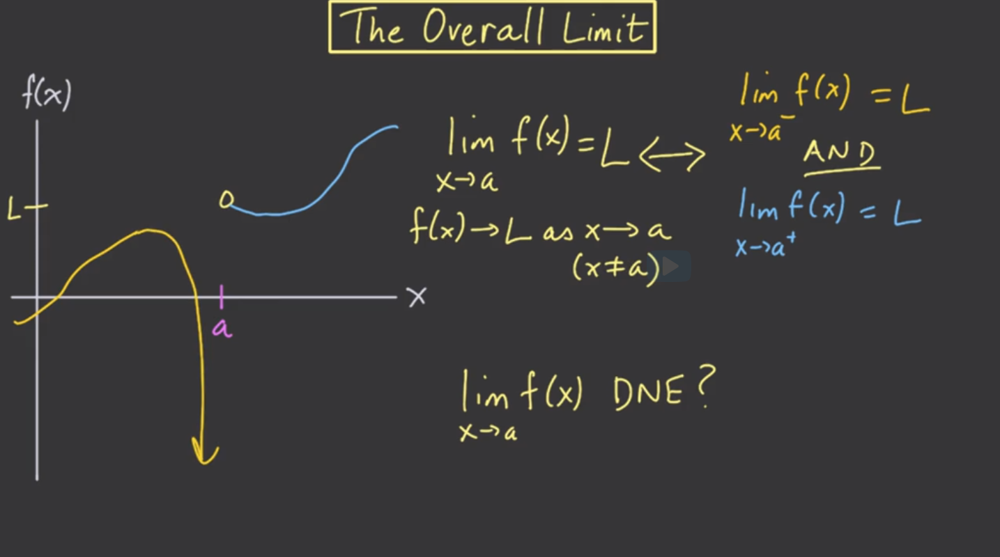
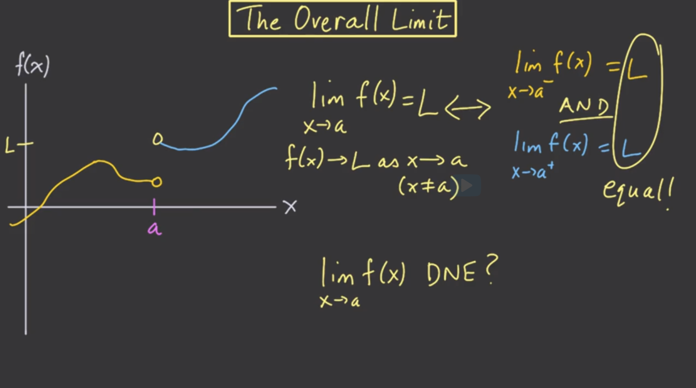

# Unit 0: Limits

## Introduction to Limits

微积分（caculas）有两个主要的概念——integral（积分） and derivative（导数）。要了解这两个概念首先必须知道limit（极限）。
假设在一条曲线上区两个点A，B。A固定不动,过A，B两点做一条直线，当B逐渐向A靠近。取极限（limit），这条直线会变成一条“切线”，这条切线的slope（斜率）就是在点A的derivative（导数）。

计算一条曲线围成的面积，通常很难直接进行计算，而一条水平线围成的面积则很容易。最初一个每一个小矩形存在一个较大的宽度。当矩形的宽度越来越小，矩形的数量越来越多，小矩形的面积之和越来越接近曲线围城的面积。小矩形的面积之和的极限就是这个曲线的面积（宽度趋近0）。

### Moving closer and closer

微积分研究的对象是函数，但在此处我们关注的是一个范围中的输入，而不是某一个输入。
变量x自x=0处从左向右移动，不断地靠近1。注意：靠近不是等于（永远不不要认为相等）。
x对应的函数f(x) = $\displaystyle \sqrt{\frac{3-5x+x^2+x^3}{x-1}}$。
根据这个函数，x在x=1处没有定义。

|x|f(x)|
|---|---|
|0|$-\sqrt{3} \approx -1.73$|
|0.5|-1.87|
|0.9|-1.97|
|0.99|-1.997|

由上表可知，随着x越来越接近1,f(x)越来越接近-2；
当从右边向左边移动x，逐渐靠近1

### One-sided limits

由此表格：
|x|f(x)|
|---|---|
|0|$-\sqrt{3} \approx -1.73$|
|0.5|-1.87|
|0.9|-1.97|
|0.99|-1.997|

记作 $\displaystyle x \rightarrow 1^-,f(x)\rightarrow -2$。其中$1^-$表示的是x从左边或者说是从负方向接近（approach）1,$f(x)$接近-2。

相对应的，当x从右边（正方向）接近1时，
|x|f(x)|
|---|---|
|2|2.24|
|1.5|2.12|
|1.1|2.02|
|1.05|2.002|

f(x)会靠近2。
但是，以上的情况在x=1时，无法得到一个值因为分母是x-1。
绘制成图像如下，

此处将函数值趋近于某个值给出一个正式的名字。称之为极限（limit）。
所以在右边，我们将说f(x)在x趋近于1时的极限是2，表示：$\displaystyle \lim_{x \to 1^+}f(x) =2$,通常称为在x等于1点的右侧极限或右极限。
左侧是相对应的情况。

### Definitions of right-hand and left-hand limits

Suppose $\  f(x)$ gets really close to $R$ for values of $x$ that get really close to  (but are not equal to)  $a$ from the right. Then we say $R$ is the ==right-hand limit== of the function $\ f(x)$ as $x$ approaches $a$ from the right.

We write
$$
f(x) \rightarrow R\ as \  x \rightarrow a^+ \\
or \\
\lim _{x\rightarrow \mathbf{a^+}} f(x) = R
$$

if $\  f(x)$ gets really close to $L$ for values of $x$ that get really close to  (but are not equal to)  $a$ from the Left. Then we say $L$ is the ==left-hand limit== of the function $\ f(x)$ as $x$ approaches $a$ from the right.

### Possible limit behaviors

right-limit和left-limit表现出如下的行为

* 左极限和有极限存在但不相等
  * 

* 左极限和右极限存在且向等
  * 
  * 此处如果$\ g(x)$的值存在且等于极限值，那么空心圆会使用实心圆。但实际上在讨论极限时，我们并不会考虑$\ g(a)$，它是无关紧要的，实际函数中，我认为$\ g(a)$根本不存在。

* 极限不存在
  * 极限值趋近与无穷（$\infin\ or \ -\infin）$
    * 
    * 
    * 用DNE表示（does not exsit）
  * 函数值在不停地振荡，无法测量
    * 

#### exercise

$$
Suppose \  f(a) = K.\  that . Must \lim_{x \to a^+}{f(x)= K}?
$$
这个论述是错误的，**极限与某一个点的实际值是否存在和值的多少并没有联系。**

### The overall limit

多数情况下，我们只想关心$x \rightarrow a$的情况，不关注他是从左侧还是从右侧趋近。
即，$\displaystyle \lim_{x \to a}\mathbf{f(x)= L} \leftrightarrow \lim_{x \to {a^-}}\mathbf{f(x)= L}\ and \ \lim_{x \to {a^+}}\mathbf{f(x)= L}$。即左右极限存在且向等。

**极限并不要求$\mathbf{f(a)}$值存在，并不会影响极限值。==我们关注的是极限值==**

the overall limit可能不存在。

1. 当左侧或者右侧极限趋近$\infty$时或者其他情况某一边的极限并不存在，
  
2. 当左右侧极限存在但是并不相等时，
  

一般来说，没有强调，“limit”就是 👉“overall limit”。极限的这个概念实际上是微积分的基本组成部分。

### Limit definition

#### The Limit in Words

If a function $\mathbf{f(x)}$ approaches some value $L$ as $x$  approaches $a$ from both the right and the left, then the limit of $\mathbf{f(x)}$ exists and equals 。

#### The Limit in Symbols

if
$$
\displaystyle {\lim_{x\rightarrow a^+} f(x)} = \displaystyle {\lim_{x\rightarrow a^-} f(x)} = L
$$
then
$$
\displaystyle {\lim _{x\rightarrow a} f(x) = L}.
$$
Alternatively,
$$
f(x) \rightarrow L \quad \mathrm{as} \quad x\rightarrow a.
$$

### Limit laws

之前的讨论都是针对单一函数，此处讨论多个函数$\displaystyle x \to a$时的情况。

* $\displaystyle \lim_{x \to a}{f(x)}= 5$
* $\displaystyle \lim_{x \to a}{g(x)}= 3$

实际上，可以将极限写成如下的形式：

* $\displaystyle \mathbf{as}\quad x \to a \quad, \mathbf{f(x)}= 5 + \epsilon_1$
* $\displaystyle \mathbf{as}\quad x \to a \quad, \mathbf{g(x)}= 3 + \epsilon_2$
  
$\displaystyle \lim_{x \to a}[f(x)+g(x)]=\lim_{x \to a} (5 + \epsilon_1 + 3 + \epsilon_2) = \lim_{x \to a } (8 + \epsilon_1 + \epsilon_2 )$
当$x \to a$时，误差值会非常非常小，意味着趋近0，因此，f加g的极限将是8。

由此：==$\displaystyle {\lim _{x\rightarrow a} \left[f(x)+g(x)\right] }
= \lim_{x \to a}f(x)+ \lim_{x \to a}g(x)$==
以上属于极限法则（limit law）中的加法

由此，存在对应的减法，乘法。
除法有一些特殊之处：
$\displaystyle {\lim _{x\rightarrow a} \frac{f(x)}{g(x)} } = \frac{L}{M}.
$当M=0时，有一些特殊的情况。

### Limit Laws

Suppose $\displaystyle {\lim _{x\rightarrow a} f(x) = L}, \qquad \displaystyle {\lim_{x\rightarrow a} g(x) = M}.$

Then we get the following Limit Laws:

Limit Law for Addition:  $\displaystyle {\lim _{x\rightarrow a} \left[f(x)+g(x)\right]= L+M
 }
$
Limit Law for Subtraction: $\displaystyle {\lim_{x\rightarrow a} \left[f(x)-g(x)\right]= L-M }
$  
Limit Law for Multiplication:  $\displaystyle {\lim _{x\rightarrow a} \left[f(x)\cdot g(x)\right] = L\cdot M }$
We also have part of the Limit Law for Division:

Limit Law for Division, Part 1: If $M\ne 0$ , then $\displaystyle {\lim _{x\rightarrow a} \frac{f(x)}{g(x)} } = \frac{L}{M}.$
We will discuss what happens when  in a later section!

## Continuity

###  Motivation

我们为什么在魔术师把人锯成两半时会感到惊讶？这是因为我们不期望身体的上半部分和下半部分之间有跳跃或分离。魔术把我们的视觉连续感玩弄得团团转。在本节中，我们将使用连续性来计算极限，并通过中值定理来探讨连续性的含义。

### How do we compute limits?

主题

在完成这个学习阶段并进行一些练习后，你应该能够：

* 辨认不连续点（函数的间断点）。
* 从图形和公式上辨别连续和不连续的函数。
* 使用极限定律来找出连续函数的和与积的极限。
* 应用中值定理（Intermediate Value Theorem）。

### Continuity at a point

函数在一个点上的极限和这个点的函数值没有必然的联系，但是他们也可能相等。
如果他们相等，那么将这种情况称之为函数在这一点处连续,写作：$f$ is continuos at $x=a$,if $\displaystyle \lim_{x \to a}f(x)= f(a)$

We say that a function $f$ is continuous at a point $x=a$ if
$$\lim_{x \to a}= f(a).$$

In particular, if either  $f(a)$ or $\displaystyle \lim_{x \to a}f(x)$ fails to exist, then $f$ is discontinuous at a.

We say that a function $f$ is right-continuous at a point $x=a$ if $\displaystyle \lim_{x \to a^+}f(x)= f(a)$ .

We say that a function $f$ is left-continuous at a point $x=a$ if $\displaystyle \lim_{x \to a^-}f(x)= f(a)$ .

It is sometimes useful to classify certain types of discontinuities.

If the left-hand limit $\displaystyle {\lim _{x\rightarrow a^-} f(x) }$ and the right-hand limit $\displaystyle {\lim _{x\rightarrow a^+} f(x) }$ both exist at a point $x=a$, but they are not equal, then we say that $f$ has a ==jump discontinuity==  at $x=a$.

If the overall limit $\displaystyle {\lim _{x\rightarrow a} f(x) }
$ exists (i.e., the left- and right-hand limits agree), but the overall limit does not equal $\  f(a)$, then we say that $f$ has a removable discontinuity at $x=a$.

### Continuity questions

从图像上，更加准确的理解连续

solution：

哪怕图像上是一个尖角，依然可以是连续，这之间没有关系。

### Overall continuity

A function $\  f(x)$ is **continuous** if for every point $c$ in the domain of $f(x)$ , the function $f$ is continuous at the point .

### Catalog of continuous functions

all polynomials

* $\sqrt[3]{x}$
* $|x|$
* $\cos{x}$ and $\sin x$
* exponential functions $a^x$ with base $a>0$

the following functions are continuous (or right continuous) at the specified values of $x$:

* $\sqrt x$, for $x \geq 0$ 

* $\tan x$, at all $x$ where it is defined

* logarithmic functions $\log _{a} x$ with base $a>0$ , for $x>0$

### ivt (intermediate value theorem)

如图所示，一条虚线横跨两个点。假设这两点是一个函数上的，那么这个函数是否一定会与这条直线相交?

假如我们知道函数是连续的，那么答案就是肯定的。所以如果f是连续的，它就没有空洞和跳跃。
所以当我们从这一点移动到这一点时，图形必须至少与线相交一次。

但如果他图像是这样的，可能就不止一个交点。但我们知道，至少会存在一个。这就是所谓的中值定理（intermediate value theorem）。

中值定理的定义：

  >如果f是连续的，并且我们有某个值m介于f(a)和f(b)的值之间（换句话说，m是一个中间值），那么至少会有一个点c在a和b之间，使得f(c)等于m。

我们需要满足以下条件才能使用中值定理：

* m在f(a)和f(b)值之间，即f(a) < m < f(b)。
* f在开区间(a, b)上连续。
* f在a处右连续，即f(a)存在且等于a的右极限。
* f在b处左连续，即f(b)存在且等于b的左极限。

为什么需要两边的端点分别作连续和右连续？

**如果这两个点有一个是不连续，那么就没有理由认为，这个端点的函数值可以作为中间值的参考，因为他可以脱离这个函数。**

这就是完整的中值定理。如果f在相关位置是连续的，并且M位于f的这两个值之间，那么f至少在一个地方等于M。

If $f$ is a function which is continuous on the interval $[a,b]
$ , and  lies between the values of $f(a)$  and $f(b)$, then there is at least one point  between  and  such that $\  f(c) = M.$

(A function $f$ is ==continuous on a closed interval $[a,b]$==  if it is right-continuous at $a$ , left-continuous at $b$ , and continuous at all points between $a$ and $b$.)

|What makes the Intermediate Value Theorem a deep result?|
|---|
|The Intermediate Value Theorem is profound because it takes information that is local by nature, and allows you to conclude a global result. Continuity at a point is local information, because it only requires knowledge of the function's behavior near that point. But somehow, if we know this fact at every point on an interval, then the Intermediate Value Theorem tells us something about the overall, or global behavior - namely, that the function has to take on a particular value, or its graph has to cross a certain line.
This is intimately tied in with the properties of the real number system. We could have the same definition of continuity for functions if we only worked with, say, the rational numbers (numbers which can be written as a fraction of integers), but the Intermediate Value Theorem would not work if that were the case. It is only when we move to the real numbers that the Intermediate Value Theorem holds true. | 

#### IVT 2 problem

Let $g(x) = 4x^{-3} - x - \sin (\pi x)$. Does the Intermediate Value Theorem imply that there must be some $c$ between $x=-1$ and $x=1$ where $g(c)=0$?

Solution:

No. Note that $g(x)$ is not continuous on the interval $[-1,1]
$ , since it is not defined at zero. Hence the Intermediate Value Theorem does not apply in this case.

## Limits of quotients

对于quotion形式的limt:$\displaystyle \frac{g}{f}$,当$f \ne 0$直接使用limit law计算,但是当$f,g \to 0$,他是有意义的.如图所示,

他模拟的就是B逐渐向A靠近的情况.

Objectives

At the end of this sequence, and after some practice, you should be able to:

* Distinguish the three cases of the Division Limit Law.

* Compute limits of quotients of functions.

* Determine when a limit is.

### Limits and division

存在：
$\displaystyle \lim_{x \to a}f(x) = L$
$\displaystyle \lim_{x \to a}g(x) = M$

对于这样的式子：$\displaystyle \lim_{x \to a}\frac{f(x)}{g(x)}$

* if $M \ne 0$, $\displaystyle \lim_{x \to a}\frac{f(x)}{g(x)}= \frac{L}{M}$
* if $M = 0 \quad and \quad L\ne 0$ $\displaystyle \lim_{x \to a}\frac{f(x)}{g(x)}= \frac{L}{0}$,没有定义DNE
* if $M = 0 \quad and \quad L=0$ ,$\displaystyle \lim_{x \to a}\frac{f(x)}{g(x)}= \frac{L}{M} = \frac{small}{small}$

第三种情况比较不同，对于：$\displaystyle \lim_{x \to 0} \frac{2x}{x}$这个式子是可以先通过约分cancle $x$，如此一来可以得到一个常数表达式2。

在这个问题中，h要注意无论i是x,2x亦或者是$x \to 0 $,本质上都不是在考虑$=0$，我们始终都只是在考虑靠近0。

### Small divided by small

对于所说的第三种情况，我们需要更多的信息才能判断出具体的值。可能的结果{near 0，a big value, not big but no near 0}

### Limit Law for Division

**突然发现一个本质：$\lim$i就是用来计算"near"的，i他最终的o结果iah也是"near"值。**

### Using the division limit law

h针对第三种情况，做如下的工作：
1. 整理式子
2. 约分

