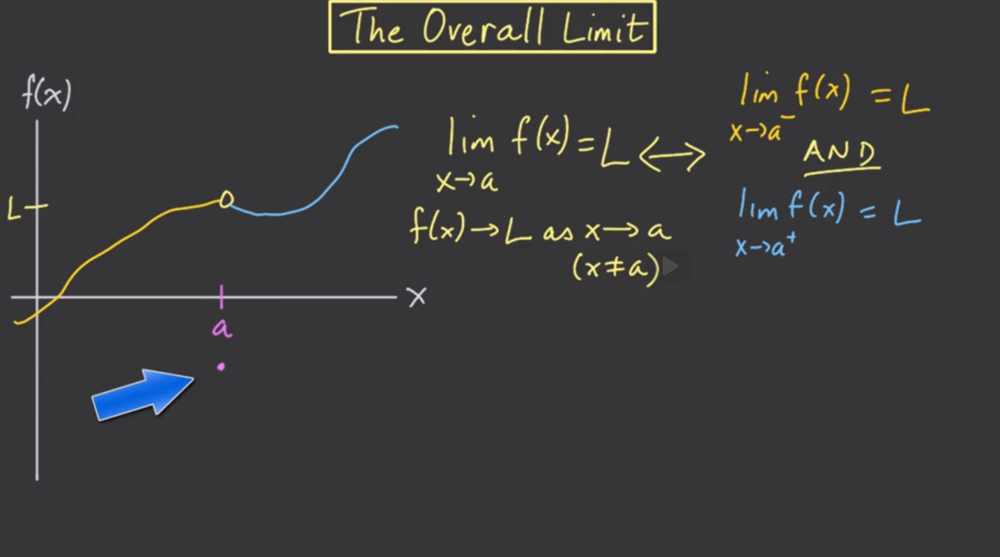

# Unit 0: Limits

## Introduction to Limits

微积分（caculas）有两个主要的概念——integral（积分） and derivative（导数）。要了解这两个概念首先必须知道limit（极限）。
假设在一条曲线上区两个点A，B。A固定不动,过A，B两点做一条直线，当B逐渐向A靠近。取极限（limit），这条直线会变成一条“切线”，这条切线的slope（斜率）就是在点A的derivative（导数）。

计算一条曲线围成的面积，通常很难直接进行计算，而一条水平线围成的面积则很容易。最初一个每一个小矩形存在一个较大的宽度。当矩形的宽度越来越小，矩形的数量越来越多，小矩形的面积之和越来越接近曲线围城的面积。小矩形的面积之和的极限就是这个曲线的面积（宽度趋近0）。

### Moving closer and closer

微积分研究的对象是函数，但在此处我们关注的是一个范围中的输入，而不是某一个输入。
变量x自x=0处从左向右移动，不断地靠近1。注意：靠近不是等于（永远不不要认为相等）。
x对应的函数f(x) = $\displaystyle \sqrt{\frac{3-5x+x^2+x^3}{x-1}}$。
根据这个函数，x在x=1处没有定义。

|x|f(x)|
|---|---|
|0|$-\sqrt{3} \approx -1.73$|
|0.5|-1.87|
|0.9|-1.97|
|0.99|-1.997|

由上表可知，随着x越来越接近1,f(x)越来越接近-2；
当从右边向左边移动x，逐渐靠近1

### One-sided limits

由此表格：
|x|f(x)|
|---|---|
|0|$-\sqrt{3} \approx -1.73$|
|0.5|-1.87|
|0.9|-1.97|
|0.99|-1.997|

记作 $\displaystyle x \rightarrow 1^-,f(x)\rightarrow -2$。其中$1^-$表示的是x从左边或者说是从负方向接近（approach）1,$f(x)$接近-2。

相对应的，当x从右边（正方向）接近1时，
|x|f(x)|
|---|---|
|2|2.24|
|1.5|2.12|
|1.1|2.02|
|1.05|2.002|

f(x)会靠近2。
但是，以上的情况在x=1时，无法得到一个值因为分母是x-1。
绘制成图像如下，

此处将函数值趋近于某个值给出一个正式的名字。称之为极限（limit）。
所以在右边，我们将说f(x)在x趋近于1时的极限是2，表示：$\displaystyle \lim_{x \to 1^+}f(x) =2$,通常称为在x等于1点的右侧极限或右极限。
左侧是相对应的情况。

### Definitions of right-hand and left-hand limits

Suppose $\  f(x)$ gets really close to $R$ for values of $x$ that get really close to  (but are not equal to)  $a$ from the right. Then we say $R$ is the ==right-hand limit== of the function $\ f(x)$ as $x$ approaches $a$ from the right.

We write
$$
f(x) \rightarrow R\ as \  x \rightarrow a^+ \\
or \\
\lim _{x\rightarrow \mathbf{a^+}} f(x) = R
$$

if $\  f(x)$ gets really close to $L$ for values of $x$ that get really close to  (but are not equal to)  $a$ from the Left. Then we say $L$ is the ==left-hand limit== of the function $\ f(x)$ as $x$ approaches $a$ from the right.

### Possible limit behaviors

right-limit和left-limit表现出如下的行为

* 左极限和有极限存在但不相等
  * 

* 左极限和右极限存在且向等
  * 
  * 此处如果$\ g(x)$的值存在且等于极限值，那么空心圆会使用实心圆。但实际上在讨论极限时，我们并不会考虑$\ g(a)$，它是无关紧要的，实际函数中，我认为$\ g(a)$根本不存在。

* 极限不存在
  * 极限值趋近与无穷（$\infin\ or \ -\infin）$
    * 
    * 
    * 用DNE表示（does not exsit）
  * 函数值在不停地振荡，无法测量
    * 

#### exercise

$$
Suppose \  f(a) = K.\  that . Must \lim_{x \to a^+}{f(x)= K}?
$$
这个论述是错误的，**极限与某一个点的实际值是否存在和值的多少并没有联系。**

### The overall limit

多数情况下，我们只想关心$x \rightarrow a$的情况，不关注他是从左侧还是从右侧趋近。
即，$\displaystyle \lim_{x \to a}\mathbf{f(x)= L} \leftrightarrow \lim_{x \to {a^-}}\mathbf{f(x)= L}\ and \ \lim_{x \to {a^+}}\mathbf{f(x)= L}$。即左右极限存在且向等。

**极限并不要求$\mathbf{f(a)}$值存在，并不会影响极限值。==我们关注的是极限值==**

the overall limit可能不存在。

1. 当左侧或者右侧极限趋近$\infty$时或者其他情况某一边的极限并不存在，
  
2. 当左右侧极限存在但是并不相等时，
  

一般来说，没有强调，“limit”就是 👉“over limit”。极限的这个概念实际上是微积分的基本组成部分。

### Limit definition

#### The Limit in Words

If a function $\mathbf{f(x)}$ approaches some value $L$ as $x$  approaches $a$ from both the right and the left, then the limit of $\mathbf{f(x)}$ exists and equals 。

#### The Limit in Symbols

if
$$
\displaystyle {\lim_{x\rightarrow a^+} f(x)} = \displaystyle {\lim_{x\rightarrow a^-} f(x)} = L
$$
then
$$
\displaystyle {\lim _{x\rightarrow a} f(x) = L}.
$$
Alternatively,
$$
f(x) \rightarrow L \quad \mathrm{as} \quad x\rightarrow a.
$$

### Limit laws

之前的讨论都是针对单一函数，此处讨论多个函数$\displaystyle x \to a$时的情况。

* $\displaystyle \lim_{x \to a}{f(x)}= 5$
* $\displaystyle \lim_{x \to a}{g(x)}= 3$

实际上，可以将极限写成如下的形式：

* $\displaystyle \mathbf{as}\quad x \to a \quad, \mathbf{f(x)}= 5 + \epsilon_1$
* $\displaystyle \mathbf{as}\quad x \to a \quad, \mathbf{g(x)}= 3 + \epsilon_2$
  
$\displaystyle \lim_{x \to a}[f(x)+g(x)]=\lim_{x \to a} (5 + \epsilon_1 + 3 + \epsilon_2) = \lim_{x \to a } (8 + \epsilon_1 + \epsilon_2 )$
当$x \to a$时，误差值会非常非常小，意味着趋近0，因此，f加g的极限将是8。

由此：==$\displaystyle {\lim _{x\rightarrow a} \left[f(x)+g(x)\right] }
= \lim_{x \to a}f(x)+ \lim_{x \to a}g(x)$==
以上属于极限法则（limit law）中的加法

由此，存在对应的减法，乘法。
除法有一些特殊之处：
$\displaystyle {\lim _{x\rightarrow a} \frac{f(x)}{g(x)} } = \frac{L}{M}.
$当M=0时，有一些特殊的情况。

### Limit Laws

Suppose $\displaystyle {\lim _{x\rightarrow a} f(x) = L}, \qquad \displaystyle {\lim_{x\rightarrow a} g(x) = M}.$

Then we get the following Limit Laws:

Limit Law for Addition:  $\displaystyle {\lim _{x\rightarrow a} \left[f(x)+g(x)\right]= L+M
 }
$
Limit Law for Subtraction: $\displaystyle {\lim_{x\rightarrow a} \left[f(x)-g(x)\right]= L-M }
$  
Limit Law for Multiplication:  $\displaystyle {\lim _{x\rightarrow a} \left[f(x)\cdot g(x)\right] = L\cdot M }$
We also have part of the Limit Law for Division:

Limit Law for Division, Part 1: If $M\ne 0$ , then $\displaystyle {\lim _{x\rightarrow a} \frac{f(x)}{g(x)} } = \frac{L}{M}.$
We will discuss what happens when  in a later section!

## Continuity

###  Motivation

我们为什么在魔术师把人锯成两半时会感到惊讶？这是因为我们不期望身体的上半部分和下半部分之间有跳跃或分离。魔术把我们的视觉连续感玩弄得团团转。在本节中，我们将使用连续性来计算极限，并通过中值定理来探讨连续性的含义。

### How do we compute limits?

主题

在完成这个学习阶段并进行一些练习后，你应该能够：

* 辨认不连续点（函数的间断点）。
* 从图形和公式上辨别连续和不连续的函数。
* 使用极限定律来找出连续函数的和与积的极限。
* 应用中值定理（Intermediate Value Theorem）。

### Continuity at a point

函数在一个点上的极限和这个点的函数值没有必然的联系，但是他们也可能相等。
如果他们相等，那么将这种情况称之为函数在这一点处连续,写作：$f$ is continuos at $x=a$,if $\displaystyle \lim_{x \to a}f(x)= f(a)$

We say that a function $f$ is continuous at a point $x=a$ if
$$\lim_{x \to a}= f(a).$$

In particular, if either  $f(a)$ or $\displaystyle \lim_{x \to a}f(x)$ fails to exist, then $f$ is discontinuous at a.

We say that a function $f$ is right-continuous at a point $x=a$ if $\displaystyle \lim_{x \to a^+}f(x)= f(a)$ .

We say that a function $f$ is left-continuous at a point $x=a$ if $\displaystyle \lim_{x \to a^-}f(x)= f(a)$ .

It is sometimes useful to classify certain types of discontinuities.

If the left-hand limit $\displaystyle {\lim _{x\rightarrow a^-} f(x) }$ and the right-hand limit $\displaystyle {\lim _{x\rightarrow a^+} f(x) }$ both exist at a point $x=a$, but they are not equal, then we say that $f$ has a ==jump discontinuity==  at $x=a$.

If the overall limit $\displaystyle {\lim _{x\rightarrow a} f(x) }
$ exists (i.e., the left- and right-hand limits agree), but the overall limit does not equal $\  f(a)$, then we say that $f$ has a removable discontinuity at $x=a$.

### Continuity questions

从图像上，更加准确的理解连续

solution：

哪怕图像上是一个尖角，依然可以是连续，这之间没有关系。

### Overall continuity

A function $\  f(x)$ is **continuous** if for every point $c$ in the domain of $f(x)$ , the function $f$ is continuous at the point .

### Catalog of continuous functions

all polynomials

* $\sqrt[3]{x}$
* $|x|$
* $\cos{x}$ and $\sin x$
* exponential functions $a^x$ with base $a>0$

The following functions are continuous (or right continuous) at the specified values of $x$:

* $\sqrt x$, for $x \geq 0$ 

* $\tan x$, at all $x$ where it is defined

* logarithmic functions $\log _{a} x$ with base $a>0$ , for $x>0$