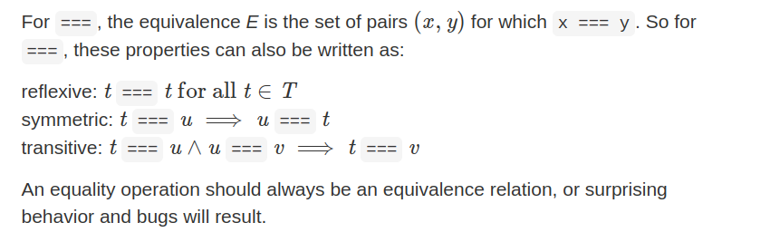
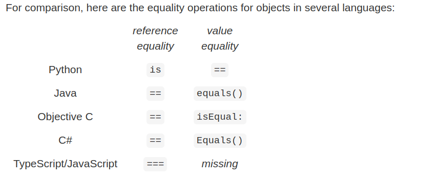
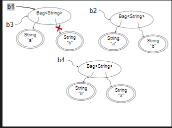

# Reading 10: Equality

Objectives
* Understand the properties of an equivalence relation.
* Understand equality for immutable types defined in terms of the abstraction function and in terms of observation.
* Differentiate between reference equality and object equality.
* Differentiate between observational and behavioral equality for mutable types.

## Instruction

本章介绍定义值相等的概念。
物理世界中没用两个完全一样的东西，哪怕是两个雪花。在数学上同一个事物往往有多种表示，例如$\sqrt{9},3,1+2$。

## Equivalence relation

相等在数学上需要满足的属性：
$E$表示$(x,y)$相等的集合，$T$表示某种类型。
reflexive: $(t,t) \in E $ for all $t \in T$
symmetric: $(t,u) \in E \Rightarrow (u,t) \in E$
transitive: $(t,u) \in E \land (t,v) \in E \Rightarrow (t,v) \in E $

满足以上才能说明两者相等。

以下是TS版本：



## Equality of immutable types

对于不可变类型，定义他的相等属性有两个方向：
1. rep经过AF，映射到相同的abstract value;
2. 根据observer和producer操作，产生相同的结果被测到(observational definition );

## Reference equality vs. value equality
在编程语言中，测试相等的操作有两种：
1. reference equailty
2. value equailty

后者就是这篇文章所讨论的，前者表述的是存储的内存地址是否是相同的。



## Equality of mutable types in Java

现在进一步完善两种类型的相等的观念：

1. observational equality
   * 即调用observer操作和producer操作来比较两个对象的结果是否一致。

2. behavioral equality
   * 即调用一个mutator的操作，改变了一个对象的状态，不更改另一个对象的状态，两个引用仍然无法区分。这测试了两个引用是否在当前状态和所有未来状态中都将“表现”相同。

对于不可变对象，观察相等性和行为相等性是相同的，因为没有mutator方法可以更改对象的状态。

对于可变对象，很容易选择使用观察相等性作为设计选择。实际上，Java对于大多数可变数据类型都使用观察相等性。例如，如果两个不同的List对象包含相同顺序的元素，那么equals()方法将报告它们是相等的。

以下是一个使用behavioral equality的例子：

```java
List<Integer> listA = List.of(1, 2, 3);
List<Integer> listB = new ArrayList<>(listA);
List<Integer> listC = listB;
```

核心：使用mutator改变其中的一个对象，然后再使用observation equality。

* call listA.set(0, 0), then compare the results of listA.get(0), listB.get(0) and listC.get(0)
* call listB.clear(), then compare the results of listA.size(), listB.size(), and listC.size()
之后可以再使用：
* compare listA.size(), listB.size(), and listC.size()
* compare listA.get(0), listB.get(0), and listC.get(0)
进行观察

对于observation equality：

这种比较的角度依赖的是observator或者producer本身规范所给出的明确的返回值，一旦规范中并没有保证有一个明确的输出，那么就不能将其作为使用的比较的方法。

```java
Set<Integer> setA = Set.of(1, 2, 3);
Set<Integer> setB = Set.of(3, 2, 1);
Set<Integer> setC = new HashSet<>(setA);
```

* compare the results of setA.size(), setB.size(), and setC.size()
* compare the results of setA.toString(), setB.toString(), and setC.toString()
* compare the first element returned by iterating over setA, setB, and setC
* compare the full set of elements returned by iterating over setA, setB, and setC

以上第一项，第四项能够使用observation equality判断是否相等。
toString()并没有规定所输出字符串的内容，只是规范中记录着textually represention。

同样 Set.iterator() returns the elements in no particular order. 即便是相同的对象也可能最终会导致不同的顺序。


## Implementing equals() In Java

```Java
Duration d1 = new Duration (1, 2);
Duration d2 = new Duration (1, 2);
Object o2 = d2;
d1.equals(d2) → true
d1.equals(o2) → false
```

```Java
public class Duration extends Object {
    // explicit method that we declared:
    public boolean equals(Duration that) {
        return this.getLength() == that.getLength();
    }
    // implicit method inherited from Object:
    public boolean equals(Object that) {
        return this == that;
    }
}
```

现在d2和o2都指向的同一个地址，但是d2作为Duration，他overloading了equal()方法。o2还是objective。当传入d2作为参数时，在compile-time时，选择调用 Duration.euqal()。但是当传入Objective时，会选择调用Objctive.equal()。

### A better way to implement euqals()

```Java
@Override
public boolean equals(Object that) {
    return that instanceof Duration && this.sameValue((Duration)that);
}

// returns true iff this and that represent the same abstract value
private boolean sameValue(Duration that) {
    return this.getLength() == that.getLength();
}
```

第一个方法更好。因为在判断是否相等的操作时，他首先判断了类型是否是Duratition，在确认之后，再执行判断是否相等的操作。

instanceof

instanceof()用于动态类型检查，判断某一个实例是否是某一种类，instanceof()再面向对象的编程中使用是一段bad smell 的代码。只允许在equal()中使用。

This prohibition also includes other ways of inspecting objects’ runtime types. For example, getClass is also disallowed.

>public final Class<?> getClass()
Returns the runtime class of this Object. The returned Class object is the object that is locked by static synchronized methods of the represented class.
The actual result type is Class<? extends |X|> where |X| is the erasure of the static type of the expression on which getClass is called. For example, no cast is required in this code fragment:
Number n = 0;
Class<? extends Number> c = n.getClass();
Returns:
The Class object that represents the runtime class of this object.
See Java Language Specification:


## The Object contract In Java

### contract for equal()

* equals must define an equivalence relation – that is, a relation that is reflexive, symmetric, and transitive;
* equals must be consistent: repeated calls to the method must yield the same result (as long as neither object has been mutated in a way that affects the equals comparison);
* for a non-null reference x, x.equals(null) should return false;
* hashCode must produce the same result for two objects that are deemed equal by the equals method.

### Breaking the equivalence relation
    
```Java
@Override
public boolean equals(Object that) {
    return this.toString().equals(that.toString());
}
```

This immediately has a problem because the default implementation inherited from Object is not useful. So let’s override toString too:

```Java
@Override
public String toString() {
    return mins + ":" + secs;  // e.g. "2:25" for 2 minutes, 25 seconds
}

```
以上的实现是存在问题的：

new Duration(1, 30).equals(new Duration(1, 30))
new Duration(1, 30).equals(new Duration(0, 90))
new Duration(1, 30).equals("1:30")
"1:30".equals(new Duration(1, 30))

暴露问题的：

第二项：可以看到哪怕抽象函数映射到的抽象值是相同的，最终的结果也是不相等的。
第三项：并不遵守同一个类型的原则，两个不同的类型可以相等。
最后一项由于是String类型调用equal()，所以编译器选择调用Object的equal()。

**It’s better to write equals() carefully, using the rep and abstraction function directly.**

### Breaking hash tables

任何以来hash table 的结构，例如hashSet 和 hashMap，都必须要实现hashCode方法。

hash table 映射key -> value。对于Key，需要其提供两个方法：equal() and hashCode()。

hash table 在初始化时会要求我们要输入要插入元素的数量(静态)，从而构造出相应大小的array。当hash结构插入值时，会调用hashCode()，使用他返回的code，作取模除法计算出"array"的index，然后将对应的value放到index所指向的内存处。

hash table 的RI：Key的hashcode必须要能够找到一个slot。
通常来说，hash table的索引所指向的位置不会只存储单一的值，而是会存储键值对的list，通常被称为hash bucket 。键和值作为一个整体的对象，这是为了应对有两个hash code 最后会计算出相同的索引。

插入操作会使计算出相同的索引放入到同一个hash bucket。查找操作会额外去比对Key来确认具体是哪一个。

以上也说明了为什么object contract 要求：如果equal()相同的对象，那么也必须要有相同的hashcode，因为这保证了他们在hash表中的索引是相同的。

这也是CS61B中所说的，如果改变了equal，就必须要改变hashcode。

```Java
public class Object {
  ...
  public boolean equals(Object that) { return this == that; }
  public int hashCode() { return /* the memory address of this */; }
}
```

以上是obj默认的equal和hashcode。equal的行为是根据两者的地址值相等来判断是否等于。

```java
Duration d1 = new Duration(1, 2);
Duration d2 = new Duration(1, 2);
d1.equals(d2) → true
d1.hashCode() → 2392
d2.hashCode() → 4823
```
由于上文中我们更改了Duration中的equal的方法，d1和d2现在是根据他们field的值来判断是否相等，但是我们并没有改变默认的hashcode所以我们违反了object contract。


一个简单的更改hashCode()的方法：
直接让hashCode()返回一个常量，这样就一定可以使equal()相等的对象返回同样的值，但缺点是hash table的性能会非常差，因为所有的键值对都会放在同一个hash buck中。

标准的做法是使用在equal中的决定因素再加上一些算数操作，得到hashcode，以下是Duration修改hashCode()的做法。

```java
@Override
public int hashCode() {
    return (int) getLength();
}
```
from stackoverflow:

[stack overflow](https://stackoverflow.com/questions/113511/best-implementation-for-hashcode-method-for-a-collection)

1. Create a int result and assign a non-zero value.

2. For every field f tested in the equals() method, calculate a hash code c by:

* If the field f is a boolean: calculate (f ? 0 : 1);
* If the field f is a byte, char, short or int: calculate (int)f;
* If the field f is a long: calculate (int)(f ^ (f >>> 32));
* If the field f is a float: calculate Float.floatToIntBits(f);
* If the field f is a double: calculate Double.doubleToLongBits(f) and handle the return value like every long value;
* If the field f is an object: Use the result of the hashCode() method or 0 if f == null;
* If the field f is an array: see every field as separate element and calculate the hash value in a recursive fashion and combine the values as described next.

3. Combine the hash value c with result:

result = 37 * result + c
4. Return result

```java
@Override 
public int hashCode() {

    // Start with a non-zero constant. Prime is preferred
    int result = 17;

    // Include a hash for each field.

    // Primatives

    result = 31 * result + (booleanField ? 1 : 0);                   // 1 bit   » 32-bit

    result = 31 * result + byteField;                                // 8 bits  » 32-bit 
    result = 31 * result + charField;                                // 16 bits » 32-bit
    result = 31 * result + shortField;                               // 16 bits » 32-bit
    result = 31 * result + intField;                                 // 32 bits » 32-bit

    result = 31 * result + (int)(longField ^ (longField >>> 32));    // 64 bits » 32-bit

    result = 31 * result + Float.floatToIntBits(floatField);         // 32 bits » 32-bit

    long doubleFieldBits = Double.doubleToLongBits(doubleField);     // 64 bits (double) » 64-bit (long) » 32-bit (int)
    result = 31 * result + (int)(doubleFieldBits ^ (doubleFieldBits >>> 32));

    // Objects

    result = 31 * result + Arrays.hashCode(arrayField);              // var bits » 32-bit

    result = 31 * result + referenceField.hashCode();                // var bits » 32-bit (non-nullable)   
    result = 31 * result +                                           // var bits » 32-bit (nullable)   
        (nullableReferenceField == null
            ? 0
            : nullableReferenceField.hashCode());

    return result;

}
```

```java
@Override
public boolean equals(Object o) {

    // Optimization (not required).
    if (this == o) {
        return true;
    }

    // Return false if the other object has the wrong type, interface, or is null.
    if (!(o instanceof MyType)) {
        return false;
    }

    MyType lhs = (MyType) o; // lhs means "left hand side"

            // Primitive fields
    return     booleanField == lhs.booleanField
            && byteField    == lhs.byteField
            && charField    == lhs.charField
            && shortField   == lhs.shortField
            && intField     == lhs.intField
            && longField    == lhs.longField
            && floatField   == lhs.floatField
            && doubleField  == lhs.doubleField

            // Arrays

            && Arrays.equals(arrayField, lhs.arrayField)

            // Objects

            && referenceField.equals(lhs.referenceField)
            && (nullableReferenceField == null
                        ? lhs.nullableReferenceField == null
                        : nullableReferenceField.equals(lhs.nullableReferenceField));
}

```

```java
@Override
public int hashCode() {
    return Objects.hash(this.firstName, this.lastName);
}
```

请注意，只要满足相等的对象具有相同的哈希码值的要求，那么你使用的具体哈希技术对你的代码的正确性没有影响。它可能会影响性能，因为它可能会在不同对象之间创建不必要的冲突，但即使是性能较差的哈希函数也比违反契约的更好。

最关键的是，如果你根本不重写hashCode，你将得到Object类提供的hashCode，它基于对象的地址。如果你已经重写了equals方法，这将意味着你几乎肯定会违反契约

>Always override hashCode when you override equals.
Use @Override!

## Breaking a HashSet’s rep invariant in Java

这里展示了使用mutable的类型打破RI的例子：

```java
List<String> list = new ArrayList<>();
list.add("a");

Set<List<String>> set = new HashSet<List<String>>();
set.add(list);

set.contains(list) → true
list.add("goodbye");
set.contains(list) → false!
for (List<String> l : set) { 
    set.contains(l) → false! 
}
```

以上的这个例子展示了，当我们将一个list对象放入到set中后，当我们向list中添加一个元素的时候，会导致set的observation行为前后不一致。

造成这种结果的原因是：List作为可变类型，他的mutator操作会改变equal()和hashCode()的结果，而HashSet内部依赖hashCode作为key。List添加元素的操作导致hashCode()结果前后不一致，所以即使set中只一个元素，key改变后，要么找不到indix，无法确认hashbuck的位置，要么找到索引位置后，因为key值的改变，在与原来存储的key对比时发现并不一致，所以导致判断错误。

所以在使用hashSet时，要着重注意当类型为可变的情况。

### Java library bug for observation and behavior

>The Java library is unfortunately inconsistent about its interpretation of equals() for mutable classes. Collections like List, Set, and Map use observational equality, but other mutable classes like StringBuilder, and arrays, use behavioral equality.

>Note: Great care must be exercised if mutable objects are used as set elements. The behavior of a set is not specified if the value of an object is changed in a manner that affects equals comparisons while the object is an element in the set.

## The final rule for equals() and hashCode()

对于immutable types:

* behavior and observational equal是一致的。
* equal()和hashCode()必须被覆盖，比较抽象值。

对于mmutable types：

* behavior 和 observational equal 两者并不一致
* equal()和hashCode()应该保持继承自object，而不选择将其覆盖。

对于一个mmutable 类型来说，如果他需要observation equal 类似的想法，可以单独实现一个基于observational equal 的类似similar() or sameValue()。Its implementation would be similar to the private sameValue() helper method we have been writing for immutable types, but it would be a public operation available to clients. Unfortunately the Java library did not make that design decision.

> Behavioral equality of mutable ADTs requires two references to be equal if and only if they are aliases for the same object.

```java
b1.equals(b2)
b1.equals(b3)
b1.equals(b4)
b2.equals(b3)
b2.equals(b4)
b3.equals(b1)
```


>Equality is now defined by the observer operation count, so b1 and b3 are certainly equal, but b2 and b4 are now considered equal as well.
The Java Collections implement observational equality because it is often convenient, but it would be better to implement a different operation for observational equality of mutable types.

### Autoboxing and equality

```java
Integer x = new Integer(3);
Integer y = new Integer(3);
x.equals(y) → true
x == y // returns false
(int)x == (int)y // returns true
```

```java
Map<String, Integer> a = new HashMap<>(), b = new HashMap<>();
String c = "c";
a.put(c, 130); // put ints into the maps
b.put(c, 130);
a.get(c) == b.get(c) → ?? // what do we get out of the maps? are they equal?
```
java中自动会转换int和integer。

当你期望Map中包含整数值（int）时，实际上get()方法返回的是Integer对象，这可能导致意料之外的行为。Integer可以在大多数情况下与int互换使用，但在涉及到相等性比较操作时，有一些不同之处。

具体来说，Integer是一个对象，而int是一个原始的整数类型。因此，你可以使用Integer对象来表示整数，但当使用相等性操作符（例如==和equals）比较时，会涉及到引用相等性和值相等性的区别。

* 130 is an integer literal, so its compile-time type is int.
* In the Map<String, Integer>, the keys are Strings and the values are Integers. So when 130 is placed in the map, it is automatically boxed up into a fresh Integer object.
* The get() operation for a Map<K, V> returns values of type V, so for a Map<String, Integer>, the type would be Integer.

Integer 是可变类型。

```java
int i = a.get(c);
int j = b.get(c);
boolean isEqual = (i == j);
```


如果我们将上述问题中的130替换为127，那么答案将不同。这是因为在范围-128到127内的整数，Integer对象会重用一个池，这些对象会被视为相等。因此，behavior差异会因输入值的不同而产生。

## “Deep equality” on collections

## Hash functions

## Summary

In TypeScript, for immutable built-in types (e.g. number, string, bigint):

* Use === for behavioral and observational equality, which are identical because there are no mutators.
* Avoid == because of its automatic conversions.
* Safe for use as Set elements and Map keys.

For immutable object types (e.g. Duration):

* Use equalValue() for both behavioral and observational equality, which are identical because there are no mutators.
* Avoid === because it is too strong, and avoid == because of its automatic conversions.
* Not safe for use as Set elements or Map keys because those data structures compare objects using ===.
For mutable object types:

* Use === for behavioral equality.
* Use equalValue() for observational equality.
* Avoid == because of its automatic conversions.
 Safe for use as Set elements and Map keys.