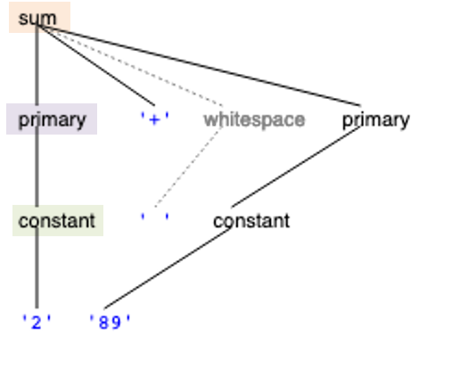
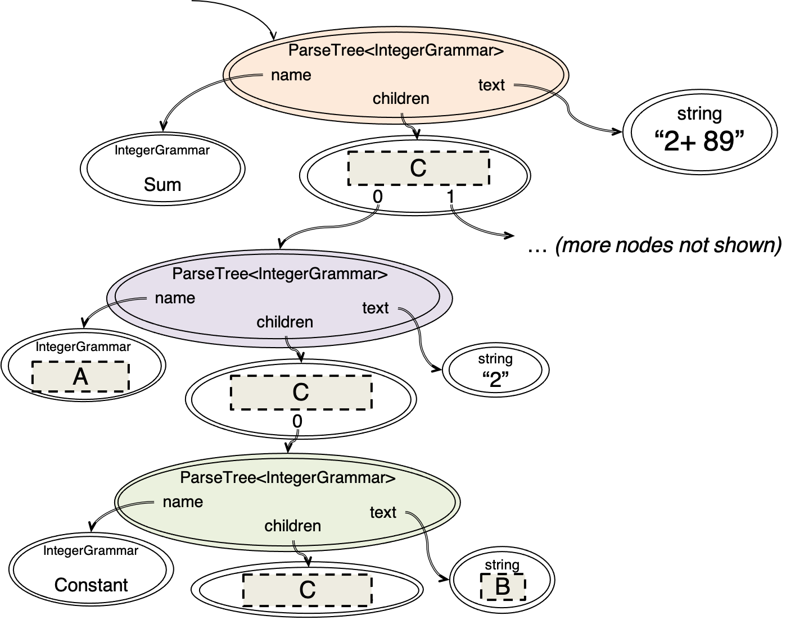

# Parser generator

A <mark data-structure-text="parser generator" id="^parser_generator"><em>parser generator</em></mark> is a good tool that you should add to your toolbox.  A parser generator takes a grammar as input and automatically generates a <mark data-structure-text="parser" id="^parser"><em>parser</em></mark>, which takes a sequence of characters and tries to match the sequence against the grammar.

The parser typically produces a <mark data-structure-text="parse tree" id="^parse_tree_2"><em>parse tree</em></mark>, which shows how grammar productions are expanded into a sentence that matches the character sequence.  The root of the parse tree is the root nonterminal of the grammar.  Each node of the parse tree expands into one production of the grammar.  We’ll see how a parse tree actually looks later in this reading.

The final step of parsing is to do something useful with this parse tree.  We are going to translate it into a value of a recursive data type.  Recursive abstract data types are often used to represent expressions in a language, like HTML, Markdown, TypeScript, or algebraic expressions (the symbolic language of algebra).  A recursive abstract data type that represents a language expression is called an <em>abstract syntax tree</em> (AST).

In 6.102, we are going to use <a href="https://web.mit.edu/6.102/www/parserlib/3.2.3/typedoc/">ParserLib</a>, a parser generator for TypeScript developed by the course staff. The parser generator is similar in spirit to more widely used parser generators like <a href="http://www.antlr.org/">Antlr</a>, but it has a simpler interface and is generally easier to use.

<h3 id="a_parserlib_grammar">A ParserLib grammar</h3>

<a href="https://web.mit.edu/6.102/www/parserlib/3.2.3/typedoc/" class="alert-link">Documentation for ParserLib</a> can be found online.

Here is what <a href="#example_markdown_and_html">our HTML grammar</a> looks like as a ParserLib grammar:

<pre id="@html_italic_normal_italic_i_html"><code class="language-parserlib hljs">html ::= ( italic | normal ) * ;
italic ::= '&lt;i&gt;' html '&lt;/i&gt;' ;
normal ::= text ; 
text ::= [^&lt;&gt;]+ ;  /* represents a string of one or more characters that are not &lt; or &gt; */</code></pre>

Let’s break it down. 

Each ParserLib rule consists of a name, followed by a <code>::=</code>, followed by its definition, terminated by a semicolon. The ParserLib grammar can also include TypeScript-style comments, both single line and multiline.

By convention, we use lowercase for nonterminals: <code>html</code>, <code>normal</code>, <code>italic</code>, <code>text</code>. 
The ParserLib library is case-insensitive with respect to nonterminal names; it canonicalizes names to all-lowercase, so even if you don’t write all your names into lowercase, you will see them as lowercase when you print your grammar.

Terminals are quoted strings, like <code>'&lt;i&gt;'</code>, or more generally regular expressions, like <code>[^&lt;&gt;]+</code>.
Unlike normal regular expressions, however, ParserLib syntax requires literal characters to be either quoted or enclosed in character-class brackets.
Thus the regex <code>(alpha|beta|[c-z])*</code> is written as <code>('alpha'|'beta'|[c-z])*</code> in ParserLib syntax.

<pre><code class="language-parserlib hljs">html ::= ( italic | normal ) * ;</code></pre>

This rule shows that ParserLib rules can have the alternation operator <code>|</code>,  repetition operators like <code>*</code> (and also <code>+</code> and <code>?</code>, even though they’re not shown in this rule), and parentheses for grouping, in the same way we’ve been using in the <a href="#grammar_operators">grammars section</a>.

Whitespace in a grammar is not significant (outside of quoted strings or <code>[...]</code> character classes).
Here the operators have been surrounded by spaces to make them more visible.
Writing the rule as <code>html::=(italic|normal)*;</code> would have the same effect, just with less readability.

The <code>html</code> nonterminal also happens to be the <em>root</em> of this grammar (also called starting symbol).
The root is the nonterminal that the whole input needs to match.
It’s good practice to put the rule for the root nonterminal first in the grammar, so that a human reader can take a top-down view, but it isn’t essential.
When we create a parser from the grammar, we tell ParserLib which nonterminal the parse should use as the root.

<pre id="@italic_i_html"><code class="language-parserlib hljs">italic ::= '&lt;i&gt;' html '&lt;/i&gt;' ;
normal ::= text ;
text ::= [^&lt;&gt;]+ ;</code></pre>

Note that the <code>text</code> production uses the inverted character class <code>[^&lt;&gt;]</code>, discussed in the <a href="#more_grammar_operators">grammars section</a>, to represent any character except <code>&lt;</code> and <code>&gt;</code>.

<h3 id="whitespace">Whitespace</h3>

Consider the grammar shown below.

<pre id="@expr_sum_sum"><code class="language-parserlib hljs">expr ::= sum ;
sum ::= primary ('+' primary)* ;
primary ::= constant | '(' sum ')' ;
constant ::= [0-9]+ ;</code></pre>

This grammar will accept an expression like <code>42+2+5</code>, but will reject a similar expression that has any spaces between the constants and the <code>+</code> signs. We could modify the grammar to allow whitespace around the plus sign by modifying the production rule for <code>sum</code> like this:

<pre id="@sum_primary_whitespace"><code class="language-parserlib hljs">sum ::= primary (whitespace* '+' whitespace* primary)* ;
whitespace ::= [ \t\r\n]+ ;</code></pre>

However, this can become cumbersome very quickly once the grammar becomes more complicated. ParserLib allows a shorthand to indicate that certain kinds of characters should be skipped. 

<pre><code class="language-parserlib hljs">// the IntegerExpression grammar
@skip whitespace {
    expr ::= sum ;
    sum ::= primary ('+' primary)* ;
    primary ::= constant | '(' sum ')' ;
}
whitespace ::= [ \t\r\n]+ ;
constant ::= [0-9]+ ;</code></pre>

The <code>@skip whitespace</code> notation indicates that zero or more matches to the <code>whitespace</code> nonterminal should be automatically ignored, before and after each terminal, nonterminal, and character class on the righthand side of <code>expr</code>, <code>sum</code>, and <code>primary</code>.
So from the point of view of grammar matching, these three rules effectively become:

<pre class="pull-margin" id="@expr_whitespace_sum"><code class="language-parserlib hljs">expr ::= whitespace* sum whitespace* ;
sum ::= whitespace* primary whitespace* (whitespace* '+' whitespace* primary whitespace*)* whitespace* ;
primary ::= whitespace* constant whitespace* | whitespace* '('  whitespace* sum  whitespace* ')' whitespace* ;</code></pre>

Several things are important to note about <code>@skip</code>.
First, there is nothing special about <code>whitespace</code>. The <code>@skip</code> directive works with any nonterminal defined in the grammar – so you could <code>@skip punctuation</code> or <code>@skip spacesAndComments</code> instead, by defining appropriate rules for those nonterminals.

Second, note how the definition of <code>constant</code> was intentionally placed <em>outside</em> the <code>@skip</code> block.
This is because we want to accept expressions with extra space <em>around</em> a constant, like <code>42  +  2</code>, but we want to reject spaces <em>within</em> constants, like <code>4   2 + 2</code>.
Putting the <code>constant</code> rule inside the <code>@skip</code> block would cause it to effectively become <code>constant ::= (whitespace* [0-9] whitespace*)+</code>, so it would accept constants with spaces inside them.
Putting the rule for <code>primary</code> inside the <code>@skip</code> block – so that its use of <code>constant</code> can be surrounded by whitespace – but keeping the rule for <code>constant</code> outside, provides the desired behavior.

>当构建一个解析器来解析特定类型的语法时，有时候我们想要在解析过程中自动忽略掉某些特定的字符，例如空格、注释、或者其他不影响语法结构的标记。在这种情况下，@skip 是一个很有用的工具，它允许我们在语法定义中标记哪些部分应该被自动忽略。   
具体来说，@skip 指令的作用是告诉解析器在匹配过程中忽略指定的非终结符，即不会创建对应的语法树节点。这通常用于那些我们在语法解析过程中不关心的部分，例如空白字符、注释等。
举个例子，假设我们有一个用于解析数学表达式的语法，其中包括数字、操作符和括号。但是我们希望在解析过程中自动忽略掉表达式中的空格，以便更灵活地处理输入。这时，我们可以在适当的位置使用 @skip whitespace，这将告诉解析器在匹配数字、操作符和括号时忽略掉空格字符。
使用 @skip 可以简化复杂的语法定义，使其更易于阅读和维护。它让我们能够专注于真正影响语法结构的部分，而将不必要的标记自动过滤掉。

<h4 class="text-danger">reading exercises</h4>

@skip

Consider this simple grammar, which has <code>semester</code> as its root nonterminal:

<pre><code class="language-parserlib hljs">@skip spaces {
  semester ::= season year ;
  season ::= 'Fall' | 'Spring' ;
  year ::= [0-9] [0-9] ;
}
spaces ::= ' '+ ;</code></pre>

Which of the following strings are matched by this grammar (where <code>␣</code> indicates a space in the string)?

<label for="md_converted_choice_6_0"><input type="checkbox" id="md_converted_choice_6_0"><code>Fall15</code></label>(missing answer)

<label for="md_converted_choice_6_1"><input type="checkbox" id="md_converted_choice_6_1"><code>␣␣␣␣Spring␣␣␣␣␣␣23</code></label>(missing answer)

<label for="md_converted_choice_6_2"><input type="checkbox" id="md_converted_choice_6_2"><code>Spring␣9␣9</code></label>(missing answer)

<label for="md_converted_choice_6_3"><input type="checkbox" id="md_converted_choice_6_3"><code>F␣a␣l␣l␣06</code></label>(missing answer)

(missing explanation)

<button class="btn btn-default exercise-submit">check</button> <button class="btn btn-default exercise-reveal" style="display: none;">explain</button>

@skip less

Now suppose the grammar is instead:

<pre><code class="language-parserlib hljs">@skip spaces {
  semester ::= season year ;
}
season ::= 'Fall' | 'Spring' ;
year ::= [0-9] [0-9] ;
spaces ::= ' '+ ;</code></pre>

The rules are still the same, but <code>@skip spaces</code> only wraps around the <code>semester</code> rule.

Which of these strings match the new grammar?

<label for="md_converted_choice_7_0"><input type="checkbox" id="md_converted_choice_7_0"><code>Fall15</code></label>(missing answer)

<label for="md_converted_choice_7_1"><input type="checkbox" id="md_converted_choice_7_1"><code>␣␣␣␣Spring␣␣␣␣␣␣23</code></label>(missing answer)

<label for="md_converted_choice_7_2"><input type="checkbox" id="md_converted_choice_7_2"><code>Spring␣9␣9</code></label>(missing answer)

<label for="md_converted_choice_7_3"><input type="checkbox" id="md_converted_choice_7_3"><code>F␣a␣l␣l␣06</code></label>(missing answer)

(missing explanation)

<button class="btn btn-default exercise-submit">check</button> <button class="btn btn-default exercise-reveal" style="display: none;">explain</button>

Another @skip

Now suppose the grammar is:

<pre id="@skip_space_semester"><code class="language-parserlib hljs">@skip space {
  semester ::= season year ;
}
season ::= 'Fall' | 'Spring' ;
year ::= [0-9] [0-9] ;
space ::= ' ' ;</code></pre>

The <code>spaces</code> nonterminal has now been changed to match just one <code>space</code>.

Which of these strings match the new grammar?

<label for="md_converted_choice_8_0"><input type="checkbox" id="md_converted_choice_8_0"><code>Fall15</code></label>(missing answer)

<label for="md_converted_choice_8_1"><input type="checkbox" id="md_converted_choice_8_1"><code>␣␣␣␣Spring␣␣␣␣␣␣23</code></label>(missing answer)

<label for="md_converted_choice_8_2"><input type="checkbox" id="md_converted_choice_8_2"><code>Spring␣9␣9</code></label>(missing answer)

<label for="md_converted_choice_8_3"><input type="checkbox" id="md_converted_choice_8_3"><code>F␣a␣l␣l␣06</code></label>(missing answer)

(missing explanation)

<button class="btn btn-default exercise-submit">check</button> <button class="btn btn-default exercise-reveal" style="display: none;">explain</button>

<h3 id="generating_the_parser">Generating the parser</h3>

The code for the examples that follow is downloadable as <a href="code.html" class="alert-link">ex12-intexpr</a>.

Download the project, run <code>npm install</code>, open in VS Code, and use <code>npm run start</code> to try your own modifications.

Refer to the <a href="https://web.mit.edu/6.102/www/parserlib/3.2.3/typedoc/" class="alert-link">documentation for ParserLib</a> online.

The rest of this reading will use as a running example the <em>IntegerExpression</em> grammar that we defined in the previous section.
In order to embed the grammar in TypeScript with its newlines intact, we will use backquotes (also called a <a href="https://developer.mozilla.org/en-US/docs/Web/JavaScript/Reference/Template_literals">template literal</a>):

<pre id="@const_grammar_string"><code class="language-ts hljs typescript">const grammar: string = `
  @skip whitespace {
      expr ::= sum;
      sum ::= primary ('+' primary)*;
      primary ::= constant | '(' sum ')';
  }
  constant ::= [0-9]+;
  whitespace ::= [ \\t\\r\\n]+;  // &lt;-- note that backslashes must be escaped
`;</code></pre>

The ParserLib parser generator tool converts a grammar string like this into a parser. In order to do this, you need to follow three steps. First, you need to import the ParserLib library:

<pre id="@import_parser_parsetree"><code class="language-ts hljs typescript">import { Parser, ParseTree, compile } from "parserlib";</code></pre>

The second step is to define an <code>enum</code> type that contains all the nonterminals used by your grammar. This will tell ParserLib which definitions to expect in the grammar and will allow it to check for any missing ones.

<a href="code.html#IntegerGrammar_enum" class="alert-link"><code>parser.ts</code></a>

<pre id="@enum_integergrammar_expr"><code class="language-ts hljs typescript">enum IntegerGrammar {
  Expr, Sum, Primary, Constant, Whitespace
}</code></pre>

Note that ParserLib itself is case insensitive, but by convention, the names of <code>enum</code> values are capitalized. 

From within your code, you can create a <a href="https://web.mit.edu/6.102/www/parserlib/3.2.3/typedoc/interfaces/Parser.html"><code>Parser</code></a> by calling its <code>compile</code> factory function.

<a href="code.html#Parser_compile" class="alert-link"><code>parser.ts</code></a>

<pre id="@const_parser_parser-integergrammar"><code class="language-ts hljs typescript">const parser: Parser&lt;IntegerGrammar&gt; = compile(grammar, IntegerGrammar, IntegerGrammar.Expr);</code></pre>

The <code>compile</code> method takes a grammar string, the nonterminal enumeration, and the nonterminal to use as the root nonterminal of the grammar.
In this case, the root nonterminal we want is <code>expr</code>, so we pass <code>IntegerGrammar.Expr</code>.

Assuming you don’t have any syntax errors in your grammar, the result will be a <code>Parser</code> object that can be used to parse text. Notice that the Parser is a generic type that is parameterized by the <code>IntegerGrammar</code> enum that you defined earlier.

<h3 id="calling_the_parser">Calling the parser</h3>

Now that you’ve generated the parser object, you are ready to parse your own text.  The parser has a method called <code>parse</code> that takes in the text to be parsed as a string, and returns a <code>ParseTree</code>. 
Calling it produces a parse tree:

<pre id="@const_parsetree_parsetree-integergrammar"><code class="language-ts hljs typescript">const parseTree: ParseTree&lt;IntegerGrammar&gt; = parser.parse("54+(2+ 89)");</code></pre>

Note that the <code>ParseTree</code> is also a generic type that is parameterized by the enum type <code>IntegerGrammar</code>.

For debugging, we can then print this tree out:

<pre id="@console-log-parsetree-tostring"><code class="language-ts hljs typescript">console.log(parseTree.toString());</code></pre>

You can also try calling the function <a href="https://web.mit.edu/6.102/www/parserlib/3.2.3/typedoc/index.html#visualizeAsUrl"><code>visualizeAsUrl(tree)</code></a> which will provide you with a URL which you can copy and paste to your browser to view the visualization. 

See the corresponding code in <a href="code.html#parser_parse" class="alert-link"><code>parser.ts</code></a>.

<h3 id="traversing_the_parse_tree">Traversing the parse tree</h3>

So we’ve used the parser to turn a stream of characters into a parse tree, which shows how the grammar matches the stream.
Next we want to do something useful with this parse tree: translating it into a value of a recursive abstract data type.

Like the <code>Parser</code> itself, the <a href="https://web.mit.edu/6.102/www/parserlib/3.2.3/typedoc/interfaces/ParseTree.html"><code>ParseTree</code></a> is parameterized by the type <code>NT</code>, an <code>enum</code> type that lists all the nonterminals in the grammar, like the <code>IntegerGrammar</code> enumeration we defined earlier.

The first step is to learn how to traverse the parse tree.
The <code>ParseTree</code> object has four methods that you need to be most familiar with.
Three of them are fundamental observers, represented as getter properties:

<pre id="@interface_parsetree-nt_nonterminal"><code class="language-ts hljs typescript">interface ParseTree&lt;NT&gt; {

  /**
   * The nonterminal corresponding to this node in the parse tree.
   */
  name: NT;

  /**
   * The children of this node, in order, excluding @skipped subtrees
   */
  children: Array&lt;ParseTree&lt;NT&gt;&gt;;

  /**
   * The substring of the original string that this subtree matched
   */
  text: string;</code></pre>

Additionally, you can query the ParseTree for all children that match a particular production rule:

<pre id="@get_children_correspond"><code class="language-ts hljs typescript">  /**
   * Get the children that correspond to a particular production rule 
   * @param name Name of the nonterminal corresponding to the desired production rule.
   * @returns children that represent matches of name's production rule.
   */
  public childrenByName(name: NT): Array&lt;ParseTree&lt;NT&gt;&gt;;
}</code></pre>

A good way to visit the nodes in a parse tree is to write a recursive function.
For example, the recursive function below prints all nodes in the parse tree with proper indentation.

<pre id="@traverse_parse_tree"><code class="language-ts hljs typescript">/**
 * Traverse a parse tree, indenting to make it easier to read.
 * @param node   parse tree to print.
 * @param indent indentation to use.
 */
function printNodes(node: ParseTree&lt;IntegerGrammar&gt;, indent: string): void {
    console.log(indent + node.name + ":" + node.text);
    for (const child of node.children){
        printNodes(child, indent + "  ");
    }
}</code></pre>

Running this function on the parse tree for <code>54+(2+ 89)</code> produces the output below.
For reference, the grammar and the visualized parse tree are shown at right.

<table><tbody><tr><td style="width:30%; padding-right:30px; vertical-align:top"><pre id="@expr-54-2_89_sum-54-2"><code class="language-none">Expr:54+(2+ 89)
  Sum:54+(2+ 89)
    Primary:54
      Constant:54
    Primary:(2+ 89)
      Sum:2+ 89
        Primary:2
          Constant:2
        Primary:89
          Constant:89</code></pre></td>
<td style="width:30%; vertical-align:top"><pre><code class="language-parserlib hljs">// the IntegerExpression grammar
@skip whitespace {
    expr ::= sum ;
    sum ::= primary ('+' primary)* ;
    primary ::= constant | '(' sum ')' ;
}
whitespace ::= [ \t\r\n]+ ;
constant ::= [0-9]+ ;</code></pre></td></tr></tbody></table>

<h4 class="text-danger">reading exercises</h4>

Parse trees

<label class="exercise-part-heading" id="@which_following_statements">Which of the following statements are true of a <code>ParserLib</code> parse tree, from careful examination of the example output just above?</label>

<label for="md_converted_choice_9_0"><input type="checkbox" id="md_converted_choice_9_0">the root node of the tree corresponds to the root nonterminal of the grammar</label>(missing answer)

(missing explanation)

<label for="md_converted_choice_10_0"><input type="checkbox" id="md_converted_choice_10_0">each internal node of the tree is named by a nonterminal in the grammar</label>(missing answer)

(missing explanation)

<label for="md_converted_choice_11_0"><input type="checkbox" id="md_converted_choice_11_0">terminals do not have their own separate nodes that can be retrieved by <code>children</code></label>(missing answer)

(missing explanation)

<label for="md_converted_choice_12_0"><input type="checkbox" id="md_converted_choice_12_0">only a grammar with recursive productions can generate a parse tree</label>(missing answer)

(missing explanation)

<label for="md_converted_choice_13_0"><input type="checkbox" id="md_converted_choice_13_0">a node’s immediate children must correspond to nonterminals mentioned in the node’s production </label>(missing answer)

(missing explanation)

<label for="md_converted_choice_14_0"><input type="checkbox" id="md_converted_choice_14_0"><code>@skip N</code> means that the skipped nonterminal <code>N</code> never appears among the <code>children</code> of nodes whose rules are inside the <code>@skip</code> block</label>(missing answer)

(missing explanation)

<button class="btn btn-default exercise-submit">check</button> <button class="btn btn-default exercise-reveal" style="display: none;">explain</button>

Snapshot diagram of a ParseTree

Let’s see how a <code>Parser­Lib</code> parse tree looks as a snapshot diagram, because it’s closer to how we will think about it and work with it in TypeScript code.

The partial snapshot diagram at the right corresponds to part of the <code>Integer­Grammar</code> parse tree for <code>"2+ 89"</code>, also shown.

The snapshot diagram shows the three correspondingly-colored nodes along the left branch of the parse tree: <code>sum</code>, <code>primary</code>, and <code>constant</code>.

Fill in the gray rectangles in the snapshot diagram.

<label class="exercise-part-heading">What should appear at location A?</label>

<select class="form-control"><option selected="selected"></option><option>Constant</option>,<option>Primary</option>,<option>Sum</option>,<option>“2”</option>,<option>“+”</option>,<option>“89”</option></select>(missing answer)

(missing explanation)

<label class="exercise-part-heading">What should appear at location B?</label>

<select class="form-control"><option selected="selected"></option><option>Constant</option>,<option>Primary</option>,<option>Sum</option>,<option>“2”</option>,<option>“+”</option>,<option>“89”</option></select>(missing answer)

(missing explanation)

<label class="exercise-part-heading" id="@should_appear_all">What should appear at all the locations marked C?</label>

>; ParseTree<IntegerGrammar>"><select class="form-control"><option selected="selected"></option><option>IntegerGrammar</option>,<option>Array&lt;ParseTree&lt;IntegerGrammar&gt;&gt;</option>,<option>ParseTree&lt;IntegerGrammar&gt;</option></select>(missing answer)

(missing explanation)

<button class="btn btn-default exercise-submit">check</button> <button class="btn btn-default exercise-reveal" style="display: none;">explain</button>

<h3 id="constructing_an_abstract_syntax_tree">Constructing an abstract syntax tree</h3>

We need to convert the parse tree into a recursive data type.
Here’s the definition of the recursive data type that we’re going to use to represent integer arithmetic expressions:

<pre id="@integerexpression_constant-n_number"><code class="language-none">IntegerExpression = Constant(n: number)
                  + Plus(left: IntegerExpression, right: IntegerExpression)</code></pre>

If this syntax is mysterious, review <a href="../11-recursive-data-types/#recursive_data_type_definitions">recursive data type definitions</a>.

When a recursive data type represents a language this way, it is often called an <mark data-structure-text="abstract syntax tree" id="^abstract_syntax_tree"><em>abstract syntax tree</em></mark>.  An <a href="code.html#integerexpressionts"><code>IntegerExpression</code></a> value captures the important features of the expression – its grouping and the integers in it – while omitting unnecessary details of the sequence of characters that created it.

By contrast, the parse tree that we just generated with the <code>IntegerExpression</code> parser is a <mark data-structure-text="concrete syntax tree" id="^concrete_syntax_tree"><em>concrete syntax tree</em></mark>.
It’s called concrete, rather than abstract, because it contains more details about how the expression is represented in actual characters.  For example, the strings <code>2+2</code>, <code>((2)+(2))</code>, and <code>0002+0002</code> would each produce a different concrete syntax tree, but these trees would all correspond to the same abstract <code>IntegerExpression</code> value: <code>Plus(Constant(2), Constant(2))</code>.

Now, we can create a recursive function that walks the <code>ParseTree</code> to produce an <code>IntegerExpression</code> as follows:

<a href="code.html#makeAbstractSyntaxTree" class="alert-link"><code>parser.ts</code></a>

<pre id="@convert_parse_tree"><code class="language-ts hljs typescript">/**
 * Convert a parse tree into an abstract syntax tree.
 * 
 * @param parseTree constructed according to the IntegerExpression grammar
 * @returns abstract syntax tree corresponding to parseTree
 */
function makeAbstractSyntaxTree(parseTree: ParseTree&lt;IntegerGrammar&gt;): IntegerExpression {
    if (parseTree.name === IntegerGrammar.Expr) {
        // expr ::= sum;
        return makeAbstractSyntaxTree(parseTree.children[0] ?? assert.fail('missing child'));

    } else if (parseTree.name === IntegerGrammar.Sum) {
        // sum ::= primary ('+' primary)*;
        const children: Array&lt;ParseTree&lt;IntegerGrammar&gt;&gt; = parseTree.childrenByName(IntegerGrammar.Primary);
        let expression: IntegerExpression = makeAbstractSyntaxTree(children[0] ?? assert.fail("missing child"));
        for (let i = 1; i &lt; children.length; ++i) {
            expression = new Plus(expression, makeAbstractSyntaxTree(children[i] ?? assert.fail("missing child")));
        }
        return expression;

    } else if (parseTree.name === IntegerGrammar.Primary) {
        // primary ::= constant | '(' sum ')';
        const child: ParseTree&lt;IntegerGrammar&gt; = parseTree.children[0] ?? assert.fail('missing child');
        // check which alternative (constant or sum) was actually matched
        switch (child.name) {
        case IntegerGrammar.Constant:
            return makeAbstractSyntaxTree(child);
        case IntegerGrammar.Sum:
            return makeAbstractSyntaxTree(child); // for this parser, we do the same thing either way
        default:
            assert.fail(`Primary node unexpected child ${IntegerGrammar[child.name]}`);
        }

    } else if (parseTree.name === IntegerGrammar.Constant) {
        // constant ::= [0-9]+;
        const n: number = parseInt(parseTree.text);
        return new Constant(n);

    } else {
        assert.fail(`cannot make AST for ${IntegerGrammar[parseTree.name]} node`);
    }
}</code></pre>

The function follows the structure of the grammar, handling each rule from the grammar in turn: <code>expr</code>, <code>sum</code>, <code>primary</code>, and <code>constant</code>.
The only rule we don’t need to handle here is <code>whitespace</code>, because the grammar uses <code>whitespace</code> only in a <code>@skip</code> block, and skipped subtrees are not returned by <code>children</code> so they should never appear in the traversal.
Note, however, that skipped whitespace will still appear in the <a href="#@interface_parsetree-nt_nonterminal"><code>text</code></a> field of a matched nonterminal.

Note that this code is tied very closely to the grammar.
If you change the rules of the grammar in a significant way, this code will likely need to change too.

To handle <code>primary</code> nodes, this code uses a <code>switch</code> statement.
Any time you use <code>switch</code>, remember: the execution of a <code>switch</code> statement starts at the matching <code>case</code> and <em>falls through</em> to subsequent cases.
Our code here is careful to <code>return</code> (or raise an error) in every case, never falling through.

<h4 class="text-danger">reading exercises</h4>

String to AST 1

If the input string is <code>"19+23+18"</code>, which abstract syntax tree would be produced by <code>makeAbstractSyntaxTree</code> above?

<label for="md_converted_choice_19_0"><input type="radio" id="md_converted_choice_19_0" name="md_converted_radio_19">Plus(Constant(19))</label>(missing answer)

<label for="md_converted_choice_19_1"><input type="radio" id="md_converted_choice_19_1" name="md_converted_radio_19">Plus(19, 23, 18)</label>(missing answer)

<label for="md_converted_choice_19_2"><input type="radio" id="md_converted_choice_19_2" name="md_converted_radio_19">Plus(Plus(19, 23), 18)</label>(missing answer)

<label for="md_converted_choice_19_3"><input type="radio" id="md_converted_choice_19_3" name="md_converted_radio_19">Plus(Plus(Constant(19), Constant(23)), Constant(18))</label>(missing answer)

<label for="md_converted_choice_19_4"><input type="radio" id="md_converted_choice_19_4" name="md_converted_radio_19">Plus(Constant(19), Plus(Constant(23), Constant(18)))</label>(missing answer)

(missing explanation)

<button class="btn btn-default exercise-submit">check</button> <button class="btn btn-default exercise-reveal" style="display: none;">explain</button>

String to AST 2

Which of the following input strings would produce:

<pre id="@plus-plus-constant-1_constant-2_plus-constant-3"><code class="language-none">Plus(Plus(Constant(1), Constant(2)), 
     Plus(Constant(3), Constant(4)))</code></pre>

<label for="md_converted_choice_15_0"><input type="checkbox" id="md_converted_choice_15_0"><code>"(1+2)+(3+4)"</code></label>(missing answer)

<label for="md_converted_choice_15_1"><input type="checkbox" id="md_converted_choice_15_1"><code>"1+2+3+4"</code></label>(missing answer)

<label for="md_converted_choice_15_2"><input type="checkbox" id="md_converted_choice_15_2"><code>"(1+2)+3+4"</code></label>(missing answer)

<label for="md_converted_choice_15_3"><input type="checkbox" id="md_converted_choice_15_3"><code>"(((1+2)))+(3+4)"</code></label>(missing answer)

(missing explanation)

<button class="btn btn-default exercise-submit">check</button> <button class="btn btn-default exercise-reveal" style="display: none;">explain</button>

Binary parse tree

In the code we’re looking at, the <code>Plus</code> operator in the abstract syntax tree is <em>binary</em>.
It represents the sum of exactly two expressions, a lefthand side and a righthand side.

Its corresponding grammar rule <code>sum ::= primary ('+' primary)*</code> is <em>n-ary</em>.
It matches the sum of <em>n</em> primary expressions, where <em>n</em> ≥ 1.
As a result, a <code>Sum</code> node in the parse tree may have one or more <code>Primary</code> children, not just two.

Part of the complexity of the <code>Sum</code> case of <code>makeAbstractSyntaxTree()</code> comes from translating an n-ary node into binary nodes.

If we wanted the <code>Sum</code> node to be (at most) binary instead, which of the following grammar rules would do it correctly?

<label for="md_converted_choice_16_0"><input type="checkbox" id="md_converted_choice_16_0"><code>sum ::= primary '+' primary</code></label>(missing answer)

<label for="md_converted_choice_16_1"><input type="checkbox" id="md_converted_choice_16_1"><code>sum ::= primary '+' primary*</code></label>(missing answer)

<label for="md_converted_choice_16_2"><input type="checkbox" id="md_converted_choice_16_2"><code>sum ::= primary | primary '+' sum</code></label>(missing answer)

<label for="md_converted_choice_16_3"><input type="checkbox" id="md_converted_choice_16_3"><code>sum ::= sum '+' sum</code></label>(missing answer)

(missing explanation)

<button class="btn btn-default exercise-submit">check</button> <button class="btn btn-default exercise-reveal" style="display: none;">explain</button>

N-ary AST

Suppose instead that we keep the <code>Sum</code> node in the parse tree as n-ary, but we want to change the abstract syntax tree <code>Plus</code> node from strictly binary to n-ary.
Which of these data type definitions would do it correctly?

)"><label for="md_converted_choice_17_0"><input type="checkbox" id="md_converted_choice_17_0"><code>IntegerExpression = Constant(n: number) + Plus(operands: Array&lt;number&gt;)</code></label>(missing answer)

)"><label for="md_converted_choice_17_1"><input type="checkbox" id="md_converted_choice_17_1"><code>IntegerExpression = Constant(n: number) + Plus(operands: Array&lt;IntegerExpression&gt;)</code></label>(missing answer)

) + Plus(expr: IntegerExpression)"><label for="md_converted_choice_17_2"><input type="checkbox" id="md_converted_choice_17_2"><code>IntegerExpression = Constants(array: Array&lt;number&gt;) + Plus(expr: IntegerExpression)</code></label>(missing answer)

(missing explanation)

<button class="btn btn-default exercise-submit">check</button> <button class="btn btn-default exercise-reveal" style="display: none;">explain</button>

Enumeration

For this grammar:

<pre id="@skip_spaces_date"><code class="language-parserlib hljs">@skip spaces { 
  date ::= monthname day ',' year | day '/' monthnum '/' year ;
}
monthname ::= 'January' | 'February' ;
monthnum ::= [0-9]+ ; 
day ::= [0-9]+ ;
year ::= [0-9]+ ;
spaces ::= ' '+ ;</code></pre>

…what values would you need to have in the enumeration type passed to ParserLib?

Specifically, when you define <code>enum DateGrammar { ... }</code> and call <code>compile()</code>, what values should appear in the <code>...</code> of the <code>enum</code>?

<label for="md_converted_choice_18_0"><input type="checkbox" id="md_converted_choice_18_0">Root</label>(missing answer)

<label for="md_converted_choice_18_1"><input type="checkbox" id="md_converted_choice_18_1">Date</label>(missing answer)

<label for="md_converted_choice_18_2"><input type="checkbox" id="md_converted_choice_18_2">Day</label>(missing answer)

<label for="md_converted_choice_18_3"><input type="checkbox" id="md_converted_choice_18_3">Month</label>(missing answer)

<label for="md_converted_choice_18_4"><input type="checkbox" id="md_converted_choice_18_4">MonthName</label>(missing answer)

<label for="md_converted_choice_18_5"><input type="checkbox" id="md_converted_choice_18_5">MonthNum</label>(missing answer)

<label for="md_converted_choice_18_6"><input type="checkbox" id="md_converted_choice_18_6">Year</label>(missing answer)

<label for="md_converted_choice_18_7"><input type="checkbox" id="md_converted_choice_18_7">January</label>(missing answer)

<label for="md_converted_choice_18_8"><input type="checkbox" id="md_converted_choice_18_8">February</label>(missing answer)

<label for="md_converted_choice_18_9"><input type="checkbox" id="md_converted_choice_18_9">Spaces</label>(missing answer)

<label for="md_converted_choice_18_10"><input type="checkbox" id="md_converted_choice_18_10">Constant</label>(missing answer)

(missing explanation)

<button class="btn btn-default exercise-submit">check</button> <button class="btn btn-default exercise-reveal" style="display: none;">explain</button>

Using a parse tree

Consider this grammar, which is designed to match a list of numbers like <code>5,-8,3</code>:

<pre id="@skip_spaces_list"><code class="language-parserlib hljs">@skip spaces { 
  list ::= int (',' list)? ;
}
int ::= '-'? [0-9]+ ;
spaces ::= ' '+ ;</code></pre>

The root nonterminal is <code>list</code>.  

Fill in the blanks of this function that converts a <a href="https://web.mit.edu/6.102/www/parserlib/3.2.3/typedoc/interfaces/ParseTree.html"><code>ParseTree</code></a> for this grammar into a <code>List</code>.

<pre id="@enum_listgrammar_list"><code class="language-ts hljs typescript">enum ListGrammar { List, Int, Spaces }
function makeList(parseTree: ParseTree&lt;ListGrammar&gt;): Array&lt;number&gt; {
    switch (parseTree.name) {
    case ListGrammar.List:
        const list: Array&lt;number&gt; = [];
        const intChild: ParseTree&lt;ListGrammar&gt;|undefined = parseTree.children[0];
        const listChild: ParseTree&lt;ListGrammar&gt;|undefined = parseTree.children[1];
        assert(intChild);
        list.push(parseInt(▶▶A◀◀));
        if (▶▶B◀◀) {
            list = list.concat(▶▶C◀◀);
        }
        return list;
    default:
        throw new Error("should never get here");
    }
}</code></pre>

<ol>
<li>

<input type="text" class="form-control" style="width: 28%;">(missing answer)

</li>
<li>

<input type="text" class="form-control" style="width: 50%;">(missing answer)

</li>
<li>

<input type="text" class="form-control" style="width: 34%;">(missing answer)

</li>
</ol>

(missing explanation)

<button class="btn btn-default exercise-submit">check</button> <button class="btn btn-default exercise-reveal" style="display: none;">explain</button>

To every thing…

Consider this grammar, with <code>semester</code> as its root nonterminal:

<pre><code class="language-parserlib hljs">@skip spaces {
  semester ::= season year ;
  season ::= 'Fall' | 'Spring' ;
  year ::= [0-9] [0-9] ;
}
spaces ::= ' '+ ;</code></pre>

Suppose ParserLib is used to produce a parse tree, and you are writing code to convert the parse tree into abstract data types representing semesters and seasons.
Here is part of that code intended to handle just the season node of the tree:

<pre id="@nonterminals_grammar_enum"><code class="language-ts hljs typescript">// nonterminals in the grammar
enum SemesterGrammar { Semester, Season, Year, Spaces }

// abstract data type representing a season of the year
enum Season { Fall, Spring, Winter, Summer }

/**
 * @param node must be a match to the season rule
 * @returns corresponding Season value
 */
function convertToSeason(node: ParseTree&lt;SemesterGrammar&gt;): Season {
  assert.equal(node.name, SemesterGrammar.Season);
  return ▶▶A◀◀ ? Season.Fall : Season.Spring;
}</code></pre>

What is the simplest correct code for <code>▶▶A◀◀</code>?
(You may want to look at the spec of <code>ParseTree</code>, specifically <a href="https://web.mit.edu/6.102/www/parserlib/3.2.3/typedoc/interfaces/ParseTree.html#text"><code>ParseTree.text</code></a>.)

<label for="md_converted_choice_20_0"><input type="radio" id="md_converted_choice_20_0" name="md_converted_radio_20"><code>node.text ==  "Fall"</code></label>(missing answer)

<label for="md_converted_choice_20_1"><input type="radio" id="md_converted_choice_20_1" name="md_converted_radio_20"><code>node.text === "Fall"</code></label>(missing answer)

<label for="md_converted_choice_20_2"><input type="radio" id="md_converted_choice_20_2" name="md_converted_radio_20"><code>node.text.trim() === "Fall"</code></label>(missing answer)

(missing explanation)

<button class="btn btn-default exercise-submit">check</button> <button class="btn btn-default exercise-reveal" style="display: none;">explain</button>

…there is a season

Now suppose the grammar is instead:

<pre><code class="language-parserlib hljs">@skip spaces {
  semester ::= season year ;
}
season ::= 'Fall' | 'Spring' ;
year ::= [0-9] [0-9] ;
spaces ::= ' '+ ;</code></pre>

In the same line of code in the previous exercise:

<pre id="@return_season-fall_season-spring"><code class="hljs parserlib">  return ▶▶A◀◀ ? Season.Fall : Season.Spring;</code></pre>

…what is now the simplest correct code for <code>▶▶A◀◀</code>?

<label for="md_converted_choice_21_0"><input type="radio" id="md_converted_choice_21_0" name="md_converted_radio_21"><code>node.text == "Fall"</code></label>(missing answer)

<label for="md_converted_choice_21_1"><input type="radio" id="md_converted_choice_21_1" name="md_converted_radio_21"><code>node.text === "Fall"</code></label>(missing answer)

<label for="md_converted_choice_21_2"><input type="radio" id="md_converted_choice_21_2" name="md_converted_radio_21"><code>node.text.trim() === "Fall"</code></label>(missing answer)

(missing explanation)

<button class="btn btn-default exercise-submit">check</button> <button class="btn btn-default exercise-reveal" style="display: none;">explain</button>

<h3 id="handling_errors">Handling errors</h3>

Several things can go wrong when parsing. 

<strong>Your grammar may have a syntax error in it.</strong>
In this case, <code>compile</code> will throw a <a href="https://web.mit.edu/6.102/www/parserlib/3.2.3/typedoc/classes/ParseError.html"><code>ParseError</code></a>.

<strong>The string you are trying to parse may not be parseable with your given grammar.</strong>
This might happen because your grammar is incorrect, or because your string is incorrect.
Either way, the problem will be signaled by the <code>parse</code> method throwing an <code>ParseError</code>.

The <code>ParseError</code> error contains some information about the possible location of the error, although parse errors are sometimes inherently difficult to localize, since the parser cannot know what string you intended to write, so you may need to search a little to find the true location of the error. 

<h3 id="left_recursion_and_other_parserlib_limitations">Left recursion and other ParserLib limitations</h3>

ParserLib works by generating a top-down <a href="https://ocw.mit.edu/courses/electrical-engineering-and-computer-science/6-035-computer-language-engineering-spring-2010/lecture-notes/MIT6_035S10_lec04.pdf">Recursive Descent Parser</a>. These kind of parsers have a few limitations in terms of the grammars that they can parse. There are two in particular that are worth pointing out. 

<mark data-mark-text="left recursion (parsing)" data-structure-text="left recursion (parsing)" id="^left_recursion_parsing"><strong>Left recursion.</strong></mark> A recursive descent parser can go into an infinite loop if the grammar involves <a href="https://en.wikipedia.org/wiki/Left_recursion">left recursion</a>. This is a case where a definition for a nonterminal involves that nonterminal as its leftmost symbol. For example, the grammar below includes left recursion because one of the possible definitions of <code>sum</code> is <code>sum '+' number</code> which has <code>sum</code> as its leftmost symbol.

<pre id="@sum_number_sum"><code class="language-parserlib hljs">sum ::= number | sum '+' number ;
number ::= [0-9]+ ;</code></pre>

This left-recursive definition is problematic because the recursive descent parser needs to try matching all alternatives for <code>sum</code>, both <code>number</code> and <code>sum '+' number</code>.
But trying to match <code>sum '+' number</code> immediately requires matching <code>sum</code> as its first step.
The parser keeps trying the rule recursively but never makes any progress through the string being parsed – not reducing to a smaller subproblem as correct recursion requires to terminate.
By contrast, a rule like <code>expr = number | '(' expr ')'</code>, which is recursive but not left-recursive, is able to make progress through the string by matching <code>(</code> before recursively applying the <code>expr</code> rule again.

Left recursion can also happen indirectly. For example, changing the grammar above to the one below does not address the problem because the definition of <code>sum</code> still indirectly involves a symbol that has <code>sum</code> as its first symbol. 

<pre id="@sum_number_thing"><code class="language-parserlib hljs">sum ::= number | thing number ;
thing ::= sum '+' ;
number ::= [0-9]+ ;</code></pre>

If you give any of these grammars to ParserLib and then try to use them to parse a symbol, ParserLib will fail with a <code>ParseError</code> listing the offending nonterminal. 

There are some <a href="https://en.wikipedia.org/wiki/Left_recursion#Removing_left_recursion">general techniques</a> to eliminate left recursion; for our purposes, the simplest approach will be to replace left recursion with repetition (<code>*</code>), so the grammar above becomes:

<pre id="@sum_number_number"><code class="language-parserlib hljs">sum ::= (number '+')* number ;
number ::= [0-9]+ ;</code></pre>

<strong>Greediness.</strong> This is an issue that you may not run into in this class, but it is a limitation of ParserLib you should be aware of. The ParserLib parsers are greedy in that at every point they try to match a maximal string for any rule they are currently considering. For example, consider the following grammar:

<pre id="@g_ab_threeb"><code class="language-parserlib hljs">g ::= ab threeb ;
ab ::= 'a'*'b'* ;
threeb ::= 'bbb' ;</code></pre>

The string <code>'aaaabbb'</code> clearly should match <code>g</code>, but a greedy parser cannot parse it because it will try to parse a maximal substring that matches the <code>ab</code> symbol, and then it will find that it cannot parse <code>threeb</code> because it has already consumed the entire string. Unlike left recursion, which is easy to fix, this is a more fundamental limitation of the type of parser implemented by ParserLib.

