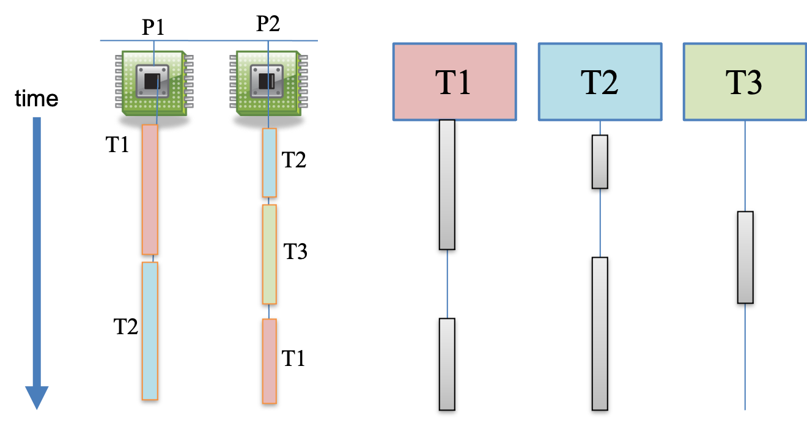
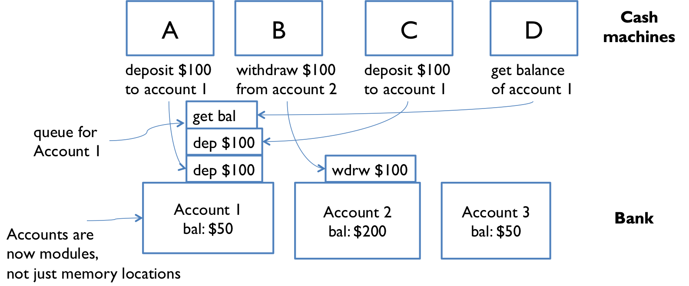
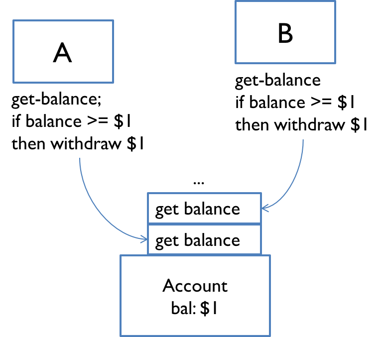

# Reading 14: Concurrency

## Concurrency

Concurrency 是多个计算同时发生。

出现的场景：在同一网络的pc，多个application运行在同一个Pc，一个芯片多个processors

concurrency 应用在网站，app，图形接口等方面。

* Web sites must handle multiple simultaneous users.
* Mobile apps need to do some of their processing on servers (“in the cloud”).
* Graphical user interfaces almost always require background work that does not interrupt the user. For example, Visual Studio Code compiles your TypeScript code while you’re still editing it.

Processor clock speeds 不再提高，相对应的是芯片的核心数在不断地增加。

in order to get a computation to run faster, we’ll have to split up a computation into **concurrent pieces**.

## Two models for concurrent programming

对于 cocurrent progtamming ，常见有两种模型——shared memory and Message passing。

### Shared memory 

A and B 分别持有各自私有的内存，同时也存在彼此都能够访问的内存。通过这个共享的内存来实现彼此的通信。
此处的内存既可以是真实的物理内存，也可以是内存之中的同一个文件或者threads之间共享的的object。

### Message passing

A and B 之间的交互人通过一个communication channel进行传递，接收方和发送方的信息通过队列的形式。

A and B可以是网络连接的电脑，可以是浏览器和服务器，可以是客户端和服务端口，也可以是运行的两个程序彼此之间使用pipe连接在一起，像 ls | grep

## Processes, threads, time-slicing

上文中的两个model是关于两个current modual相互交流。而一般的current midual来源于process和threads。

### Process

它是程序运行的instance。process使得程序感觉都像是独占一个电脑，感觉整个世界就是为他而生。

所以说process 虚拟了一台专为当前程序的pc。

不同的process不能够访问各自的内存，就像是有网络连接的两台电脑。OS可以实现share-memory。（实际上是内存映射）。

### Threads

A thread is a locus of control inside a running program. Think of it as a place in the program that is being run, plus the stack of method calls that led to that place (so the thread can go back up the stack when it reaches return statements).

threads = a function + address of call this function

threads 相当于在一台虚拟的pc之中，模拟了一个processor。在这个虚拟的processor中threads运行这与peocess一一样的程序使用ptocess的内存。所以threads天然就拥有着share-memory的机制，当然也存在每一个thread所独有的 “thread-local” memory 。

### Time slicing.

How can you have many concurrent threads with only one or two processors in your computer? 

假设你只有两个单独的processor，如何创建多个threads？

### cocurrent and parallel

1. Concurrent（并发）：

    * 并发是一种高级编程概念，通常与多任务和多线程一起使用。
    * 并发是指在有限的时间内，同时处理多个任务，但不一定是同时执行。任务之间可以轮流交替执行，通过时间片轮转或事件驱动等方式来实现。
    * 并发的目标是提高系统的效率、资源利用率和响应性。它通常用于处理大量的非 CPU 密集型任务，如网络通信、I/O 操作等。
    * 并发可以在单个 CPU 上实现，因为它不要求任务真正同时执行。

2. Parallel（并行）：

    * 并行是指在同一时刻同时执行多个任务，通常需要多个处理单元，例如多个 CPU 核心或多台计算机。
    * 并行的目标是加速任务的执行，通过同时处理多个任务来减少总体执行时间。
    * 并行通常用于处理需要大量计算的 CPU 密集型任务，例如科学计算、图像处理等。
    * 并行需要硬件支持，通常在多核处理器、多处理器系统或计算集群中实现。

简而言之，"并发" 强调的是任务的组织和管理，任务之间可以交替执行以提高效率，而 "并行" 强调的是同时执行多个任务以提高速度。这两个概念通常在多任务编程、操作系统和计算机架构中起着重要的作用，具体取决于任务的性质和可用的硬件资源。

当存在多个threads时，concurrency利用time slicing来模拟。即processor 通过在不同的threads 中切换。
图中的左侧显示了不同的threads在这两个processor中不同time slice中运行。

右侧是以threads的视角来看待这个过程。

当两个不同的threads同时两个不同的processor中运行时，这被称之为be running in parallel。

parallel为软件引来了parallelism。
这里注意，当所有的软件运行在一个processor中，此时的threads只会是current而非parallel。
对于软件来说即使threads只会是current，同样会引起问题。因为time slicing发生的时间是不精确也是不确定的。

## Workers in TypeScript

TypeScript does not have user-accessible threads, but it does have an abstraction called Worker. Sometimes called Web Workers because the API first appeared in web browsers, the API is also supported by Node.

A Worker is created by specifying the JavaScript file that it should execute as its starting point.

这里的文件要求必须是.js

Both the Mozilla and Node documentation for workers calls them threads, but their behavior is much more like separate processes:

* 使用共享内存——SharedArrayBuffer 
* 每一个worker都是工作在一个新的环境之中，当你在一个worker中导入一个midual时，另一个modual会在导入一次，不共享相同的副本。
* worker之间的通信基本上是依靠信息传递的机制。

we can think of a Worker as a lightweight process.

## Shared memory example

## Interleaving

因为操作不是原子的，所以在交替中执行代码时间，某一个worker的状态的来源可能并不是对应着串行的状态，因为此时前一个操作在逻辑上并没有为完成，所以获取的状态在逻辑上是错误的。

## Race condition

This is an example of a race condition. A race condition means that the correctness of the program (the satisfaction of its specs and preservation of its invariants) depends on the relative timing of events in concurrent computations A and B. When this happens, we say “A is in a race with B.”

Some interleavings of events may be OK, in the sense that they are consistent with what a single, nonconcurrent process would produce, but other interleavings produce wrong answers – violating specs or invariants.

Race condition

## Message passing example

这是 message passing 使用的场景，当有多个请求被受到时，它们会以queue的顺序放置，并以此顺序处理这些请求。

采用 message-passing 并不能保证不出现 race condidion。如下图所示，如果B的get-balance 操作的顺序不保证在A的withdraw 的顺序之后，那么还是会出现 race condition。

> One lesson here is that you need to carefully choose the operations of a message-passing model. withdraw-if-sufficient-funds would be a better operation than just withdraw

## Concurrency is hard to test and debug

If we haven’t persuaded you that concurrency is tricky, here’s the worst of it. It’s very hard to discover race conditions using testing. And even once a test has found a bug, it may be very hard to localize it to the part of the program causing it.

Concurrency bugs exhibit very poor reproducibility. It’s hard to make them happen the same way twice. Interleaving of instructions or messages depends on the relative timing of events that are strongly influenced by the environment. Delays can be caused by other running programs, other network traffic, operating system scheduling decisions, variations in processor clock speed, etc. Each time you run a program containing a race condition, you may get different behavior.

These kinds of bugs are heisenbugs, which are nondeterministic and hard to reproduce, as opposed to a bohrbug, which shows up repeatedly whenever you look at it. Almost all bugs in sequential programming are bohrbugs.

A heisenbug may even disappear when you try to look at it with console.log or a debugger! The reason is that printing and debugging are so much slower than other operations, often 100-1000x slower, that they dramatically change the timing of operations, and the interleaving.

This problem is particularly easy to see with threads using shared memory, because their access to shared variables is so fast. But it’s only masked, not truly fixed. A change in timing somewhere else in the program may suddenly make the bug come back.

It’s harder to see this effect with the TypeScript bank account example, using workers reading and writing a shared file, because file access is comparably slow to printing. But the heisenbug phenomenon still exists, and would certainly crop up if you stopped one of the cash machines at a breakpoint and tried to step through it with a debugger – the other cash machine would be able to run to completion without interference, and the problem would appear to go away.

Concurrency is hard to get right. Part of the point of this reading is to scare you a bit. Over the next several readings, we’ll see principled ways to design concurrent programs so that they are safer from these kinds of bugs.

## Summary

* Concurrency: multiple computations running simultaneously
* Shared-memory & message-passing paradigms
* Processes & threads
  * Process is like a virtual computer; thread is like a virtual processor
  * A TypeScript Worker is like a lightweight process.
  * Time slicing allows a processor to switch between multiple threads
* Race conditions
  * When correctness of result (postconditions and invariants) depends on the relative timing of events
These ideas connect to our three key properties of good software mostly in bad ways. Concurrency is necessary but it causes serious problems for correctness. We’ll work on fixing those problems in the next few readings.

* Safe from bugs. Concurrency bugs are some of the hardest bugs to find and fix, and require careful design to avoid.

* Easy to understand. Predicting how concurrent code might interleave with other concurrent code is very hard for programmers to do. It’s best to design your code in such a way that programmers don’t have to think about interleaving at all.

* Ready for change. Choosing the right concurrency design — for example which data are in shared memory, or what the messages are in a message-passing protocol — will not only prevent bugs now, but it will influence how easy it is to accommodate different changes in the future.

