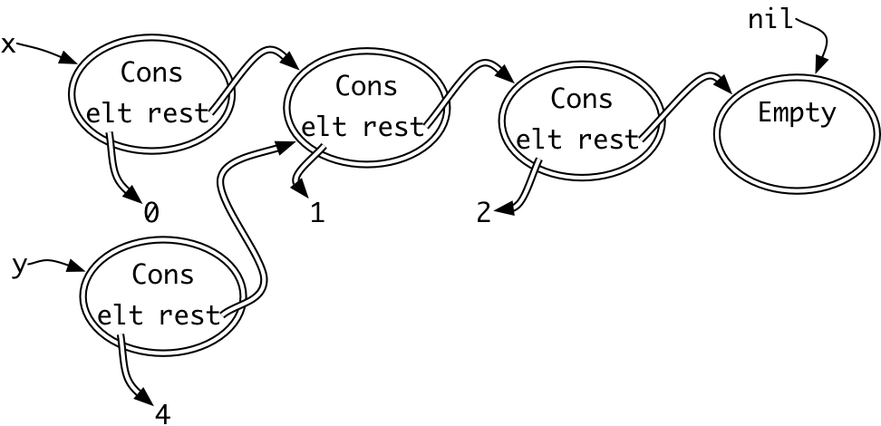

# Reading 16: Recursive Data Types(java)

## Immutable lists

immutability的强大：

1. 安全性
2. 便于之后share

## Immutable lists in Java

```java
public interface ImList<E> {
    // todo: empty() returning ImList<E>
    public ImList<E> cons(E elt);
    public E first();
    public ImList<E> rest();
}
```

以下是对接口的两个实现

Empty:

```java
public class Empty<E> implements ImList<E> {
    public Empty() {
    }
    public ImList<E> cons(E elt) {
        return new Cons<>(elt, this);
    }
    public E first() {
        throw new UnsupportedOperationException();
    }
    public ImList<E> rest() {
        throw new UnsupportedOperationException();
    }
}
```

Cons:

```java
public class Cons<E> implements ImList<E> {
    private final E elt;
    private final ImList<E> rest;

    public Cons(E elt, ImList<E> rest) {
        this.elt = elt;
        this.rest = rest;
    }
    public ImList<E> cons(E elt) {
        return new Cons<>(elt, this);
    }
    public E first() {
        return elt;
    }
    public ImList<E> rest() {
        return rest;
    }
}
```

这里缺少empty操作，可能的做法有两种：

1. 让客户端自行调用Empty的构造函数，自行构造空的Empty，但是这么做会导致放弃representation independence.应为客户端此时知道了表示empty是使用empty类来做大的。
2. 自行定义一个工厂方法。

为了不放弃representation independence，使用第二种方法：

```java
public interface ImList<E> {
    public static <E> ImList<E> empty() {
        return new Empty<>();
    }
    public ImList<E> cons(E elt);
    public E first();
    public ImList<E> rest();
}
```

empty 返回一个类型为E的ImList类型，他是静态方法，所以在声明的时候他无法知道子类或者子类的实例变量。
可以将这种函数返回值类型的声明视作：对于任何类型E，返回一个类型为E的ImList<E>。



这张图表现了一个非常重要的优点——sharing

X and Y share [1,2] which are only one copy in memory, and then , they are immutable.

### Two classes implementing one interface

> Empty and Cons are variants that cooperate, rather than alternatives to pick from.这里的 Empty and Cons 都是实现数据类型所必需的，并不是等同与多个实现。

rep invariant is for rep.

参数为null必须显示地说明。

## Recursive datatype definitions

datatype definition:
> ImList<E> = Empty + Cons(elt:E, rest:ImList<E>)

Empty 和Cons本称作variants，中文是变体，这说明了Empty 和 Cons本身就代表着不同类型的值，他们是不同的形态。

ImList 被两种值所表示：Empty 或者 Cons，Cons 包含有两个field，一个是elt，另一个是rest。可以使用这种定义，无限在后面添加Cons，这样可以使得这种结构一直在延长。

用datatype definition记录能够使结构更加可视化

格式写法:

* an abstract datatype on the left, defined by its representation (or concrete datatype) on the right
* the representation consists of variants of the datatype combined by a union operator, which we’ll write as +
* each variant is a class name with zero or more fields, written with name and type separated by a colon (:).

递归的数据定义将左侧的抽象类型应用在了右侧他自己的定义里.以下是一个例子(这同时也是递归定义的标志):

> Tree<E> = Empty + Node(e:E, left:Tree<E>, right:Tree<E>)

Tree 定义成 Empty 和 Node的集合,元素的类型是.这表示Tree的值要么是Empty,要么是Note，一次只能是一种。

When you write a recursive datatype, document the recursive datatype definition as a comment in the interface:

```java
public interface ImList<E> {

    // Datatype definition:
    //   ImList<E> = Empty + Cons(elt:E, rest:ImList<E>)

    // ...
}
```

optional datatype definition:
>Optional<E> = Present(e:E) + Empty

## Functions over recursive datatypes

将一个数据类型，当成递归定义中的一个具体的variants，一来能够操纵递归和无边界的数据结构类似list和trees。
另外可以很方便的将每一个操作转换成函数。

用一个具体的variants来思考结构的表示和描述操作，每一个variants就代表着函数的一次执行情况。

例如：

size : ImList → int

size(Empty) = 0  
size(Cons(elt:E, rest:ImList)) = 1 + size(rest)

size(Cons(0, Cons(1, Empty)))  
   = 1 + size(Cons(1, Empty))  
   = 1 + (1 + size(Empty))  
   = 1 + (1 + 0)  
   = 1 + 1  
   = 2

传化成java　code

```java
public interface ImList<E> {
    // ...
    public int size();
}

public class Empty<E> implements ImList<E> {
    // ...
    public int size() { return 0; }
}

public class Cons<E> implements ImList<E> {
    // ...
    public int size() { return 1 + rest.size(); }
}
```


以下是具体的实例：

isEmpty : ImList → boolean

>isEmpty(Empty) = true  
isEmpty(Cons(elt:E, rest:ImList)) = false

contains : ImList × E → boolean

> contains(Empty, e:E) = false  
contains(Cons(elt:E, rest:ImList), e:E) = (elt=e) or contains(rest, e)

get: ImList × int → E
>get(Empty, n:int) = undefined  
get(Cons(elt:E, rest:ImList), n:int) = if n=0 then elt else get(rest, n-1)

append: ImList × ImList → ImList

>append(Empty, list2:ImList) = list2  
append(Cons(elt:E, rest:ImList), list2:ImList) = cons(elt, append(rest, list2))

reverse: ImList → ImList

>reverse(Empty) = empty()  
reverse(Cons(elt:E, rest:ImList)) = append(reverse(rest), cons(elt, empty()))

从以上的例子可以看出如何：implementing the operation (recursively) in each concrete variant

这里的variant: 指的是组成数据类型表示的各个variant.
在imlist中，variant指的就是: Empty and Cons。
也就是说当我们实现一个操作的时候，我们可以将每一个variant作为一种情况来考虑。然后递归的调用，以下是一个例子：

size(Empty) = 0  
size(Cons(elt:E, rest:ImList)) = 1 + size(rest)

size(Cons(0, Cons(1, Empty)))  
   = 1 + size(Cons(1, Empty))  
   = 1 + (1 + size(Empty))  
   = 1 + (1 + 0)  
   = 1 + 1  
   = 2

这个例子我们就是先根据variants,在将其简化为成递归的步骤。


## Tuning the rep

```java
public class Cons<E> implements ImList<E> {
    private final E elt;
    private final ImList<E> rest;
    private int size = 0;
    // rep invariant:
    //   elt != null, rest != null, size >= 0
    //   size > 0 implies size == 1+rest.size()

    // ...
    public int size() { 
        if (size == 0) size = 1 + rest.size();
        return size;
    }
}
```

为了性能，增加了rest field。

## Rep independence and rep exposure revisited

对于isEmpty，在document spec时，不会：“return true iff this is an instance of Empty.”而是用抽象类型：“return true iff this list contains no elements.”

Any time you write an ADT, its specs must not talk about the rep

```java
public class Cons<E> implements ImList<E> {
    private final E elt;
    private final ImList<E> rest;
    int size;

    public Cons(E elt, ImList<E> rest) {
        this.elt = elt;
        this.rest = rest;
    }
    public ImList<E> cons(E elt) {
        return new Cons<>(elt, this);
    }
    public E first() {
        return elt;
    }
    public ImList<E> rest() {
        return rest;
    }
}
```
Cons.rest()返回内部list的引用是否产生了rep exposure.
Cons的invariants: 

1. size 用于是正确的
2. Cons是不可变的

没有：因为返回的引用是不可变化的。

## Null vs. empty

使用一个表示empty的对象而不是null，这是一种设计模式——sentinel objects。

这么做的好处是：即便是一个empty的对象，你依然可以调用对象的方法，null做不到这一点。另外，因为这个特性，导致在很多的场景下，必须添加检测代码在实际中。

```java
if (list != null) n = list.size();
```

你可能经常会忘记，所以这么写更安全和通用：

```java
n = list.size();
```
Keep null values out of your data structures, and your life will be happier.

## Declared type vs. actual type

static type or compile-time type
所有的具有静态检查的面向对象的语言有两种类型检查：compile time and running time

compile time,每一个变量都有一个declared type。

run time,每一个对象都有一个 actual type,也叫做dynamic type or runtime type 。

## Another example: Boolean formulas

在计算机科学中利用递归的数据类型表示的另一个例子： Boolean formulas

math:
>(P ∨ Q) ∧ (¬P ∨ R)

datatype definition:

```java

Formula = Variable(name:String)
          + Not(formula:Formula)
          + And(left:Formula, right:Formula)
          + Or(left:Formula, right:Formula)
```

java code:

```java
And( Or(Variable("P"), Variable("Q")),
     Or(Not(Variable("P")), Variable("R")) )
```

## Backtracking search with immutability

回溯搜索是一种在问题空间中进行搜索的方法，通常通过不断做出选择来前进，当选择导致无法找到解时，需要回溯。

1. immutable list只有末端可以共享，如果一个结构开头是一致的，但随后就不相同了，那么这两个list 就必须要分开存储(因为list是单链)
2. 可变的数据类型通常并不适用回溯算法，因为他需要撤销之前的操作，回到上一步操作，可变类型需要修改，但不可遍类型只需要丢弃当前的状态。
3. 使用不可比也不共享的数据结构也不是一个好的选择，他会导致空间需求呈现出二次增长。
4. immutable list 的优点是每一步都共享前一步的信息
5. 使用不可变的数据结构的搜索可以立即使用并行优化
