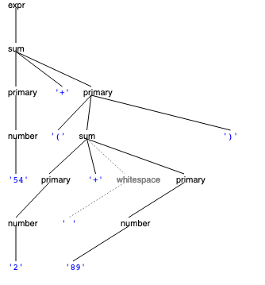
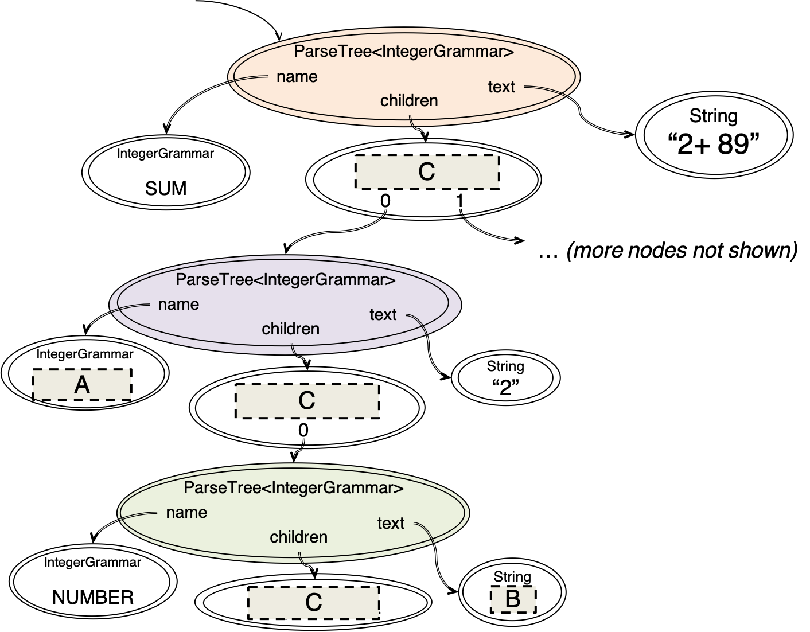

# Reading 18: Parsers

## Parser generators

parser generator -> parser -> parse tree -> recursive datatype

* parser generator: takes a grammar as input and generates parser.
* parser: take a sequence of characters and tries to match the sequence against the grammar.
* parse tree: root of tree is root nonterminal of the grammar.
* recursive abstraction data to represent expressions like HTML, Markdown, Java, algebraic data type(AST).
* AST: A recursive abstract data type that represents a language expression is called an abstract syntax tree (AST).


## A ParserLib grammar

```java
html ::= ( italic | normal ) * ;
italic ::= '<i>' html '</i>' ;
normal ::= text ; 
text ::= [^<>]+ ;  /* represents a string of one or more characters that are not < or > */
```

## Calling the parser



>ParseTree<IntegerGrammar> tree = parser.parse("54+(2+ 89)");

这是一个parser对象, 可以使用这个对象解析一段文本并生成一个parseTree.

### Classpath resources

classloaders essentially act as a layer of abstraction between resource name and location on disk

通过设置 JVM的类路径 -classpatch，将资源文件放置在\classes 目录中。

```java
  ClassLoader.getResourceAsStream ("some/pkg/resource.properties");
  Class.getResourceAsStream ("/some/pkg/resource.properties");
  ResourceBundle.getBundle ("some.pkg.resource");
```

通过classloader 可以载入资源。

Additionally, if the code is in a class within a some.pkg Java package, then the following works as well:

```java
Class.getResourceAsStream ("resource.properties");
```

## Traversing the parse treea


```
EXPR:54+(2+ 89)
  SUM:54+(2+ 89)
    PRIMARY:54
      NUMBER:54
    PRIMARY:(2+ 89)
      SUM:2+ 89
        PRIMARY:2
          NUMBER:2
        PRIMARY:89
          NUMBER:89
```

```java
// the IntegerExpression grammar
@skip whitespace {
    expr ::= sum ;
    sum ::= primary ('+' primary)* ;
    primary ::= number | '(' sum ')' ;
}
whitespace ::= [ \t\r\n]+ ;
number ::= [0-9]+ ;
```



## Constructing an abstract syntax tree

recursive datatype definition:

```java
IntegerExpression = Number(n:int) + Plus(left:IntegerExpression, right:IntegerExpression)
```

IntegerExpression (AST)

```java
/** Immutable type representing an integer arithmetic expression. */
public interface IntegerExpression {
    // Data type definition
    //    IntegerExpression = Number(n:int)
    //                        + Plus(left:IntegerExpression, right:IntegerExpression)
    //                        + Times(left:IntegerExpression, right:IntegerExpression)
    
    /** @return the computed value of this expression */
    public int value();
}
```

IntegerExpression 只捕获重要的一部分：分组和值。忽略掉创建这个AST的字符序列的细节。

2+2, ((2)+(2)), and 0002+0002 会产生不同的 concrete syntax tree，但是都只会对应一个相同的 abstract IntegerExpression value: Plus(Number(2), Number(2)).

IntegerExpression parser 产生的concrete syntax tree

## Handling errors


## Left recursion and other ParserLib limitations

ParserLib works by generating a top-down Recursive Descent Parser. 这种类型的parser 有两种问题值得值出。

### Left recursion.

```java
sum ::= number | sum '+' number ; number ::= [0-9]+ ;
```

sum的可能的值可以是 ：sum '+' number ;当需要匹配这各类型的值时，我们首先就需要匹配sum，我们会陷入到一种无限的循环之中。parser 总是区匹配sum，在这个过程之中，他不会对这个字符串作任何的处理，也就是 not reducing to a smaller subproblem。

[generic technology for left recursive](https://en.wikipedia.org/wiki/Left_recursion#Removing_left_recursion)

```java
sum ::= number | thing number ;
thing ::= sum '+' ;
number ::= [0-9]+ ;
```

这也是相同的问题，但是它是以一种间接的方式。

最简单的解决方法是：使用 (number +) * 来代替 sum。

### Greediness

```java
g ::= ab threeb ; 
ab ::= 'a'*'b'* ;
threeb ::= 'bbb' ;
```

string 'aaaabbb' 很明显是能够 匹配grammar g。但实际区却不能。
ab会尽可能多的去匹配多的ab字符串，所以他会耗尽字符串，而不去匹配threeb。

this is a more fundamental limitation of the type of parser implemented by ParserLib.
