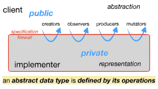

# Reading 6: Abstract Data Types

## Instruction

ADT让我们将程序中具体使用某个数据结构分离，不用在使用时假设某个具体的数据结构。

## What abstraction means

* Abstraction. Omitting or hiding low-level details with a simpler, higher-level idea.
* Modularity. Dividing a system into components or modules, each of which can be designed, implemented, tested, reasoned about, and reused separately from the rest of the system.
* Encapsulation. Building a wall around a module so that the module is responsible for its own internal behavior, and bugs in other parts of the system can’t damage its integrity.
* Information hiding. Hiding details of a module’s implementation from the rest of the system, so that those details can be changed later without changing the rest of the system.
* Separation of concerns.Making a feature (or “concern”) the responsibility of a single module, rather than spreading it across multiple modules.

以构造一个函数作为上下文：Abstraction: 

* A spec is an abstraction in that the client only has to understand its preconditions and postconditions to use it, not the full internal behavior of the implementation.
* Modularity: Unit testing and specs help make functions into modules.
* Encapsulation: The local variables of a function are encapsulated, since only the function itself can use or modify them. Contrast with global variables, which are quite the opposite, or local variables pointing to mutable objects that have aliases, which also threaten encapsulation.
* Information hiding: A spec uses information-hiding to leave the implementer some freedom in how the function is implemented.
Separation of concerns: A good function spec is coherent, meaning it is responsible for just one concern.

### User-defined types

抽象数据类型以操作来特征一个类型。类似number可以执行加减，string可以连接和切割。与用户一般定义的类型不同，ADT并不担心具体的值在ADT里是如何表示的，用户能够忽略底层的表示。

## Classifying types and operations

type分成内置和自定义，也可以分为可变和不可变。
可变和不可变的区别在于具有的操作不同，一个可以改变现有的结构，一个只能够创建新的对象。
操作可以分为四种：Creator, Protucer,  Observer, Mutator。
其中区分Creator: 接受不同的参数，创建对象。Protucer: 接受同类型的对象作为参数，创建一个新的对象。

## An abstract type is defined by its operations

ADT构造的核心是操作。对于一个Array,我们不关心他具体是用一段内存，list或者哈希表，而只是根据他的特征：一堆看不见的数据和一系列操作（[i],length,push）。

隐藏一系列共享的数据和操作。

The operations of the type constitute its abstraction. This is the public part, visible to clients who use the type.

The fields of the class that implements the type, as well as related classes that help implement a complex data structure, constitute a particular representation. This part is private, visible only to the implementer of the type.

## Designing an abstract type

1. 操作最好是单一职责。
2. 实现的操作应该是有着明确目的，一个复杂的，功能繁杂的操作不仅使用场景单一，且难以实现（针对set的sum操作，考虑set是string，obj等类型）
3. 操作应该是满足客户端的需要，不仅考虑必要，还有是否方便，性能等考量。
4. 不因该混合ADT专用功能和通用功能。

## Representation independence

使用ADT应该独立于它是如何表示的。

ADT的表示包含了他的field和任何对这个field的假设和需求。

## Realizing ADT concepts in TypeScript

## Testing an abstract data type

