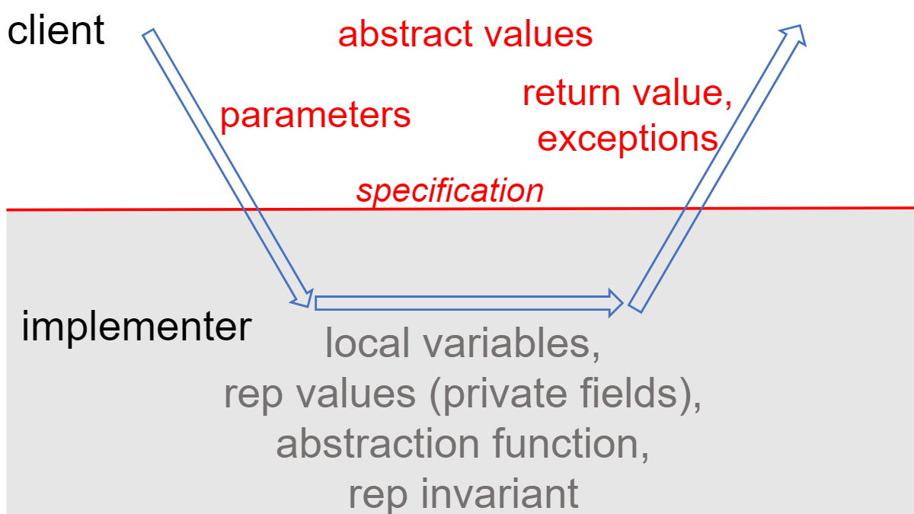

# Reading 7: Abstraction Functions & Rep Invariants

Objectives

<ul id="@invariants_representation_exposure">
<li><a class="jump" href="#@invariants_representation_exposure"></a>invariants</li>
<li>representation exposure</li>
<li>abstraction functions</li>
<li>representation invariants</li>
</ul>

<p id="@reading_study_more"><a class="jump" href="#@reading_study_more"></a>In this reading, we study a more formal mathematical idea of what it means for a class to implement an ADT via the notions of <em>abstraction functions</em> and <em>rep invariants</em>.
These mathematical notions are eminently practical in software design.
The abstraction function gives us a way to cleanly define the equality operation on an abstract data type (which we’ll discuss in more depth in a future class).
The rep invariant makes it easier to catch bugs caused by a corrupted data structure.</p>

## Invariants

invariants 作为程序的属性，是在整个运行期间状态都不会发生改变。
例如一旦我们创建了一个int 类型的变量，那么Java本身不允许在运行期间这个变量变成其他的了类型，这就是一种invariants。

对于一个immutable 类型，一旦创建，他的值就不可以改变，这也是一种invariants。还有，变量i如果是作为迭代的指示器，那么他就一定要满足：0 < i < length - 1，这也是一种invariants。

### Immutability

#### representation exposure

对于不可变的类型，必须要确保他内部的field 不被改变。所以不能给client改变内部值的能力。通常会将需要的field定义为Private，并设置为final。

类似的一旦产生representation exposuree，也会威胁到representation independence。因为一旦在client的使用中直接访问field，那么一旦我们改变实现，对应的client就必须也要改变。一个例子：当我们构造自己的字符串时：

1. 直接使用chart[]。
2. 使chart[]和int start and int end。

可以看到后者可能会出现只有在规定的范围中的字符才是有效的。一旦由第一种改成第二种，势必要划定有效的范围，那么就必须要改变client。

以上的方法的缺陷是，尽管无法直接获取内部的field和对其重新分配，我们可以做到的是间接获取某一个field的引用(通常会有set和get方法)，然后如果这个field本身是mutable，那么就可以通过这个reference修改。
比较直观的例子就是Date类：
```Java

Date d = t.getTimestamp();
d.setHours(d.getHours()+1);
```

解决的方法是使用 **defensive copying**，即直接返回一个新的对象。

```Java
public Date getTimestamp() {
    return new Date(timestamp.getTime());
}
```

```Java
/**
 * @return a list of 24 inspiring tweets, one per hour today
 */
public static List<Tweet> tweetEveryHourToday () {
    List<Tweet> list = new ArrayList<Tweet>(); 
    Date date = new Date();
    for (int i = 0; i < 24; i++) {
        date.setHours(i);
        list.add(new Tweet("rbmllr", "keep it up! you can do it", date));
    } 
    return list;
}
```

这样其实依然还有问题，在以上的例子中，利用一个Date引用来创建24个Tweet，对于原本的tweet的实现，这么做会导致24个Tweet全部指向同一个Date，我们每一次迭代都在改变他。为了解决再创将中的这个问题，我们将他的构造函数也改写成defensive copying。

```Java
public Tweet(String author, String text, Date timestamp) {
    this.author = author;
    this.text = text;
    this.timestamp = new Date(timestamp.getTime());
}
```

以上的做法可能存在繁琐，如果一个对象太大，复制他的代价过于庞大我们可以在spec上注明不能更改，保持invariant。

在Java中可以使用immutabale wrapper 来将可变类型的的mutator操作禁止。但是这么做的缺点是一旦你利用原来的引用改变了值，wrapper在编译时并不会报错，wrapper不是一个单独的类型。

有关clone的限制：

>浅复制：clone() 方法默认执行的是浅复制，这意味着它只复制了对象的字段引用，而不是字段的内容。这可能导致意外的副作用，因为两个对象引用相同的数据。如果对象包含可变对象的引用，对其中一个对象所做的更改可能会影响到另一个对象，这可能会导致不可预料的行为。
>破坏封装性：clone() 方法绕过了类的构造器和访问控制（private、protected等），因此它可以复制对象的所有字段，包括私有字段。这可能会导致破坏类的封装性，使得私有字段可以在不应该被访问的情况下被复制和修改。
>缺乏通用性：要正确实现 clone() 方法，需要一定的编程经验，并且每个需要被复制的类都需要单独实现 clone() 方法。这使得代码更加复杂，容易出现错误。另外，一些类可能根本无法被合理地复制，因为它们引用了外部资源或依赖于运行时状态，这使得 clone() 方法无法正确工作。
>推荐使用其他方式：在Java中，通常更推荐使用其他方式来创建对象的副本，例如使用构造器来创建新对象并复制字段的值，或者使用序列化和反序列化等更灵活的方法。这些方法通常更安全、更容易理解和维护。
>综上所述，由于clone() 方法的一些问题和限制，一般建议避免使用它，而选择更安全和可靠的方式来创建对象的副本。

## Rep invariant and abstraction function

space of abstract values 是client想要的值，是存在在现实中的值。
space of representation values 是具体的Java对象，在BigInteger，他在内部表现为一个int 类型的数组，Biginterger可以将其组合映射成他要表示的值。

AF和RI，不会仅仅因为两个空间的确定就确定。

在现实之中如果像表示字符的集合，这是Abs value ，我们可以在内部选择String，这是Rep。但不是所有的Rep都能够存在一个对应的Abs value，因此RI会限制某一个space中的rep是合法的，因为它可以映射一个实际的abs value，当然可以是多对一。

只有abs value space，我们能够选择很多的结构来表示他，比如对字符串来说，我们可以考虑用字符数组或者向量或者其他的结构，即Java对象。

rep value space 的值很多，这之中并不是全部都可以映射abs value space。必须有RI来确定。

即便是具有相同的RI，Rep value，Abs value，通过改变不同的abs，一个同样的具体的一个表示值(比如 <String, a>，可以被解释成字符a，如果要求数量是偶数，他就是一个不合法的值)

以上说明了**实现一个抽象类型(abstract type)不仅要选择两个空间(abs value space 和 rep value space )，同时还要确定哪些Rep是合法的(RI)，应该如何将Rep解释成Abs，也就是将两个空间映射(AF)。**

### Checking the rep invariant

Rep Invariant隐式表明Rep不能为Null，可以不写在注释中，但是需要包含在checkRep之中。可以显示的生声明可以为Null，可以思考Optional。

如果在checkRep中的方法对Null会抛出异常，可以省略单独对Null的检查。

## Beneficent mutation

在增加了Rep value space 和 abs value space了，我们扩大对immute的定义，只要依然保持映射到相同的abs value，可以允许内部的值发生改变。 

```Java
public class RatNum {

    private int numerator;
    private int denominator;

    // Rep invariant:
    //   denominator != 0

    // Abstraction function:
    //   AF(numerator, denominator) = numerator/denominator

    /**
     * Make a new RatNum == (n / d).
     * @param n numerator
     * @param d denominator
     * @throws ArithmeticException if d == 0
     */
    public RatNum(int n, int d) {
        if (d == 0) throw new ArithmeticException();
        numerator = n;
        denominator = d;
        checkRep();
    }

    /**
     * @return a string representation of this rational number
     */
    @Override
    public String toString() {
        int g = gcd(numerator, denominator);
        numerator /= g;
        denominator /= g;
        if (denominator < 0) {
            numerator = -numerator;
            denominator = -denominator;
        }
        checkRep();
        return (denominator > 1) ? (numerator + "/" + denominator) 
                                 : (numerator + "");
    }
}

```

ToString 作为一个observer，他改变了内部的值，但是从映射的abs value space 依然没有改变。另一个角度是AF作为多到一的函数，改变一个Rep有其他的可以代替。

## Documenting the AF, RI, and safety from rep exposure

注释中记录：

1. 要准确地记录什么值是有效的什么是无效的(RI)。
2. AF作为一个映射函数，必须要准确，类似“表示一系列的字符集合”是不准确的。

> AF(s) = {s[i] | 0 <= i < s.length()}

类似上面这样的定义是正确的，当我们带入一个具体的值时，例如：

> AF("abbc") = {"abbc"[i] | 0 <= i < "abbc".length } = { 'a', 'b', 'c' }.

我们会发现我们最终会得到一个这样的单一的值。

但如果我们这样：
> AF(s) = a set of characters
即使带入值“abbc”，他的右侧并不会有什么影响

最后要标注：safety from rep exposure ，为了防止rep exposure发生。

以下是一个例子：
```Java
// Immutable type representing a tweet.
public class Tweet {

    private final String author;
    private final String text;
    private final Date timestamp;

    // Rep invariant:
    //   author is a Twitter username (a nonempty string of letters, digits, underscores)
    //   text.length <= 280
    // Abstraction function:
    //   AF(author, text, timestamp) = a tweet posted by author, with content text, 
    //                                 at time timestamp 
    // Safety from rep exposure:
    //   All fields are private;
    //   author and text are Strings, so are guaranteed immutable;
    //   timestamp is a mutable Date, so Tweet() constructor and getTimestamp() 
    //        make defensive copies to avoid sharing the rep's Date object with clients.

    // Operations (specs and method bodies omitted to save space)
    public Tweet(String author, String text, Date timestamp) { ... }
    public String getAuthor() { ... }
    public String getText() { ... }
    public Date getTimestamp() { ... }
}
```

```Java
// Immutable type representing a rational number.
public class RatNum {
    private final int numerator;
    private final int denominator;

    // Rep invariant:
    //   denominator > 0
    //   numerator/denominator is in reduced form, i.e. gcd(|numerator|,denominator) = 1
    // Abstraction function:
    //   AF(numerator, denominator) = numerator/denominator
    // Safety from rep exposure:
    //   All fields are private, and all types in the rep are immutable.

    // Operations (specs and method bodies omitted to save space)
    public RatNum(int n) { ... }
    public RatNum(int n, int d) { ... }
    ...
}

```

### What an ADT specification may talk about

现在更新一下注释中应该有内容：

在Java doc中应该只有client的可见的部分。
向AF，RI，Rep或者一些私有field中的内容。不应该卸载外面，而应该在内部。




## ADT invariants replace preconditions

以下时之前的版本的spec

```Java
/** 
 * @param set1 is a sorted set of characters with no repeats
 * @param set2 is likewise
 * @return characters that appear in one set but not the other,
 *  in sorted order with no repeats 
 */
static String exclusiveOr(String set1, String set2);
```

使用ADT的spec

```Java
/**
 * @return characters that appear in one set but not the other
 */
static SortedSet<Character> exclusiveOr(SortedSet<Character> set1, SortedSet<Character> set2);
```

这么做的好处：
1. 所有的前置条件现在都会被强制执行，而不是返回一个未知的结果。
2. 如果我们要改变sortedSet的rep，完全不需要再来修改exclusiveor。
3. 这样更容易理解，看一个sorterSet和一段注释前者更简洁和易懂。

### How to establish invariants

An invariant is a property that is true for the entire program – which in the case of an invariant about an object, reduces to the entire lifetime of the object.

To make an invariant hold, we need to:

make the invariant true in the initial state of the object; and
ensure that all changes to the object keep the invariant true.
Translating this in terms of the types of ADT operations, this means:

creators and producers must establish the invariant for new object instances; and
mutators, observers, and producers must preserve the invariant for existing object instances.
The risk of rep exposure makes the situation more complicated. If the rep is exposed, then the object might be changed anywhere in the program, not just in the ADT’s operations, and we can’t guarantee that the invariant still holds after those arbitrary changes.

So the full rule for proving invariants is as follows:

If an invariant of an abstract data type is

established by creators and producers;
preserved by mutators, observers, and producers; and
no representation exposure occurs,
then the invariant is true of all instances of the abstract data type.

This rule applies structural induction over the abstract data type.


## Summary

* An invariant is a property that is always true of an ADT object instance, for the lifetime of the object.
* A good ADT preserves its own invariants. Invariants must be established by creators and producers, and preserved by observers and mutators.
* The rep invariant specifies legal values of the representation, and should be checked at runtime with checkRep().
* The abstraction function maps a concrete representation to the abstract value it represents.
* Representation exposure threatens both representation independence and invariant preservation.
* An invariant should be documented, by comments or even better by assertions like checkRep(), otherwise the invariant is not safe from bugs.


The topics of today’s reading connect to our three properties of good software as follows:

* Safe from bugs. A good ADT preserves its own invariants, so that those invariants are less vulnerable to bugs in the ADT’s clients, and violations of the invariants can be more easily isolated within the implementation of the ADT itself. Stating the rep invariant explicitly, and checking it at runtime with checkRep(), catches misunderstandings and bugs earlier, rather than continuing on with a corrupt data structure.

* Easy to understand. Rep invariants and abstraction functions explicate the meaning of a data type’s representation, and how it relates to its abstraction.

* Ready for change. Abstract data types separate the abstraction from the concrete representation, which makes it possible to change the representation without having to change client code.