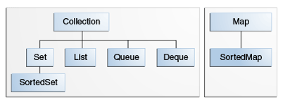

# Reading 8: Defining ADTs with Interfaces, Generics, Enums, and Functions

Objectives
Today’s class is about various ways to implement abstract data types, including:

* interfaces: separating the interface of an ADT from its implementation;
* generic types: defining a family of ADTs using generic type parameters;
* enumerations: defining an ADT with a small finite set of values;
* global functions operating on an opaque type: rare in TypeScript but common in non-object-oriented languages.
We also discuss subtyping as a relationship between two types determined by their specs, and distinguish it from subclassing, which involves reps as well.

After today’s class, you should be able to:

* define ADTs using classes, interfaces, generics, and enumerations
* determine whether one type is a subtype of another

## Interfaces

使用Iterfaces实现ADT的好处：
1. Interface中没有rep，只有client所需要的方法。
2. 能够有更多映射相同的abstract value但rep不同的ADT。
3. static error。

### about Java

Java 中interface允许实现default method 和 static method


### About interfaces in TypeScript

interface contains the spec of an ADT, namely its public method signatures and public instance methods.

It also should not include any abstraction function, rep invariant, or safety from rep exposure argument, as all those depend on having a rep.

## Subtypes

subtypes 是subset of subertype。

“B is a subtype of A” means “every B is an A.” In terms of specifications: “every B satisfies the specification for A.”

编译器不能检查subtype的spec的强弱，设定上应该是至少与实现的interface强度相同。

可以通过继承已经存在的接口来强化spec或是添加更多的方法。

### Collection Interfaces

<!-- [collection interfaces tutor](https://docs.oracle.com/javase/tutorial/collections/interfaces/) -->



The following list describes the core collection interfaces:

* Collection — the root of the collection hierarchy. A collection represents a group of objects known as its elements. The Collection interface is the least common denominator that all collections implement and is used to pass collections around and to manipulate them when maximum generality is desired. Some types of collections allow duplicate elements, and others do not. Some are ordered and others are unordered. The Java platform doesn't provide any direct implementations of this interface but provides implementations of more specific subinterfaces, such as Set and List. Also see The Collection Interface section.
* Set — a collection that cannot contain duplicate elements. This interface models the mathematical set abstraction and is used to represent sets, such as the cards comprising a poker hand, the courses making up a student's schedule, or the processes running on a machine. See also The Set Interface section.
* List — an ordered collection (sometimes called a sequence). Lists can contain duplicate elements. The user of a List generally has precise control over where in the list each element is inserted and can access elements by their integer index (position). If you've used Vector, you're familiar with the general flavor of List. Also see The List Interface section.
* Queue — a collection used to hold multiple elements prior to processing. Besides basic Collection operations, a Queue provides additional insertion, extraction, and inspection operations.
Queues typically, but do not necessarily, order elements in a FIFO (first-in, first-out) manner. Among the exceptions are priority queues, which order elements according to a supplied comparator or the elements' natural ordering. Whatever the ordering used, the head of the queue is the element that would be removed by a call to remove or poll. In a FIFO queue, all new elements are inserted at the tail of the queue. Other kinds of queues may use different placement rules. Every Queue implementation must specify its ordering properties. Also see The Queue Interface section.

* Deque — a collection used to hold multiple elements prior to processing. Besides basic Collection operations, a Deque provides additional insertion, extraction, and inspection operations.
Deques can be used both as FIFO (first-in, first-out) and LIFO (last-in, first-out). In a deque all new elements can be inserted, retrieved and removed at both ends. Also see The Deque Interface section.

* Map — an object that maps keys to values. A Map cannot contain duplicate keys; each key can map to at most one value. If you've used Hashtable, you're already familiar with the basics of Map. Also see The Map Interface section.

The last two core collection interfaces are merely sorted versions of Set and Map:

* SortedSet — a Set that maintains its elements in ascending order. Several additional operations are provided to take advantage of the ordering. Sorted sets are used for naturally ordered sets, such as word lists and membership rolls. Also see The SortedSet Interface section.
* SortedMap — a Map that maintains its mappings in ascending key order. This is the Map analog of SortedSet. Sorted maps are used for naturally ordered collections of key/value pairs, such as dictionaries and telephone directories. Also see The SortedMap Interface section.


因为在所有的collection及以下的接口中都能够throw unsupport exception，所有对他们的mutability和immutability是没有再spec中要求。
List.of()返回的是一个不可改变的List，由他创建的对象不能做任何mutator的操作。它可以作为调用某一个方法时创建它的参数。返回时可以使用return Collections.unmodifiableList(...) 构造不可改变的List。
通常method默认状况下，参数是不可改变的，返回值没有这种约定。


## example: MyString

```Java
MyString s = new FastMyString(true);
List<String> s = new ArrayList<String>();
```
这么做实际上违反了我们之前一直以来建立的抽象(abstraction barrier)。这与其具体的表示挂上了钩，List没有定义constructor，所以也不会有他的spec。该构造函数的规范不会出现在任何接口中，因此没有静态保证不同的实现甚至会提供相同的构造函数。可以使用静态的工厂方法来解决。

```Java
public interface MyString { 

    /**
     * @param b a boolean value
     * @return string representation of b, either "true" or "false"
     */
    public static MyString valueOf(boolean b) {
        return new FastMyString(b);
    }
}
    // ...
```


### Structural subtyping in TypeScript

structural subtyping是TS的一种方便的机制：如果B存在所有A需要的操作——相同的public 方法和比变量，并且变量的类型是兼通的，那么即使并没有使用implement或者extend关键字，也依旧认为B是A的subtype。

这种机制有好处也有坏处，好处是方便，但隐患是B的spec与A并不会保持一致(因为没有implement，所以你不知道B要遵守A的spec)。

这就导致如果A是immutability，但B添加了mutator的方法，会直接导致A变量被赋值了B实例，A可以改变状态。

## Why interfaces?

1. 静态检查和简化人类阅读
2. 不同的应用对不同的实现有不同的性能
3. 便于针对各种不同的目的的spec
4. 因为视角的不同而产生不同种类的相同接口的ADT(菜单栏和菜单项)
5. 灵活切换不同的实现，遵照ADT的编写策略

## Subclassing

使用子类实现ADT是另一种方法。他使得子类继承了父类的全部rep和方法。这样做的好处是很多的东西可以直接复用，但是相对的会引入更多的问题：

1. 子类和父类之间充满了rep exposure
2. 子类和父类充满rep dependece
3. 子类和父类可能会意外违反rep invarains

Designing for safe subclassing means that the superclass must now offer two contracts: one for interaction with clients, and one for subclasses. These issues simply do not arise with interfaces.

### More 关于使用subclassing

subclassing breaks encapsulation

>When a class is subclassed, either it must freeze its implementation forever, or all its subclasses must evolve with its implementation.

当子类继承父类之后，一旦父类做出了改变，比如父类改变了RI，子类必须也要同时更改。

#### Use composition rather than subclassing

```Java
public class Album {
    protected Set<Photo> photos;
    public void addNewPhoto(Photo photo) { photos.add(photo); }  
}

public class MyAlbum extends Album {
    public void removePhoto(Photo photo) { photos.remove(photo); }  
}

public class Album { 
    protected Set<Photo> photos;
    protected Map<Person, Photo> photosContaining;
    // rep invariant: all Photos in the photosContaining map
    //                are also in the photos set
    // ...
}

```

<s>public class Properties extends Hashtable { ... }</s>
public class Properties {
    private final Hashtable table;
    // ...
}

~~public class CountingList<E> extends ArrayList<E> { ... }~~
public class CountingList<E> implements List<E> { 
    private List<E> list;
    public CountingList<E>(List<E> list) { this.list = list; }
    // ...
}

以上的做法称之为 forward。

```Java
public class CountingList<E> implements List<E> { 
    private List<E> list;
    private int elementsAdded = 0;

    public CountingList<E>(List<E> list) { this.list = list; }

    public boolean add(E elt) {
        elementsAdded++;
        return list.add(elt);
    }
    public boolean addAll(Collection c) {
        elementsAdded += c.size();
        return list.addAll(c);
    }
    // ...
}
```

```Java
public class CountingList<E> extends ArrayList<E> {

    // total number of elements ever added
    private int elementsAdded = 0;

    @Override public boolean add(E elt) {
        elementsAdded++; 
        return super.add(elt);
    }

    @Override public boolean addAll(Collection c) {
        elementsAdded += c.size();
        return super.addAll(c);
    }
}
```

``` Java
public class CountingList<E> extends ArrayList<E> {

    // total number of elements ever added
    private int elementsAdded = 0;

    @Override public boolean add(E elt) {
        elementsAdded++; 
        return super.add(elt);
    }

    @Override public boolean addAll(Collection c) {
        elementsAdded += c.size();
        return super.addAll(c);
    }
}

```

### Overriding and dynamic dispatch

 dispatching: 当一个方法有多种实现时间，Java必须要决定使用哪一个实现。
 
 Java的规则： dynamic dispatch——结果取决于运行时的类型。

 对于父级的类，不能用他来调用他不具有的方法，一个Objectiv不可能调用所有的方法(所有的class inherit it)。


## Generic types

一个奇怪的Java语法现象：静态的generic method 需要  

```Java

public static <F> Set<F> make() { ... }
```

### Implementing generic interfaces

有两种方式：

1. 实现generic interface时，直接确定他的类型。
2. 用generic implementation。

```java

public interface Set<E> {

    // ...

    /**
     * Test for membership.
     * @param e an element
     * @return true iff this set contains e
     */
    public boolean contains(E e);

    /**
     * Modifies this set by adding e to the set.
     * @param e element to add
     */
    public void add(E e);

    // ...
}

public class CharSet implements Set<Character> {

    private String s = "";


    // ...


    @Override
    public boolean contains(Character e) {
        checkRep();
        return s.indexOf(e) != -1;
    }

    @Override
    public void add(Character e) {
        if (!contains(e)) s += e;
        checkRep();
    }
    // ...
}
```

```Java
public interface Set<E> {

    // ...
                                               
public class HashSet<E> implements Set<E> {

    // ...
```

第二种方式对类型只能利用已经存在在generic interface中的内容。

## Enumerations

一般针对有限且比较小的值。

### 使用 enumerations的好处：

enumeration class 无论是在内部还是外部定义，他的实例化发生在“类文件的加载”。 作为一个没有构造器的类，同一时间只会存在一个实例，所以它的内存地址都是唯一的。正因如此，我们可以使用“==”来进行比较，这么做还会引入对类型的静态检查 fail fast。

枚举类中field的类型如同其他的变量一样，可以指定。
与原始值不同，枚举类型的变量可以为空（null），我们需要像处理其他对象类型一样避免它。

All enum types also have some automatically-provided operations, defined by Enum:

* ordinal() is the index of the value in the enumeration, so JANUARY.ordinal() returns 0.
* compareTo() compares two values based on their ordinal numbers.
* name() returns the name of the value’s constant as a string, e.g. JANUARY.name() returns "JANUARY".
* toString() has the same behavior as name().

## Getters and setters

## ADTs in non-OOP languages

```Java
FILE* f = fopen("out.txt", "w"); // open a file for writing
fputs("hello", f); // write to the file
fclose(f);  // close the file
```

对于像c语言一样非面向对象，实现ADT的方法是将ADT作为函数的的参数，对其所有的操作都是在函数内部完成，只需要传递指针的方式。类似与File类型。将本应该在类中的操作函数化，fclose，fopen，fputs。

One key takeaway from this is that the notion of an abstract data type does not depend on language features like classes, or interfaces, or public/private access control. Data abstraction is a powerful design pattern that is ubiquitous in software engineering.

