# Probability models and axioms

---

## Sample space

---

### What is sample space?

当做一个实验，实验中所有可能的结果组成一个set，这就是样本空间(sample space)。

ss有两个性质：

1. ss中每一个元素都是互斥的。
2. ss中包含所有可能的结果。

实际选择ss根据你期望的模型，例如对于toss coin experience，你可以选择{H,T}的ss，或者{H + sun,H+rain,T+sum,T+rain}。
两者都是正确，但前者的粒度更符合实际所需。

### How like it is?

sample space 本身是集合，他可以是{1,2} or {1,2,3 ......} or {(x,y)| 0<=x<=1 && 0<=y<=1}。
当顺序是考虑因素时，可以使用Tree图来表示。
lect中给出了两个实验，掷两次色子和投掷飞镖。

## Probability axioms

---

### Event

---
事件（event）是样本空间的subset。在描述连续的样本 空间（比如一个平面）时，某一个点的概率是0，但仍然能够说明，某一个区域的概率是一个正数，比如一个标靶上面部分。所以此处是将事件为分配概率的最小单位。

### Axioms

---

1. 非负：$$\tag{a}$$ $P(\omega) == 1$
2. 正则：$$\tag{b}$$ $p(A)\geq 0$
3. 可加：$$\tag{c}$$ $if A \cap B = \empty, P(A) \cup P(B)= P(A) + P(B)$

#### consequence

已知:
$$
\begin{align*}
 A \cup A^c = \omega \\
 A \cap A^c = \empty
\end{align*} $$

$1.由add和normal公理: P(A) \leq 1$

$$
\begin{aligned}
1 = P(\omega) = P(A \cup A^c) \\
P(A \cup A^c) = P(A) + P(A^c) \\
P(\omega) = P(A) + P(A^c) \\
P(A) = 1 - P(A^c) \\
P(A^c) \geq 0 \\
P(A) \leq 1
\end{aligned} $$

$2.P(\empty) = 0$

$$
\begin{aligned}
    P(\omega)= P(\omega \cup \omega^c) \\
    P(\omega) = P(\omega) + P(\omega ^c) \\
    1 = 1 + P(\omega^c) \land P(\omega^c) = P(\empty) \\
    P(\empty) = 0
\end{aligned}
$$

$3.P(A \cup B \cup C) = P(A) + P(B) + P(C), A \cap B \cap C = \empty$
$$
\begin{aligned}
P(A \cup B \cup C) = P((A \cup B) \cup C) \\
P(A \cup B \cup C) = P(A \cup B) + P(C) \\
P(A \cup B \cup C) = P(A) + P(B) + P(C)
\end{aligned}
$$

$由3可知，P(A_1 \cup A_2 \cup A_3 \cup \cdots A_n) = P(A_1) + P(A_2) + P(A_3) + \cdots + P(A_n)= \displaystyle \sum_{k=1}^nA_k，此处所有的集合A都是disjoint。$
$
对于P(\{S_1,S_2,S_3, \cdots S_n\}) = P(\{S_1\} \cup \{S_2\} \cup \{S_3\} \cup \cdots \{S_n\}) = P(S_1) + P(S_2) + \cdots + P(S_n)
$

此处将一个有限集视作有限个只包含一个元素的单一集合，然后在计算概率时，就可以使用有限集不相交的可加性。

4. If A$\subset$B，则P(A)$\leq$P(B)。
$$
\begin{aligned}
B = A + (A^c \cap B) \\
A,(A^c \cap B) is disjoin \\
P(B) = P(A) + P(A^c \cap B) \\
P(B) \geq P(A)
\end{aligned}
$$

5. P(A $\cup$ B) = P(A) + P(B) - P(A $\cap$ B)。
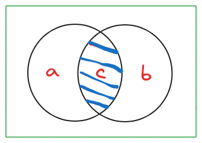
$$
\begin{aligned}
&a = P(A \cap B^c) \\
&b = P(B \cap A^c) \\
&c = P(A \cap B) \\
&left: P(A \cup B) = a + b + c (disjoin\quad  add) \\
&right: P(A) + P(B)-P(A \cup B) = (a+c) + (b+c) + c = a + b + c \\
&left = rifht
\end{aligned}
$$

由5可以推导，P(A $\cap$ B) $\geq$ 0(axiom), P(A) + P(B) $\leq$ P(A $\cup B$),这被称作并集边界(union bound)。

继续扩展5，考虑P(A $\cup$ B $\cup$ C)，图示如下
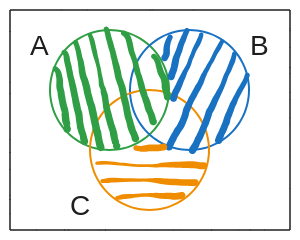

A $\cup$ B $\cup$ C = A $\cup$ (B $\cap$ A$^c$) $\cup$ (C $\cap$ A$^c$ $\cap$ B$^c$ )

P(A $\cup$ B $\cup$ C) = P(A + (B $\cap$ A$^c$) + (C $\cap$ A$^c$ $\cap$ B$^c$ ))=   P(A) + P(B $\cap$ A$^c$) + P(C $\cap$ A$^c$ $\cap$ B$^c$ )

### Example

#### discrete example

(probability law)概率法则是为每一个样本空间中的元素分配概率的“标准”，决定每一个元素的概率十是多少。
对于一个样本空间中的一个子集（事件），他的概率是子集中所有元素的数量乘以概率（此处每一个元素都是等概率）discrete uniform probability law 。

#### continuous example

向一块木板投掷飞镖，如果在这之中画出一块区域，计算飞镖设中这块区域的概率，此处可以使用uniform probability lay，即子集的概率是子集的面积/样本空间的面积。一个点的面积是0（不存在面积），所以对于飞镖射中某一个点的概率是0。

#### calculating probability

由此总结出计算概率的一般方法

1. 根据文字描述找出样本空间
2. 指定概率法则，这个过程比较随意，这也是建模的过程
3. 确定所求概率的事件的范围，即确定子集。
4. 计算。

### Countable additivity

一个离散，但是无限的样本空间
ex: 无限次抛一枚硬币，第一次出现正面的概率。
理论上，硬币可以无限次出现反面，所以这个样本的元素是无限的，但是每一个元素都是独立的，并不是连续的。
一次硬币的投掷，正面：1/2 反面：1/2
probability law :
$1/(2^n)$，n = {1,2,3,...}。
根据公理，样本空间的概率是1。
$$
\begin{aligned}
\sum_{n=1}^\infty\frac{1}{2^n} = 1/2 * (1 - 1/2^n)/(1 - 1/2) = 1
\end{aligned}
$$
所以probability law是合理的。但是此处存在一个问题：使用了可加的公理，这个公理假设事件是不相交且有限的，但此处的事件是无限的。

事实证明这样是可以的，我们可以扩展可加性：
对于事件$A_1,A_2,A_3,\cdots$，如果这些事件是sequence（可以按照顺序排列），不相交的，那么仍然是可加的。

此处有一反例，如果对于一个矩形平面，那么这个平面上所有的点的并集并不适用于可加公理，从图像上看，每一个点并不能够以序列(sequence)的排列(like, $A_1,A_2,A_3,\cdots$)。这样的事件即是不可计算的事件。

对于硬币实验，我们可以按照实验次数一次将可能发生的事件写出来（第一次是正面，第二次是正面，第三次是正面$\cdots$
而对于点我们无法刻意以某种顺序排列,且点与点之间是连续的（1,1），（1.1,1.1），（1.11,1.11）。

### What's meaning of probability

### Match background

---

#### De Morgan's law

对于如下的情况
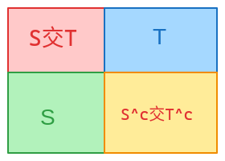
$$
(S \cap T)^c = S^c \cup T^c
$$

证明：
$$
If X \in (S \cap T)^c \Rightarrow X \notin S \cap T \\
\Rightarrow \{ X \notin S \quad or \quad X \notin T \} \\
\Rightarrow \{X \in S^c \quad or \quad X \in T^c \} \\
\Rightarrow X \in S^c \cup T^c
$$
上述证明中，当X属于S与T的交集的补集时，X不属于图中的红色部分。当X不属于S时，其属于蓝色和黄色部分。当X不属于T时，其属于绿色和黄色的部分，符合条件。两者的并集是绿色 + 黄色 + 蓝色。
这是De Morgan'S law的第一个结论，当使用一个简单的句法替换
$S \rightarrow S^c \quad S^c \rightarrow S \\$
$T \rightarrow T^c \quad T^c \rightarrow T \\$
根据第一个结论，可以推出
$(S^c \cap T^c)^c = S \cup T $
更进一步
$S^c \cap T^c = (S \cup T)^c$

De Morgan's law 适用于多个并集，通常写作如下

$\qquad \displaystyle {\Big(\bigcup _n S_ n\Big)^ c=\bigcap _n S_ n^ c,\qquad \Big(\bigcap _n S_ n\Big)^ c=\bigcup _n S_ n^ c}$

De Morgan's law 沟通了并集和交集，使得两者可以相互转化。

#### Sequence and limit

What's sequence?
一般的解释是：

* $a_1,a_2,a_3,...,a_i, i\in\{ 1,2,3 \cdots\} $，就是数列。
* 从数学的角度来说，sequence是一个函数，对于一个自然数i，f(i) = a_i。
  
limit即高数中的极限。
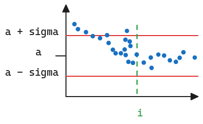
如图可以看出，当index > i时，之后所有的点$a_i$ 都落入到了 $a + \sigma$和 $a - \sigma$所围成的“带子”之中。对于这样的sequence，我门称其为converge a。

用数学表述是：
$$ if \forall \sigma > 0, there is a i_0, i > i_0, |a_i - a| \leq \sigma  $$

#### Infinite series

$\displaystyle \sum_{i=1}^\infty a_i = \lim_{n \to \infty }\sum_{i=1}^n$。
这只在极限存在有意义。

* $if a_i \geq 0$, limit must exsit.($\infin$ or a)
* if a_i have different sign
  * exsit
    * if rearrange different order, the series may diff.
    * if $\lim_{n \to \infin}\sum_{i=1}$
  * not exsit

#### The geometric series

* 将其视作等比数列之和的极限

#### About the order of summation in series with multiple indices

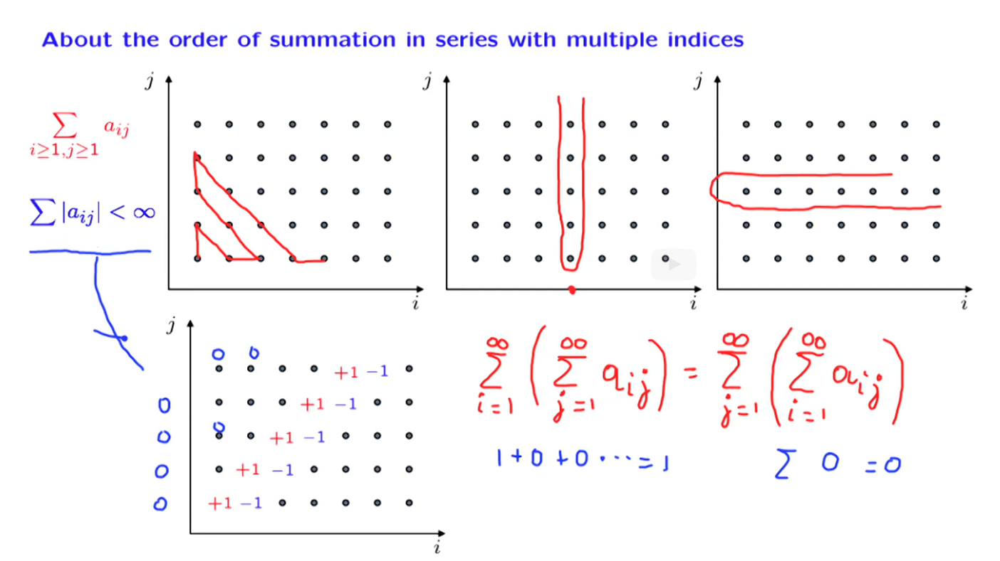
对于有两个下标的sequence(double sequence)，按照不同的顺序来求级数可能会有不同的结果。

1. 任意的顺序
2. 固定i，先求所有的j
3. 固定j，先求所有的i

如果将每一项取其绝对值，无穷级数收敛于一个实数，而不是无穷，则和与顺序无关。第四幅图展示了一个反例，取绝对值，无穷级数收敛于无穷。

下图是介绍 j$\leq$i的例子
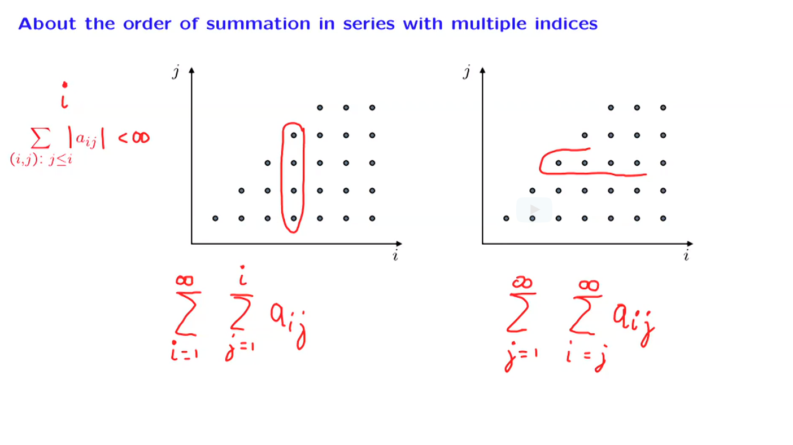

#### Countable and uncountable sets

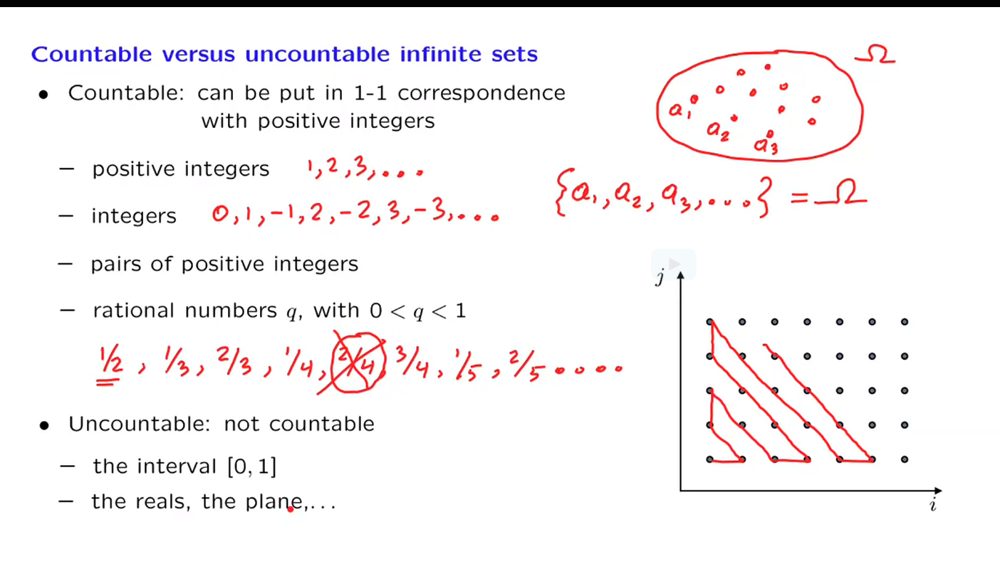
集合有可计算和不可计算两种类型（countable or uncountable）。离散的是可计算的，所有我们认为是连续集合是不可计算（这种说法感觉并不准确）。对与小数0< q <1,可以按照（1/2,1/3，2/3，1/4，2/4，3/4排列）。对于一个区间[0,1],没办法排列出元素。

#### Proof that the set of real numbers is uncountable

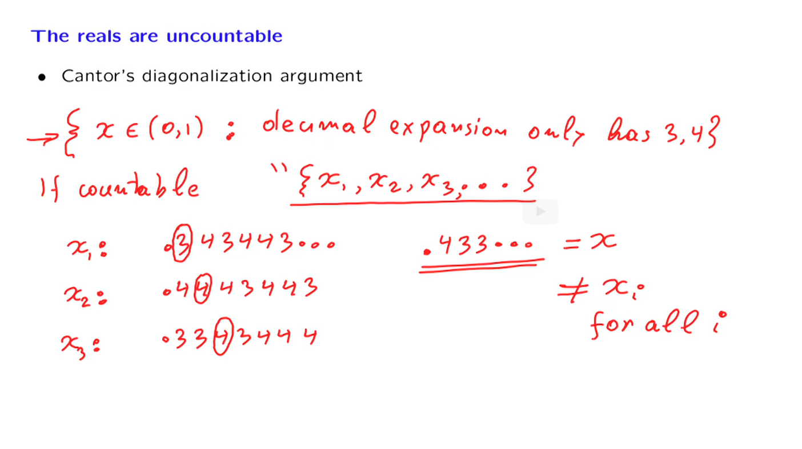
证明的过程如下：
假设实数是countable，那么就可以写成$\{x_1,x_2,x_3,\cdots \}$,为了简便我们只查看数字是3和4组成的在0与1之间的实数。随机写出$x_1,x_2,x_3, \cdots$。现在假设一个x，第一项与$x_1$的第一项不同，第二项与$x_2$的第二项不同，重复下去，那么这个x对于所有的$x_i$都是不相等的。因此x不属于这个集合。这违背了集合的定义，所以real 是

### Solved Problems

#### The probability of the symmetric difference of two events

What's symmetric difference of two events?
两个事件A，B，只发生一个事件。
problems:
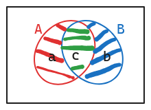

证明：
$P(a \cup b) = P(A) + P(B) - 2* P(c)$
已知：

* a = $A \cap B^c$
* b = $B \cap A^c$
* c = $A \cap B$

$$
\because a \cap b = \empty \\
P(a \cup b) = P(a) + P(b) \\
P(A) = P(a \cup c) \\
P(A) = P(a) + P(c) \\
P(a) = P(A) - P(c) \\
same: P(b) = P(B) - P(c) \\
P(a) + P(b) = P(A) - P(c) + P(B) - P(c) = P(A) + P(B) - 2* P(c) \\
P((A \cap B^c) \cup (B \cap A^c)) = P(A) + P(B) - 2* P(A \cap B)
$$

solution: 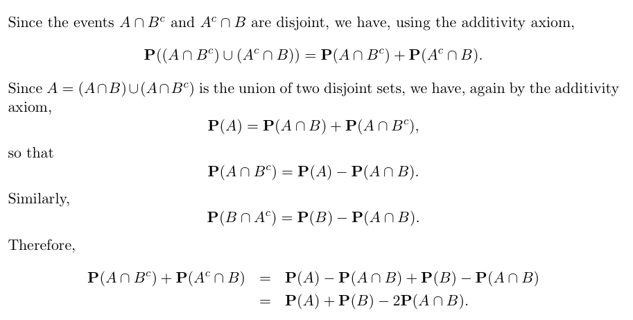

#### Geniuses and chocolates

problem:  Out of the students in a class, 60% are geniuses, 70% love chocolate, and 40% fall into both categories. Determine the probability that a randomly selected student is neither a genius nor a chocolate lover.

这个问题提供两种工具来解决概率相关的问题。

1. 使用Venn diagram
2. partion with label
使用venn来表示各个事件之间的关系。partion 用样本空间切割成pieces。pieces需要满足以下条件：

* 彼此是disjoint。
* 所有的piece组合在一起就是整个样本空间。

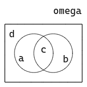
a: 学生only是geniuses
b: 学生only喜欢吃巧克力
c: both
d: neither

$$
P(a \cup c) = 0.6 \\
P(b \cup c) = 0.7 \\
P(a) + P(c) = 0.6 \\
P(b) + P(c) = 0.7 \\
P(b) + P(d) = 0.4 \\
P(a) + P(d) = 0.3 \\
P(c) = 0.4 \\
P(d) = 0.1
$$

#### Uniform probabilities on a square

problem: Romeo and Juliet have a date at a given time, and each will arrive at the meeting place with a delay between 0 and 1 hour, with all pairs of delays being “equally likely," that is, according to a uniform probability law on the unit square. The first to arrive will wait for 15 minutes and will leave if the other has not arrived. What is the probability that they will meet?

为了简化分析，假设罗密欧和朱丽叶只能以15min来增长等待时间。那么这个样本空间就是离散的。如图所示。
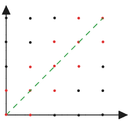
红色点即是他们能够约会的点，被绿色虚线索穿过的线即是他们都不需要等待的点。

实际上，当罗密欧准时到达时，朱丽叶可以在[0,15]内任意时间内抵达。所以实际上他是连续的。根据uniform probability，概率实际是面积，将矩形的面积 - 两个三角形的面积除以矩形的面积可以计算出他们能够约会的可能性。
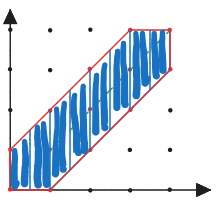

#### Bonferroni's inequality

如果我们说，一个班级中聪明的人很少。漂亮的人也很少。那么一个班级中聪明或者漂亮的人很少。用概率论的表述：
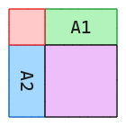
A1: 聪明人
A2：漂亮的人
紫色是既不聪明也不漂亮的人。
$P(A_1 \cup A_2) \leq P(A_1) + P(A_2)$

如果我们说，一个班级中聪明的人很多。漂亮的人也很多。那么一个班级中既聪明又漂亮的人很多。用概率论的表述：
$P(A_1 \cap A_2) \geq P(A_1) + P(A_2) - 1$
在图中表示的是，紫色区域的面积非常小，红色区域的面积非常大。

$$
(A_1 \cap A_2)^c = A_1^c \cup A_2^c \\
P((A_1 \cap A_2)^c) = P(A_1^c \cup A_2^c) \leq P(A_1^c) + P(A_2^c) \\
1 - P(A_1 \cap A_2) \leq (1 -P(A_1)) + (1 - P(A_2)) \\
P(A_1 \cap A_2) \geq P(A_1) + P(A_2) - 1
$$

Bonferroni's inequality 很好地展示了如何综合使用De Morgan's law,set theoretic operation and union bound 来阐述概率之间的关系。
