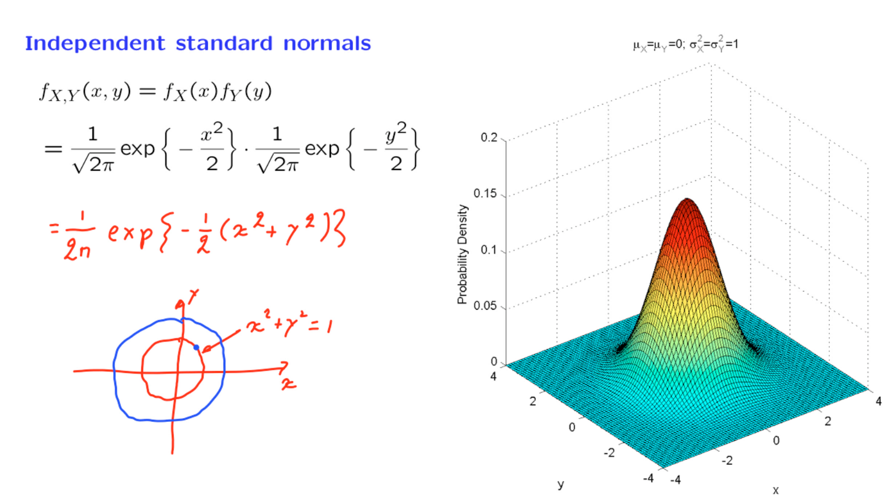

# Unit 5: Continuous random variables

## Lec. 10: Conditioning on a random variable; Independence; Bayes' rule

### index

Conditioning X on Y

* Total probability theorem
* Total expectation theorem

Independence

* independent normals

A comprehensive example
Four variants of the Bayes rule

### Conditional PDFs

在之前已经了解到了某一个确定事件$A$，计算在这个事件下，对应的PDF。本节研究的是在某一个随机变量下的PDF。

与之前相同，使用概率密度替换离散中的概率，得出随机变量下的条件PDF的定义式子。

对于连续的随机变量将将$\displaystyle P_{X,Y}(x,y)$转换成PDF：

$\displaystyle P_{X,Y}(x,y) = P(x \leq x + \delta, y \leq Y \leq \epsilon+y)=f_{X,Y}(x,y)\times s \quad s = \delta \epsilon$。
这里的s在连续随机变量中就是x和y组成的面积，对于联合密度来说面积就是X和Y围成的面积。

然后计算出Y的概率：$\displaystyle P_Y(y)=f_Y(y)\epsilon$

根据离散随机变量的公式，用相对应的连续随机变量代替，这样就可以推导出连续随机变量的条件概率是多少：

$\displaystyle P_{X \mid Y}(x\mid y)= \frac{f_{X,Y}(x,y)\times  \delta \epsilon}{f_Y(y)\epsilon}=f_{X \mid Y}(x \mid y)\delta$

$\displaystyle f_{X \mid Y}(x \mid y) = \frac{f_{X,Y}(x,y)}{f_Y(y)}$

--- 

用它来计算更一般的事件的条件概率： $\displaystyle P(X \in A \mid Y=y)$，而不仅仅是区间。

我们这样做：一般情况下，对于连续随机变量，我们可以通过在该集合上积分一个概率密度函数来找到 X 属于某个集合的概率。因为这里我们正在处理一个给定 Y 值的条件情况，我们使用条件概率密度函数而不是真正的概率密度函数。通过这种方式，我们计算条件概率。

在给定随机变量 Y 的值的条件下处理条件概率密度函数，就像处理普通的概率密度函数一样，只是给定了这个随机变量取特定值的信息。在这个条件下，我们将按照通常的方式计算概率，使用条件概率密度函数而不是普通的概率密度函数。

**计算是要注意定义是否成立，即上面$Y\approx y$概率是否为0**

### Comments on conditional PDFs

进一步理解条件概率密度函数的定义：$\displaystyle f_{X \mid Y}(x \mid y)= \frac{f_{X,Y}(x,y)}{f_Y(y)}$

* $\displaystyle f_{X \mid Y}(x \mid y)$非负

* 固定某一个y值，从图像上看，联合PDF的变化好像只于x相关，类似切片，但是分母的存在，多出了缩放因子。固定了小 y 并对所有 x 进行积分，使用这个定义，由于分母是一个常数，不涉及 x，我们只需要对分子进行积分。我们会认出分子对应于我们之前的边际分布的公式——Y 的边际概率密度函数。从联合中，这就是我们如何恢复 Y 的边际概率密度函数。

* 固定了小 y 并对所有 x 进行积分，分子是常数，只有分母积分，可以看到分子与分母大小相同。

* 推导出乘法规则(将$f_Y(y)$移动到右边)，与离散中的定义相似。

### Total probability and total expectation theorems

1. 全概率(total probability theorems)
2. 条件期望
3. 全期望 （建议从E[x]的定义开始推导，图中从下向上）

#### problem

### Independence

独立性是概率论的核心概念之一，因为它使我们能够从更简单的模型构建更大的模型。在连续情况下，我们应该如何定义独立性呢？我们的指导来自于离散定义。

类比于离散情况，我们将会说，如果联合连续随机变量的联合概率密度函数等于边际概率密度函数的乘积，那么它们是独立的。现在我们可以与乘法法则进行比较，只要 Y 的密度是正的，这个法则总是成立的。

独立性的直观解释：

$\displaystyle f_X(x)=f_{X\mid y}(x\mid y)$

**独立性就等同于要求联合的所有切片具有相同的形状，而这个形状是边际概率密度函数的形状**。更具直观解释，无论观察 Y 的哪个值，X 的分布都不会改变。在这种意义上，Y 不会传达关于 X 的任何信息。请注意，这个定义在 X 和 Y 方面是对称的。所以从对称性来看，当我们有独立性时，也意味着 X 不会传达关于 Y 的任何信息，且在给定 X 的情况下，Y 的条件密度必须与 Y 的无条件密度相同。

### Stick-breaking example

现在我们将通过一个例子来综合介绍我们所引入的所有概念。

我们有一根长度为 l 的棍子。我们在某个随机位置断开这根棍子，这对应于一个随机变量 X。我们假设这个随机变量在整个棍子长度上是均匀分布的。因此，它的概率密度函数具有这个特定的形状。为了使概率密度函数的积分为1，这个概率密度函数的高度必须等于 1/$l$。

然后我们拿着我们剩下的那段棍子，它的长度是 X，然后我们在一个随机位置 Y 处再次把它断开。我们假设这个位置 Y 在剩下的那段棍子的长度上是均匀分布的。这个假设意味着什么呢？它意味着如果第一次断开是在某个特定值 x 处，那么随机变量 Y 具有条件分布，在区间从 0 到 x 上是均匀分布的。因此，条件概率密度函数是均匀的。就像任何其他概率密度函数一样，条件概率密度函数必须积分为1。因此，这个条件概率密度函数的高度等于 1/x。

那么$X, \quad Y$两者是否是独立的？并不是！

1. 一个看法是，如果你改变 $x$，$Y$的条件概率密度函数将会变成不同的形状。而在独立性的情况下，当你改变小  $x$的值时，所有的条件概率密度函数必须都相同。
2. 另一种看法是，如果我告诉你 $x$ 是 0.5，这会给你关于 $Y$ 的很多信息。它告诉你 $Y$ 必须小于等于 0.5。因此，随机变量 $x$ 的值为你提供了关于另一个随机变量的大量信息。

根据全概率公式可得到$\displaystyle f_{x,y}= \frac{1}{xl}$

#### 找到随机变量 Y 的边际概率密度函数

$\displaystyle f_Y(y)= \frac{1}{l} \log(\frac{l}{y})$

我们处理的函数随着我们趋近于 0 时趋近于无穷大。拥有一个概率密度函数趋近于无穷大的问题吗？实际上并不是。只要这个概率密度函数下的面积等于1，它仍然是一个合法的概率密度函数。趋近于无穷大并不是一个问题。

#### 计算随机变量 Y 的期望值

1. 一种方法是使用期望值的定义。
2. 第二种方法是分而治之,使用总体期望值定理

为什么这更简单？当我们以一个特定的值来条件于 X 时，Y 在 0 到 x 之间具有均匀分布。因此，这个条件期望值是均匀分布的期望值，即那个均匀分布的范围的一半。因此，我们得到从 0 到 l 的积分。1/l 乘以 x/2，dx。最后，这是一个我们可以轻松求解的积分

或者我们甚至可以以更简单的方式思考。这里的表达式是 x 的密度。这是 x 本身。因此，这个积分乘以 x 给我们 X 的期望值。在那里只有一个因子 1/2。因此，我们得到 l/2 乘以 1/2，即 l/4。这个答案是有直观意义的。如果我们折断一根棍子一次，我们留下的期望值是我们开始的一半。但如果我们再折断一次，那么我们预计平均来说，长度会再次减小一半。因此，我们预计剩下的棍子的长度将是我们开始的长度的 1/4。

### Independent normals

为了更加熟悉联合概率密度函数，让我们来看一下独立的正态分布。实际上，这是一个重要的例子，因为噪声通常由正态分布的随机变量建模，而出现在系统的不同部分或不同时间的噪声项通常被假定为相互独立的。

#### 标准正太的联合密度

两个标准正态随机变量 X 和 Y，均值为零，方差为1。如果它们是独立的，它们的联合概率密度函数就是边际概率密度函数的乘积。

如果我们绘制这个联合概率密度函数，我们会得到这个图形。它看起来像一个钟，位于原点的中心——在坐标为零的点。

可以从另一个角度来考虑这里正在发生的事情，将两者乘积表达式重写为1/(2π)，然后是指数函数的负 1/2 x 平方加 y 平方，由此以来得到一个以$e$为底的指数函数。
这个函数的值只与$x, \quad y$有关，但是$x^2 + y^2$当区特定值时，结果都是相同的（圆的表达式），即只要在同一个圆的边上，就会相同，那么相应的联合密度函数也相同。

**所以，以原点为中心的圆圈就是所谓的联合概率密度函数的等高线。在每个等高线上，联合概率密度函数都是一个常数**

现在将其推广到更加一般的情况。

#### 一般正太分布的联合密度

同上面一样，作独立的两个正太随机变量的乘积为联合密度概率函数。一切都与之提到的一样。
只不过此时$x, \quad y$构建的不再是圆而是一个椭圆。在同一个椭圆上，$x，y$的构造的是相同的值，也就是相同的联合密度概率值。

联合概率密度函数在指数等于零时最大。这发生在 x 等于 $mu _x$，y 等于 $mu _y$ 时,恰好在椭圆中心。

### Bayes rule variations

这门课的很大一部分内容都是基于一些基本技能和思想的变化，其中之一就是贝叶斯法则，这是推断的基础。

在离散设置中，我们有一个随机变量，其具有已知的概率质量函数（PMF），但其值没有被观察到。取而代之的是，我们观察到了另一个随机变量的值，称为 Y，它与 X 有一定的关系。

我们将使用 Y 的值来对 X 进行一些推断。两个随机变量之间的关系是通过指定在任何 X 值下的 Y 的条件 PMF 来捕捉的。将 X 视为未知的世界状态，将 Y 视为 X 的噪声观察。条件 PMF 告诉我们在每种可能的世界状态下 Y 的分布。

一旦我们观察到 Y 的值，我们就获得了关于 X 的一些信息。我们使用这些信息来推断 X 的可能值。在数学上，我们不再依赖于 X 的先验，而是形成了一些修订后的信念。也就是说，我们形成了基于我们已经观察到的特定观察结果的 X 的条件 [PMF]。

所有这一切都是因为贝叶斯法则。

在离散和连续的情况下完全相同。

### Mixed Bayes rule

我们已经看到了贝叶斯法则的两个版本——一个涉及两个离散随机变量，另一个涉及两个连续随机变量。但在现实生活中，有许多情况下需要同时处理离散和连续随机变量。例如，您可能希望恢复被发送给您的离散数字信号，但是信号已经被连续的噪声损坏，因此您的观测是一个连续随机变量。

因此，假设我们有一个离散随机变量 K，以及另一个连续随机变量 Y。为了获得适用于这种情况的贝叶斯法则的变体，我们将按照更标准的情况进行。我们将使用两次乘法规则来得到两个事件发生的概率的两个替代表达式。我们将使这些表达式相等，并从中得出一个贝叶斯法则的版本。

> The $y'$ is a dummy variable for integration. When you compute the integration, $y'$ will take all possible values that variable  $y$can take (which is the range of $y$).
When you refer to $y$, it is one specific value in its range.

### Detection of a binary signal

我们将在一个涉及离散未知随机变量和连续测量的重要应用中使用贝叶斯法则。我们的离散未知随机变量将是一个随机变量，它以等概率取值加1或减1。而测量将是另一个随机变量 Y，它等于离散随机变量，但受到我们用 W 表示的加性噪声的影响。因此，我们得到的观测值是 K 和 W 的和。

这是数字通信中常见的情况。我们试图发送一位信息，即 K 是否为加1或减1，但是我们所做的观测受到通信信道的干扰，即通道中存在的一些噪声，并且根据我们所观察到的 Y 的值，我们将尝试猜测发送了什么。我们对噪声的假设是它是一个标准正态随机变量。

假设我们观察到随机变量 Y 的特定值。我们想对随机变量 K 进行猜测。当然，没有办法完全确定地猜测。唯一可以说的就是确定 1 被发送的可能性相对于 -1 被发送的可能性。我们如何解决这样的问题？我们使用我们已经开发的贝叶斯法则的版本，这个公式给出了我们想要的条件概率。

特别地，在这里，我们正在询问 K 取值为 1 的条件下，在观察到 y 的值的情况下 K 的条件概率。这就是我们要计算的内容。

#### $P_{K \mid Y} (1 \mid y)$的解释

当 y 非常大时，y 趋近于正无穷大，这个项消失了，我们得到了1。另一方面，如果 y 非常非常小，因此 y 趋近于负无穷大，我们得到 e 的无穷大，这是一个非常大的数。因此，这个比率将趋近于0。

让我们解释一下这个图。如果 y 非常大，更可能 y 是从这个分布中出来，以至于 K 等于1。因此，如果我们得到这个观察结果，K 等于1 的概率几乎为1。我们几乎可以确定。

另一方面，如果 y 非常非常小，那么更可能的是我们所看到的是从这个分布中出来，以至于 K 等于 -1。在这种情况下，K 为1 的概率将近似于0。最后，如果 y 等于0，我们正好处于这两种可能性的中间，通过对称，K 的任何选择都是等可能的。因此，给定 Y 等于0，K 等于1 的后验概率为1/2。当 Y 等于0时，发送任何一个信号都是等可能的。

###  Inference of the bias of a coin

