# Unit 6: Further topics on random variables

## Lec. 11: Derived distributions

### The PMF of a function of a discrete r.v.

作为对寻找随机变量函数分布的预热，我们先从离散情况开始考虑。

两种写法形式：
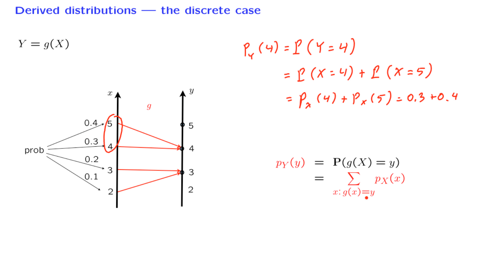

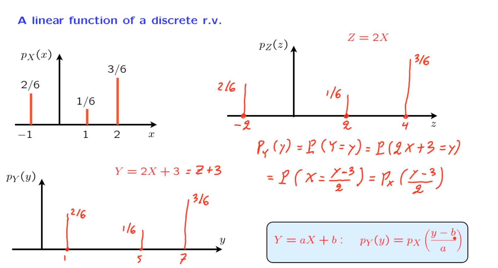

### A linear function of a continuous r.v.

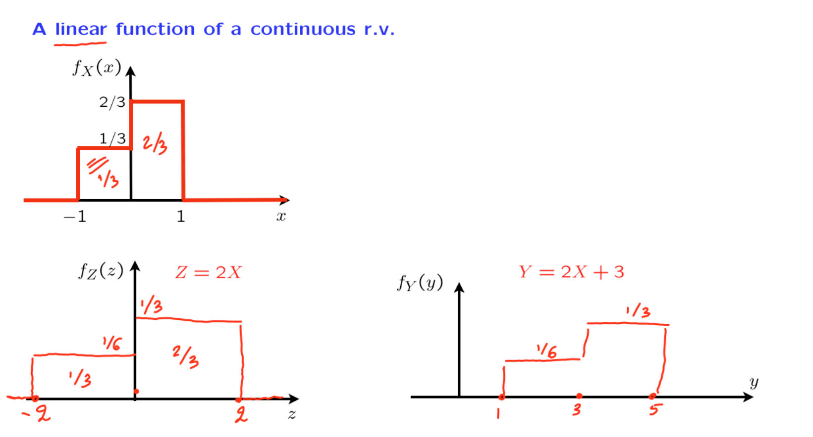

上述是一个均匀随机变量经过线性变换之后的图像。

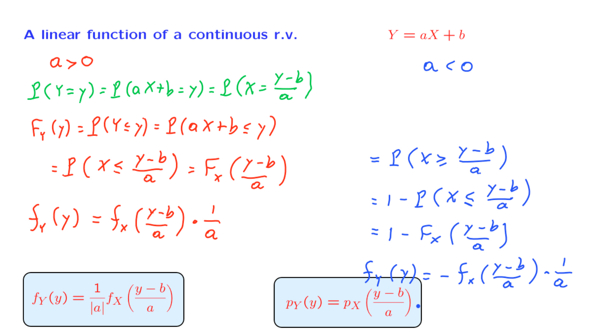

此处分情况讨论$a$，使用CDF表示，之后使用微分计算出相应的PDF。

这个公式表示的是以下情况。因为我们在这里有一个a因子，我们将X的PDF在水平方向上按照a进行了缩放。由于这里有b项，所以PDF在水平方向上也发生了水平移动。最后，这个项对应于我们绘图的垂直缩放。而$\displaystyle \frac{1}{a}$存在的原因是为了使Y的PDF的积分等于1。

有趣的是，我们还可以将其与我们之前推导出来的相应离散公式进行比较。这个离散公式的外观完全相同，只是缩放因子不会出现。因此，在连续随机变量的情况下，我们需要在垂直方向上进行缩放PDF。但在离散情况下，这种缩放不存在。

### A linear function of a normal r.v.

一个正态分布的随机变量，经过线性的变换之后，依然是正太分布。
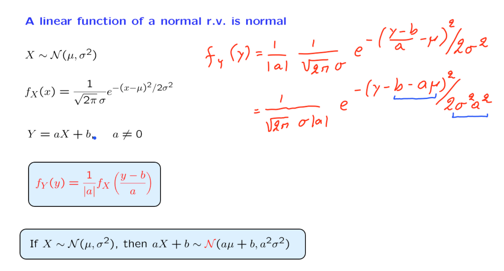

随机变量Y是正态分布的。直观地说，在这里发生的是，我们从一个正态的钟形曲线开始。一个关于X的钟形PDF。我们在垂直和水平方向上对其进行缩放，然后通过b进行水平平移。当我们进行这些操作时，PDF仍然保持钟形。因此，最终的PDF再次是一个钟形的正态分布

### The PDF of a general function

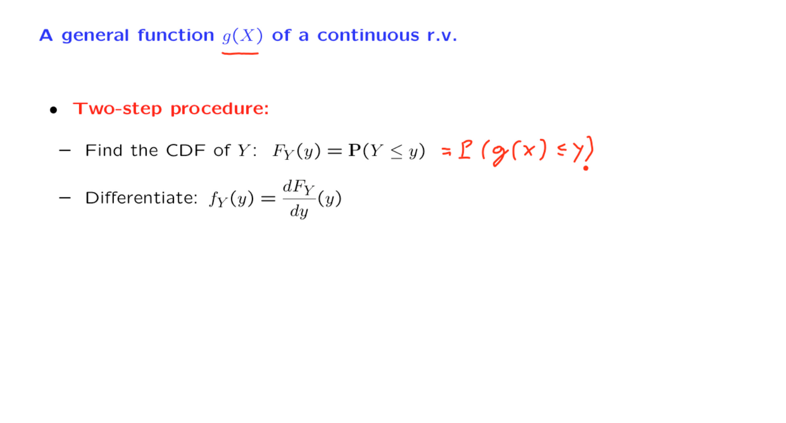

在这个重要的部分，我们将开发一种方法来找到连续随机变量的一般函数（即g(X)）的概率密度函数（PDF），其中g(X)在一般情况下可以是非线性的。这个方法非常通用，包括两个步骤。

第一步是找到Y的累积分布函数（CDF）。
然后第二步是对CDF进行求导，然后找到PDF。大部分的工作在于找到Y的CDF。

#### Y=$X^3$

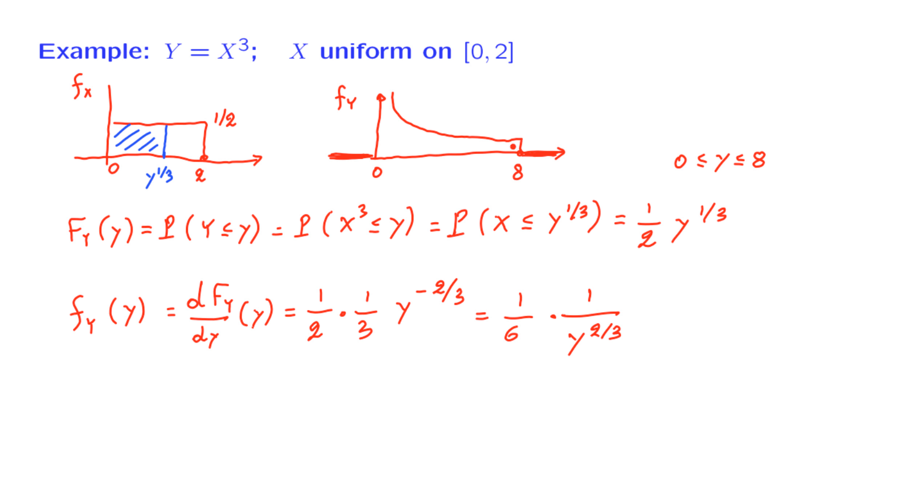

在这个例子中，首先使用已知的X的$F_X$来表示出Y的CDF，之后使用求导计算出Y的PDF。

#### Y=$\displaystyle \frac{a}{X}$

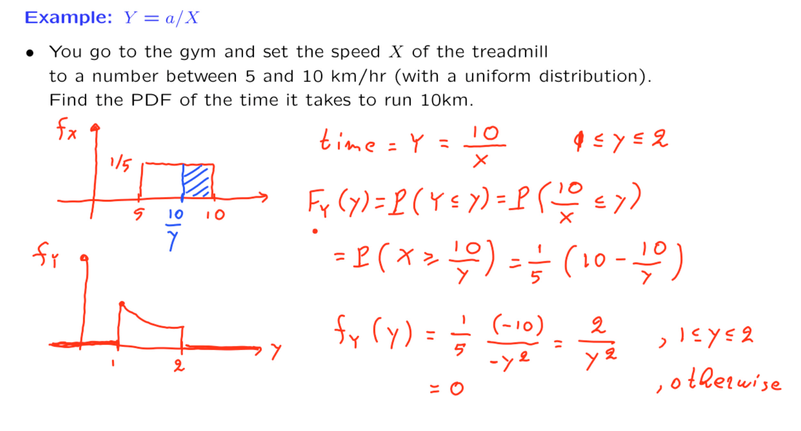

### The monotonic case

上一节根据X的CDF，找出Y的CDF，从而求导得出Y的PDF。
但事实证明，在我们处理单调函数的特殊情况下，有一个通用的公式可以将Y的PDF表示为X的PDF。

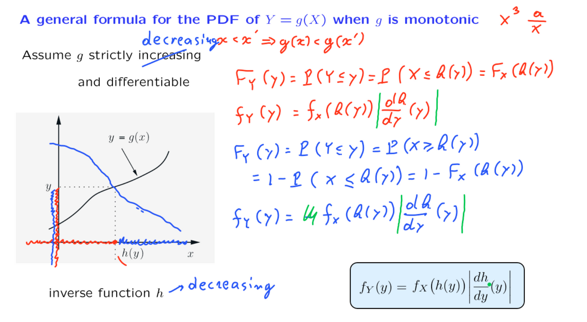

有了$Y=g(X)$，且其在所需要的定义域是单调的，那么就可以找的相应的反函数$X=h(Y)$，将所关注的事件用随机变量X的术语重新写成以下形式。如此一来使用X的CDF就可以表示出Y的CDF，然后使用链式法则求导出Y的PDF。

最后写成绝对值构建同一形式，单调递增和递减都有效。

#### example

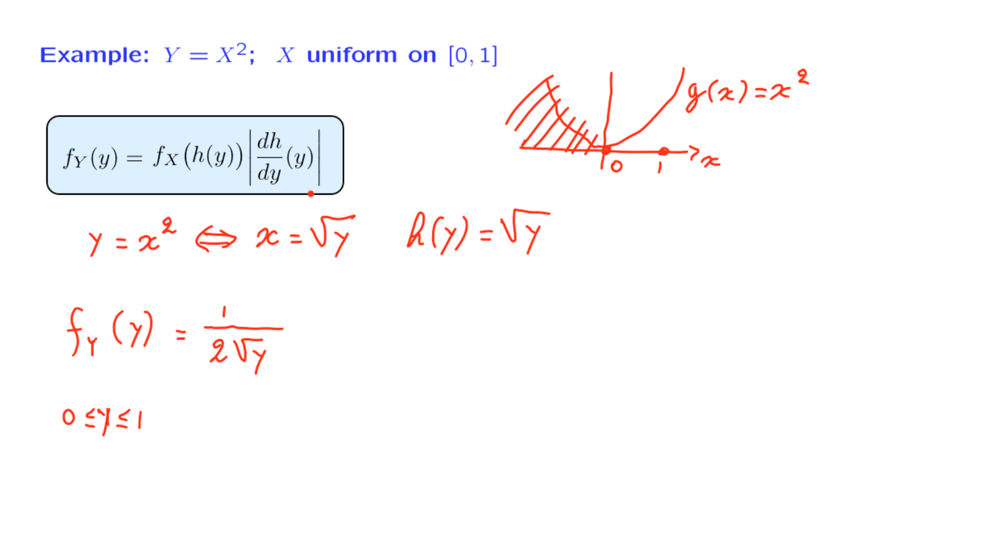

### The intuition for the monotonic case

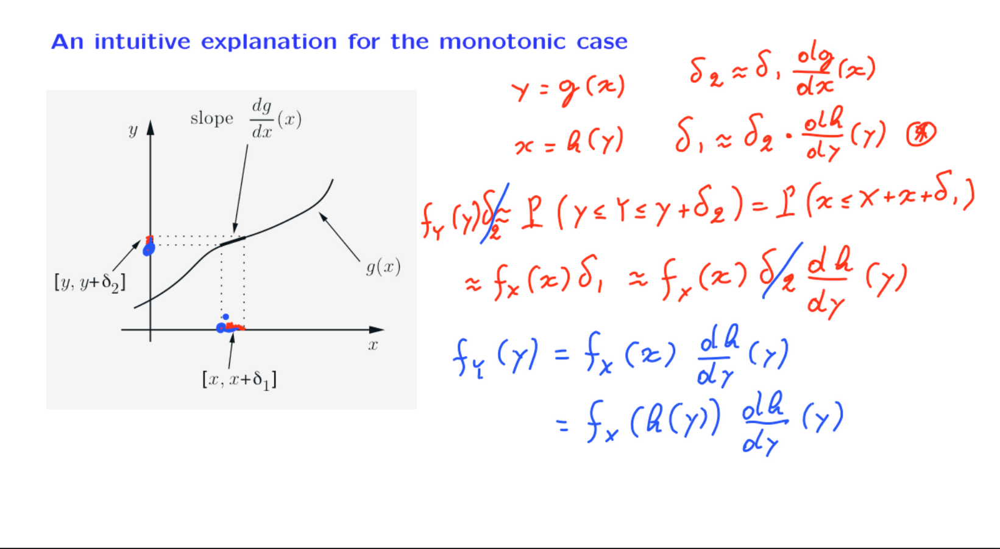

刚刚推导出的单调情况下的公式有一个很好的直观解释。

假设g是x的单调函数，并且是单调递增的。让我们固定一个特定的x和一个相应的y，使得它们之间的关系如下 - y等于g(x)，或者我们可以通过反函数来讨论，使得x等于h(y)。回想一下，h是反函数，它在给定y的值时告诉我们相应的x值是哪个。

Y的概率在这里近似等于Y在点y处的PDF乘以相应区间的长度。

### A nonmonotonic example

到目前为止，我们的所有示例都涉及到在X上单调的函数g(x)，至少在我们感兴趣的x范围内是如此。现在让我们看一个涉及非单调函数的示例。

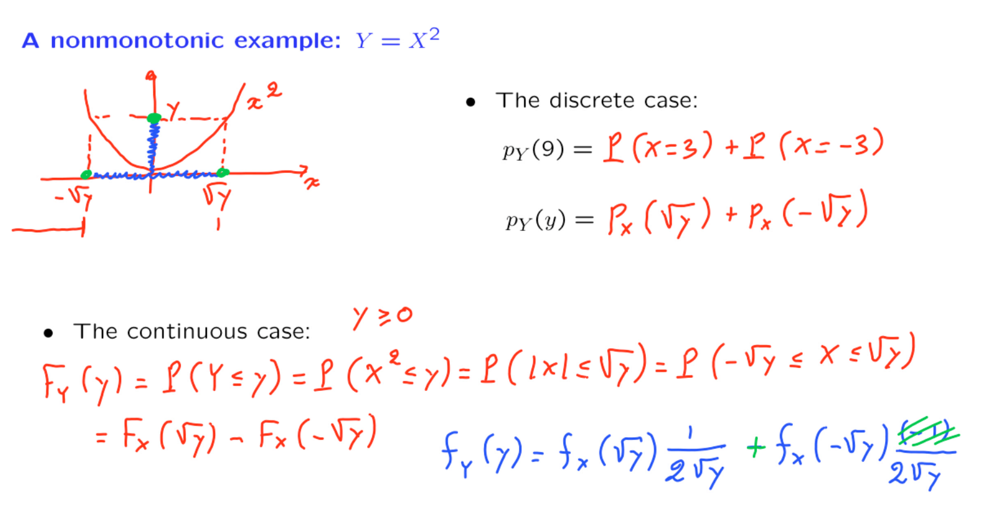

### A function of multiple r.v.'s

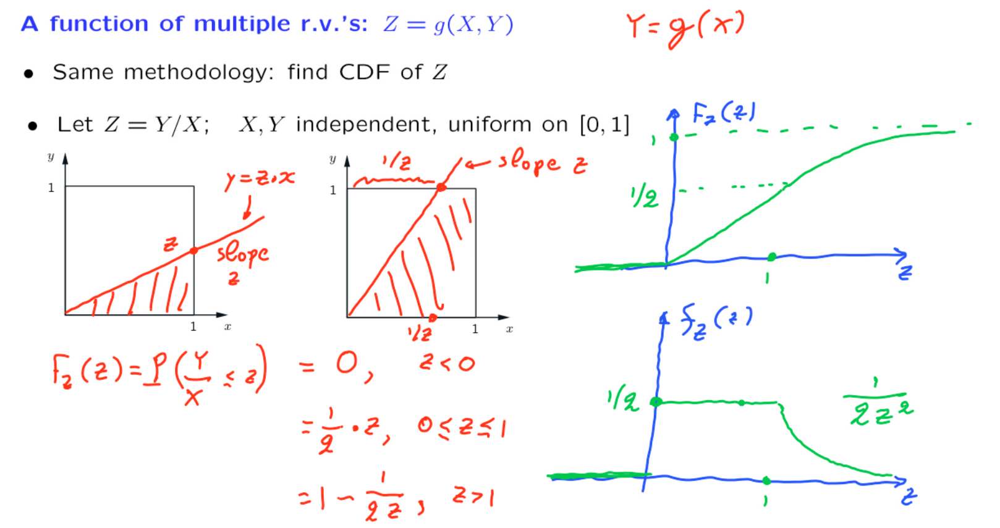