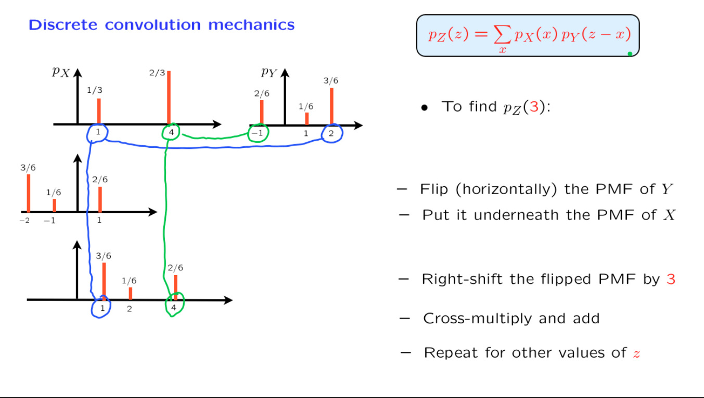
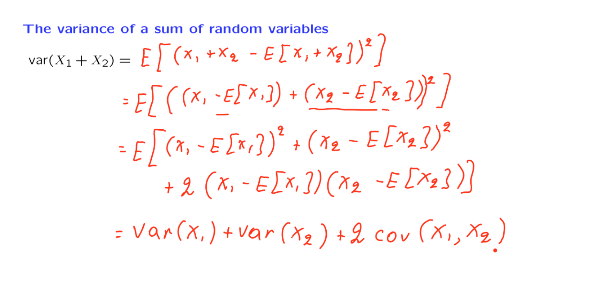

# Unit 6: Further topics on random variables

## Lec. 12: Sums of independent r.v.'s; Covariance and correlation

### The sum of independent discrete random variables

本节内容是计算两个独立离散随机变量之和的概率质量函数（PMF）。

假设 X 和 Y 是独立的，这两个事件发生的概率是它们各自概率的乘积。因此，它是 X 等于 0 的概率（这里我使用了 PMF 表示法）乘以 Y 等于 3 的概率。类似地，下一个项是 X 等于 1 的概率乘以 Y 等于 2 的概率，$(2,1),(3,0),(4,-1)\cdots$

由于两者独立，概率等于两者PMF的乘积。这些PMF之和就是Z的取特定值的概率。这个公式被称为卷积公式($\displaystyle P_Z(z)=\sum_x P_X(x)P_Y(z-x)$)。它是两个 PMF 的卷积。卷积的含义是，某人给了我们一个随机变量的 PMF，也给了我们另一个随机变量的 PMF。

当我们说我们给定了 PMF，意思是我们给定了所有可能的 little X 和 little y 的 PMF 值。然后卷积（convolution formula）公式进行一定的计算，现在得到了一个新的 PMF，即随机变量 Z 的 PMF。

上图是一个新的例子，图中展示了$X,Y$可能的值，现在想要计算$Z=3$。
一种方法是将公式展开，计算所有的可能值的概率之积的和。$\rightarrow$
另一种方法是将Y的图像沿竖直方向翻转,再向右边移动3个单位长度(实际上就是构造-y+3,X+y=3)，再在X圖像上查找有沒有相應的對應項。

这个例子更加贴近生活。如果现在想要结算学生在小学的成绩的加权之和。我们是认为越贴近现在权重越高，时间越长则越低。如果用F表示成绩，G表示某一个年级的权重，可以表示为：$\displaystyle F(n)G(6-n)$

### The sum of independent continuous r.v.'s

推导的几个关键点：

1. $\displaystyle f_{Z \mid X}(z \mid x) = f_Y(z - x) $ 
2. $\displaystyle f_{Z,X}(z,x) = f_X(x)f_{Z \mid X}(x) $
3. $\displaystyle f_{Z}(z) = \int _{- \infin} ^{ \infin}f_{X,Z}(x,z)dx $

#### Problem

### The sum of independent normal r.v.'s

以上是独立的随机变量的卷积的推导，对与三个或者以上的，使用归纳法，将两者卷积之后，再与另一个求和。

### Covariance

在这个部分，我们开始一个新的主题。我们将讨论两个随机变量的协方差，这提供了关于这两个随机变量之间依赖关系的有用信息。

假设 X 和 Y 的均值为零，并且它们是离散随机变量。如果 X 和 Y 是独立的，那么它们的乘积的期望是期望的乘积。由于我们假设均值为零，所以这将等于零。

但是如果X,Y的联合PMF的分布是图中左侧的两个象限，每个点的概率都是相同。根据在图中的观察，图一中，平均而言，所有的点的x 乘以 y 的值的和将是正值。

另一方面，如果图表采用这种形式，那么大多数情况下，x、y 对位于2象限或3象限，其中 x 乘以 y 的乘积是负值。因此，随机变量 X 和 Y 通常具有相反的符号，平均而言，X 乘以 Y 的期望值将是负值。

现在，让我们进行泛化。随机变量不必是离散的。这个量对于任何类型的随机变量都是有定义的。如果我们有非零均值，那么协方差可以通过这个表达式来定义 $\displaystyle E[(X - E[X])\times (Y - E[Y])] \qquad E[X] \neq0,E[Y] \neq 0$。在这里，我们看一下 X 偏离其均值的值，以及 Y 偏离其均值的值，我们要问的是这两个偏差是否倾向于具有相同的符号，是否以相同的方向移动。

如果协方差是正的，它告诉我们，每当这个量是正的，使得 X 在其均值之上，那么通常情况下，Y 从其均值偏差的偏差也倾向于是正的。总结一下，协方差在一般情况下告诉我们，两个随机变量是否倾向于在某种平均或典型的意义下一起移动，都是高或都是低。

### covariance explain

以男女身高作为两个随机变量。在图中可以看出，当男方身高高于其平均值时，其妻子的身高也高于身高。将所有的情况相加取平均值，若结果为正，则是正相关，为负数则是负相关。值越大说明，相关的程度越大。

关于$\displaystyle E[XY]=0$的解释：

因此，在独立的情况下，我们有零协方差。另一方面，反之不成立。有些例子中我们具有依赖性，但协方差为零。

图右侧的例子，在这个例子中，有四种可能的结果。在任何特定的结果中，要么 X 要么 Y 将是 0。所以在这个例子中，随机变量 X 乘以 Y 在恒等于 0。X 的均值也是 0，Y 的均值也是 0，通过对称性，所以协方差是这个数量的期望值。因此，在这个例子中，协方差等于 0。

另一方面，两个随机变量 X 和 Y 是相关的。如果我告诉你 X 等于 1，那么你知道已经发生了这个结果。在这种情况下，你可以确定 Y 等于 0。因此，知道 X 的值告诉你很多关于 Y 的值，因此，在这两个随机变量之间存在依赖关系。

### Covariance properties

在这个部分，我们讨论协方差的一些代数性质。这里没有什么深奥的，只是一些观察，如果我们想进行协方差计算，这些观察可能会很有用。

1. 假设$X=Y$，最后表达式就是$X$的方差的表达式
2. 将一般的协方差表达式展开，利用期望的线性性质，化简可得$\displaystyle E[XY]-E[X]E[Y]$
3. X 线性表达式 与$Y$的协方差，最后的结果只是$X \quad Y$的协方差与系数$a$，因为常数项在期望中依然是作为一个常数项，所以会相抵消。$\displaystyle E[(X - E[X])(Y - E[Y])] = E[XY]$，此处设定：$\displaystyle E[X],E[Y] = 0$
4.

#### Problem

solution:

### The variance of the sum of r.v.'s

一般情况，随机变量$X_1,X_2$是独立的，那么$\displaystyle var(X_1 + X_2)= var(X_1) + var(X_1)$。现在我们想要探究可能存在的依赖关系。

上述式子simple之后，得到的两个随机变量和的方差的一般形式。在独立的情况下，协方差为0，我们只有两个方差的和。但是当随机变量之间有依赖关系时，协方差可能是非零的，我们会有额外的一个项。现在让我们推广这个计算。

此处推导多个随机变量的和的方差，为了保持计算简单，我们将假设均值为零。但最终的结论也对非零均值的情况成立。

因此，我们得到了计算随机变量和的方差的一般公式。如果随机变量具有0的协方差，那么它们的和的方差是各自方差的和。这在随机变量相互独立时特别发生。对于一般情况，可能存在依赖关系和非零方差，那么和的方差还涉及所有不同随机变量之间的可能协方差。

### The correlation coefficient

两个随机变量之间的协方差告诉我们关于它们之间依赖关系的强度。但从定性上来说，这并不容易解释。例如，如果我告诉你 X 和 Y 的协方差等于 5，这并不能告诉你 X 和 Y 是否密切相关。
另一个困难在于，如果 X 和 Y 的单位是例如米，那么协方差的单位将是平方米。这很难解释。

所以一个更加具有信息的量是相关系数(The Correlation coefficient)，它是协方差的无量纲版本，图中给出了他的定义式。

现在，如果 X 的单位是米，那么标准差也是米。因此，这个比率将是无量纲的。它不受我们使用的单位影响。对于这个比率，同样的道理也适用，这就是为什么相关系数没有任何自己的单位。

如果标准差为0，那么方差也为0，那么我们就有一个恒等于常数的随机变量。对于这种退化的随机变量情况，相关系数是没有定义的，因为它将涉及到除以0。

相关系数有一个很重要的性质：始终在-1和1之间。
这使我们能够判断某个相关系数是否很大，因为现在我们有了绝对尺度。因此，它确实提供了度量两个随机变量关联程度的方法。

相关系数的极端情况：

1. 如果两个随机变量是独立的，那么两者就是完全不相关的，因为此时协方差为0，相关系数是0。
2. $Y=X$，如图再所示，此时相关系数为1（分子使用了协方差的线性性质）。
3. 如果我们有两个具有线性关系的随机变量——也就是说，如果我知道 Y，我可以确定 X 的值，并且可以使用线性公式来确定它。在这种情况下，相关系数要么是1，要么是-1。反之亦然。如果相关系数的绝对值为1，那么两个随机变量之间遵循一个确定性的线性关系。相关系数的极端值为正负1，等效于两个随机变量之间存在确定性关系。
4. 随机变量的线性函数与另一个随机变量的相关系数，此处使用绝对值整理出一般形式，最后的结果是a的符号乘相关系数。因此，相关系数的大小在用 aX + b 替代 X 时不会改变。这基本上意味着如果我们更改随机变量 X 的单位，例如，假设 X 是摄氏度，而 aX + b 是华氏度，从一个单位集合，摄氏度，到另一个单位集合，华氏度，不会改变温度与其他随机变量的相关系数。

4是相关系数的一个好的性质，再次反映了它是无量纲的，没有任何自己的单位，而且它不取决于我们为每个随机变量使用的单位类型。

### Derivation of key properties of the correlation coefficient

这一节主要是为了论证 $\displaystyle 1 \leq \rho \leq 1$

对图中 $\displaystyle E[(X - \rho Y)^2] $的解释：

>In my opinion, in the zero-mean and unit variances case, I would like to think of $\hat{X} = \rho Y$ , which means that  is a prediction of $X$. The expression $\displaystyle E[(X - \hat{X})^2]$ is one way to measure how good this prediction is. If you have $|\rho|=1$ , the prediction error  $\displaystyle E[(X-\hat{X})^2]=0$ and it means that you $\displaystyle \hat{X} = \rho Y$ is a very good prediction of $X$.

### Interpreting the correlation coefficient

相关系数的数学性质很重要，但更重要的是能够正确解释它。比如，假设相关系数是0.5，那么这意味着X和Y之间存在一些有趣的关联。但是具体是什么呢？

这告诉我们这两个随机变量在某种程度上是有关联的。然而，人们经常错误地将其解释为这两个随机变量之间存在因果关系，但这是错误的。

在一般情况下，较大的相关系数并不意味着随机变量之间存在因果关系。举个例子，假设X表示一个人的数学能力，Y表示一个人的音乐能力。

通常情况下，人们发现数学能力和音乐能力是相关的。在数学能力高的人中，音乐能力也往往较高。是否存在因果关系呢？

如果你学习数学很多并且变得非常擅长，是否意味着你会成为一位更好的音乐家？未必。或者如果你不断地练习小提琴，是否意味着你在数学考试中会取得更好的成绩？同样未必。

也许实际情况是，人类大脑具有某种特定特性，当这种特性得到很好的发展时，它既有助于数学能力，又有助于音乐能力。这是相关系数可能出现的典型情况，也就是相关系数显著，反映了影响随机变量X和Y的共同但可能隐藏的因素。

--- 

对于第二个例子，首先我们看一下X的方差。由于X是两个独立随机变量的和，它的方差将是这些方差之和。我们假设这些方差都等于1。因此，X的方差等于2。这意味着X的标准差等于2的平方根。类似地，Y的标准差也等于2的平方根。

现在，我们看一下X和Y之间的协方差。由于X和Y的均值为0，协方差就是这两个随机变量的乘积的期望值。根据这两个随机变量的定义，它就是下面的乘积。

我们将这个乘积展开成四个项的和，并计算每个项的期望值。这让我们得到了这个特定的表达式。现在，Z的均值为0，方差为1。因此，Z的平方的期望值等于1。

对于下一个项呢？V和Z是独立的。因此，乘积的期望值等于期望值的乘积。但期望值都为零，所以这个项为零。用类似的论证，其他项也是零。

所以协方差等于1。从这里，我们可以得出计算的结论，即X和Y之间的相关系数等于1除以2的平方根乘以2的平方根，即1/2。

#### Covariance meaning

这个例子也为你提供了相关系数为1/2时可能意味着什么的大致概念。

这意味着这两个随机变量具有一些共同的特征。它们还有一些特殊的特征。这两个特征在权重上大致相等。

如果V和W完全不存在，相关系数将为1。另一方面，如果V和W的方差很大，以至于完全掩盖了Z的影响，那么相关系数的值将会小得多，可能更接近于0。当然，在极端情况下，如果Z完全不存在，X和Y是独立的，相关系数将为0。

>In the video "no direct influence of X on Y" means that $X= \text{some function} \ f$, and the function  $\ f$ does not explictly involved in variable $Y$ . In the problem in the video, $X$ and  $Y$ are dependent.

Let X and Y be two independent random variables. Their probability densities functions are
shown below. 

$f_X(x) = \frac{3}{4}(1 - x^2) \quad -1 \leq x \leq 1$

$f_Y(y)= \frac{1}{3} \quad 0 \leq y \leq 1$
$f_Y(y)= \frac{2}{3} \quad 2 \leq y \leq 3$

Let Z = X + Y . Determine fZ(z). 

