# Unit 6: Further topics on random variables

## Lec. 13:Conditional expectation and variance revisited;Application: Sum of a random number of independent r.v.’s

A more abstract version of the conditional expectation

* view it as a random variable
* the law of iterated expectations
A more abstract version of the conditional variance
* view it as a random variable
* the law of total variance
 Sum of a random number of independent r.v.’s
* mean
* variance

### Conditional expectation as a r.v.

在这个部分，我们重新审视条件期望的概念，并将其视为一种特殊类型的抽象对象。

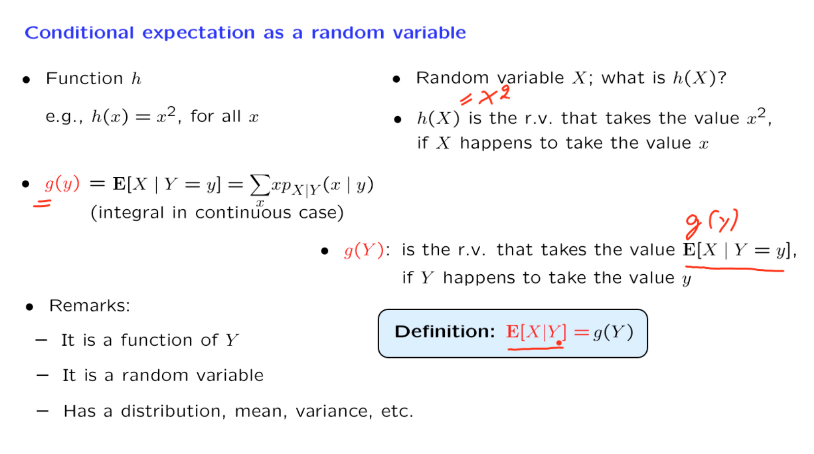

#### 函数

首先左侧的$h$表示的是函数，将一个数字$x$映射到他的平方。

$X$是一个随机变量，当我们写下h(X)时，对于定义为一个二次函数的h（例如在这种特定方式下），$h(X)$被定义为一个随机变量。它是随机变量，在随机变量大写的X恰好取值为小x时，取值为小x的平方。这个随机变量通常被表示为随机变量X的平方。

#### 条件期望

$g$是函数，$y$是特定的一些值，$g(Y)$是随机变量，如图所解释，当$Y$是某一个小$y$值时，$g(Y)$的值是$g(y)$。所以它是一个特定的随机变量，我们称之为给定随机变量Y的随机变量X的抽象条件期望。

#### example

假设要折断树枝$X$是第一个折断位置，$Y$是第二个需要折断的位置，假设$X$符合均匀分布 $(0,1)$，Y 是$(0,X)$的均匀分布。对于 $\displaystyle E[Y \mid X =x]= \frac{x}{2}$，$\displaystyle E[Y \mid X]=\frac{X}{2}$，所以说$E[Y\mid X]$ 是随机变量，因为他本质还是随机变量X。它是$X$的函数，因为他的输入$X$，然后映射输出。

#### Problem

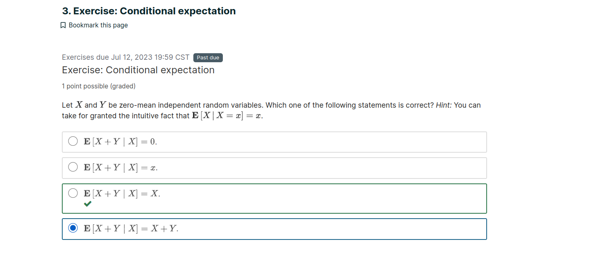

solution:
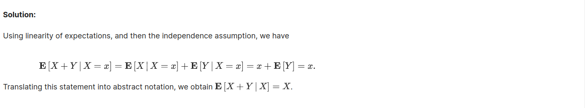

### The law of iterated expectations

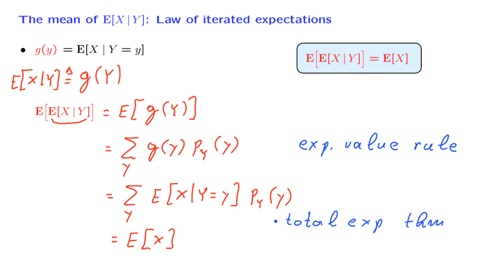                                                              

此处我们定义了函数$g$，并将其与$E[X \mid Y]$联系起来，接着计算$E[E[X \mid Y]]$。使用期望的定义展开这个表达式会发现最终就是再计算$X$的期望，这实际就是之前的toatal Exception Theorem。

> "Iterated" just means "repeated", so it looks like reasonable nomenclature to me (even if it is just a single iteration).

#### Problem

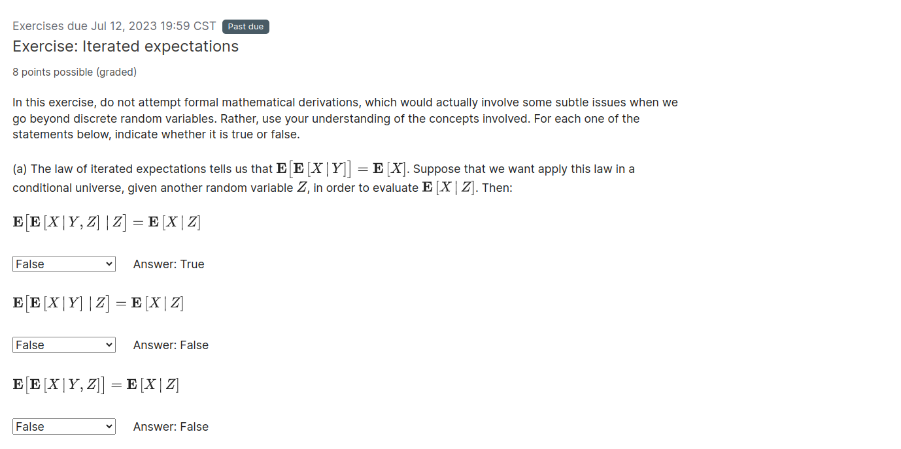

expression
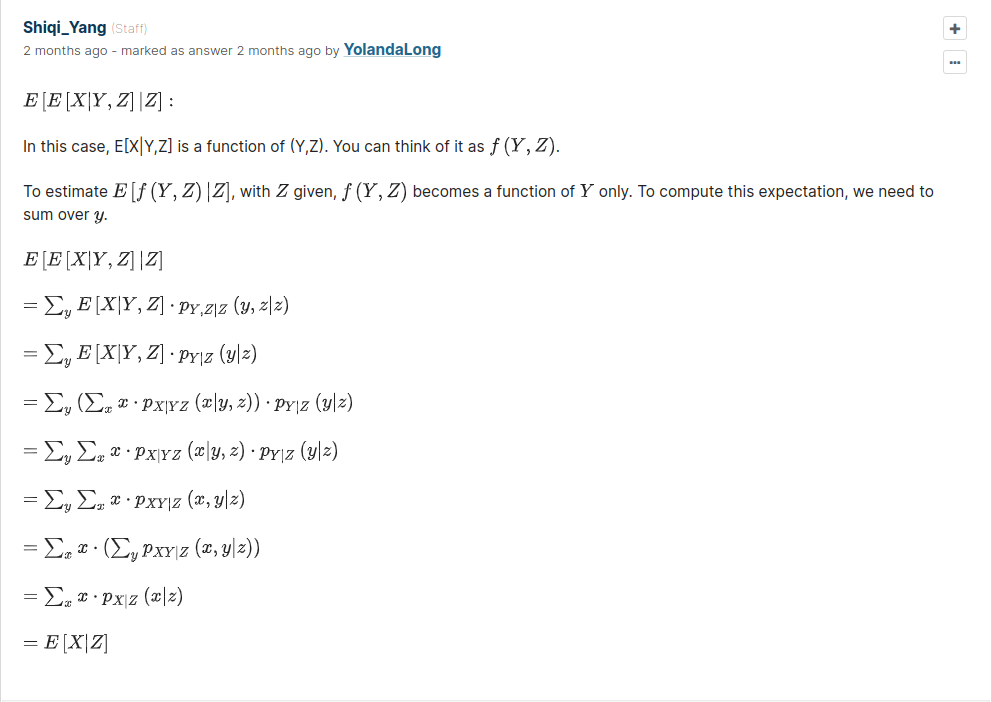

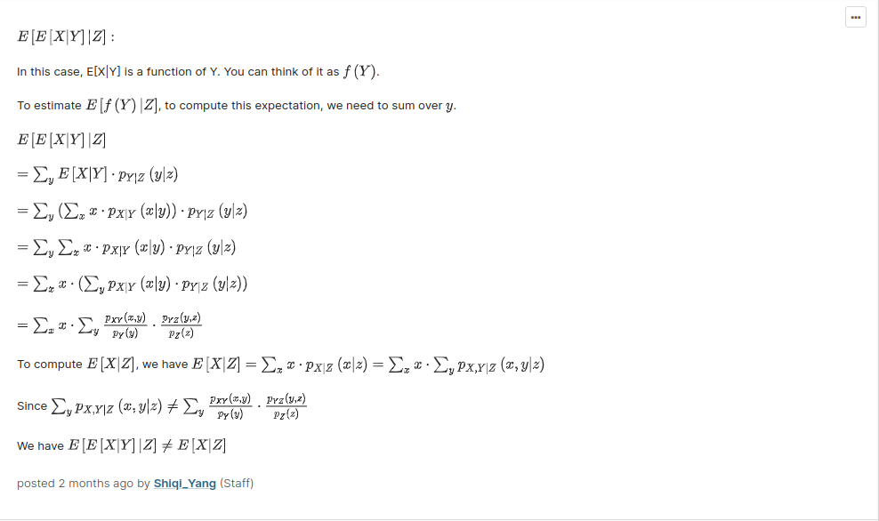

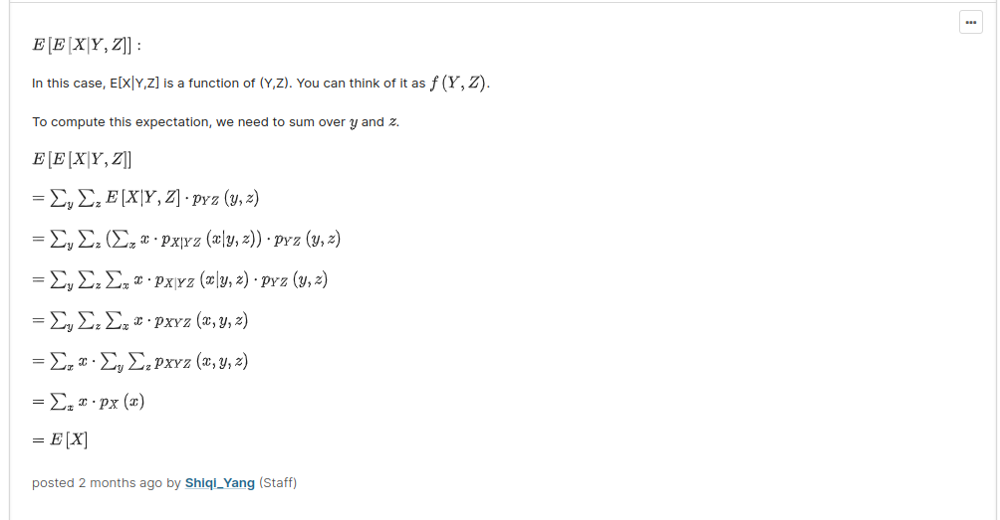

### Stick-breaking revisited

这里是迭代期望法则的一个简单应用示例。我们重新回顾一下之前见过的“折断棍子”的例子。

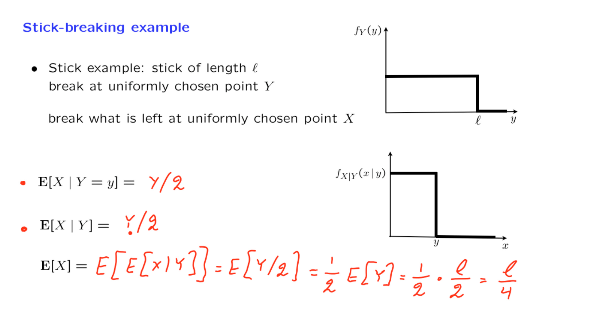

第一个式子和第二个式子本质上没有区别，只不过一个是具体的值$y$，另一个是随机变量$Y$。这就是一般的条件期望与抽象条件期望的区别。

第三个式子则是使用迭代期望法则进行计算，本质上和之前使用$Y=y$没有差别。

### Forecast revisions

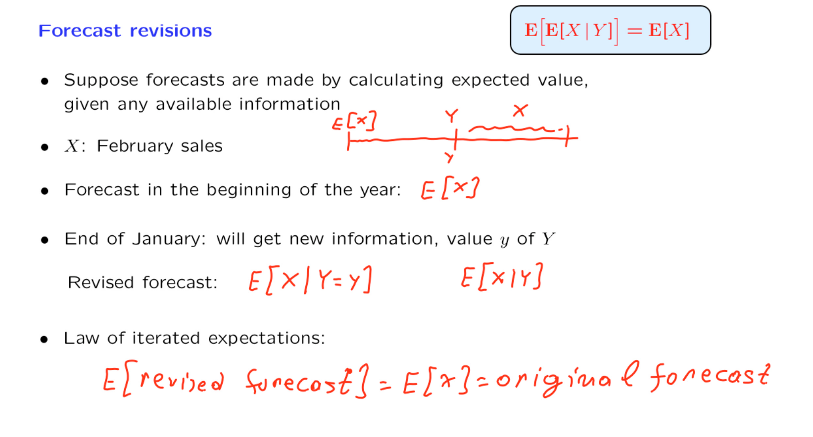

这是一个迭代期望定理在现实之中的一个应用，加深理解。
假设在一家公司，现在是1月初或者12月，你要预测2月份的销售总额$X$，你的预测的值是$E[X]$。现在，时间过去了，我们现在坐在二月初或一月底。在那个时候，你获得了一些新的信息，即大写字母 Y 的值，用小写 y 表示。你的新预测应该是什么？

一旦你手头有了这个信息，你的新预测应该是在给定你手头具体可用信息的情况下计算出的 x 的期望值。所以这是在一月底计算的修订后的预测。但如果你坐在一年初，问自己，修订后的预测将会是什么，你的答案将是，我不知道它会是什么。它是随机的。它取决于大写字母 Y 最终会变成什么样。我的修订后的预测是一个随机变量，即在大写字母 Y 取特定值小写 y 时的 X 的期望值。

那么在这种情况下，迭代期望法则告诉我们什么？它告诉我们修订后的预测的期望值与原始预测相同。
从实际的角度来看，这表明修订后的预测并不会比原始的预测要高或者低。它可以是更高或更低。但平均而言他不会高或者低，。你不期望平均来看，预测会被修订为更高或更低。

这可能与现实并不一致，事实上现实生活中的预测实际上并不是真正诚实计算的期望值。但也许它们是通过一些隐含或隐藏的偏见来计算的，以至于给出的预测实际上不是期望值。

>The proof that is not possible to predict the future
discussion posted 2 months ago by Luke18500

>We matematically proved that is not possible to predict the future: if you could tell at the beginning of the year what the revised forecast would be it means that you could include those new revised forecast in even better forecast, in a positive loop: i.e. you could predict the future!

### The conditional variance

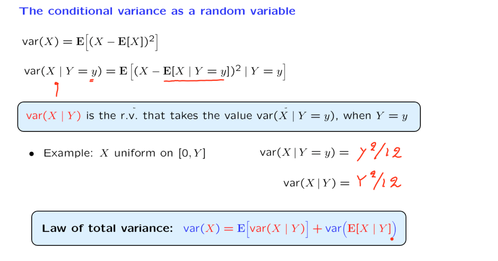

我们已经定义了一个随机变量在给定另一个随机变量的条件下的条件期望，将它视为一个抽象对象，它本身也是一个随机变量。现在，让我们对条件方差的概念进行类似的处理。

开始使用方差的定义和$Y=y$给出了一般的条件方差的定义。随机变量大写 X 的条件分布的方差。这是数字之间的等式。如果我告诉你小 y 的值，条件方差由这个特定的数量定义，它是一个数字。

现在，我们以与我们为定义条件期望为随机变量的情况相同的方式继续，即将$E[X \mid Y=y]$看作小 y 的函数，这个函数现在可以用来定义一个随机变量。这个随机变量可以用这种方式表示，$var(X \mid Y)$

让我们看一个例子，以使这个更加具体。假设 Y 是一个随机变量。我们抽取了这个随机变量。并且我们被告知，在给定那个随机变量的值的情况下，X 将在从 0 到 Y 的特定区间上是均匀分布的。

所以如果我告诉你大写 Y 取特定的数值，那么随机变量 X 在从 0 到小写 y 的区间上是均匀分布的。一个在长度为小 y 的区间上均匀分布的随机变量有一个我们知道的方差。它是 y 平方除以 12。这是数字之间的等式。对于任何特定值的小 y，这是条件方差的数值。

现在，让我们将这个数字之间的等式转化为随机变量之间的抽象等式。随机变量 X 的条件方差是一个随机变量，当大写 Y 是小写 y 时，它取这个值。但这与这个随机变量相同。这是一个随机变量，当大写 Y 恰好等于小写 y 时，它取这个值。

所以我们定义了条件方差的抽象概念，类似于条件期望的情况。

> 所谓抽象，即将其与具体的值剥离开来，描述某一类的所有情况，可以与编程中的抽象的思想作类似比较。

#### Problem

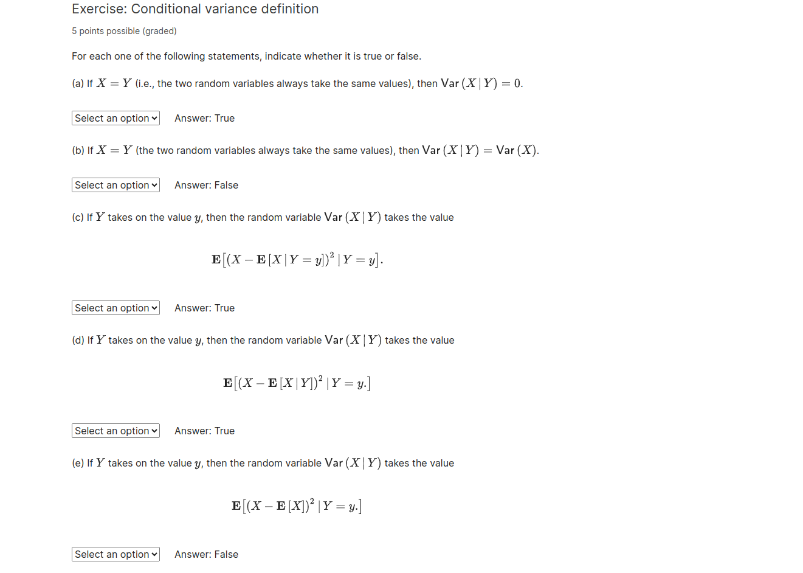

solution 

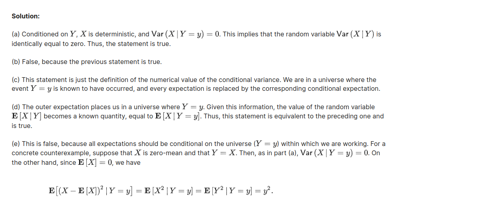

### Derivation of the law of total variance

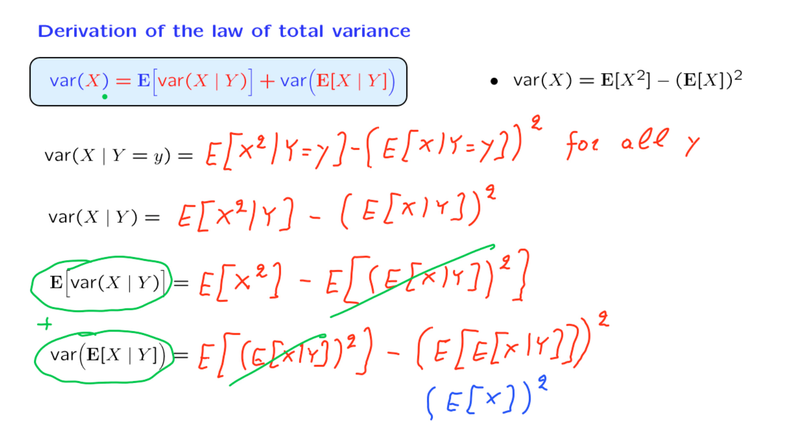

我们将现在进行law of total variance 的推导。这个具体的推导并不提供深刻的理解，不会真正让你明白为什么是正确的。但它涉及一些有趣的数学操作，这些操作对于理解如何进行以及为什么每一步都有效是有用的。

这个推导依赖于计算方差的标准公式。

分别计算最后两项，将他们相加组成一个新的表达式，会消去一个共有的项。

第三项的式子来源于第二个式子的期望，即将第二个式子表示方差的式子带入到期望中去。

### A simple example

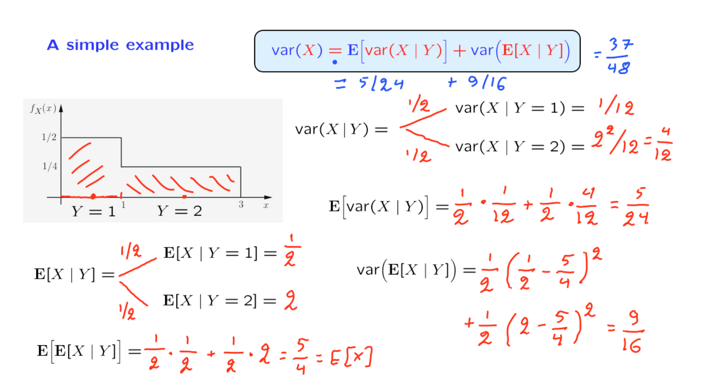

分布如图所示

首先计算$\displaystyle E[X \mid Y]$，使用定义。

$\displaystyle E[E[X \mid Y]]$，继续使用期望的定义，只是此时将$\displaystyle E[X \mid Y]$，当作要计算的项。

$\displaystyle var(X \mid Y)$，差不多，对于每一个单独的情况，使用积分计算。

之后都是分别使用定义计算即可。

### Section means and variances

我们现在将通过另一个示例来巩固我们对迭代期望法则和总方差法则的理解。这个示例如下所示：我们有一个班级，班级总共有30名学生，分为第一节和第二节。让xi表示学生i的分数，比如班级的最终成绩。

我们考虑以下的概率实验。我们随机均匀地挑选一名学生，使得每名学生被选择的概率相等。我们定义了两个随机变量--X是一个数字随机变量，表示所选学生的分数。如果选择学生i，随机变量大写X的值是xi。大写Y定义为所选学生所在的部分的随机变量，因此y取值为1或2。

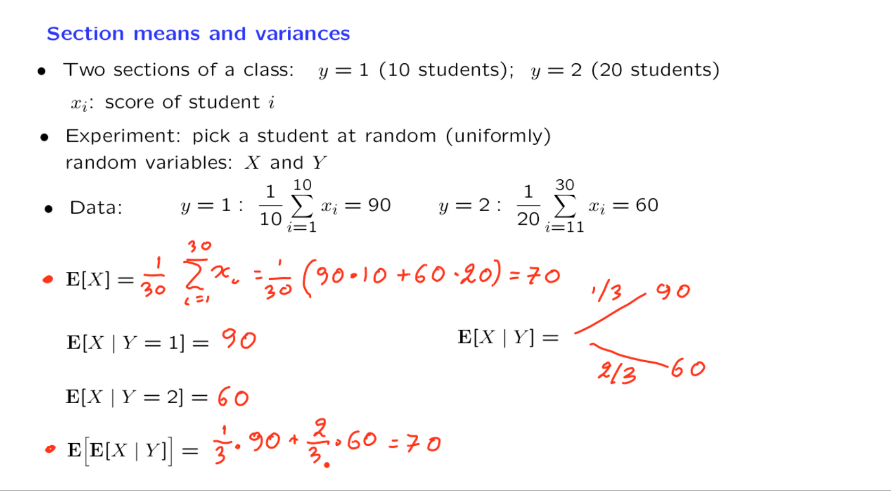

以上发现$\displaystyle E[X] = E[X \mid Y]$ 根据迭代期望法则，我们知道这两者应该是相同。因此，迭代期望法则允许我们通过考虑不同部分的大小来计算整个班级的总平均值。这是一种分而治之的方法，类似于我们在使用总期望定理进行分而治之时所做的。

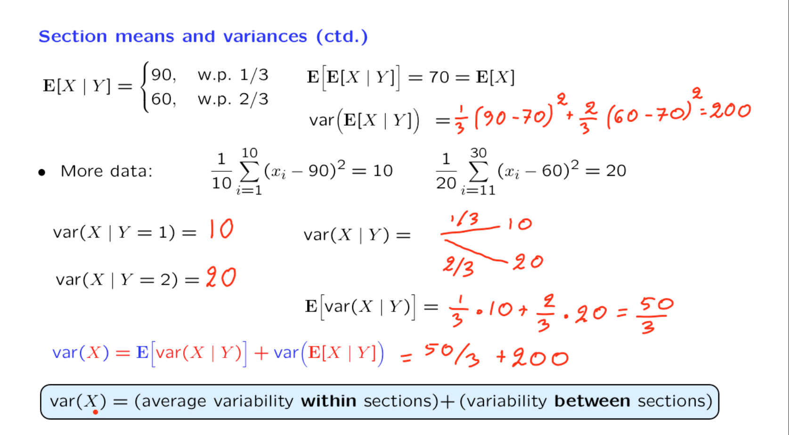

我们继续我们的示例，这里是迄今为止我们找到的内容的总结。条件期望是一个随机变量，以一定的概率取这两个值。这个随机变量的均值等于70。现在让我们计算这个随机变量的方差。

这个随机变量以1/3的概率取值为90，距离这个随机变量的均值相差这么多，我们对其进行平方。以2/3的概率，它取值为60，距离随机变量的均值相差这么多，我们也对其进行平方。当我们进行计算时，我们发现这个数字等于200。

现在追加更多的信息，第一部分是第一节学生的方差，第二部分是第二节学生部分的方差。根据其分布，写出条件方差，由此计算出这两部分方差的期望，也就是平均值。

现在使用 total variance 计算总的$\displaystyle var(X)$。

根据这个题目的背景，来解释$\displaystyle var(x)$的组成：
1. 每一个section中的方差，我们单独思考某一个section中的"差异"，然后取所有section的平均值。
2. 第二部分是考虑不同的section的mean，弄清楚不同的section的mean之间的差异。每一个section的期望与总体之间的“差异”，他衡量了不同section之间的差异。

因此，学生分数的总体随机性可以分解为两个随机性成分。一个随机性来源是不同section具有不同的平均值。另一个随机性来源是在每个section内，学生与其部分的平均值不同。这两个随机性成分加在一起，形成了学生分数的总随机性，由整个班级的方差来度量。

> E[X] = AVG of any student.
> E[X|Y] = AVG of a student of a determined class section.
> E[E[X|Y]] = AVG of the class section. 
> Var(X|Y) = Variance of a student within a class section.
> E[Var(X|Y)] = AVG Variance within a class section.
> Var(E[X|Y]) = Variance between class sections.

### Mean of the sum of a random number of random variables

现在，我们将研究一个涉及独立随机变量之和的模型，但有一个变化。它将是独立随机变量的数量之和，而不是一个固定的数量。这是一个在各种应用中都出现的模型，但它也将帮助我们更好地掌握迭代期望法则和总方差法则。

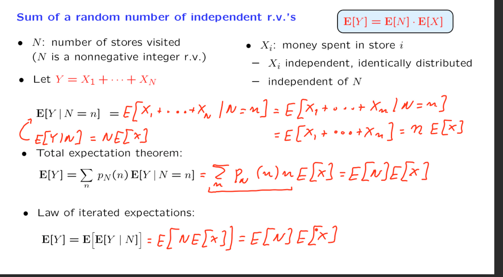

一个总是值得尝试的思路：
令n为一个真实的数，比如5。接下来展开$\displaystyle E[Y \mid N=n]$，使用n代替N。n
在此处视作是一个常数5，使用$\displaystyle E[X]$来表示X的期望，乘以n表示和的期望。

接下来使用总的期望定律，$\displaystyle E[X]$视作是一个常数。

进行第二次数学推导，直接使用iterated expection。注意我们抽象化表示出了$\displaystyle E[Y \mid N]$

### Variance of the sum of a random number of random variables

继续研究独立随机变量的随机数量之和。我们已经弄清楚了这个总和的期望值是多少，并且找到了一个相当简单的答案。然而，当涉及到方差时，很难猜测答案会是什么?

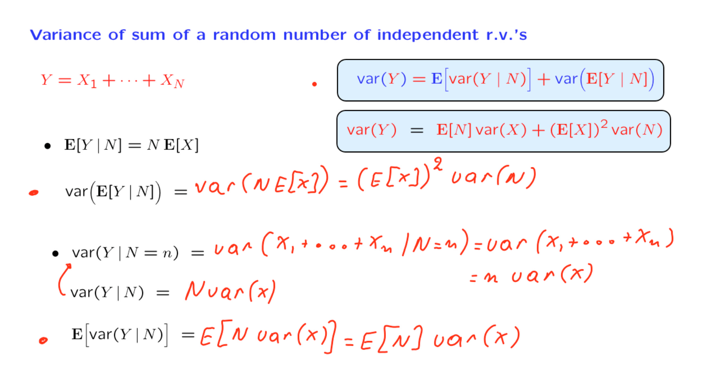

条件方差项无条件方差的转变：因为X与N是独立的，所以当告知了N的信息之后，并不会影响X的分布。

n个随机变量之和的无条件方差只是它们每一个的方差的n倍。

式子中的平方项来源方差的性质。将E[X]看作一个常数项。

这个使用$\displaystyle Var[X + Y]$可以证明，$\displaystyle var(X) + var(Y)$

最后的表达式告诉我们，你花费的总金额的方差，这是衡量你总共花费的金额的随机性的一种方式，这个随机性有两个原因。

一个原因是在任何给定商店花费多少钱的随机性，这由X的方差来捕捉。这是你在一家典型商店花费的金额分布的方差。但还有另一种随机性，这种随机性来自于商店的数量本身是随机的，这给了我们Y的方差的贡献。

#### problem

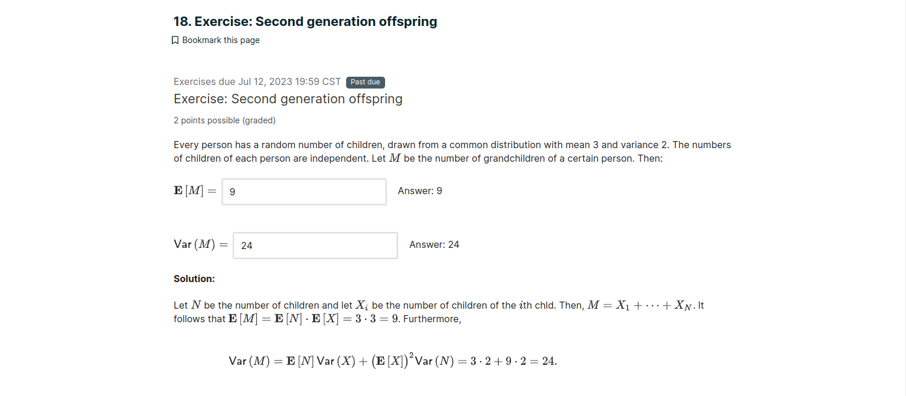