# Unit 7: Bayesian inference

## Unit 7 overview

In this unit, we focus on Bayesian inference, including both hypothesis testing and estimation problems.

a) We apply the Bayes rule to find the posterior distribution of an unknown random variable given one or multiple observations of related random variables.

b) We discuss the most common methods for coming up with a point estimate of the unknown random variable (Maximum a Posteriori probability estimate, Least Mean Squares estimate, and Linear Least Mean Squares estimate).

c) We consider the question of performance analysis, namely, the calculation of the probability of error in hypothesis testing problems or the calculation of the mean squared error in estimation problems.

d) To illustrate the methodology, we pay special attention to a few canonical problems such as linear normal models and the problem of estimating the unknown bias of a coin.

* Mostly an application of earlier tools
  * but very useful
* Infer something about Θ based on an observation X
    * rely on the Bayes rule

## Lec. 14: Introduction to Bayesian inference

### Lecture 14 overview 

这一章主要是关于Baye's 的使用

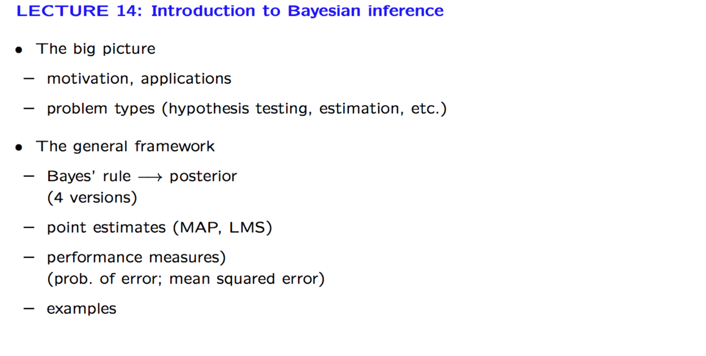

### Overview of some application domains

在我们开始讨论推断方法之前，值得从宏观角度看一下，以便更好地理解。到目前为止，我们集中关注了分析概率模型的方法，这是大局的一部分。如果我们的模型已经经过谨慎选择，那么它应该与现实世界相关，并帮助我们进行预测或决策。但我们如何知道这是否成立呢？这就是为什么我们需要查看由真实世界生成的数据，然后使用这些数据来构建模型的原因。这就是推断和统计领域的全部内容。

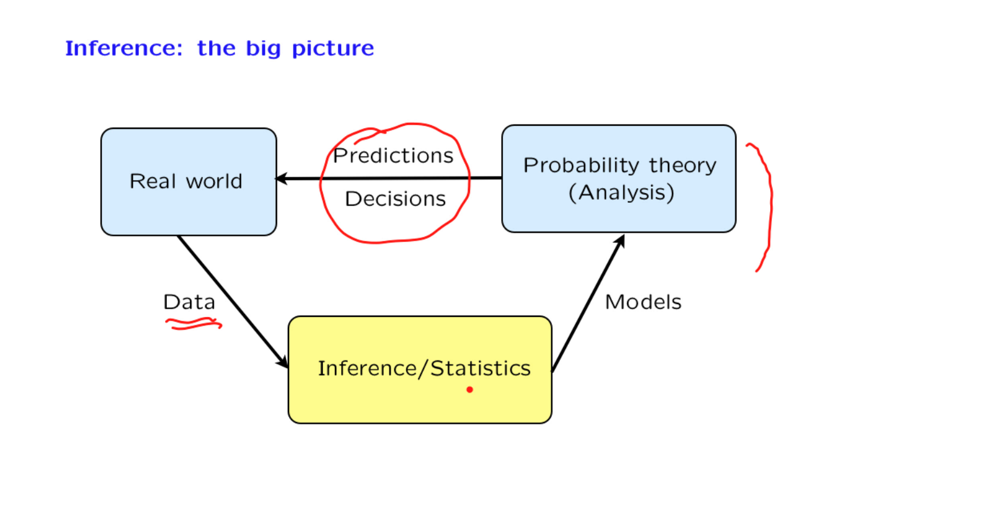

之前一直在学习的内容是Probability theory。

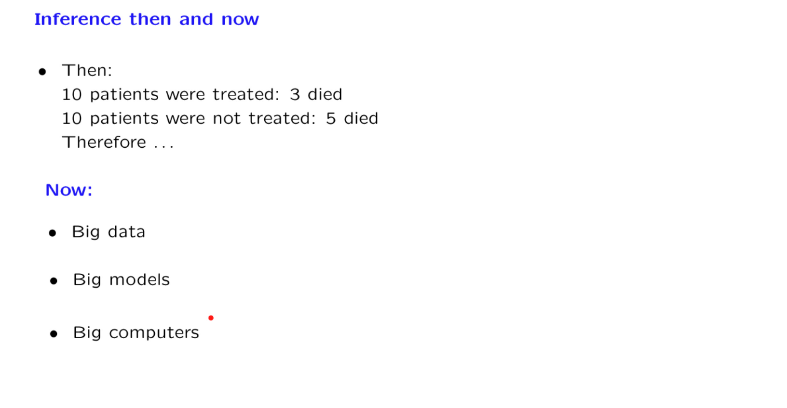

过去的统计学家统计的数据十分有限。

### 使用场景

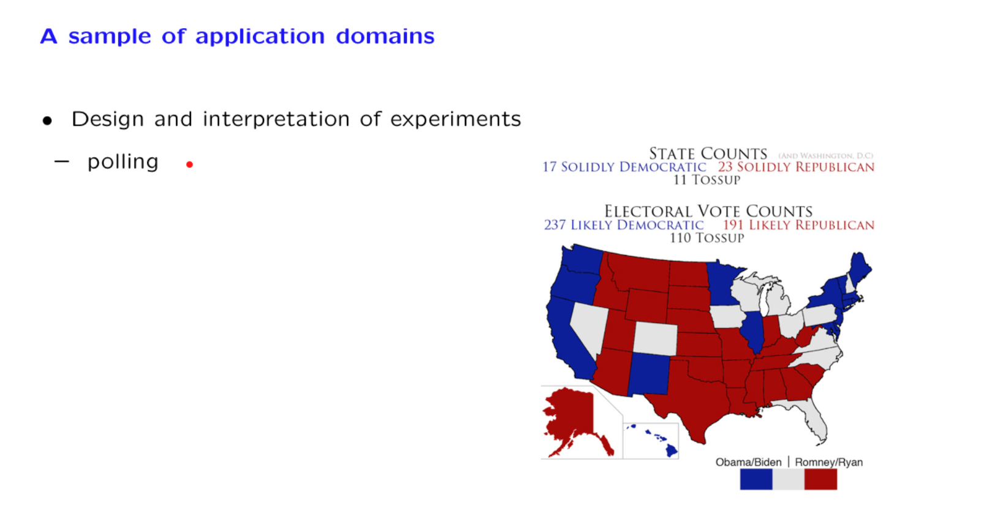

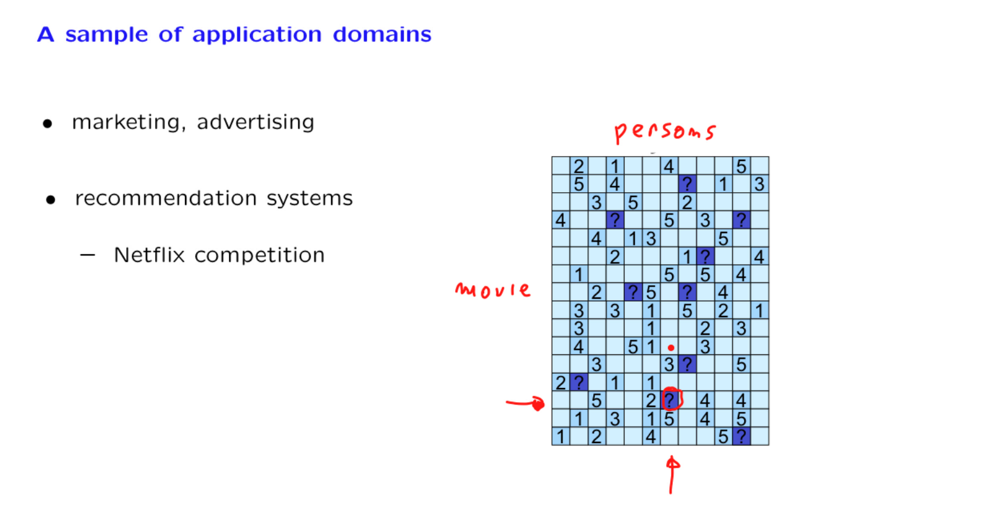

在某种程度上比较传统的情境中，人们设计了一种数据收集方法，然后使用这些数据来进行简单的预测。这就是民意调查的情况，其目的是预测选举的结果。另一个领域是市场营销和广告，情况有些类似。不过现在，我们想要为每个个体消费者进行预测，而不是为整体人口进行预测。还有一个特定的应用与所谓的推荐系统有关。你收集人们给电影的评分，就像Netflix宣布的一个著名竞赛中那样。所以你有每部电影和观看过它们的人的数据。你记录了每个人给特定电影的评分。现在，在收集了大量这种类型的数据之后，你试图使用这些信息来猜测，例如这个人是否对这部电影感兴趣。这是一个相当困难的问题。一个相当复杂的问题。它给了社区一个机会，来发展更高级的方法组合，以便对这个表格中的未知条目进行良好的预测。

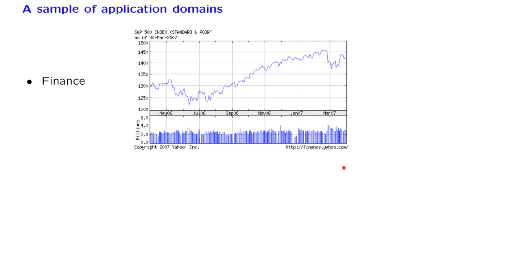

金融领域。市场确实不确定。而且有相当完整的历史数据。我们如何利用这些数据来进行预测？

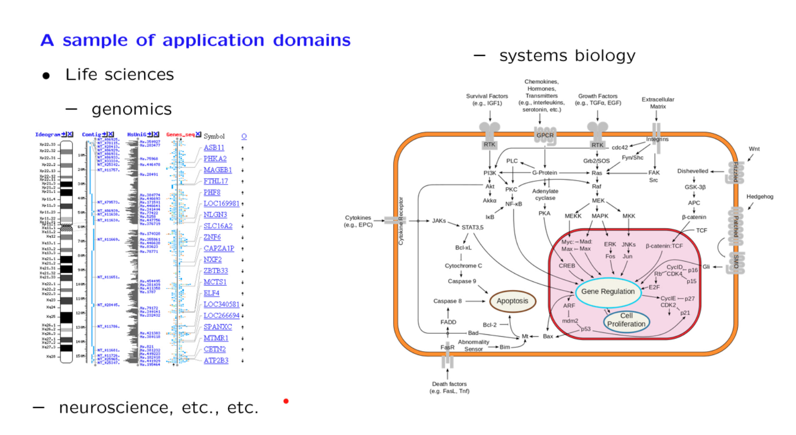

自然科学，生命科学正在发生一场革命。有大量的基因组数据需要处理，以找出哪种基因组合会导致哪种疾病。或者我们可能想要了解生命细胞内化学反应的细节。还有一个即将到来的新领域，神经科学，那里将产生大量的数据。这些将包括大脑测量数据。对每个神经元在做什么的测量。希望这些数据有朝一日将带领我们找出大脑真正在做什么以及它是如何工作的。

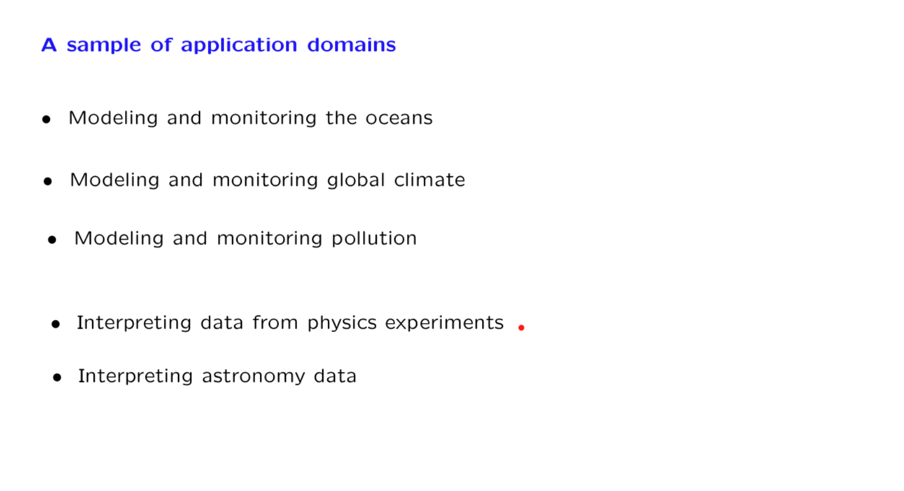

在科学领域，清单是无穷无尽的。不胜枚举。在建模气候和环境方面，科学家们现在正在使用大型模型。他们试图使用大量可用数据来校准这些模型。在物理学中，科学家们也使用精密的推断方法，试图在大海捞针中找到针。比如寻找稀有粒子或遥远的行星。最后，工程学是与噪声作斗争。工程师们试图制造能在不确定的环境中工作的设备。信号处理领域是一个典型的例子，那里的通用问题是恢复信号的内容。例如，当信号在受到噪声干扰后接收到时，恢复无线电传输的内容。

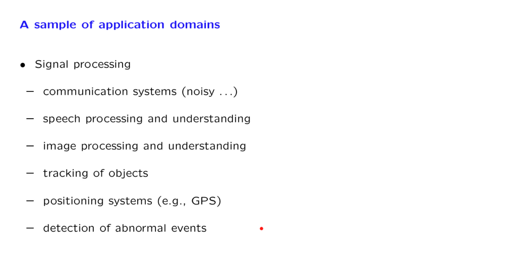

我可以不停地列举这种情况，但我们必须在某个地方停下来。最重要的是，机会和需求是巨大的。出于这个原因，我们将研究参与的核心方法。对我们来说，幸运的是，不同的应用具体情况不同，但基本概念和方法却是相同的。

### Types of inference problems

在深入讨论主题的核心内容之前，我想对推断领域中出现的不同问题类型提出一些建议。你可以将模型构建与对未观测变量进行推断之间进行一般区分。

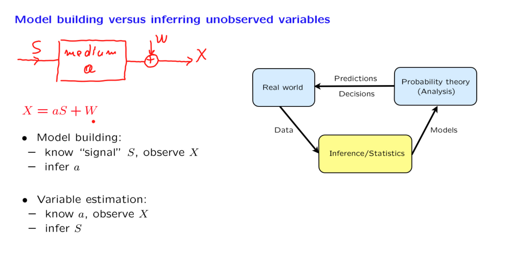

你有一个发送信号的发射器，称之为S。这个信号通过某种介质传播，它可能只是大气。而介质会以某个因子a减弱信号。然后，当信号传播时，它还会受到一些噪声的干扰，称之为W，接收器看到的是一个观测值X。因此，这种情况由这个简单的方程描述。

上文所提到的问题(infer S and infer a)虽然描述和含义不相同，但是在数学上的描述是相同的。都是已经知道一个变量去推断另外一个变量。这意味着这两种问题可以采用相同的方法。

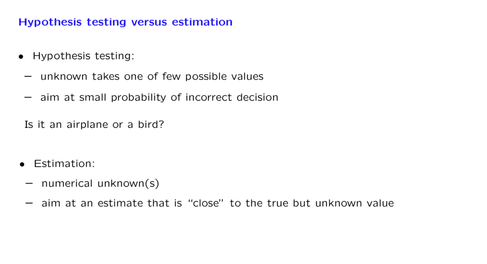

另一种问题类型的区别：

对于假设性检验，我们可能对某一个时间或者现象存在许多的模型。我们想要做的就是在众多的候补模型之中，找出正确的或者犯错最小的模型。我们得到了一个雷达读数。问题是要进行推断，雷达是否探测到了一架飞机或者飞机是否存在。因此，在假设检验问题中，我们基本上是在少数几个离散的可能选择中进行选择。

于此相反的是，在估计问题之中，未知的数量更多地是数值类型的。它们甚至可以取连续的值。我们想要做的是个未知数量的估计值，该值接近我们试图估计的数量的真实但未知的值。因此，在这里，我们的性能目标是一种距离函数。我们希望接近真相。通常情况下，我们有一个可能选择的连续集合，也就是说，我们的估计可以是一般的实数。

总的来说，这两种类型的问题，即假设检验和估计，在处理方式上有一些显著的不同，接下来我们将看到。

problem collection:

1. infer variable
2. hypothesis (choose "right model" from some backup)
3. estimate some value of number

#### problem

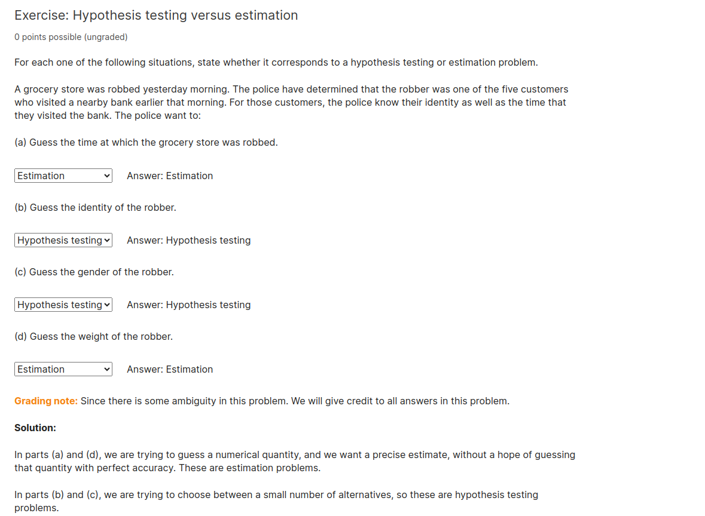

### The Bayesian inference framework

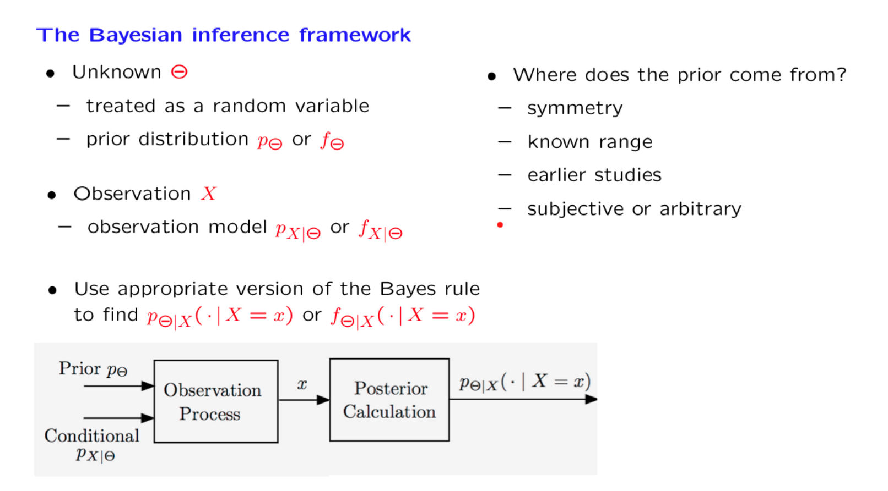

我们将一个未知量视作是一个随机变量，这是区别其他frame 的地方。这个变量$\displaystyle \theta$，存在一个分布，即先验分布。
之后我们观察到了一些数值，这也是一个随机变量，当观察的过程结束时，我们得到的是一个具体的数值$\displaystyle x$，而这个Observation process 根据一个概率模型进行建模。
此时我们指定了$\displaystyle X$的条件分布，一旦获取了具体的观测值时，就可以使用Bayesian rule 来计算$\displaystyle \theta$。

对于参数$\displaystyle \theta$，他的先验分布从何而来？一般会使用对称性，等可能的在有限的模型之中选择。
考虑他的范围，将不可能的范围的值的PMF和PDF设置为0。
有时候这个选择更多的是凭借我们的主观意识，即$\displaystyle \theta$ 的belief。使用Bayes frame只是得到了$\displaystyle \theta$的后验分布。

为了理解这个概念，考虑猜测候选人在总统选举中获得的选举票数这个问题。

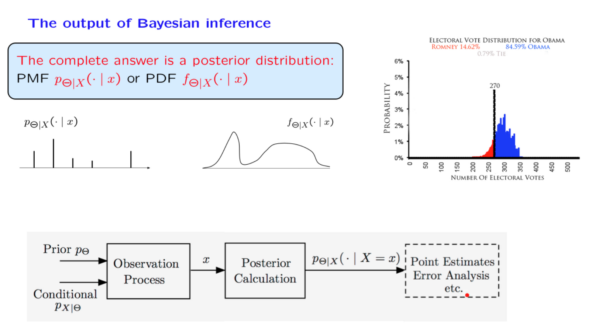

选举票数是候选人从美国各个州获得的选票。候选人需要获得一定数量的选举票才能当选总统。一个可能的预测可以是我预测候选人A将获胜，但实际上，一项民意调查结果的更完整呈现可能是这样的图表，它本质上是一个PMF（右侧的红蓝色图像）。
在这里，一个特定的民意调查员收集了所有数据，并提供了不同可能的选举票数的后验概率分布。这个图表比简单的陈述更具信息量，简单陈述只是告诉我们我们预计某个候选人会获得超过所需的选举票数。

像之前所说的，Bayesian给我们的是一个后验分布，但我们很多时候想要的是一个确定的结果。比如，能够预测这场选举谁最有可能当选。这就需要继续来处理，也就是到来图中虚线的部分。
让我们谈谈这个问题。

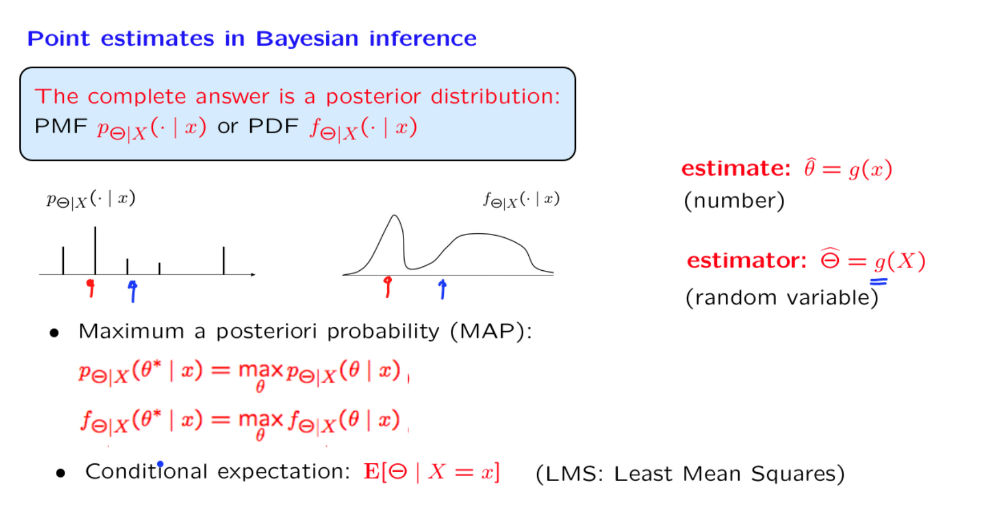

我们有了后验分布，开始对它进行处理。首先可以根据PMF或者PDF选择最有可能发生的情况，也就是可能性最大的值，在图中被红色标注。或者可以计算期望，报告条件期望的均值。
以上就是为了得出一个具体的值所采取的两种措施。
术语提出两点评论。我们在这里得到的是一个估计值。我给了你条件PDF或条件PMF，然后你告诉我一个数字。这个数字，这个估计值，是通过从数据开始，对数据进行一些处理，最终得出的一个数值。
g是我们用来处理数据的方法。它是一个特定的规则。
如果我们知道数据的值，我们知道估计值将会是什么。但如果我们不知道这个值是多少，那么我们能够看到的是一个随机变量$\displaystyle X$，那么经过处理能够得到的也只能是一个随机变量。这两个都是随机的。

图中标识出了estimate和estimator的区别。estimator所指代的就是函数g，这是我们处理数据的方式。
从抽象的角度来看，我们知道了计算条件分布所需的内容，并且我们手头有两个具体的估计器。现在，我们只需要考虑各种示例，以讨论穿越这些各种步骤需要什么。

### Discrete parameter, discrete observa

让我们更详细地讨论当两个随机变量都是离散的时候如何进行贝叶斯推断。未知参数 Theta 是一个随机变量，它取离散集合中的值。我们可以将这些值视为替代假设。

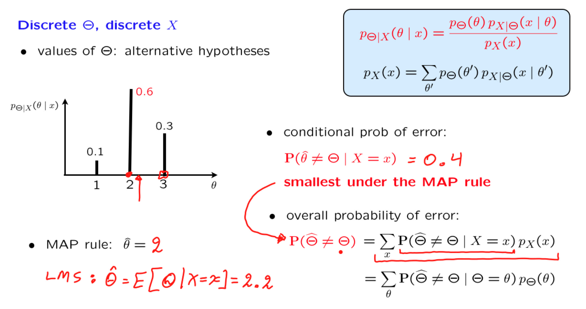

我们假设我们有一个模型，观察到了 X 的值，并且已经确定了随机变量 Theta 的条件概率质量函数（PMF）。
我们使用MAP规则来预测 $\displaystyle \hat{\theta}$，结果为2。当然也可以使用LMS。之后我们可能需要考虑这个预测的结果的准确性会是多少？
我们的数据采取MAP，由图中PMF可知，2发生的概率会是0.6。这是最有可能发生的。但是也可能会有其他的结果，比如3或者4，两者的概率是0.4。这就是我们会犯错的概率。
如果我们选择的估计值不是 2 而是 3，那么真实参数将等于我们的估计值的概率为 0.3，但我们错误的概率为 0.7，这将是一个更大的错误概率。更一般地说，特定估计的错误概率是  $\displaystyle \Theta$的其他值的概率之和。如果我们想要保持错误的概率较小，我们就要保持 $\displaystyle \Theta$ 自身的概率较大。因此，根据这个论点，我们可以看到达到最小可能的错误概率的方法是使用 MAP 规则。这是 MAP 规则非常重要的性质。

以上是对预测的错误的概率的分析。但更为普遍的是，我们要去讨论个estimator或者是各个estimator的效果，以了解它们的总体错误概率。
假设我们设计两一个决策系统，他会根据数据给出相应的一个结果值。
一般会有两种方法来判断估值的准确性：

1. 使用total probability
2. 计算给出的估计值已经发生的条件下概率。

最后我们观察到MAP规则会实现错误率最小的估值结果。

### Discrete Parameter, Continuous Observation

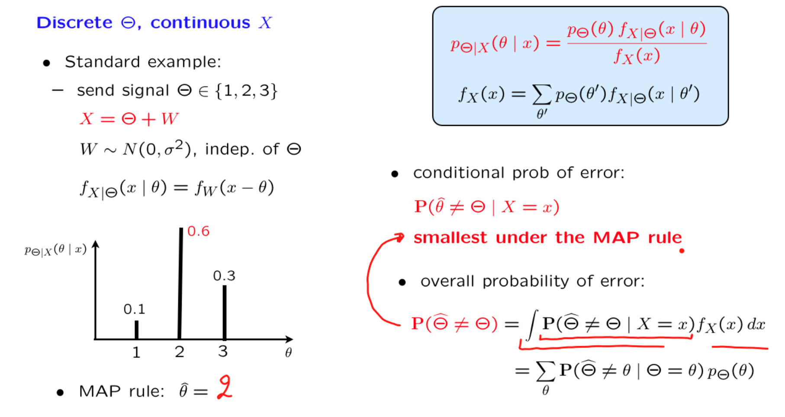

这次处理的情况是：得到的观察值是连续的。
类比信号发送的例子，发送的值$\displaystyle \Theta$是离散的，有三种情况。但受到噪声的影响最后观测到的$\displaystyle X$是连续的。

首先使用先验分布和观测的值，可以得出可以得出与噪声分布的关系，然后使用Bayes（连续部分使用的是PDF）。

后续的流程基本就与先前一样。

### Continuous Parameter, Continuous Observation

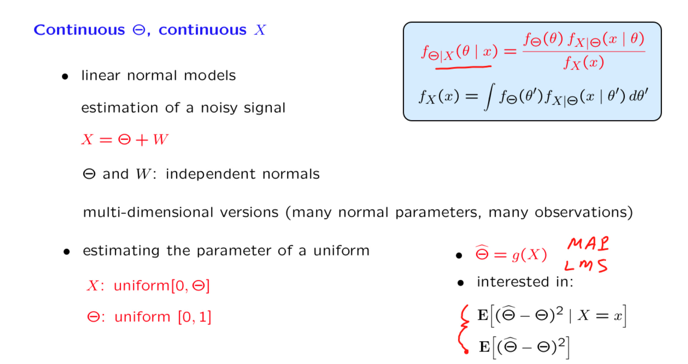

这一节的讲座不会再详细讨论详细的解决过程，与之前的基本一样，只是使用来不同版本的Bayes。现在具体讨论几个会出现的问题。

#### 这样的模型（观测值和估计值）什么时候会出现？

一种情况被称呼为linear normal model，他是我们感兴趣的随机变量全部都是正态分布（X $\displaystyle \Theta$）。
另一种情是$\displaystyle \Theta$是一个向量，他有许多的分量，由此就会得到不同的X的观测值。这种情况目前还没有讨论过。

#### 涉及估计均匀分布的参数

因此，X是一个在某个范围内均匀分布的随机变量。但是范围本身是随机且未知的。基于观察X，我们希望估计$\displaystyle \Theta$的真实值。这是您将在本课程的已解决问题集合中看到的示例之一。在这种情况下，我们希望提出估计$\displaystyle \Theta$的方法，我们形成一个估计器，目前的主要候选估计器再次是最大后验概率(MAP)估计器，它查看这个条件密度并选择使这个条件密度尽可能大的theta值。然后另一个选择是最小均方$\displaystyle \Theta$估计器，它只是计算给定X的情况下的$\displaystyle \Theta$期望值。

#### 对不同estimator性能的估计。

这里给出性能的定义，他就是我们得到的估计值与真实值之间的距离，通常使用$\displaystyle  \hat{\Theta} - \Theta$的平方，然后取他的均值。
在这个过程之中，既包含了特定情况，也有无条件。

### Inferring the Unknown Bias of a Coin and the Beta Distribution

现在将通过一个示例来介绍一个连续未知参数和离散观测的情况，即硬币的未知偏差和观测序列中观测到的头数。这是一个我们将从一些详细开始的示例，稍后我们还将回顾它。

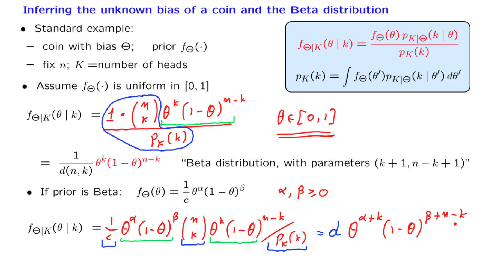

这个示例是一个我们已经见过的示例的扩展，当我们首次介绍相关版本的贝叶斯规则时。我们有一枚硬币。它的偏差在0到1之间，但是偏差是未知的。根据贝叶斯哲学，我们将这个未知的偏差视为一个随机变量，并为它分配一个先验概率分布。我们独立地抛这枚硬币n次，其中n是某个正整数，然后记录所获得的头数。基于这个随机变量的值，我们希望对$\displaystyle \Theta$进行推断。

1. 假设$\displaystyle \theta$的先验分布是[0,1]的均匀分布

利用Bayes rule，得到如图中的表达式。
$\displaystyle \frac{n \choose k}{P_K(k)}$ 与$\theta$无关，所有将他单独隔离出来得到$\frac{1}{d(n,k)}$

2. 假设$\displaystyle \theta$的先验分布是Beta 分布。
同样将非$\theta$的部分提取出来用d表示。

通过最后的结果可以看到beta分布的一个性质，如果先验分布是Beta分布，那么后验分布也会是Beta分布，只是参数($\alpha \to \alpha+k \qquad \beta \to \beta+n-k$)变化了。

### Inferring the Unknown Bias of a Coin—Point Estimates

我们现在将继续讨论推断某枚硬币的未知偏差的问题，该硬币具有一定的先验分布，并且我们观察到在n次独立的抛硬币中出现的正面次数。

现在不仅仅是后验分布，我们需要得到一个单一的值，也就是估计值，来预测硬币的偏差。

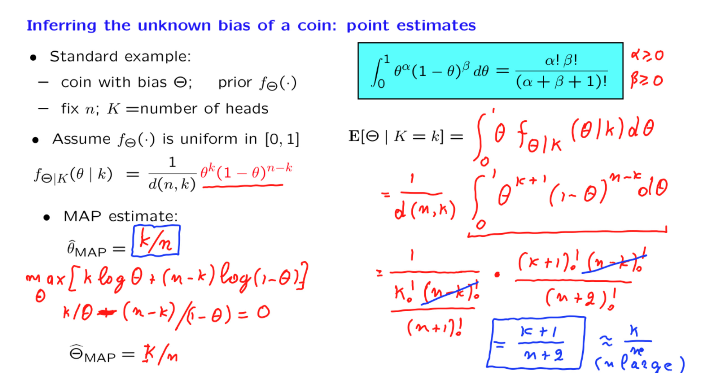

一切和上文相同，后验分布为图中所示的Beta分布。

首先使用MAP estimator，通过求导，找极值的方法，来找到后验分布的最大值。后验分布中的$\displaystyle  k$是小写，因为此时我们已经了到来观测值。得到的估计值为$\displaystyle \frac{k}{n}$。estimator是$\displaystyle \frac{K}{n}$，他是函数，是随机变量。

现在使用LMS(least mean square)方法，求取在$\displaystyle K = k$的条件下，$\displaystyle \Theta$的期望。使用beta formula。
估值为$\displaystyle \frac{k + 1}{n + 2}$，这里的k是小写，代表的是具体的值。

现在，让我们比较我们得到的两个估计值，MAP估计和条件期望估计。它们非常相似，但不完全相同。这意味着Beta分布的均值并不等于使分布达到最高点的点。另一方面，如果n很大，当n很大时，这个表达式将近似等于k/n。因此，在大n的极限下，这两个估计值将不会相差太多。

### Summary

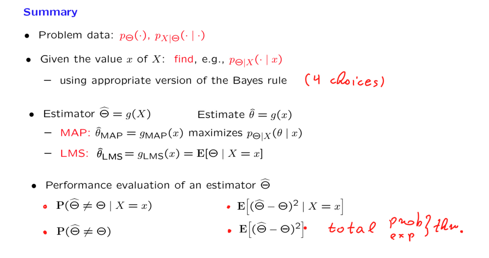

### Beta formula

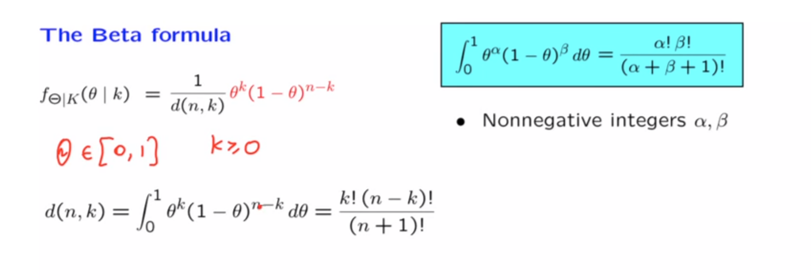

现在要计算出$\displaystyle \int_0 ^1 \theta^k (1-\theta)^{n-k}d\theta=\frac{k!(n-k)!}{( n+1 )!}$

有两种思路：

1. 直接利用积分计算
2. 将 k替换为$\alpha $，n-k替换为$\beta$

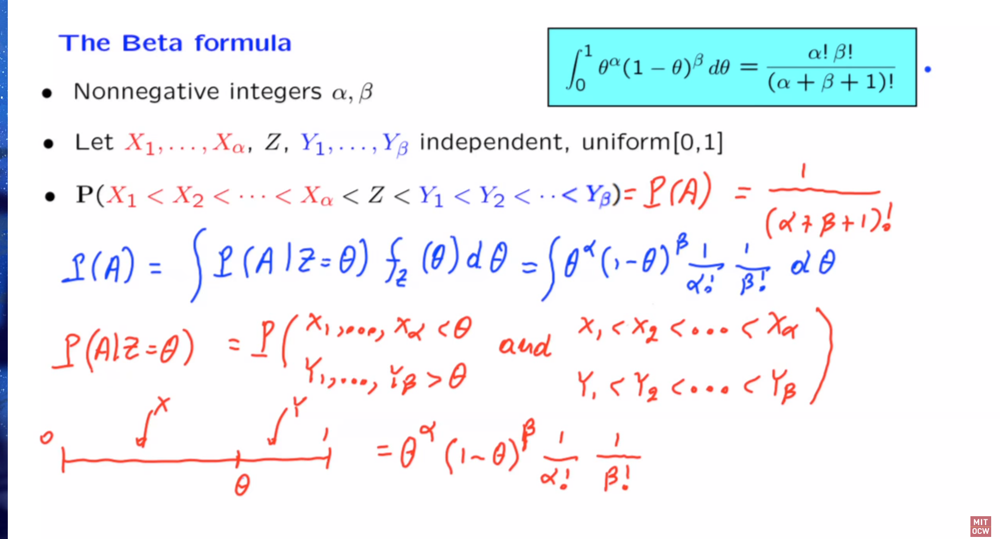

设X和随机变量Y，Z为一个常数，将原本的表达式转换为求取这个序列的概率：$P(X_1<X_2<...<X_a<Z<Y_1< Y_2<...<Y_{\beta})$

$P(A)=\int P(A\mid Z=\theta)f_Z(\theta)d\theta $
$P(A \mid Z=\theta)=P(X_1,...,X_{\alpha} < \theta,Y_1,...,Y_{\beta}>\theta \quad and  \quad X_1<X_2...X_{\alpha} < \theta,Y_1<Y_2...Y_{\beta}) $
在条件概率下($z=\theta$),$X_1<X_2<...$的概率(实际上就是每一个单独的X都在$\theta$左侧的概率)X是分布在[0,1]之间的均匀分布，现在要求在$\displaystyle \theta$的左侧，概率就是$\theta$(因为长度为$\displaystyle \theta$,概率就是$\theta \times 1$)，Y也是同理。$\displaystyle X_1 < X_2 <...<X_{\alpha}$的概率：$\displaystyle \frac{1}{所有的排序}= \frac{1}{\alpha!}$,Y同理。$\displaystyle f_{\theta}(\theta)=1$

综合以上可以得到：P(A)=$\displaystyle \theta^\alpha(1-\theta)^\beta\frac{1}{\alpha!\beta!}$

$\displaystyle P(A)=\frac{1}{(\beta + \alpha + 1 )!}$

由此可以得出beta formula。
