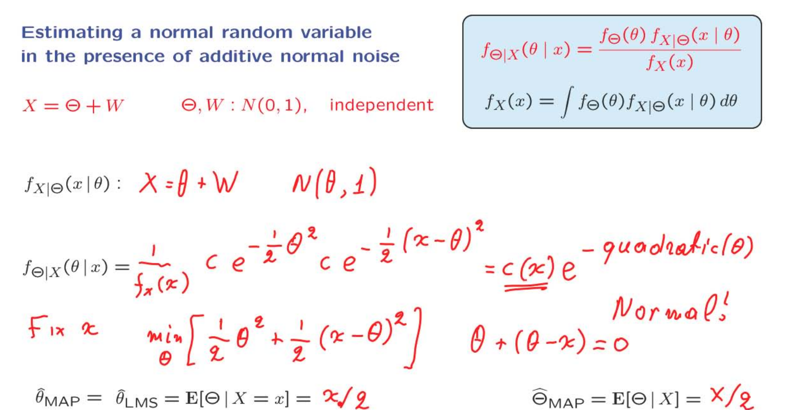

# Unit 7: Bayesian inference

## Lecture 15: Linear Models With Normal Noise

### overvoew
在上一堂课中，我们讨论了涉及到贝叶斯规则各种变化的推断示例。但我们没有考虑到一个情况，即未知随机变量和观测值都是连续的情况。在这堂课中，我们将专注于这种重要类型的模型。

在我们考虑的模型中，我们首先有一些基本的独立正态随机变量。其中一些，记作Theta j，是未知的需要估计的参数。另一些，记作Wi，代表噪声。我们的观测值Xi，是这些基本随机变量的线性函数。特别地，由于独立正态随机变量的线性函数也是正态分布的，所以观测值本身也是正态分布的。这可能是所有推断和统计学中最常用的模型类型之一。这是因为在许多情况下，它是一个合理的近似。此外，它具有非常清晰的分析结构和非常简单的解决方案。例如，事实证明每个Theta j的后验分布本身也是正态分布，并且MAP和LMS估计是相等的。这是因为正态分布的峰值出现在均值处。此外，这些估计值是观测值的一些简单线性函数。我们将通过逐渐复杂的版本序列来介绍这些事实。我们将从只有一个未知和一个观测值开始，然后进行泛化。并且我们将通过一个相当现实的例子来说明模型的构建和解决方案，该例子涉及从一些带有噪声的测量中估计物体的轨迹。

### Recognizing Normal PDFs

在这个讲座系列中，我们将对正态随机变量进行详细讨论。因此，现在先从一个简单的观察开始，这将使我们以后能够更快地进行推导。

一开始回顾来正态分布的表达式定义。
而后提出一个一般的形式。因为我们必须要保证PDF在X趋近无穷时能够积分为1，所以图中所提出的一般形式就必须要保证x趋近无穷时，指数的表达式就必须是趋近0，所以$\displaystyle \alpha$就必须要保证大于0。

开始对指数进行处理，根据二次项和一次项使用完全平方，最终会剥离出一部分没有$\displaystyle x$项。归根到底就是将他转化成正态分布的形式。

当我们确信如此的指数函数是正态分布时，因为正态分布的峰值就是在他均值的点处，所以可以直接求二次项的导数，取导数为0的时候，得到这个二次向的最大值，也就是整体的最小值。

### Estimating a Normal Random Variable in the Presence of Additive Noise

作为更复杂和更困难的模型的准备，我们将从最简单的模型开始，其中涉及线性关系和正态随机变量。模型的具体情况如下。有一个未知参数，模拟为一个随机变量，$\displaystyle \Theta$我们希望估计它。我们手头拥有的是$\displaystyle \Theta$加上一些加性噪声W。这个和是我们的观测值X。我们做出的假设是$\displaystyle \Theta$和W都是正态随机变量。为了简化计算，我们假设它们是标准正态随机变量。此外，我们假设$\displaystyle \Theta$和W是彼此独立的。

**根据贝叶斯方法，关于$\displaystyle \Theta$的推断本质上是在我告诉你观测值大写X取特定值小写x的情况下计算 $\displaystyle \Theta$ 的后验分布。**
为了计算这个后验分布，我们调用Bayes规则的适当形式。

为了取得后验分布，在Bayes的公式中，我们需要先找到在给定$\displaystyle \theta$下的，X的分布。此时$\displaystyle \theta$是一个常数。因为$\displaystyle W$是独立的，所以$\displaystyle X$的表达式是一个正态分布加上常数。X的均值和方差可以直接利用方差和期望的或者站在X的视角分析得出$\displaystyle N(0,1)$。

使用公式计算后验分布，C表示的是正态分布归一化的参数。两个关于$\displaystyle e$的指数则分别是$\displaystyle \Theta$和X的正态分布的指数部分。现在可以将这个式子进行合并，前面有关X的分布和c的常数归为一类，后面有关指数部分函数的指数部分则则可以合并成关于$\displaystyle \Theta$的二次函数。注意此时的视角转变，在计算先验时，$\displaystyle \theta$视作常数，但是在后验是X才应该视作是常数。

现在固定x的值，表达式里真正有用的就是指数部分，因为我们需要找到正态分布的峰值，对于这个负的表达式而言就是取最小值，对这个部分求导，得出在$\displaystyle \Theta = \frac{x}{2}$，他的estimator为$\displaystyle \frac{X}{2}$。

这个例子有多特殊？事实证明，即使我们假设Theta和W是独立的正态随机变量，但具有一些一般均值和方差，解的结构仍然是一样的。你应该能够自己验证，重复我们刚刚进行的计算，Theta的后验分布仍然是正态的。由于它是正态的，分布的峰值与期望值相同。所以期望值，或者最小均方估计器，与最大后验概率估计器是一致的。最后，尽管这个公式不会完全成立，估计器也会有一个类似的公式，即估计器将被证明是测量的线性函数。我们将看到，这些结论实际上比这更一般化。这正是使用正态随机变量和线性关系非常吸引人的原因。

### The Case of Multiple Observations

现在，我们已经准备好进入一个相当有趣和相当现实的模型。
这是一个模型，其中我们有一个未知参数，它被建模为一个我们试图估计的随机变量。
这个随机变量是Theta。我们有这个随机变量的多次观测。每一个这些观测都等于未知的随机变量，再加上一些附加的噪声。这个模型在实践中经常出现。通常情况下，我们试图估计某个数量，但只能在噪声存在的情况下观察到该数量的值。由于噪声的存在，我们想要尝试多次测量它。因此，我们有多个这样的测量方程。

这里的每一个$\displaystyle X_i$对应着$\displaystyle \theta + W_i$，表示常数加上噪音。$\displaystyle X$是一个向量，表示着多个观测值的集合。
正因为$\displaystyle X$是向量，所以$\displaystyle f_{X \mid \Theta}$表示的是一个联合分布。又因为图中给出条件：$\displaystyle \theta,W_1,W_2 ...$是独立的，所以每一个$\displaystyle X_i$相互独立，所以他的联合分布就是所有的边缘分布的乘积。
图中使用了累乘符号$\displaystyle \prod$
最后得到后验分布，他一定是正态分布。

和之前一样，我们也能最终将其整理成了常数部分和有关$\displaystyle \theta$的二次函数。
因为是正态分布，估计值是他的峰值。对$\displaystyle quad(\theta)$求导，取其为0建立等式。将$\displaystyle \theta$与X分割开到两边，最后得到蓝色框中的公式。

图中的上半部分是是一些关键点的总结。
下半部分则是关于对公式的解释。
我们将观测值的值与先验均值相结合。
在某种意义上，先验均值被视为我们可用的另一份信息。
它被以某种平等的方式视为其他观测结果。
权重是由方差确定的，以一种相当合理的方式。
那些将获得最大权重的观测将是那些对应的噪声方差很小的观测。
所以我们刚刚经历的这个估计问题的解决方案具有许多很好的性质。

### The Mean Squared Error

现在对我们的估计值，评测他的性能。

使用距离的期望来测试性能。
先来看在一个确定的观测值的条件下，将估计值用上文中的到的表达式代替，变换成了条件方差。
根据一开始对正态分布的归纳，但出现图中情况的型式时，有对应的方差的公式。

此处使用的随机变量是$\displaystyle \Theta$，公式中使用的是$\displaystyle X$，但是都一样。
$\displaystyle \alpha$ 是$\displaystyle \theta ^2$的系数，所以需要提取$\displaystyle quad(\theta)$所有$\displaystyle \theta$平方项前的系数。此时表达式中的$\displaystyle x$是常数。借用方差的表达式，带入$\displaystyle \alpha$前的系数。可以得到的估计值。

因为我们的模型是正态分布，所以估计值无论是使用之前所提到的那两种方法，结果$\displaystyle \hat{\theta}$既是可能性最大的值，也是期望值。这也是我们使用平方距离的方法最终会转化为计算方差。所以会得到图中的表达式。

对于整体性能的评估，可以使用total Expection 或者 iteration Expection。前面条件期望的部分就是上面的条件期望，在此处作为一个常数。之后对X的PDF做积分为1。所以最后得出的结果和上文的一样。

现在，我们推导的这个表达式在其内容上也是相当直观的。让我们尝试理解一些特殊情况。假设一些噪声项的方差非常小。如果一个项很小，这意味着对应的这个项在这里是大的。所以这些项的和将会很大。只要有一个项很大，那么总和也会很大。然后1除以它将会很小。所以在这种情况下，均方误差很小。这意味着如果只有一个测量具有低噪声，那么对于我正在尝试估计的随机变量来说，剩余的不确定性将会很小。我会有一个小的误差。另一方面，如果所有的噪声方差都很大，那么这意味着这里的所有这些项将会很小。我在添加小的项。1除以一些小的东西将会是一些大的东西。所以均方误差将会很大。也就是说，如果所有的测量都非常嘈杂，那么我不指望能够特别好地估计我的随机变量。

现在，让我们看看另一个特殊情况。 假设所有的方差都是一样的，噪声方差以及先验分布的方差。

上文的表达式会转化成 $\displaystyle \frac{\delta^2}{1 + n}$。这个表达式是评估性能的，所以他告诉我们随着n的增加，也就是观测的样本的数量增加，那么表达式的值就会变小，也就是错误的均值会下降，性能会变强。

另外因为条件和全局的mean squared error是相同的，这给了我们一个结论，无论$\displaystyle x$如何变化，给定我们已经获得的数据，Theta的后验分布的条件方差都是相同的。从某种意义上讲，它告诉我们，没有那一个特定的$\displaystyle x$，能够给我们比其他任何$\displaystyle x$更有价值的信息，每一个$\displaystyle x$都是相同的价值。

为了真正欣赏这个陈述真正的含义，最好看一个非常具体的例子。所以让我们重新审视我们研究过的第一个例子，其中我们只有一个观察结果，$\displaystyle \theta$和W都是标准正态随机变量。

这与我们最初见到的例子相同。使用上面的结论，无论是MAP还是LMS估计器，我们的估计都会是$\displaystyle \frac{X}{2}$，这里存在两个$\displaystyle \delta_0 \quad \delta_1$ 且两者相等，所以使用上文的表达式的结果，可以计算出他的 the mean squared error 是$\displaystyle \frac{1}{2}$，所以我们后验分布的方差是$\displaystyle \frac{1}{2}$，期望是$\displaystyle \hat{\theta}$。
最初，我们对Theta有相当多的不确定性。在我们获得0的测量后，这在某种程度上强化了我们对Theta接近0的信念。所以我们得到了一个较窄的分布。这是我们关于Theta的brief的更新。

在图中红色表示$\displaystyle \Theta$的先验分布，假设观测值为0，那么估计值$\displaystyle 0/2 = 0$，此时的后验分是图中蓝色的部分。他的方差是1/2。
如果此时我们有一次得到一个观测值，如图中的绿色部分。会发现他与我们一开始的设想（红色）差距会非常大。与蓝色相比方差相同。

这给到我们一个结论，当我们形成了对$\displaystyle \Theta$的估计之后，估计值也许会受到观测值的影响，但是剩余的不确定性，即the mean error却是一样的，与获得其他观测值的结果是相同的。
这有一个很好的作用，我们可以只是用一个单一的数值来表示性能，而不用去说明具体是在那一个观测值下得出的结论。

### Multiple Parameters; Trajectory Estimation

在这一段中，我们介绍了一个具有多个参数和多个观测的模型。这是在无数实际应用中出现的模型。但是，我们不会给您一个通用和抽象的模型，而是会讲述一个具体的情境，其中包含了通用模型的所有要素，但具体可视化，并且我们可以可视化结果。该模型如下：

有人手持一个球并将其向上扔。这个球将会沿着某条轨迹运动。这是什么样的轨迹呢？根据牛顿的定律，我们知道它将由时间的二次函数来描述。下面是这样一个二次函数的图表，其中横轴是时间轴，而这个变量 x 是球的垂直位移。

球向上抛出，然后下落。

现在假设您不知道这些参数。您不知道球在被抛出时的确切位置。您也不知道确切的速度。也许您还生活在一个奇怪的引力环境中，您不知道引力常数。您想要根据测量来估计这些量。如果您要遵循贝叶斯推断方法，您需要将这些变量建模为随机变量，并将实际实现的值视为这些随机变量的实现。我们还需要为这些随机变量提供一些先验分布。我们应该指定这三个随机变量的联合概率密度函数。
在这里，一个常见的假设是假设所涉及的随机变量彼此独立。每个随机变量都有一个先验分布。那么这些先验分布从哪里来呢？例如，如果您知道抛球的人在某个位置，比如说在一米范围内，那么您应该有一个描述 $\displaystyle \Theta_0$可能值的分布，其标准差可能为几米。因此，这些先验被选择来反映您对这些参数可能值的了解。
然后会发生的事情是，您将在某个时间点观察轨迹。例如，在某个时间 t1，您进行了一次测量。但您的测量并不精确。它是带有噪声的，您记录了某个值。在另一个时间，您进行了另一次测量，并记录了另一个值。在另一个时间，您进行了另一次测量，并记录了另一个值。同样地，您会获得多次测量。基于这些测量，您希望估计参数。
让我们为这些测量编写一个模型。我们假设测量等于测量时球的真实位置，也就是这个数量，再加上一些噪声。我们引入了这些噪声随机变量的模型。我们假设我们有它们的概率分布。我们还假设它们彼此独立，而且独立于Theta。通常情况下，当测量设备尝试多次测量某些东西时，相应的噪声将是独立的。因此，这通常是一个现实的假设。此外，测量设备的噪声通常独立于决定您试图测量的现象的任何随机性。所以这些都是相当常见和现实的假设。

#### 做模型的假设

让我们回顾一下我们已经拥有的东西。我们有根据这个关系确定的观察结果，其中Wi是噪声项。现在，让我们作一些更具体的假设。我们将假设这些随机变量Theta是正态随机变量。同样地，W也是正态的。正如我们之前所说，它们都是独立的。为了使公式保持简单，我们将假设这些随机变量的均值为0，尽管在均值为非零时也可以采用相同的过程。我们希望根据这些测量来估计Theta参数。
和往常一样，我们将使用适当形式的贝叶斯规则，即连续随机变量的贝叶斯规则。唯一需要注意的是，在这个符号中，x 是一个 n 维向量，因为我们有 n 个测量。而Theta 在这个示例中是一个三维向量，因为我们有三个未知参数。因此，无论何时看到没有下标的theta或x，它都应该被解释为一个向量。
为了计算后验分布，需要得到X的条件分布。$\displaystyle X_i$是正态分布，所以使用随机变量和的特点，可以求出他的期望和分布。由此可以求出X的条件期望。
调用Bayes，有关$\displaystyle \Theta$和X的条件分布都是边际分布的积，因为他们都是向量，且彼此独立。化简可得图中的表达式。
现在，如果我们想要估计Theta，应该如何做呢？自然的过程是寻找最大后验概率估计值，它将最大化这个表达式关于theta的值。找到一组theta参数，这个表达式最大。等价地，我们可以看一下指数，去掉负号，并最小化我们在这里得到的二次函数。如何最小化一个二次函数呢？我们对每个参数分别求导，并将导数设置为0。这样我们将得到三个方程和三个未知数。因为它是关于theta的二次函数，这些导数将是theta的线性函数。因此，我们正在处理的这些方程将是线性方程的系统。这通常是在实践中所做的事情。这正是在这个特定的示例中计算最大后验概率估计值所需的一切。我们将在稍后讨论，这个估计有很多有趣的性质，而且是相当普遍的。