# Unit 7: Bayesian inference

## Lecture 16: Least Mean Squares (LMS) Estimation

### Overview

到目前为止，我们已经看到了两种估计未知参数的方法。我们可以使用最大后验概率估计，或者我们可以使用条件期望。也就是后验分布的均值。从某种意义上说，这些都是任意的选择。那么，如何施加性能准则，然后找到一个估计，它在这个准则下是最优的呢？这就是我们将在本讲座中要做的事情。我们引入了一个具体的性能准则，即均方估计误差的期望值，然后寻找在这个准则下最优的估计器。事实证明，最优估计器是条件期望。这就是为什么我们一直称它为最小均方估计器。它发挥了重要作用，因为它是估计未知随机变量的一种规范方式。我们将研究一些它的理论性质，还将在一个示例的背景下说明它的使用以及相关性能分析。

### LMS Estimation in the Absence of Observations

在这个段落中，我们介绍了最小均方估计的主题。但作为热身，我们将从一个非常简单的特殊情况开始。假设我们有一个随机变量，我们希望对其进行估计，并且我们知道这个随机变量的概率分布------如果它是离散的，那么是概率质量函数；如果是连续的，那么是概率密度函数。

作为一个具体的例子，假设我们的随机变量在某个区间上均匀分布。我们想要对这个随机变量进行估计。我们对点估计感兴趣。然而，我们考虑一个非常特殊的情况，即没有可用的观测数据。我们只有这个概率分布。那么我们如何估计这个随机变量呢？

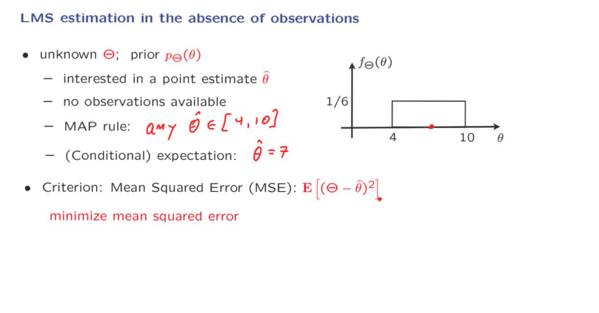

现在需要判断采用那一种规则来得出估计值。我们所使用的方法是引入一个性能的权衡标准。我们从我们的估计器中希望得到什么？我们将关注的特定标准是均方误差。如果您提出某个估计，那么您会看一下您的估计与您尝试估计的真实值有多远，取其平方，并对其进行平均。这导致我们制定了一个公式，我们将尝试找到一个估计值 θ hat，使其最小化这个均方误差，考虑了所有可能的估计值。

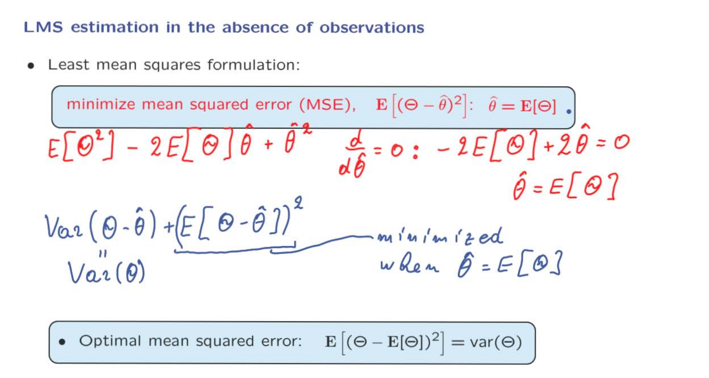

$\displaystyle \hat{\theta}$，视作是一个常数。
红色是利用微积分来推导，将其展开，求导，令导数为0。
蓝色部分是使用方差的简化计算的形式再移动项构成图中的表达式。

根据我们的推导我们会发现这个公式其实是方差。

### LMS Estimation of One Random Variable Based on Another

我们再次有一个随机变量 Theta，其已知的先验分布。我们对点估计感兴趣。然而，这一次不同的是，我们现在有一个观测值。而且我们还有一个模型，将该观测视为在真实参数值给定的条件下的条件分布。

我们观测到了一个随机变量的值。这个值是小 x。基于这个值，我们现在想得出一个未知随机变量 Theta 的点估计。我们如何进行呢？

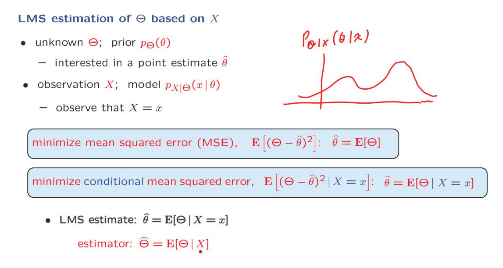

使用Bayes根据先验分布和测量值得出后验分布。

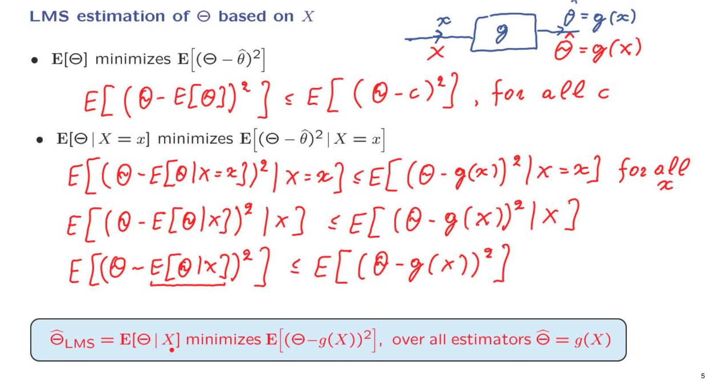

如果我们想更抽象地思考它，我们设计了一个基于随机变量大写字母 X 的估计器，并计算了我们尝试估计的随机变量，即 Theta，在 X 的基础上的期望值。

让我们现在继续进行一些观察。请记住，Theta 的期望值最小化了这个量。我们可以更明确地将其写成以下不等式形式：如果我们将期望值作为估计值，那么得到的均方误差将小于或等于我们在任何其他估计值 c 的位置使用时得到的均方误差。
这是对所有 c 都成立的关系。c是任何的常数。

现在，让我们将这个不等式转化为我们更感兴趣的情境，其中我们有一个可用的观测值。
一次，条件期望值最小化了均方误差。让我们明确写出这意味着什么，以类似于我们之前写下的形式。
这意味着 Theta 的期望值减去估计值，即条件期望值，的平方，在我们所处的这个条件宇宙中小于或等于我们在替代估计值 g 的位置使用时得到的均方误差。
因此，无论我们可能使用的 x 的值为何，错误至少与使用条件期望值时获得的均方误差一样大。

为什么我在这里使用这个符号 g？让我们回到更大的背景。我们得到了一个数值观测值 x。我们对它进行了一些处理，对应于某个函数 g。然后我们得出了一个估计值，这个估计值是我们观测到的小 x 的函数，因此它本身也是一个随机变量。
所以无论我们使用什么估计值，均方误差都不会比我们使用条件期望值时获得的均方误差小。

首先将式子抽象化，之后的式子化简对两边使用迭代法则。

总之，Theta 的条件期望，视为一个随机变量、一个估计值，即我们所谓的 Theta 的最小均方估计器，具有这样的特性，即它最小化了所有可能的替代估计值的均方误差。所以如果您想使用某个其他函数 g 来设计这个盒子，您得到的均方误差将不会比使用条件期望值得到的均方误差更小。

### LMS Performance Evaluation

LMS非常出色，因为它有一个非常简单的答案。如果你关心的是保持均方误差小，那么得出估计的方法就是报告条件期望，一旦你获得了一些数据值。或者更抽象地说，如果你事先不知道要获得什么数据，你可以将其视为一个随机变量。
由于这个估计器非常重要，值得写下这个估计器的性能是什么。所以假设你已经获得了一个特定的测量值，一个特定的观测值，那么在那个条件宇宙内，你已经获得了那个值，所得到的均方误差就是这个量。它是你试图估计的变量与你的估计值之间的误差的平方的均值，所有的计算都在这个条件宇宙内进行。

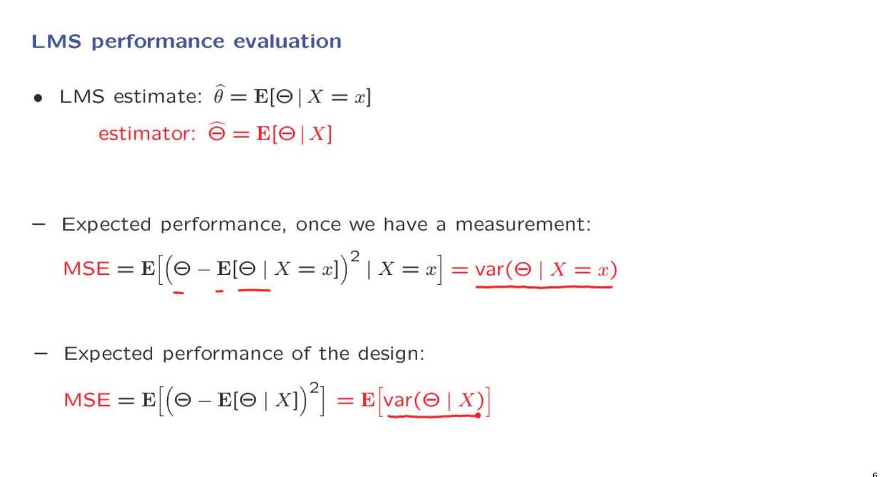

当我们获取到了测量值时，就使用条件期望来计算MSE。
如果此时还没有测量值，那么就使用随机变量的条件期望来计算MSE，相当于进一步抽象化。

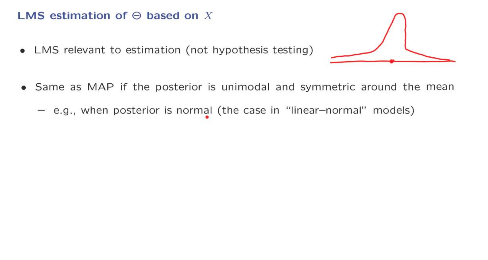

接下来，让我继续就最小均方估计提出一些更多的评论。首先，现在应该非常清楚的一点是，最小均方估计只与估计问题相关。这是因为在假设检验问题中，我们通常关心的是错误的概率，而不是均方误差。

第二个重要的评论是，在某些情况下，最小均方估计和最大后验估计（MAP）会重合。什么情况下会发生这种情况？如果 Theta 的后验分布恰好有一个单峰值，并且也在某一点周围对称，以至于峰值也在那个特定点出现，那么显然峰值就在这里。但是条件期望值也是同一个点，因为它是对称中心。所以在这些情况下，这两种类型的估计或估计器是一致的。

### Example: The LMS Estimate

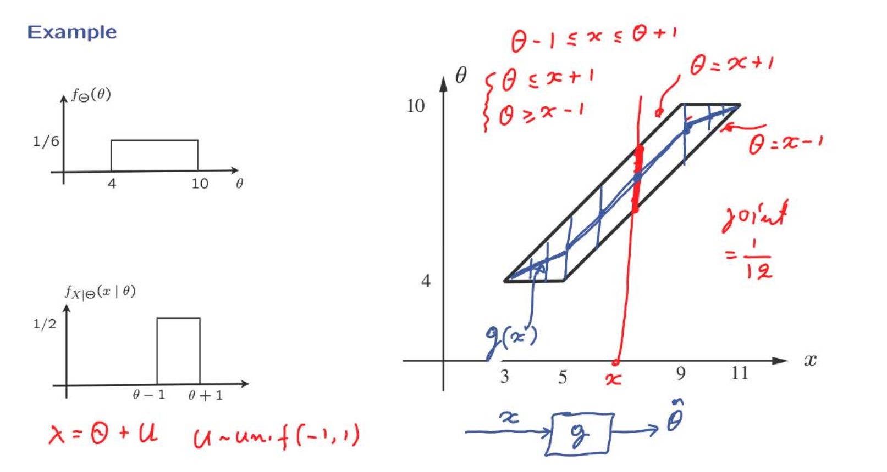

图中的平行四边形的两条边分别代表着$\displaystyle x + 1 \quad x -1$
现在已经有利先验分布和观测值的条件分布，为了找到后验分，先去找到联合分布。

因为两个分布都是均匀分布，且都是独立的，所以只需要将重合部分概率相乘即可得到联合概率。

图中任意取一点$\displaystyle x$，过这个点做一条垂线，与四边形重合的部分就是此时的$\displaystyle \theta$在确定一个观测值的前提下，可以取到的所有值。因为$\displaystyle \theta$自身就是均匀分布，利用条件LMS，我们能够取得的估计值的MSE最小值就是此时$\displaystyle \theta$的均值。所以就是这条垂线重合部分的重点。依次类推，其他都是一样的。
注意在四边形的两个顶点处的连线的斜率发生了改变。最后对于我们的估计值分布在一个关于$\displaystyle X$的随机变量上，他是一个关于g的分段函数。

### Example Continued: LMS Performance Evaluation

我们现在继续我们的例子，转向性能评估问题。

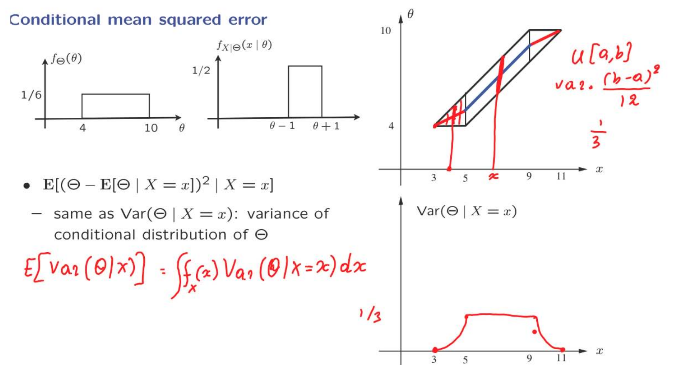

利用LMS，在确定观察值的条件概率下，抽象我们的估值，如图中平行四边形中间的连线部分。
使用MSE来衡量estimator的性能。实际上就是计算方差。
没给定一个特定的x值，对应的$\displaystyle \theta$的分布就是图上的竖直红线。这是一个均匀分布，因此可以得到计算方差的表达式，图上已经标注。
$\displaystyle x \in [5,9]$，对应$\displaystyle \theta + 1 \quad \theta - 1 $是$\displaystyle \theta$的边界值，所以b-a的值是固定的。因此在这个范围的方差的值是固定的，为$\displaystyle \frac{1}{3}$。而在$\displaystyle [3,5] \quad [9,11]$，这两个范围中斜率与之前的是不相同的。可以看到此时$\displaystyle \theta - 1$的值此时是固定的，而$\displaystyle \theta + 1$的值此时在递减，根据方差的表达式，他的变化是一二次函数的形式。
因此按照论述的变化关系，可以得出方差与$\displaystyle x$的变化关系，构建出如图所示的图像。

根据这个图像可以看出一些情况。当$\displaystyle x=3$和11是，此时方差显示为0，如果我们选择这两个值为观测值，那么我们会得到一个准确的估计值。如果选择其他的观测值，那么就有可能存在不确定的情况。

如果我们现在对整体均方误差感兴趣，那么我们必须计算这个条件方差的平均值，其中平均值是在所有X值上进行的条件方差的积分。但是，当然，每个X的可能性都必须根据相应的概率，或在这种情况下，X的概率密度函数来加权。X的概率密度函数是什么？这不是给我们的，但是可以根据我们已经完成的工作轻松确定。我们知道Theta和X的联合分布，每当我们知道联合分布，我们也可以找到边际分布。

### LMS Estimation with Multiple Observations or Unknowns

到目前为止，我们对最小均方（LMS）估计的讨论都是基于只有一个未知随机变量和一个观测的情况。我们关心的是对这个单一未知随机变量的点估计。

那如果我们有多个观测或参数怎么办呢？

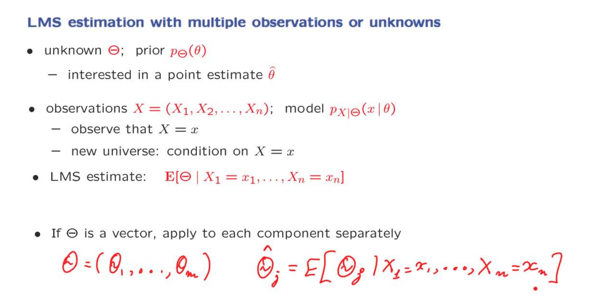

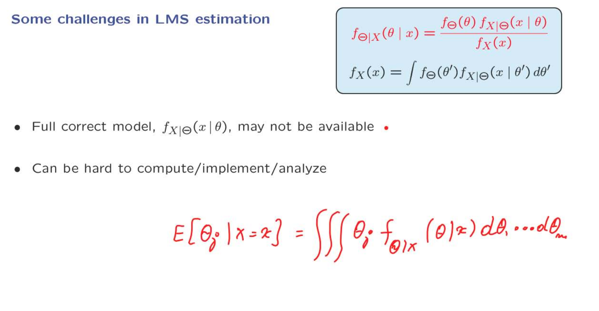

尽管LMS估计有如此简单和通用的解决方案，事情并不总是那么容易。首先，许多应用中，我们不一定拥有良好的模型，或者对我们的观测模型不太有信心。如果X和Theta是多维的，这样的模型可能很难构建。

给定X，Theta关于X的条件期望可能是观测的复杂非线性函数。这意味着可能很难进行分析，但更重要的是，即使在获得数据之后，计算它可能会非常困难。
让我们理解一下为什么会出现这种情况。假设Theta是一个多维参数。那么，为了计算Bayes公式中涉及到的分母，当你对theta进行积分时，你实际上必须进行多维积分，这可能非常具有挑战性，有时几乎是不可能的。
即使你手头上有这个分母项，仍然为了计算条件期望，你将不得不再次计算theta j对向量theta的后验分布的积分。但这个积分同样应该是在所有参数上进行的，所以在一般情况下它将是一个多维积分，这是另一个困难的来源。

这就是为什么我们将考虑最小均方估计的另一种替代方法的原因，它在计算上要简单得多，并且在我们需要掌握的模型方面要求不那么高。

### Properties of the LMS Estimation Error

在这一部分，我们将讨论最小均方估计中估计误差的一些理论性质。
回想一下，我们的最小均方估计是未知随机变量在给定我们的观测情况下的条件期望。
让我们定义误差，即估计值与我们试图估计的随机变量之间的差异。

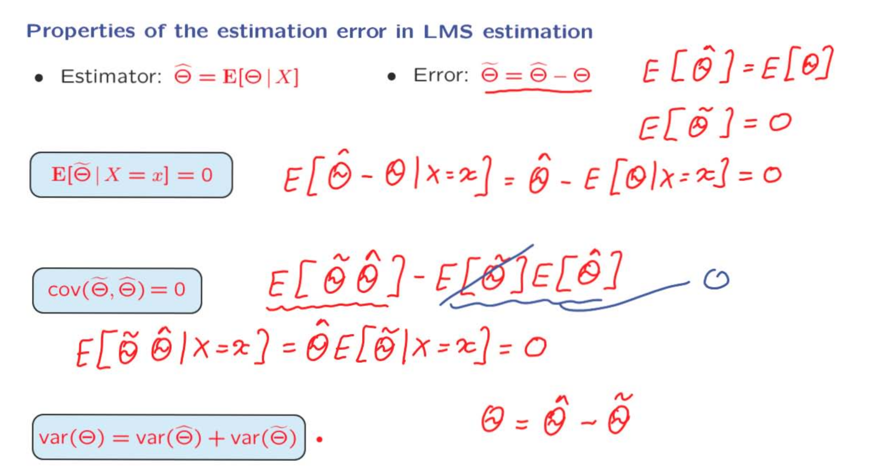

使用迭代期望，可以计算$\displaystyle E[\hat{\theta}] = E[\theta]$。
对于误差，通过对其定义式移项$\displaystyle E[\tilde{\theta}]=E[\hat{\theta} - \theta] = E[\hat{\theta}] - E[\theta] = 0$。估计误差的条件期望也将等于0。

现在，让我们转向一个稍微复杂的问题。估计误差和估计之间的协方差是多少？

在给定x的情况下，估计值是确定的，

