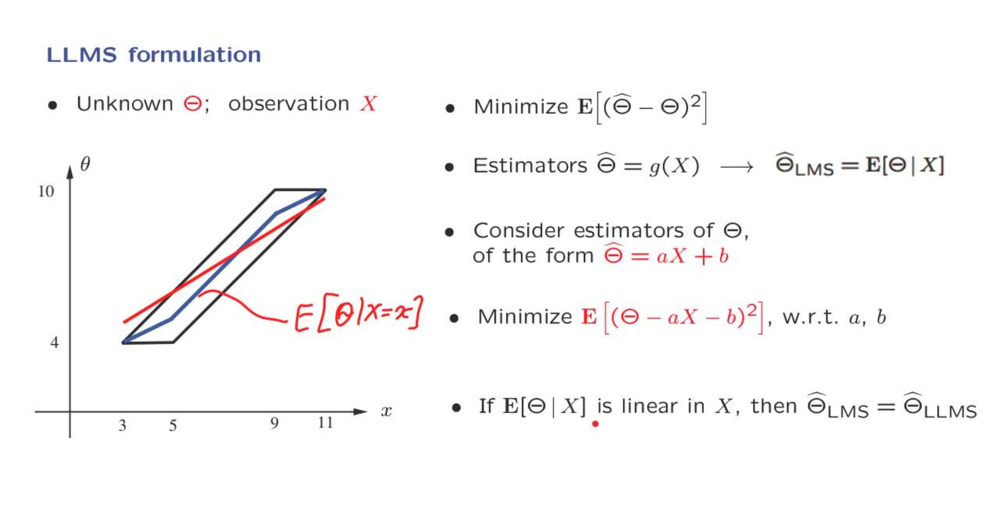
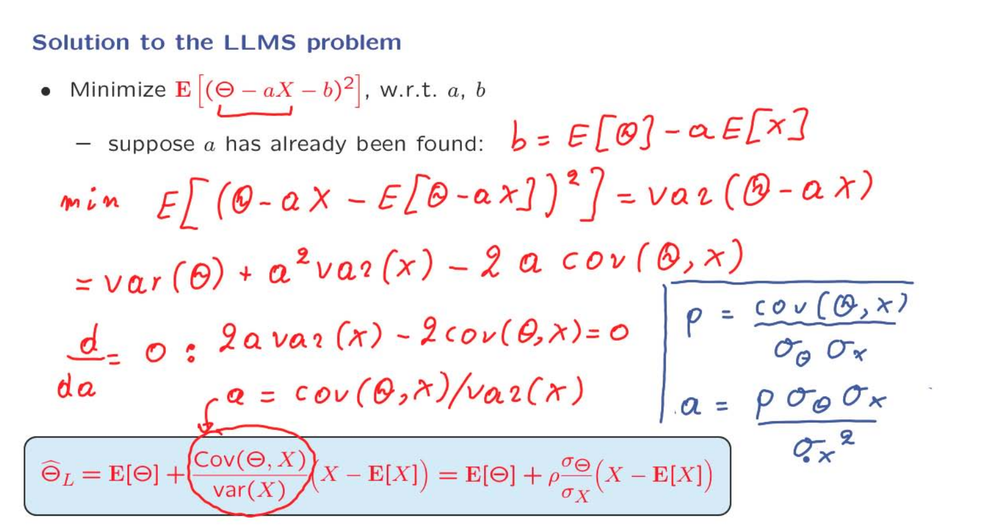
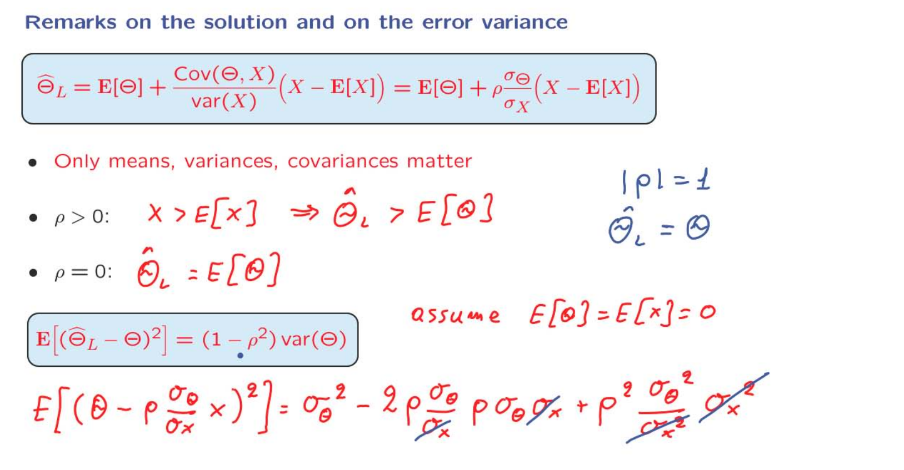
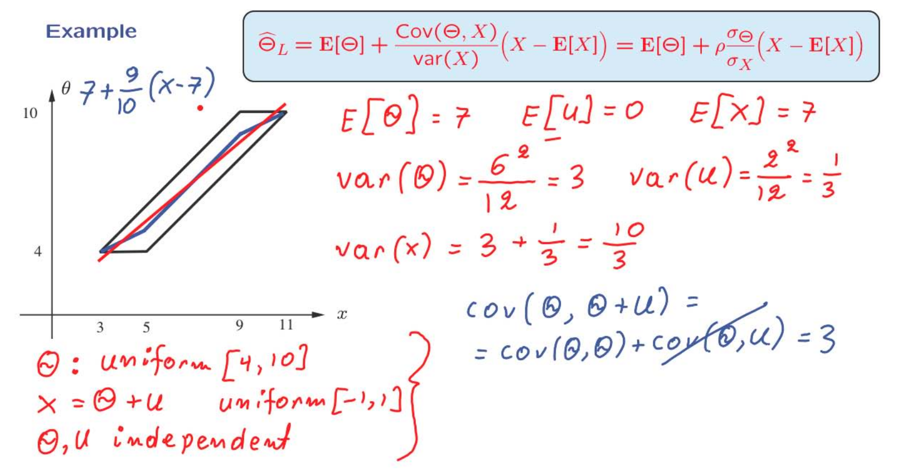
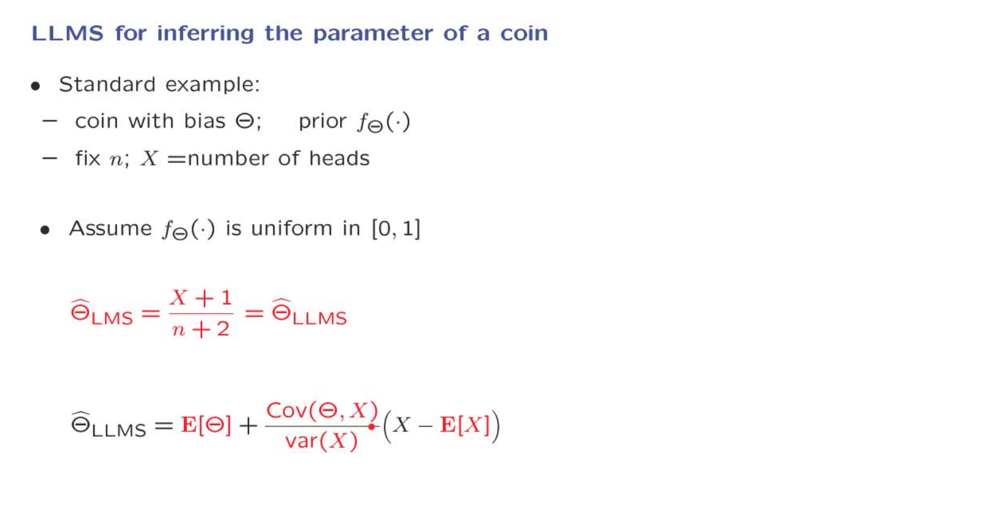
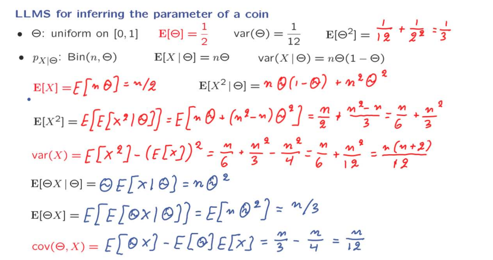
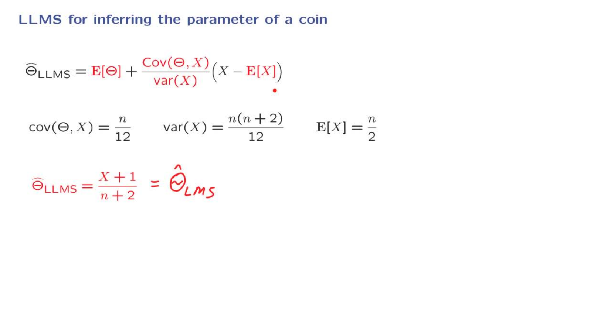
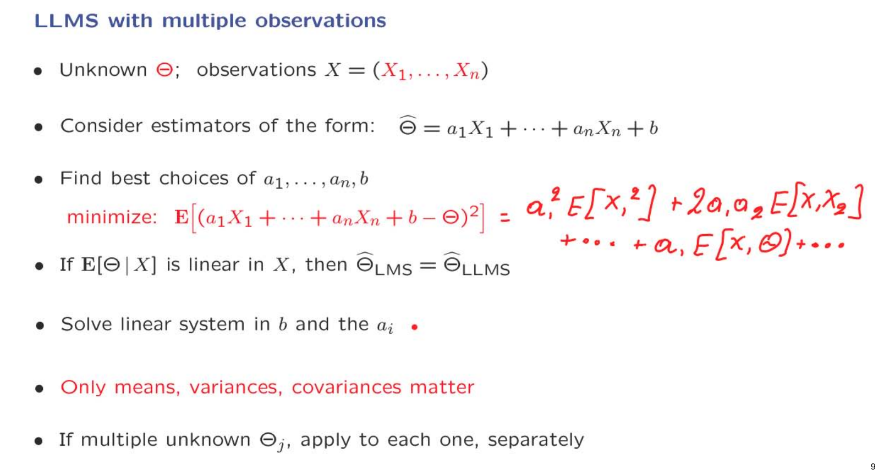
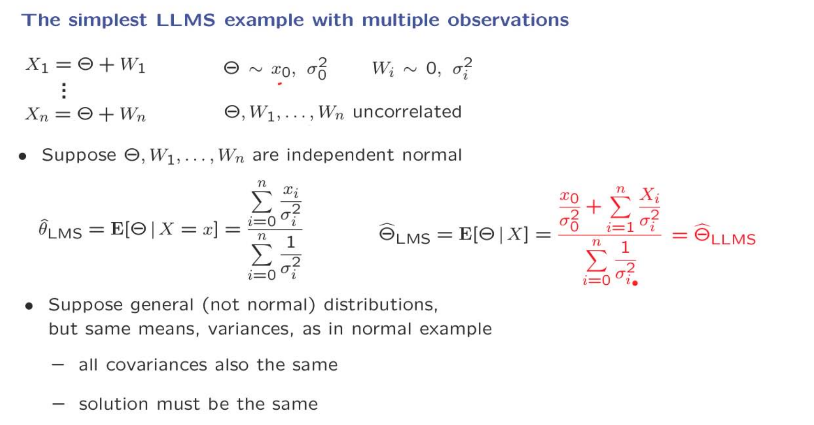
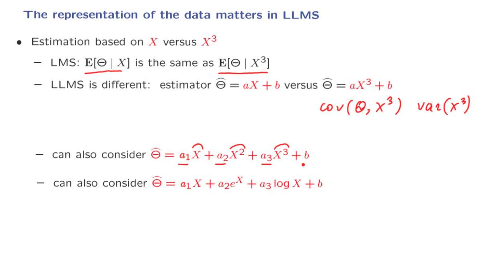

# Unit 7: Bayesian inference

## Lecture 17: Linear Least Mean Squares (LLMS) Estimation

### Overview 

### LLMS formulation

我们已经得到了结论，根据MSE的标准最好的estimatitor是LMS。但是在现实中，LMS的计算并不是都是很简单。
如上一节中的例子，适用LMS最后得到的是图中蓝色的线，但是他并不是线性的。我们希望有红色的线能够成为一个estimator。毕竟在现实中我们并没有那么多的时间去计算一个十分复杂的LMS。
如果现在将一个estimator表示成一个有$\displaystyle aX + b$的线性函数，就能够很好的解决我们的痛点。当然我们自然是希望这个线性的函数仍然能够具有最小均方误差。
与一开始我们想要确定一个最好的estimator相比，即一个函数g。我们此时需要考虑的是一个线性函数。在数学上比起确定一个任意的函数要简单许多。

### Solution to the LLMS Problem

       

关于LLMS的推导：

首先，推导一个简单的情况，假设我们的估计值是一个与观察值无关的常量
$$\begin{aligned}
&MSE: E[( \Theta - \hat{\theta})^2] = var(\Theta - \hat{\theta}) + { E[(\Theta - \hat{\theta})] }^2 = var(\Theta) + { E[(\Theta - \hat{\theta})] }^2 \\
\\
&MIN \ MSE: E[(\Theta - \hat{\theta})] = 0 \to \hat{\theta} = E[\Theta]
\end{aligned}
$$
所以，此时我们认为当$\displaystyle \hat{\theta}= E[(\Theta - \hat{\theta})]$时,MSE能够取得最小值，他就是$\theta$的方差。

当我们引入观察值X时，一切的步骤都是一样的，只不过是限制在X的条件之中:
$\displaystyle \hat{\theta}=E[(\Theta - \hat{\theta}) \mid X]$

现在回到这个例子之中，当假设a已知，求b使得MSE最小：

我们首先将$\Theta - aX$ 视作是一个整体的 "$\Theta$",b视作是一个估计值，那么我们就能够套用上面的结论，b = E["$\Theta$"]。

将b的值带回到表达式里，使用方差和的性质：

* $var(X_1 + X_2)= var(X_1) + var(X_2) + cov(X_1,X_2)$

* cov(aX + b, Y) = a * cov(X, Y)

MSE = $\displaystyle var(\theta) + var(-aX) + 2cov(\Theta, -aX) =\sigma_\Theta ^2 + a^2\sigma_X ^2 -2a cov(\Theta, X)$

现在MSE的表达式是一个关于a二次函数($\sigma_\Theta, \sigma_X, cov(\Theta, X)$ 都是常量)，使用二次函数的性质,或者求导得到这个表达式取最小值时，$\displaystyle \frac{cov(\Theta, X)}{var(X)} = \frac{\rho \sigma_\Theta}{\sigma_X} = a$

### Remarks on the LLMS Solution and on the Error Variance

现在对这个公式进行一些解释。

首先观察这个公式，我们只需要有关$\displaystyle \Theta \quad X$的期望，方差，和协方差。这使得我们不需要知道具体的$\displaystyle \Theta \quad X$的分布详细，简化了模型的构建。
这个式子的第一部分是期望，第二部分是有关他的错误系数，是对结果的修正。
$\displaystyle \rho$这个系数则用来控制修正因素的影响。
当$\displaystyle \rho > 0$，如果此时的观察值$\displaystyle X$非常大，那么就会造成估计的期望的结果会比初始分布的期望大，他的影响也会更大。如果$\displaystyle \rho < 0$就会有类似的效果，只不过此时是负向。
当$\displaystyle \rho = 0$是，我们的估计值就是这个随机变量$\displaystyle \Theta$的初始分布的期望，我们的估计并没有做任何的修正，也就是$\displaystyle \Theta \quad X$不相关。

现在计算关于我们的估计的MSE。为了方便假设$\displaystyle \theta \quad X$的均值都为0。
将表达式带入然后展开。

### LLMS Example

$\displaystyle \Theta \quad U$是独立的，所以两者的方差等于0。
最后得到的线性的表达式在图中是红色的线，他可以视作是真实蓝色线的最佳近似。

### LLMS for Inferring the Parameter of a Coin

这是一个较为复杂的例子，用来验证上节中公式的正确性。将一枚硬币的bias设为要计算的随机变量$\displaystyle \Theta$，他是0到1之间的均匀分布。

以上的计算简略总结使用的方法：

1. binomial 计算方差，期望的性质。
2. 将整体分解为多个独立的随机变量之和
3. iterational expection
4. 协方差简化公式计算
5. 方差的简化公式计算

最后将结果做一个验证

### LLMS with Multiple Observations

这一节主要是介绍当我们有多个观察值时，应该如何运用之前介绍单一的观察值经验。同样的，也介绍了当有多个需要估计的随机变量时，又应该如何去计算。

这同样是一个优化的问题，我们在确立了使用MSE的情况下，要确定线性方程的中的系数使得其最小。

### The Simplest LLMS Example with Multiple Observations

在线性估计问题中，我们不需要做一个独立的假设。
对于我们的目的来说，只要假设它们是不相关的就足够了。

通常来说，如果有多个观察值，一般不会有一个十分简洁的公式。
这里使用了一个技巧，我们假设$\displaystyle \Theta \quad W_i$是正态分布，并且彼此相互独立。转化成图中的形式有什么好处呢？
我们会发现踏实一个关于X的线性表达式，他的对象是$\displaystyle \Theta$的条件期望。正如我们之前讨论过的 - 如果条件期望值 Theta 在观察中是线性的，那么这也是最佳可能的线性估计值。

之所以可以这么做是因为在线性估计最优问题中我们并不关心具体的分布，而只需要找到我们所关心的几个量就可以。

为什么如果条件期望值 Theta 在观察中是线性的，那么这也是最佳可能的线性估计值？

>摘录自chatGpT
当条件期望值 Theta 在观察中是线性的时候，这实际上意味着我们正在寻找一个线性函数，将观察值（通常用 X 表示）映射到 Theta 的估计值。这个估计器的形式通常如下：
Θ^=a1X1+a2X2+…+anXn+bΘ^=a1​X1​+a2​X2​+…+an​Xn​+b
其中，X1,X2,…,XnX1​,X2​,…,Xn​ 是观察值，a1,a2,…,an,ba1​,a2​,…,an​,b 是待定的系数。
现在，为什么这个线性估计器是最佳的呢？这涉及到均方误差（Mean Squared Error）的概念，通常用来衡量估计值与真实值之间的差距。均方误差是估计误差的平方的期望。
当我们说这个估计器是"最佳"的时候，我们实际上是在说它是在所有线性估计器中最小化均方误差的一个。也就是说，没有其他线性函数可以更好地估计 Theta，因为这个估计器的均方误差是最小的。
这个结论的数学证明涉及到统计理论中的一些复杂数学工具，特别是通过最小化均方误差的标准线性估计器，但这个结论通常是由最小均方误差原理（Principle of Minimum Mean Square Error）来支持的。
总之，如果条件期望值 Theta 在观察中是线性的，那么由于最小均方误差原理，这个线性估计器将是最佳的，因为它最小化了估计误差的均方误差。

### The Representation of the Data Matters in LLMS

这里介绍了其他的线性LMS的结构。如果从$\displaystyle X$的视角来看，我们并不会，认为它是线性的。我们考虑的是我们需要求得的优化的系数，系数的线性性质很重要。

选择那种模型来源于你对问题的了解。随之而来的，是在求解时的难度会增加。

不同的选择将给我们带来不同的性能。但现在，这有点偏离了数学方法的主题，更接近于你需要在任何特定问题领域行使的艺术。