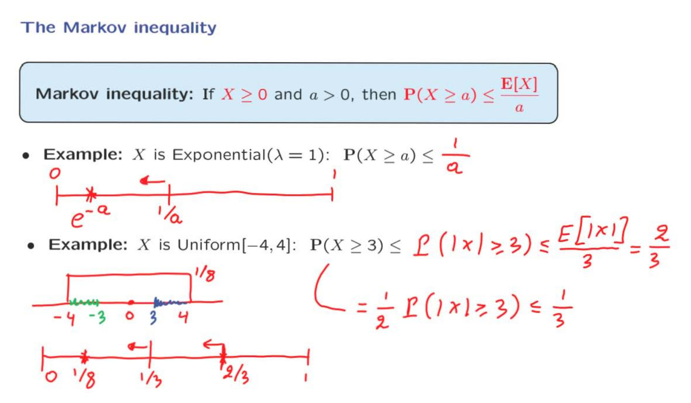
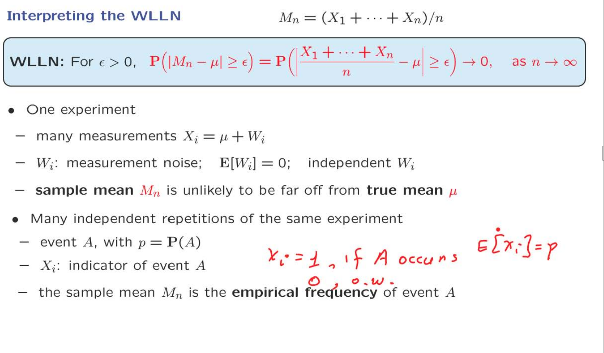

# Unit 8 Limit Theorems

## Lecture 18: Inequalities, Convergence, and the Weak Law of Large Numbers

### The Markov Inequality

为了阐述 Weak law of Large Numbers，需要先介绍三个基本的不等式。这是第一个：Markov 不等式
这个表达式的传达的思想是：一个随机变量如果大于0，当我们知道它的期望值很小时，那么这个随机变量等于一个很大值的可能性就会很小。
Markov针对的是：当我们对一个随机变量分布并不是十分清楚时，我们可以通过它的期望来了解一些事情。

我们首先使用微积分的观点，假设随机变量$\displaystyle X$是大于0的，a也是大于0的。那么整体的期望一定是大于或者等于a以后部分的期望。而a以后的期望又必然是大于对一个常数项a的积分。

现在第二次推导Markov inequality，这次我们以一种更为抽象，但基本的思想依然是类似的方式进行推导。

新创建一个随机变量Y，它的取值如图所示。由此可以得出结论，Y的期望一定是小于或者等于X的期望。
因为两者的概率分布的情况是相同的，但是随机变量的值Y是一定要小于X的。计算Y的期望可以得出它是等于右边的式子，移项就可以得到markov表达式。

现在现在让我们通过一些简单的例子来进行更多讨论。
对于指数分布，大于或等于a的概率，通CMF计算可以得到$\displaystyle e^{-a}$，根据Markov表达式可以得到一个边界$\displaystyle \frac{1}{a}$。如果当这两个值非常接近，那么$\displaystyle \frac{1}{a}$就能作为一个估计。但事实上，他们两个隔的非常远，$\displaystyle \frac{1}{e^a}$的分母作为一个指数，要比a大得多。
因此，人们希望获得比马尔可夫不等式更好的界限，这是我们将在下一步中考虑切比雪夫不等式的一个动机。

接着下一个例子，因为X分布的区间既有正值又有负值。所以不能直接使用Markov不等式。
利用绝对值建立一个不等的关系，将计算的对象转化成对绝对值对象。符合大于3的区间，对于绝对值对象来说，包含了原始区间中的绿色部分和蓝色部分，为$\displaystyle \frac{2}{3}$。由此可以计算出原始对象大于3的概率，为绝对值的一般。
最后我们得到的markov inequality 是小于$\displaystyle \frac{1}{3}$，而实际这个概率是$\displaystyle \frac{1}{8}$

### The Chebyshev Inequality

从数学角度来看，切比雪夫不等式只是马尔可夫不等式的一个简单应用。然而，它传达了一种略有不同的信息。
切比雪夫不等式说的是，如果方差很小，那么随机变量不太可能偏离均值太远。如果方差很小，我们有很少的随机性，因此 X 不能太远离均值。

与均值距离大于或等于某个数的概率最多是方差除以该数的平方。因此，如果方差很小，偏离均值很远的概率也会很小。如果数 c 很大，以至于我们讨论的是距离均值很远的情况，那么这种事件发生的概率将至少以 1/c² 的速率下降。

现在开始推导这个不等式。这里假设C 是大于0的。因为C小于0，绝对值是一定比c大的。
利用markov构建不等式。

这里举出的例子a是大于1。通过计算之前的例子，利用chebyshev得到的概率是约等于是$\displaystyle \frac{1}{a^2}$。

### The Weak Law of Large Numbers

在这一部分中，我们推导并讨论了大数定律的弱形式。这是一个相当简单的结果，但在概率论中起着重要的中心作用。

假设我们做一项实验多次，得到了多个观察值，将每一个观察值视作是独立的随机变量。他们彼此的分布都是相同的，所以假设他们的mean 和 variance。

这里引入一个新的概念：sample mean。他是随机变量和的均值函数，所以他也是一个随机变量。而随机变量的期望，则是一个常数。样本均值是尝试估计真实均值的最简单和最自然的方式，而大数定律会为这个概念提供一些支持。
期望值，是一种理论上的均值，因为我们无法得到这个实验所有可能的结果。sample mean则是实际上我们观察到的值，计算出来的。

在计算出sample mean的方差和期望值之后，利用chebyshev找到sample mean与均值之间的距离大于$\displaystyle \epsilon$概率的最大值。
但我们固定$\displaystyle \epsilon$，而将n趋近无穷大时，会发现概率会逐渐趋近于0。
这告诉我们，随着样本的数量越来越多，sample 原理均值的概率会逐渐降低。
这正是大数定律的弱形式告诉我们的。如果我们固定任何特定的 epsilon，即正常数，样本均值偏离真实均值超过 epsilon 的概率将变得越来越小，当 n 趋向无穷大时趋于零。

#### Interpreting the WLLN

WLLN 阐述了这样一个事实：当样本量足够大时，通过样本量得出的sample mean与真实的分布的期望的差距会变得非常小，$\displaystyle \epsilon$就是衡量这之间的误差的系数。

图中考虑了一个特殊的例子，多次重复实验，如果时间A发生，那么indicator variable就会是1，反之就会是0。那么此种情况下，可以得到$\displaystyle X_i$的期望就是p，这是真实的期望。
在这个特定的例子中，样本均值只计算事件A在我们进行的n次实验中发生的次数，因此它是事件A的发生频率。大数定律告诉我们，经验频率将接近事件的概率。从这个意义上说，它强化或证明了将概率解释为频率的观点。

> 文中提到的"empirical frequency"（经验频率）指的是样本均值（sample mean），而不是事件A的发生频率。这里可能存在一些混淆，我来澄清一下。
在文中，作者讨论的是一个长时间的实验，该实验重复进行，并且每次实验都会生成一个样本均值，样本均值是从相同概率分布中独立抽取的随机变量的平均值。这个样本均值是通过观察实验结果计算得出的，因此被称为“经验”的。
与此同时，文中还提到了事件A的概率和事件A的发生频率。事件A的概率是一个理论概念，它表示从概率模型中计算出的事件A发生的概率，这是一个固定的数值。而事件A的发生频率是在实际实验中观察到的事件A发生的相对次数，它是一个经验值，是通过多次实验得出的。
大数定律告诉我们，当进行足够多次实验时，样本均值（经验频率）会越来越接近真实均值，而真实均值指的是从相同概率分布中随机抽取的样本的平均值，而不是事件A的理论概率。事件A的理论概率是一个固定的概率，不会因为重复实验而改变。

### The pollster's problem

这是对WLLN的实际的应用。

现在举行一场全名选举，在这场选举中人口中的一部分会投票Yes。使用系数p来表示投yes的人口占比。为了预测结果，在正式投票之前，为了做出预测，会提前收集样本。每一个样本中的投票情况使用随机变量$\displaystyle X_i$表示，他是indicator variable。因此可以直接利用Bourly计算出$\displaystyle X_i$的期望为p，方差为p(1-p)。

您想要找出，预测或估计p实际上是多少。但是由于shi ji qing

sample mean 实际上就是样本中投票会投yes的人数站样本总人数的比例。Boss固定我们估计的误差应该定于0.01。将这个数字设定为$\displaystyle \epsilon$，利用WLLN计算，会得到当前的sample mean 与实际的mean之间的差值大于0.01的概率会是$\displaystyle \frac{1}{4}$。在计算过程之中我们并不能确定p的具体值，因为它来源于未来。但是根据表达式的形式我们可以确定它等于最大值时的情况，p=1/2。

现在我们认为超过0.01的概率最高可能会是1/4。我们认为这个太高了，希望可以将其降到
5%，在WLLN的表达式中，在不改变当前模型的情况下，唯一可以变化的量是n，也就是样本量。由此可以建立表达式计算出想要误差的概率小于5%，那么样本量就必须要大于50,000。

请注意，所需的规格有两个参数。一个是您想要的准确度，另一个是您希望实现准确度的置信度。现在50000是一个相当大的数字。如果您注意民意调查的结果，通常以报纸上的形式呈现，它们通常告诉您有3个百分点的准确度，而不是1个百分点。这可以帮助减小样本大小。然后还有另一个效应。我们这里的计算基于切比雪夫不等式，但切比雪夫不等式并不是那么准确。事实证明，如果我们使用更精确的估计来估计这个概率，我们将发现实际上对于我们的目的来说，需要的n要小得多。

### Convergence in Probability

#### Understanding convergence "in probability"

这里解释一下一般的收敛和在概率上的收敛的区别。
一般序列的收敛，指的是当$\displaystyle n$，超过某一个值时，就一定保证两$\displaystyle a_n$的取值一定是在我们设定的区间中：$\displaystyle a_n - \epsilon , a_n + \epsilon$。
但是概率上的收敛，则是指当$\displaystyle n$超过某一个定值时，$\displaystyle a_n$取值在上述区间之外的概率为0。在图中可以看到我们研究的随机变量的分布，由蓝色逐渐过渡到两绿色。

#### Some properties

### Convergence in probability examples

#### first example about convergence

这是第一个例子，Y是一个离散随机变量，从他的PMS可以看出，除了在$\displaystyle n^2$这个点，其他的可能取值的概率都是0。
我们首先猜测，这个随机变量会收敛到0，因为当n趋近无穷，他的概率趋近于1。

图中使用chebyshev的表达式，来验证取值为0不在我们所要求的区间之中的概率是否可以趋近是0，答案是肯定的。
也可以从另一个角度来看，直接从他的分布上观察。

从以上的计算之中可以得出即使收敛于一个常数，也不表明他的期望也收敛于这个常数。这主要是因为收敛关注分布的大部分的情况（类比介绍收敛的定义时的图像，分布最终由蓝色部分转化成绿色部分）。
而期望既关注值本身又关注概率（通过期望的定义式子），所以哪怕是概率很小的值，但如果它本身非常大，那么对最终计算期望的结果也回有非常大的结果。

#### second example for convergence

这是第二个例子，随机变量X是0到1之间的均匀分布。根据这个条件，我们可以判断X一定是不收敛的，因为他的分布并不会发生改变。
现在取n个随机变量X，在他们之中取最小值作为随机变量Y的输出。那么y可能会收敛吗？
处理概率收敛的问题，第一步是对随机变量做一个合理的猜测。
Y的变化情况，取决与X，当依次从最大的X的值向下取时，Y一直在减小，知道为0。在这个过程之中，如果后加入的X的值比之前要大，那么Y就不会减小，由此我们得到了$\displaystyle Y_{n+1} \leq Y_n$。所以当n无穷大时，我们收集到足够的X来形成Y，一旦Y达到了最小值，再之后无论X的值是什么都不会再Y，所以我们猜测Y应该是收敛于0。

第二步就是验证我们之前的猜想。
根据定义，$\displaystyle \epsilon$的取值有两种情况，第一种是大于1，因为这个超过了X的最大值，所以这种情况是一定满足的。
第二种就是小于1。我们将$\displaystyle \epsilon$作为是X的一个可能的取值，并且我们将其设为能取的最小值，那么如果有n个X，由此构成的取值范围就是$\displaystyle \epsilon$到1之间，概率则是这部分的面积。
现在每一个X彼此是独立的，所以每一个存在的X比$\displaystyle \epsilon$大的概率都是这部分的面积，可以拆分为所有项的单独的乘积。
最后计算出结果$\displaystyle (1 - \epsilon)^n$，因为$\displaystyle (1 - \epsilon) < 1$，所以最终的结果会趋近0，他的极限是0。一旦我们作出了这个猜测，然后我们写出与猜测的极限值相距epsilon的概率的表达式。然后我们要么精确计算这个概率，就像在这个例子中一样。或者我们试图以某种方式对它进行界定，并仍然显示它趋于0。

### Related Topics

这一节只是给你一个更大的图景

### Recitation Problems

定义X为随机选择的一名加拿大人的身高，其中每名加拿大人的选择概率相等，用E[X]表示为h。Bo有兴趣估计h。因为他确信没有一名加拿大人的身高超过3米，Bo决定使用1.5米作为X的标准差的保守（较大）值。为了估计h，Bo对他随机选择的n名加拿大人的身高取平均值；他用H表示这个数量。

(a) 以h和Bo对X的标准差的1.5米上限为基础，确定H的期望值和标准差。

(b) 帮助Bo计算一个n的最小值（n > 0），以使Bo的估计量H的标准差小于0.01米。

(c) Bo想要99%确定他的估计值在加拿大人的真实平均身高上下浮动不超过5厘米。使用切比雪夫不等式，计算使Bo满意的n的最小值。

(d) 如果我们同意没有一名加拿大人的身高超过3米，为什么使用1.5米作为随机选择的任何一名加拿大人的身高X的标准差的上限是正确的？

这道题目值得注意的是第四题，它使用了一个特殊情况，即在[0,b]之间各以0.5的概率取两个端点值，这样可以保证方差的值是最大的，因为端点处的值是距离期望值最远的，方差衡量的就是各个可能的取值距离的距离的程度。

>方差用来衡量X的取值在其均值附近的分散程度。方差越大，X的取值就越分散，越不集中在均值附近。