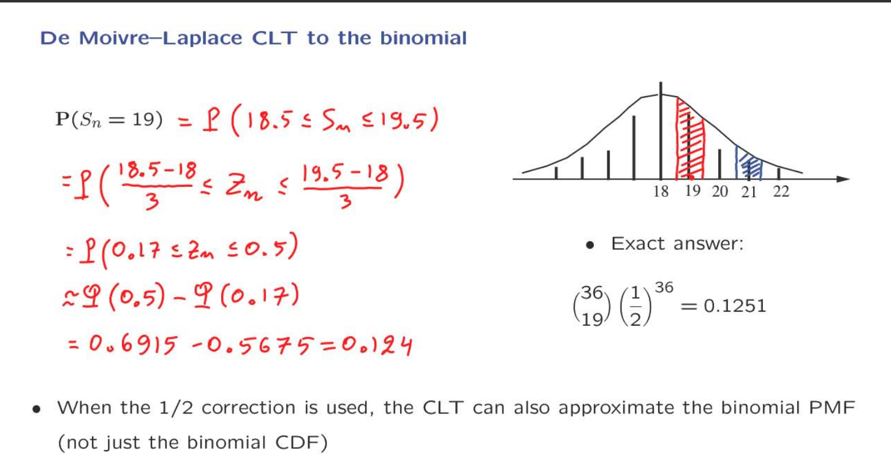

# Unit 8 Limit Theorems

## Lecture 19: The Central Limit Theorem (CLT)

### The Central Limit Theorem

我们定义一系列 indenpendent identical V.B. $\displaystyle X_i$。他的方差和期望设定为订制，为了方便叙述，假想出了他的分布如图中所示。

现在计算n个随机变量的和，构建出新的随机变量为$\displaystyle S$。他的输出与独立X的数量n有关，期望不会变化，但是方差变为了与n有关的表达式。所以可以看到S的分布与X的分布起了变化。n变大，导致了方差变大，所以分布中距离期望的距离也在不断的变大。

使用sample mean，会发现期望现在不发生改变，意味着他的分布不会左右移动。方差在n趋近无穷的时候，结果会趋近与0。这两者表明在这种情况下，$\displaystyle m_n$的分布会逐渐收敛与一个常数。

现在改进以上的变化，让他除以$\displaystyle \sqrt{n}$，相比于上面的构造，这样做的好处是保证了方差不会变化，但是期望会变化。

现在对$\displaystyle S_n$做出如图中$\displaystyle Z_n$的构成。我们会发现$\displaystyle Z_n$的期望恒定会是0，方差恒定会是1。与其他之前所有的构造相比，$\displaystyle Z_n$的分布会是不变的现在将$\displaystyle Z_n$与一个标准正态分布进行比较，最后可以得出$\displaystyle Z_n$的CDF的极限与Z的CDF相等。这也是中心极限定理告诉我们的。Note：Z的CDF的值可以直接根据table得出。

中心极限定理是一个非常重要的结果。因此，我们将花一些时间来讨论如何解释它，它的含义是什么，如何使用它，然后我们将通过一些示例来看如何实际应用它。

### Discussion of the CLT

中心极限定理非常了不起。这是一个非常深刻的结果，高度复杂而不直观。没有明显的理由表明为什么这个随机变量，即随机变量总和的标准化版本，应该具有近似正态分布。此外，它非常有用，其中一个关键原因是它是通用的。X的分布是什么并不重要。无论X的分布如何，在极限情况下，这个标准化的总和版本都将表现得像一个正态随机变量。如果我们希望将其应用于特定示例或模型，我们只需要知道X的分布的相应均值和方差，正如我们将在多个示例中看到的那样。当我们应用它时，它被证明非常准确，而且是一个非常好的计算快捷方式。即使我们详细了解X的分布，要计算Sn的分布，我们也必须将X的分布与自身卷积n次，这可能会在计算上变得很麻烦。而当我们使用中心极限定理时，涉及的计算非常简单，正如即将出现的示例所示。

最后，在哲学层面上，中心极限定理证明了为什么涉及正态随机变量的模型非常自然。无论何时有一个受多个噪声源影响的现象或对象，如果这些噪声源是独立的，那么这些噪声源的整体效应将很好地由正态随机变量模拟，即使每个噪声源的分布与正态分布非常不同。这就是为什么在许多不同领域的许多应用中，正态随机变量提供了非常有用和准确的模型的原因

由于中心极限定理如此有用和重要，值得确保我们完全理解它说了什么，并对其数学内容发表一些评论

中心的说法如下。我们取独立同分布随机变量的总和，形成总和的标准化版本，其中我们减去总和的均值并除以总和的标准差，然后它告诉我们这个随机变量Zn的CDF会收敛到正态CDF。所以我们得到的是一个关于CDF的陈述。它还没有告诉我们关于PDF或PMF的具体信息。所以，例如，如果Sn和X都是连续随机变量，那么Zn也是连续的，您可能想知道Zn的PDF是否会收敛到正态PDF。事实证明，有一些这种类型的结果，它们断言这个随机变量的PDF，甚至是PMF，会以某种意义上的正态PDF收敛。但是这些结果通常需要一些更多的数学假设才能成立。然而，当我们展示各种示例的图片时，我们将通过显示PDF和PMF的图片来做到这一点，因为这些更容易可视化。

既然这个结果如此普遍和重要，那么我们是否可以将它推广到其他情境呢？我们的两个主要假设是随机变量是独立的和同分布的。我们是否可以取消这些假设？有适用于Xi不是同分布的情况的中心极限定理版本。只需要对Xi的均值和方差做出一定的假设。一些条件是必需的。此外，独立性的假设不需要是字面上真实的。有一些中心极限定理的版本适用于具有弱依赖性的情况。也就是说，附近的Xi可能是相关的，但是如果您将X5与X的100万号进行比较，那么这两个随机变量基本上是独立的。在这些情况下，我们仍然可以应用适当版本的中心极限定理。最后，您可能会好奇如何证明这个结果。证明它的一种方法，也是很久以前为伯努利随机变量X的特殊情况建立的方法，在这种情况下S是二项式的。它是通过对二项式公式进行代数操作而建立的。但这是一个不能推广的推导。对于一般情况，可以使用所谓的变换方法来获得证明，这是我们不涵盖的一个主题，但它的步骤如下。我们考虑这个随机变量Zn的函数，其中s是某个参数，并且我们显示这个期望会收敛到相应的期望，如果在Zn的地方用标准正态Z来代替。而且对于所有s来说，或者至少对于一些足够丰富的s来说，这是真的。然后，我们引用一些深层次的数学结果，告诉您，如果这种类型的期望会收敛到那种期望，那么Zn的CDF也必须会收敛到Z的CDF。但这是一个涉及多个步骤并引用了数学的其他领域的一些深刻结果的证明。最后，还有实际方面。它到底是说了什么，我们如何使用它？由于Zn的CDF可以由标准正态的CDF近似

### Illustration of the CLT

现在让我们看一些数值示例，以了解中心极限定理在实践中的工作原理。

让我们看一个具有均匀分布的离散随机变量，在此范围从1到8。如果我们将两个独立的随机变量相加，从这个PMF中抽取，我们将得到一个随机变量，其PMF是这个PMF与自身的卷积。我们甚至可以手工进行这个计算，得到一个三角形的PMF。所以这就是我们在n等于2的情况下得到的结果。现在我们可以继续这样做。如果我们添加四个这些离散均匀变量，当然假设它们是独立的，那么我们得到的PMF开始具有接近正态形状的形状。如果您取多达32个，那么32个离散均匀变量的总和的PMF几乎与绘制正态PDF时获得的形状完全相同。所以即使n只有32，我们本质上也已经收敛了。事实上，这种收敛是如此好，以至于在实践中，人们经常使用这个想法来生成正态随机变量的随机样本。您该怎么做？您从离散均匀分布中随机抽取32个样本，然后将它们相加。然后您得到的是本质上是正态随机变量的一个样本。现在在这个示例中，事情对我们来说进展顺利，因为我们从中开始的分布非常对称，没有任何奇怪的特征。情况并不总是如此有利。

让我们考虑从截断几何分布开始。如果我们添加八个独立的随机变量，并且从这个分布中抽取，那么我们得到的是这种形式的PMF，它看起来并不像正态形状。原因是有明显的不对称性。所以让我们添加更多独立的X。如果我们添加16个，我们开始得到一些接近正态的东西。但是不对称性仍然可见。如果我们添加32个，我们仍然可以看到一些不对称性。换句话说，这里的尾巴并不完全像那里的尾巴。所以在这种情况下，真正让它难以收敛的是原始分布的不对称性。在我们能够获得非常准确的近似之前，需要更大的n值。

### CLT Examples

我们将通过一系列的示例来说明我们通常使用基于中心极限定理的正态近似来回答的不同类型的问题。

我们的设置如下：我们有一个容器，容器接收包裹。每个包裹都有一个随机重量，它是从参数为1/2的指数分布中抽取的独立随机变量。我们用100个包裹装满容器。我们想计算100个包裹的总重量超过210的概率。例如，210可能是容器的容量。
遵从中心极限定理，构造出$\displaystyle Z_n$，因为是通过$\displaystyle S_n$构造出来的$\displaystyle Z_n$，所以在两边都会进行变换。我们得到的是$\displaystyle Z_n \geq 0.5$。因为标准正态分布的概率可以通过查表来确定，所以需要变换成小于的形式。

基本的流程还是如上一个例子一样，只不过这次是需要求的未知量从概率改成了去容量a。

我们再次确定包裹的数量为100，但我们给定了一些概率容忍度。我们允许包裹的总重量超过容器的容量。但我们不希望这种情况发生得太频繁，我们只希望有5%的概率超过容量。如果我们想要这种规格，我们应该如何选择容器的容量？

我们的最后一个示例将有所不同。事情是这样的。我们开始装载容器，容器的容量是210。一旦我们装载包裹，看到重量超过了210，我们就停下来。让N表示已经装载的包裹数量，这个数量是随机的。如果你不幸的是，碰巧得到了很多重包裹，那么你会更早停下来。我们想要大致计算已经装载的包裹数量大于100的概率。
现在，这个问题感觉有点不同。原因是N不是独立随机变量的和，所以我们没有一个可以应用于N的中心极限定理的版本。我们能做什么呢？
做法是首先将N分解成多个随机变量的和，将其变成$\displaystyle S_n \leq 210$，之后同上面的做法一样，构造$\displaystyle Z_n$，在使用中心极限定理，在表中查找标准正态相应的CDF的值。

### Normal Approximation to the Binomial

我们现在想用中心极限定理来估计二项式分布的CDF的概率。
在这个例子中，一共是36个实验的随机变量，想要用CLT来估计使用成功的次数是21的概率。图中列出了使用CLT表示的CDF。我们最后估计的答案可以使用二项式分布的公式来计算的概率作为标准。
可以看到我们通过计算$\displaystyle S_n < 21$的概率得到的估计的概率是0.8413，我们从十分位开始与正确答案就有差距，所以我们想要做得更好。

因为二项式分布是离散的所以小于或者等于21等效于小于22。
所以可以通过使用CLT来等效计算$\displaystyle S_n < 22$的概率。
我们计算得到的结果是0.9082。很明显这个结果并没有变好。

我们在做估计的时候，是将要计算的CDF等效为标准正态分布，第一个估计我们我们是低于实际。第二个是高于实际。所以要计算真实的情况，要考虑这两者的中间值。以均值为中心的二项分布的PMF，这是一个离散随机变量，但当我们使用中心极限定理时，我们假装二项分布是正态分布，但保持相同的均值和方差。

这里我们将21到22之间的面积取一半加上21之前的面积做我们估计的CDF的计算区域被认为是合理的。因为$\displaystyle S_n$是离散的，在处理21和22是等效的，可是在使用CLT的时候我么利用正态分布，所以这两种处理就发生了变化。
使用21.5来计算最后得到的结果会是0.8790。此时我们的误差就已经是非常小了，我们得到了更好的结果。

现在，我们注意到这个值与这个问题的精确答案非常接近。它作为一个近似是非常好的，远远好于我们使用这个选择或那个选择获得的。由于这个近似是如此好，我们甚至可以考虑使用它来近似二项PMF的单个概率。

当我们想要估计19的概率时，仿照上面的做法，取两端的中间值18.5和19.5，变换$\displaystyle S_n$为$\displaystyle Z_n$，两端也是采取相同的变换。
最终得到的结果是0.124，与真实值0.1251相同。
这个例子说明了一个更一般的事实，即计算二项PMF的单个条目的这种方法提供了非常精确的答案。
实际上，有关这方面的定理和理论结果告诉我们，在某些情况下，当n趋于无穷大时，这种逼近方式会给我们提供非常精确的逼近。

### Polling Revisited

### Recitation Problems

(c) 这里需要使用一个技巧，我们需要计算$\displaystyle N \geq 220$，等效于计算$\displaystyle \sum_{i=1}^{219}X_i \leq 1000$，因为如果在第219天还没有生产够1000个产品，那么就一定需要更多的时间。

