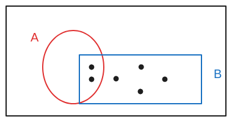
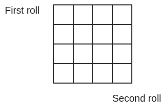
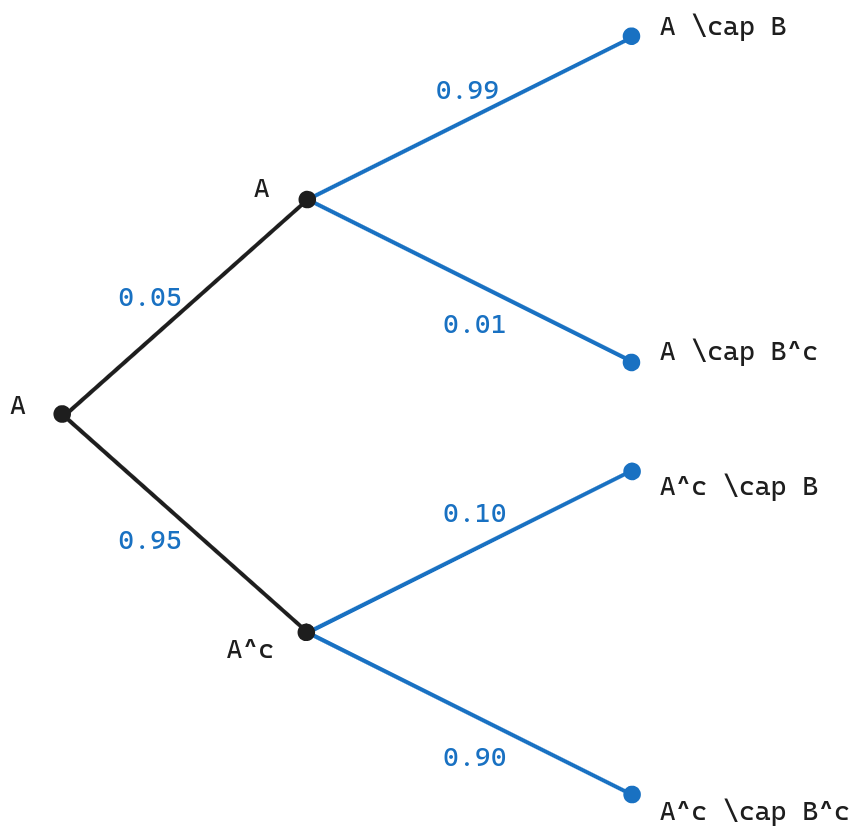
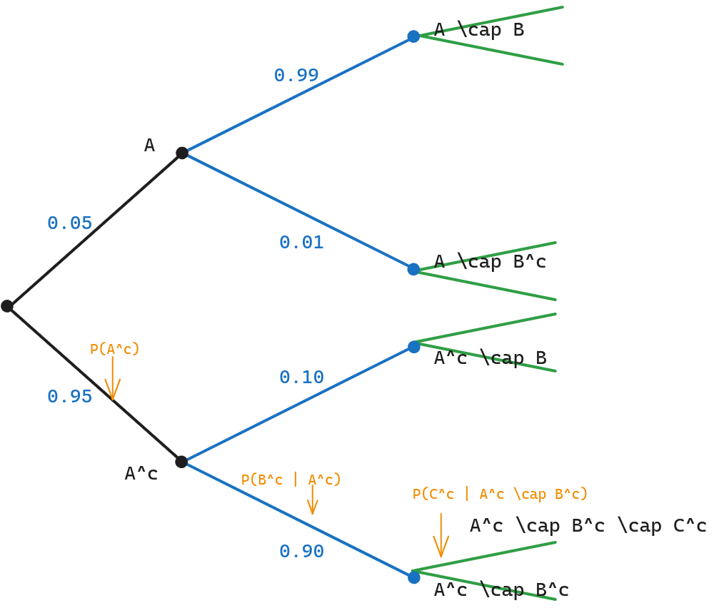
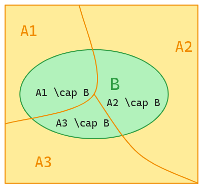
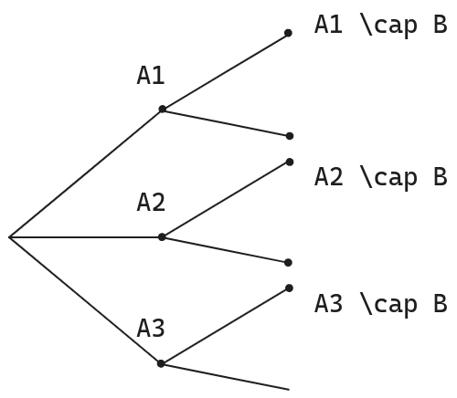

# Unit 2: Conditioning and independence

## Lec. 2: Conditioning and Bayes' rule

### 1.Overfiew

如果让你在某一个城镇的户籍系统中随机选择一个人，他的年龄是18岁以下的概率大概是25%（来自于统计学 18岁以下人口/所有人口）。但如果此时告诉你这个人已经结婚了，那么25%的概率就不再有意义，应为我们知道一部分情况就不可能（你知道13以下不可能结婚）。
当获取新的知识和信息时，概率会发生改变。
主线：

* conditional probability
* tools:
      1. Mutipilication rule
      2. Total probability theorm
      3. Bayes' rule(-> inference)
**其中Bayes's rule是将其他的补充信息添加到概率模型的系统性方法。**

### 2. Conditional probabilities

条件概率是与修订后的模型相关的概率，该模型考虑了关于概率实验结果的一些附加信息。

如图所示，使用discreate uniform law $p(A) = \frac{5}{12}, p(B) = \frac{6}{12}$

假设发生的事件是B，则此时B以外的事件就不可能在发生，概率为0,在图中省略之后

此时$\displaystyle P(A|B)= \frac{2}{6}, P(B|B) = 1 $
其中P(A|B)指的是在事件B发生时，事件A发生的概率。因为已经确定发生的是事件B，所以在B发生时，事件B发生的概率是1。

#### condition probability defination

$\displaystyle P(A|B) = \frac{P(A \cap B)}{P(B)}$
在事件B发生的前提下，事件A的概率。

* 因为不能除以0,所以P(B) > 0
* 这是一个定义式，所以不存在是否正确的说法，他就是如此定义的。

a problem

If $\varOmega$  is finite and we have a discrete uniform probability law, and if $ B \neq \empty $ , then the conditional probability law on $\varOmega$ , given that B  occurred, $ \varOmega$ is also discrete uniform.

解：
假设在B已经发生的情况下，处B以外的概率都是0,那么对于样本空间 $\omega$ 来说,每个可能的取值在样本空间中不可能具有相同的概（率对于B内部的取值是等概率的，但是对于B外部的就不可能是等概率：0）,所以在确定B已经发生的情况下，样本 \omega $ 的每一个取值不可能是等概率。

* "Discrete uniform probability law"指的是离散均匀概率分布。

#### A die roll example

一个四面的色子，每一面都是等可能性质

* 事件B是：min(x,y) = 2; M是max(x,y)

如图所示 1

P(M = 1 | B) = 0:蓝色是 M=1,红色是B

如图所示 2

对于$\displaystyle P(M=3|B) =  \frac{2}{5}$
事件B发生在5块正方形，与M=3共同占据2块。
也可以使用条件概率的定义,分别计算P(M=3 $\cap$ B) 和 P(B)。

#### Conditional probabilities obey the same axioms

所有从原始概率中推导出来的公式和理论对条件概率依然有效。
条件概率同样满足概率的定理。

* P(A | B) $\geq$ 0 非负
* P( $\varOmega$ | B) = 1
* P(N | B) = 1
* $ if \displaystyle A \cap C = \empty, then P(A \cup C | B) = P(A | B) + P(C | B)$
  * $$ \frac{P((A \cup C)\cap B)}{P(B)} = \frac{P(A \cap B) \cup P(C \cap B)}{P(B)} = P(A|B) + P(A | C)
  $$
  * 此时使用了一些 set theoretic identity(Demorgan's law 也是这其中的等式)

#### A radar example: models based on conditional probabilities and three basic tools

在之前的例子中（在人口统计系统随机选择18岁以下），可以看到条件概率将新的已经发生的信息添加到新的模型之中，从而修正得到一个更加符合事实的模型。
此处将指出另一种用途也可以通过借助条件概率构建多阶段的实验模型。

假设，一个雷达系统监视空中某一区域的飞机经过的情况。

* 事件A：领域之中出现了飞机
* 事件B：雷达检测到飞机的出现
如图所示构建模型

* P(A) = 0.05, $P(A^c) = 0.95$
* P(A | B) = 0.99

1. $P(A \cap B)$
   * P(B | A) = 0.99
   * P(B | A) = $\frac{P(A \cap B)}{P(A)}$
   * P(A \cap B) = P(A) $*$ P(B | A) = 0.99* 0.05

2. P(B)
   * P(B)表示雷达看见飞行物的事件有两种可能性：1. 空中出现🛩️，雷达检测到。2. 空中没有监测到飞行物，雷达错误地检测到存在🛩️。
   * $\displaystyle A \cap B \quad and \quad A^c \cap B, 两者之和就是B的概率。（无法使用定义式变形推导出P(B),因为我们并不知道P(A | B)的概率。$
   * $0.05 *0.99 + 0.95* 0.10$

3. P(A | B)
   * 直接使用定义式推导：$\displaystyle \frac{P(A \cap B)}{P(B)}$

##### The multiplication rule

增加事件C,由图可以看出

$\displaystyle P(A^c \cap B^c \cap c^c) = P(A^c) *P(B^c | A^c)* P(C^c | A^c \cap B^c)$
中间的分支表示的就是条件概率

---

使用公式推导如下:
$$
P(A | B) = \frac{P(A \cap B)}{P(B)}, P(B|A) = \frac{P(A\cap B)}{P(A)} ;\\
P(A \cap B) = P(B) *P(A | B) = P(A)* P(B | A); \\
\begin{aligned}
P(A^c \cap B^C \cap C^c)
&= P((A^c \cap B^c) \cap P(C^c)) \\
&=P(C^c | (A^c \cap B^c)) *P(A^c \cap B^c) \\
&=P(C^c | (A^c \cap B^c))* P(B^c | A^c) * P(A^c)
\end{aligned}
$$

---

进一步推广
$\displaystyle P(A_1 \cap A_2 \cap A_3 \cap A_4 \cdots A_n) = P(A_1) * P(A_2 | A_1) * P(A_3 | A_1 \cap A_2) * P(A_4 | A_1 \cap A_2 \cap A_3)* \cdots P(A_n | A_1 \cap A_2 \cdots A_{n-1})$
简写为:
$\displaystyle P(A_1) * \prod_{i=2}^{n}P(A_i | A_1 \cap A_2\cap \cdots A_{n-1})$

Exercise:
* $\mathbf{P}(A\cap B\mid C)= \mathbf{P}(A\mid C)\, \mathbf{P}(B\mid A\cap C)$

* 先使用条件变量定义式，再使用multiplication rule将分子部分转化，最后会消掉分母。
* note: 条件变量的定义式分子上是所有发生事件的交集，当已知某一个事件已经发生时，除这个事件之外的事件都会被剔除模型之中，可以这么认为，此时我们改变了样本空间。

#### Total probability theorem

这个例子之中我们使用了*分而治之*的思想，我们将一个样本空间分成了三个部分：$A_1 \,A_2 \,A_3$。每一个部分都包含一部分的事件B。
正中做法将原本的大的样本空间分割的更小，从而简化了处理——因为我们现在可以在一个更小的空间（$A_1 \, A_2 \, A_3$）之中来探查概率。

现在，我们可以分别计算出$\mathbf{P}(A_1\cap B), \mathbf{P}(A_2\cap B), \mathbf{P}(A_3\cap B)$,再取三者之和，即可求B在整个样本空间发生的概率。

换另一种视角，可以以树的结构来展示,也可以说明事件B就是与B相关的树的叶子结点概率值和。

综上可以得出 $\displaystyle \mathbf{P}(B) = \mathbf{P}(A_1\cap B)+\mathbf{P}(A_2\cap B) + \mathbf{P}(A_3\cap B)$

当将分区改为无限可序列化的形式，使用Countable add axiom，可以推导出以下formula：
$\displaystyle \mathbf{P}(B) = \sum_{i=1}^{n} \mathbf{P}(A_i\cap B) = \sum_{i=1}^{n} \mathbf{P}(A_i)* \mathbf{P}(B\mid A_i)  $

* $\displaystyle \mathbf{P}(A) = 1$
* 此公式是$\displaystyle \mathbf{P}(B\mid A_i)$的加权平均值。
* weight是$\displaystyle \mathbf{P}(A_i)$

#### Bayes' rule

**整合新证据的具体方法(systematic approach for incorporating new evidence)**
在Total probability theorem的例子之中，将样本空间划分为了3个分区。

* 对于每一个分区，$\displaystyle \mathbf{P}(A_i)$设置为他的 init "beliefs"
* 在已经得知B发生后：$\displaystyle \mathbf{P}(B\mid A_i)已知$
* 在给定B已经发生后，来调整init beliefs。

调整init beliefs：
$$
\begin{aligned}
&\mathbf{P}(A_i\mid B) = \frac{\mathbf{P}(A_i\cap B)}{\mathbf{P}(B)} \\
&分子使用Mutiple \,Rule \rightarrow \mathbf{P}(B\mid A_i)*\mathbf{P}(A_i) \\
&分母使用Total\, Probibality\, Theorem \Rightarrow \mathbf{P}(A_1 \cap B) + \mathbf{P}(A_2 \cap B) + \cdots + \mathbf{P}(A_n \cap B)
\end{aligned}
$$

综上，修正beliefs：$\displaystyle \mathbf{P}(A_i\mid B) = \frac{\mathbf{P}(B\mid A_i)*\mathbf{P}(A_i)}{\sum_{j=1}^{\infin}{\mathbf{P}(B\mid A_j)*P(A_j)}}$，这也就是Bayes’s rule的计算方法。

Bayes'rule 能够根据已经知道的事件概率去推测另一个事件的概率$\displaystyle \mathbf{P}(A_i\mid B) \longleftrightarrow \mathbf{P}(B | A_i)$
