# classical statistical 

## Lecture 20: An Introduction to Classical Statistics

### Overview of the Classical Statistical Framework

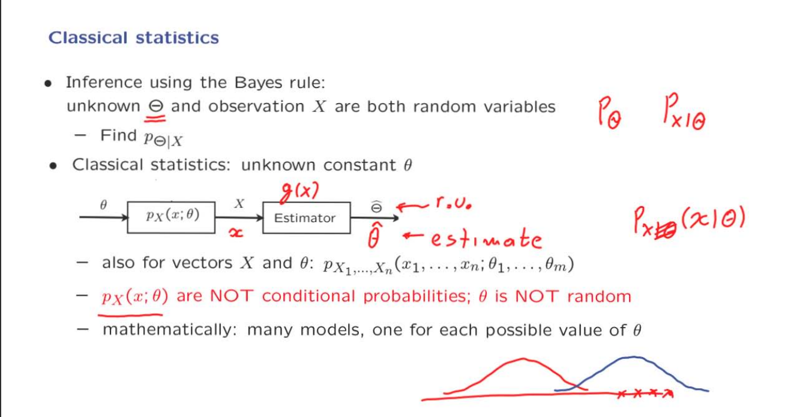

这一节对的主题是 classical statistical framework。他区别于Bayes framework。
Bayes 是将未知量设为随机变量，具有相应的分布。然后然和根据观察值和先验分布利用Bayes推测出后验分布。
但是CSF则是将未知量设置为一个常数，只是这个常数的值我们是不知道的。
例如我么观察到$\displaystyle X$的分布，在某一个常量$\displaystyle \theta$，正如图中所画出的两个分布（红色和蓝色），每一个常量$\displaystyle \theta$都影响了或者说就会存在一个$\displaystyle X$的分布。
$\displaystyle \theta$可能会受到某种因素的干扰，展现出不同的值，从而导致X的分布不同，但是我们最终还是可以通过找到X某一个特定的分布(出现的次数最多)来得到具体的$\displaystyle \theta$。这是通过计算X的期望得到的。
当我们实际得到多个x值，我们就能够得到有关X的信息，通过处理X，就能够得到$\displaystyle \hat{\Theta}$，他是估计$\displaystyle \theta$的估计器，同时他也是关于X的函数和随机变量。我们每输入一个具体的X的值，就能够得到在这个x中有关$\displaystyle \theta$的估计值。
这里提示一下，可能是出于简便，这里的每一个x值实际上就是$\displaystyle \theta$的一个取值。X是随机变量，$\displaystyle \theta$则是X的均值，同时也是我们想要的得到的未知量，他是X的期望。

### The Sample Mean and Some Terminology

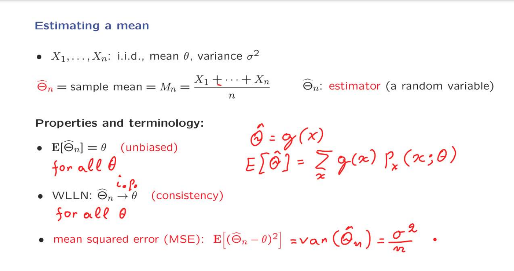

在本课程中，一边利用Classical Statistics制作$\displaystyle \theta$的估计器。
收集样本量，使用sample mean来制作$\displaystyle \hat{{\Theta_n}}$。

$\displaystyle \hat{\Theta_n}$本身是sample mean，所以根据WLLN，他会趋近于$\displaystyle \theta$

第三个使用随机变量的独立性产生的方差的线性性质得出结果。

### On the Mean Squared Error of an Estimator

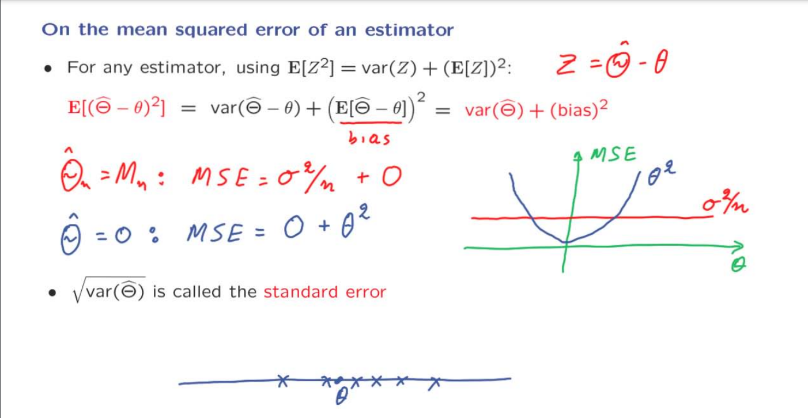

这一节讨论的是MSE。
这里给出的求stand error的公式是通过移象变换方差的简便运算的来的导出来的。
其中$\displaystyle E[\hat{\Theta} - \theta]^2$表示的是bias，它代表着，估计值和真实的未知量之间的差距。感觉是人为添加的修正元素。
因为我们是通过样本的数值来估计的，认为未知量是常数，因此当我们得到不同的数据时，就会有不相同的估计值。将方差项区根号，所得到的是被称作stand error(因为在classic static中，我们的估计器与真实的未知量是没有bias的)。他展现了所有可能的x取值的分布(X的期望就是我们的未知量的估计值，但是X的分布是未知的，而观察值是有限的，所以由此计算出的期望，也就是估计值通常是不准确的，也就出现了有关他的分布)。

### Confidence Intervals

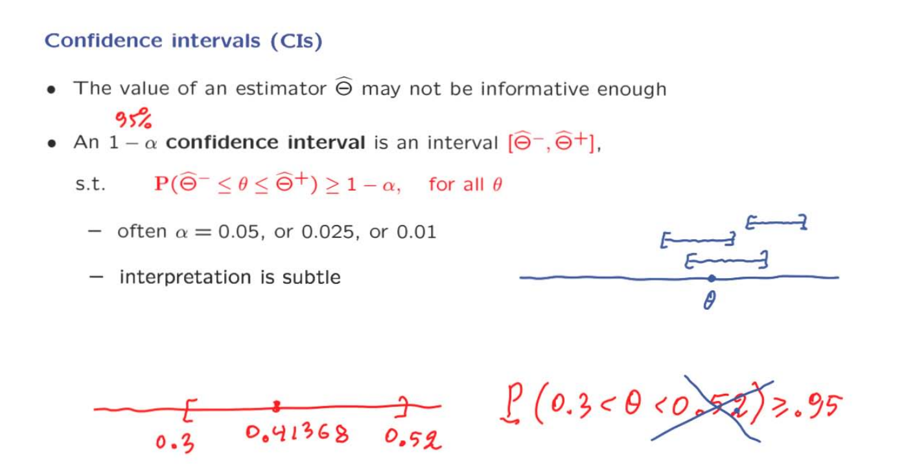

置信区间的概率是我们当前所定义的范围区间所捕捉到我们的未知量的概率。在图中所画出的边界值0.3和0.52和$\displaystyle \theta$(classic statistics)都是常量，他们没有随机因素。
可以这样想像，想要找出使用了超级影分身的鸣人，我们想要找到他的本体，被标记为$\displaystyle \theta$。使用须佐能乎的手臂抓他，每次在抓的一群鸣人当中，都有一定的概率能够抓到他的本体。这就是置信区间的概率的意义。
不要将其认为$\displaystyle \theta$的值有95%的概率大于0.3小于 0.52。$\displaystyle \theta$只有一个。

### CI for the estimation of the mean 

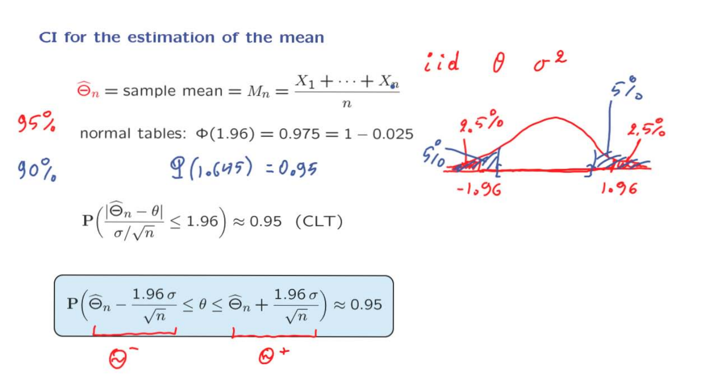

这一节就CI的使用给出了例子。
我们使用sample mean 做我们的估计器，使用CLT定理来构建出有关概率的不等式，移项，最终可以得到一个CI的表达式。在CI中有95%的概率得找到我们需要的未知量。
这个表达式里需要我们计算出stand error($\displaystyle \sigma$)。

### Confidence Intervals for the Mean, When the Variance is Unknown

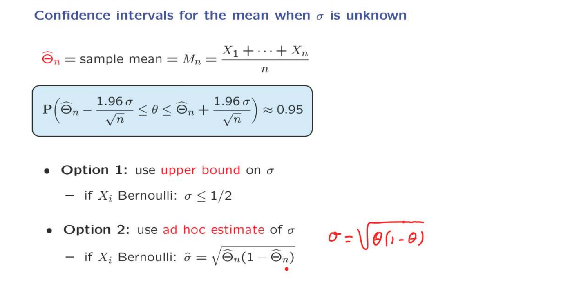

这里我们讨论当我们并不知道$\displaystyle \sigma$的具体的值时，需要做的处理。

第一种方法针对特定的结构，我们可以使用他的上界。
第二种方式是引入一个临时的对方差的估计值。

以上这两种方法都需要特殊的结构(Bernoulli)。

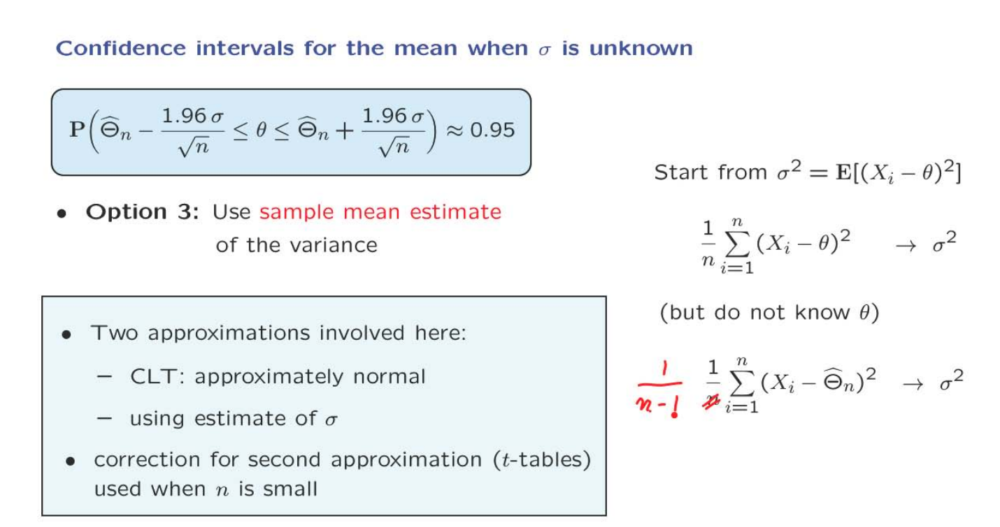

第三种方式是一个更为通用的方法，我们使用sample mean 和方差的定义来计算出一个方差的估计值。从表达式里可以看出来，这种方法需要我们知道X的期望。同样的这个值是我们想要得到的值，我们并不知道他的值应该是多少。但是可以使用我们的估计器得到的估计值。

这个方法涉及到了两个近似，一个是得到convience intervals本身利用了CLT的近似。另一个来源于我们对于$\displaystyle \sigma$的近似。

课中提及到了使用上面的方法，会导致convidence intervals区间整体偏大。当样本量比较少的时候，比如30个，使用t-distribution-table会比较进行校正，当样本数量较大时则不需要。

人们通常会看到一种替代方法来估计方差，其中1/n的因子被替换为1/(n-1)。使用这种替代形式，结果发现这是方差的无偏估计量。
这可能是使用这种替代形式的原因。另一方面，当n很大时，使用n或n-1几乎没有什么区别。这就结束了我们对置信区间的讨论。

### Other Natural Estimators

这一节扩展和沿用了上面的思想

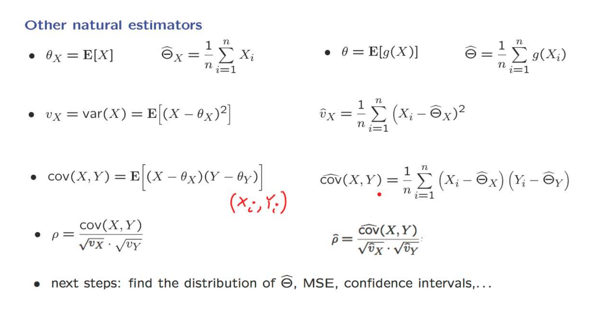

不仅可以在期望和方差上利用WLLN进行估计，协方差也是相同的。
当然这一切的前提是要求样本量要很大。

以下是不涉及的内容：

如果你想知道在这一点之后的进一步议程是什么，可能会是以下内容。
通常，统计学家可能希望尽可能多地了解估计器的概率分布。
例如，这里我们有一个协方差的估计。
这个估计将是一个随机变量，因为它是由随机数量确定的。
这个数量的概率分布是什么？
我们是否可以近似地描述它？
与这个估计器相关的均方误差是多少？
如果你想构建置信区间，你会如何做？
这些都是统计学家深入研究的主题，如果你想进一步了解这些主题，可以参加有关统计和推断的进一步课程。
但在这门课程中，我们将不再深入探讨

### Maximum Likelihood Estimation

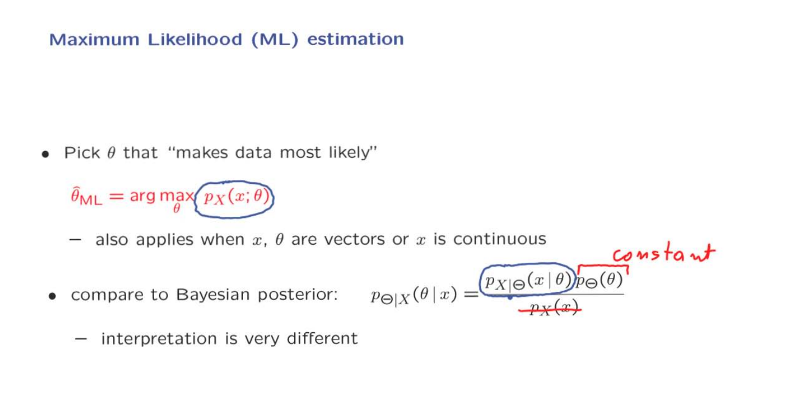

这里阐述Maximum Likelihood Estimation的思想。
通常如果我们能够将$\displaystyle \theta$视作是X的期望，那么直接利用sample mean进行估计就可以了。但实际很多时候我们没办法直接这么做，那么通常我们就会使用Maximum Likelihood 。
他的核心思想是：我们计算出一个 $\displaystyle \theta$，他要保证对于当前的样本(也就是某一个x或者一组x具体的值)是最有可能发生的。

于Bayes做对比，我们是设定了一个先验分布，通过观察值和他的分布找到$\displaystyle \theta$的后验分布，也就是通过样本修正后的$\displaystyle \theta$的分布。通常我们估计$\displaystyle \theta$的值，是找到这个分布中最大概率的$\displaystyle \theta$值。

ML有着很类似的想法，但是在具体的处理中，$\displaystyle \Theta$被视作是一个未知的常数，那么此时想要得到的最有可能的$\displaystyle \theta$(后验分布能够最大)，就要使Bayes中的先验分布能够的概率最大，根据表达式可以看出。

这两者虽说在形式上有所相似，但是在思想上确实是不相同。

在贝叶斯设置中，你在问的问题是，θ的最可能值是什么？
而在最大似然设置中，你在问的是，什么是使我的数据最可能的θ的值？

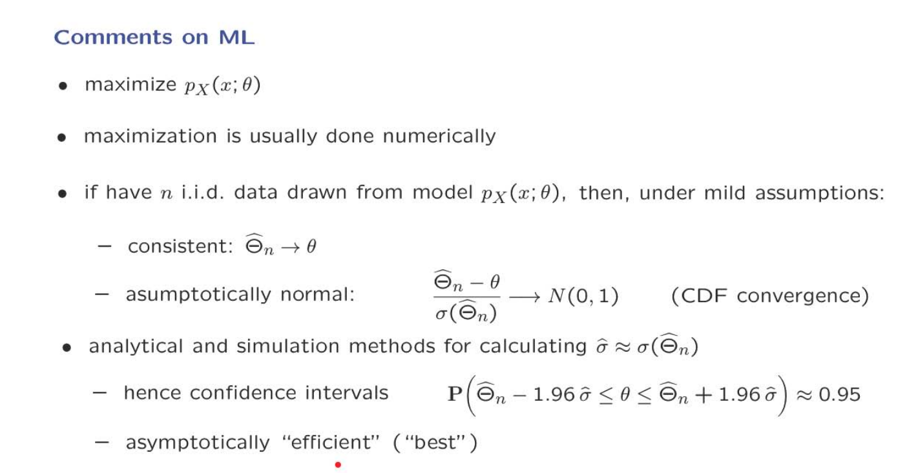

### Maximum Likelihood Estimation Examples

使用Maximum Likelihood 的流程：

1. 写出表示将$\displaystyle \theta$作为参数的概率表达式.
2. 最大化这个表达式.

以下举出具体的例子来展示如何得到Maximum Likelihood。

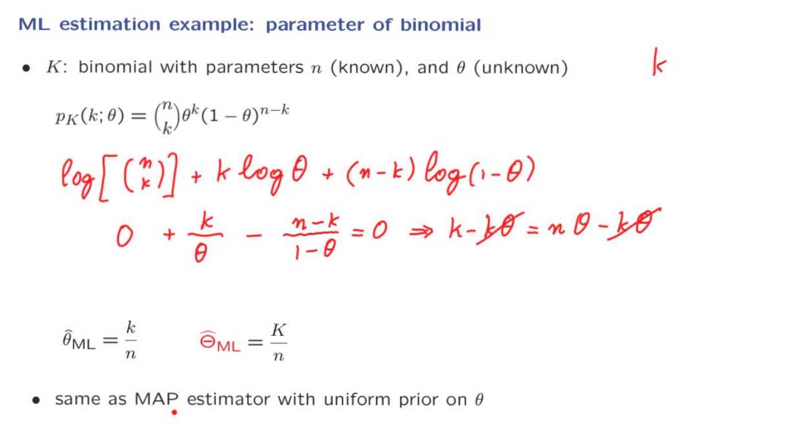

这个例子想象成抛 :coin: ，n代表着实验次数，$\displaystyle \theta$是硬币的bias，K是正面朝上的次数。

这里注意：log(abc) = log(a) + log(b) + log(c)

写出他的PMF。然后我们要使上述的表达式最大。这里使用logrithm来简化计算，求化简之后的导数，令其为0。最终所得到的表达式$\displaystyle \frac{K}{n}$就是我们的Maximum Likelihood的estimator。

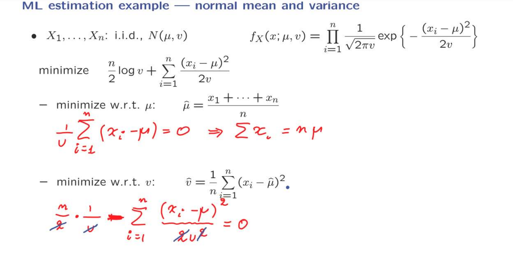

这是一个更加复杂的例子，可以看到这里有两个未知的参数$\displaystyle \mu \quad v$，方法依然相同，先写出PDF，再使PDF能够最大。
这里依然时使用了logrithm进行简化，最后是要使简化后的表达式最小。

因为这里有两个未知量，所以我们最终会得到两个估计器。在这里分别对两者进行单独的求导。

