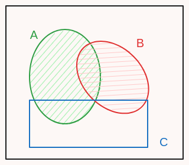

# Unit 2: Conditioning and independence

## Lec. 3: Independence

### 1. overview

如果事件A已经发生，这通常会改变事件B发生的概率，一般需要使用条件概率$\displaystyle \mathbf{P}(B\mid A)$。但如果条件概率的值与$\displaystyle \mathbf{P}(B)$的值是一样的，说明二者之间并没有联系（~~没有交集~~:**下文根据independence的定义这种说法是错误的。**），这种情况表明A与B是独立的（**independence**）。

在一个集合之中，如果有两个独立事件，会说一对独立（Pairwaise Independence）。

本节内容
Independence of two events:

* Conditional independence
* Independence of a collection of events
* Pairwise independence
* Reliability
* The king’s sibling puzzle

### 2. A coin tossing example

例举了投掷硬币的例子（存在bias: p head, 1-p tail）。回顾了三个工具：Multiplication，Total Probability Rule and Bayes'Rule

### 3. Independence of two events

先从直觉上来定义独立性。
回想投掷硬币的例子，第一次硬币为正面并不会影响第二次投掷硬币的结果。
事件A已经发生，事件B不受它的影响，即$\mathbf{P}(B\mid A) = \mathbf{P}(B)$。这表明事件A的发生并不会影响B的beliefs，B的原始概率与条件概率相同。如此说B独立与A。

数学上的正式定义：$\mathbf{P}(A\cap B) = \mathbf{P}(A)*\mathbf{P}(B)$
相比直觉上的定义，数学上的定义有以下的好处：

* 等式两边同时除以$\mathbf{P}(A)$或$\mathbf{P}(B)$等效于直觉定义。
* 直觉上的定义只说明B独立与A，并不能说明A独立与B（$\mathbf{P}(A|B) = P(A)$）,数学的定义式具有对称性（），可以说明A也独立于B（事实上独立性就是双向的）。
* 直觉上的定义有一个限制条件，即$\mathbf{P}(B)> 0$,数学定义式中包括了$\mathbf{P}(B)= 0$的情况。

**两个事件是独立的等效于他们两个是disjoint吗？**

如图所示：

* $\mathbf{P}(A)> 0$, $\mathbf{P}(B)> 0$
$\mathbf{P}(A\cap B)= \mathbf{P}(\empty)= 0$
$\mathbf{P}(A)* \mathbf{P}(B)> 0$

因此两个disjoint的事件并不符合一对独立事件的定义。
事实上此处的事件A与B两者是**相互依赖**的。当事件A发生时

### Some Problem

Let A be an event, a subset of the sample space $\varOmega$ . Are A and $\varOmega$ independent?
这是一个好问题。
如果使用数学方法:

1. $\mathbf{P}(A)*\mathbf{P}(\varOmega)= \mathbf{P}(A)* 1= \mathbf{P}(A)$

2. $\mathbf{P}(A\cap \varOmega)= \mathbf{P}(A)$

符合定义。

但如果从直觉上来看，假设$\varOmega$发生，他无法给出信息A是否发生。但若A发生，则$\varOmega$一定发生，这样可能会觉得他们彼此因该是相互依赖的。
实际上，这种理解是错误的。
无论a是否会发生，$p(\varOmega)$ 始终都是1，这和a没有关系。**两事件相互独立，意味着一个事件发生与否都不会给出信息去影响另一个事件的beliefs。**

补充说明：

* p(a) = 1 和 p(a) = 0。说明事件a一定会/不会发生。对于其他事件或者它本身来说，无论是否发生，a一定是确定的。

### independence of event complements

直观上认为：如果a与b独立，那么当已知a发生时，b发生的的beliefs不应该改变，那么b不发生的beliefs也不应该改变，因此a与b的补也应该是独立的。

a发生对b不发生没有影响。

证明：
$$
\begin{aligned}
&a = (a\cap b)\cup (a\cap b^c) \\
两者是disjoint，使用可加定律： &p(a)= p(a\cap b) + p(a\cap b^c) \\
因为a，b独立：&p(a) = p(a)*p(b) + p(a\cap b^c) \\
&p(a) - p(a)*p(b) \rightarrow p(a)*(1- p(b))= p(a)* p(b^c)
\end{aligned}
$$

other problem: a and b是独立的，那么$a^c and b^c$也是独立吗？

* solution: 与上述思路是一致的，拆分$a^c$，使用$a^c与b是独立的$。
* intution: 在之前的思路中由$a,b$独立推导出$a,b^c$,独立是对称的,$b^c与a$也是独立的，由$a,b \rightarrow a,b^c \rightarrow b^c,a(symmetric) \rightarrow b^c,a$。

### conditional independence

条件概率模型和一般的概率模型并没有什么区别，只不过增加了一些信息，并没有改变样本空间或者事件（思考一开始定义他的图）正应如此，基本上一般的概率模型所具有的概念都会对应有一个条件概率模型的版本。

条件独立的数学式: $p(a\cap b \mid c) = p(a\mid c) * p(b\mid c)$
那么条件独立和无条件独立（一般独立）之间是否存在暗示的关系，比如若两个事件相互独立，那么他们也相互条件独立吗？

如下图示：

假设a，b是相互独立的，c已发生。
在图上可以看出，A与B在C中并没有交集，也就是说A，B存在：A发生，B一定不发生。反之一样。

所以A，B独立不能够推断出A，B条件独立。

### Independence versus conditional independence

* $\mathbf{P}(Head\mid A) = 0.9 \quad \mathbf{P}(Head\mid B)= 0.1$
* 随机选择硬币的概率（A or B）都是0.5
比较条件独立和一般的独立: toss硬币是否是独立的

1. $\mathbf{P}(H_{11})$（第11次toss硬币是head朝上）
   * $\mathbf{P}(A\cap H) + \mathbf{P}(B\cap H)= 0.5*0.9 + 0.5*0.1 = 0.5$
2. $\mathbf{P}(H_{11}\mid 前面10次都是head朝上)$
   * 根据给出的信息，从intution角度大概可以判断选择的硬币是A，那么第11次head朝上的概率是0.9

结合**conditional independence**，两个事件A，B相互独立，但是在条件概率模型下，他们并不一定依然独立（在C中的交集为空）。

### Independence of a collection of events

从直观上，我们想要表现硬币的每次toss都是独立的，可以写作：

* $\mathbf{P}(A_1\cap A_4^c)= \mathbf{P}(A 1\cap A_4^c\mid A_2\cup (A_3\cap A_5^c))$
  * 还能有其他的组合比如$A_2^c or A_2\cup (A_3\cap A_5)$,总之就是表示与之前或者之后toss无关。
  * 这是从直觉上来解释。**即某一些事件的发生是否会影响另一些事件**，这实际也是独立性的意义。
  
之前定义的事件的独立性都是两个,现在是多个。
给出定义：$\mathbf{P}(A_1\cap A_2\cap A_3 \cdots A_n)= \mathbf{P}(A_1)\mathbf{P}(A_2) \mathbf{P}(A_3)\cdots \mathbf{P}(A_n) $

### Independence versus pairwise independence

* Two events are independent
  * $H_1$: the first toss coin is head
  * $H_2$: the second toss coin is head
  * $\mathbf{P}(H_1)= \mathbf{P}(H_2)= \frac{1}{2}$

事件C：第一次和第二次投掷coin相同 ： {HH, TT}

* 绿色：C
* 红色：$H_1$
* 蓝色：$H_2$

$$
\mathbf{P}(H_1\cap C)= \mathbf{P}(HH)=1/4 \\
\mathbf{P}(H_1)* \mathbf{P}(C)=1/2 * 1/2 = 1/4 \\
同理：\mathbf{P}(H_2\cap C)= \mathbf{P}(A_2)* \mathbf{P}(C) \\
\mathbf{P}(H_1\cap A_2)= \mathbf{P}(A_1)* \mathbf{P}(A_2)
$$
所以$H_1,H_2,C$ 是pairwaise independenc。

$$
\mathbf{P}(H_1\cap A_2\cap C)= \mathbf{P}(HH)= 1/4 \\
\mathbf{P}(H_1)*\mathbf{P}(A_2)*\mathbf{P}(C)= \mathbf{P}(red)*\mathbf{P}(blue)*\mathbf{P}(green)= 1/2*1/2*1/2 = 1/8
$$
这两者并不相同。

所以：$H_1,H_2,C$是pairwaise independence,但是$H_1,H_2,C$不是independence。

### Reliability
独立性的好处是，能够将复杂的状况拆分成小的状况，分别处理，再聚合在一起。
这是一个例子使用独立性来分析一个系统的reliability。

* 假设一个系统，事件U表示系统组件的状态是”UP“，正常。事件F表示系统的组建是”DOWN“，不可用。假设事件U彼此之间都是独立的（使用独立性的直观意义，那么F也是独立的）。
* P表示的就是事件U发生的概率

如图是第一个系统：

想象成电路，要使电流通过，那么这个系统正常运转的概率：
$\mathbf{P}(system up)= \mathbf{P}(U_1\cap U_2\cap U_3)= P_1* P_2* P_3$

第二个系统：

直观来看，一个并联电路。要使的电流能够通过，即系统正常，必须要保证有一个分支是正常的。
$$
\begin{aligned}
P(system \quad up)&= P(U_1\cup U_2\cup U_3) \\
&=1- P(F_1\cap F_2\cap F_3) \\
&= 1- P(F_1)*P(F_2)*P(F_3)
\end{aligned}
$$
在此处无法使用独立的性质，因为独立针对的是交集，可以通过Demorgan‘s law 将交集转化为并集，但在此处采用直观上的逻辑分析，三个组件至少有一个是正常的对应的反面就是三个组件都是损坏的即F的全部交集。

### The King's sibling

* The king comes from a family of two children. what is probability of his sibling is female?

1. 以上的描述比较模糊，再次作出一些假设，$P(boy)=P(girl)=1/2，are independent$。男孩拥有优先级，即同时存在一男一女，男生一定是国王。
   * 根据（1）作出的假设，国王的兄弟姐妹的性别与国王没有关系，所有P(girl)= 1/2
2. 更精确的描述模型
|BB | BG|
|GB | GG|
   * 根据已经知道的事实，一定是有男孩的（因为要求的是👑的兄弟），所以第四种情况不可能发生，也就是存在B的情况已知，其性别是girl的有两种所以是2/3。
3. 更改说明，假设这个家庭决定生孩子，直到有一个是男孩。
   * 那么根据一开始的信息，他们有两个孩子。那么第一个是女孩的概率是1。o
4. 再次更改假设，这个家庭打算要两个男孩。
   * 那么此时，女孩的概率就是0。

这个问题说明，在作出假设时，必须要准绝，不同的假设对相同的情况会造成不一样的结果。