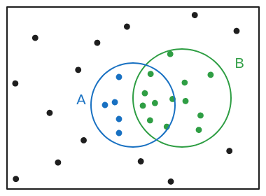
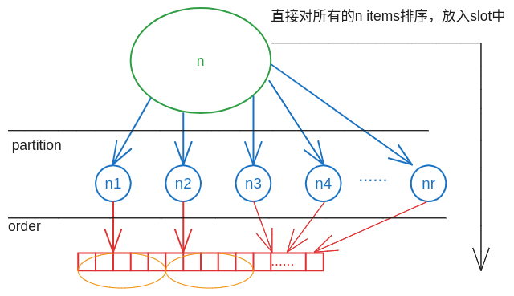

# Unit 3: Counting

## Lec.4: counting

### Overview

假设有20名篮球运动员，需要从中选出5名主力，7名替补。有多少种选出这13名选手的方案。
这里所产生的问题是，我们的方案非常多。
本节的重点就是在一个样本空间之中，计算某些子集所包含的元素的数量。
为什么关心子集元素的数量：在许多的模型之中概率简化为了数量。

### The counting principle

counting principle 也叫rule of product or multiplication principle。根据名字，他就是有关乘的概念。一件事有n种，另一件有m种，他们两个一共的组合是n*m种。

**counting的原则是每一个元素是等概率**

#### Basic counting principle examples

1. 🚗的牌照有两个字符跟着3个数字组成，有多少种组合
   * 26*26* 10*10* 10
   * 同一个组合不能出现已经使用的
     * 26*25* 10*9* 8

2. 排序n个元素的方式
   * n(n - 1)(n -2)$\cdots$ 1

3. 一个集合{1,2,$\cdots$ n}能够构成多少的子集
   * 每一个元素都有两种选择：1.添加到子集；2.不添加到子集。

### Combinations

definition:

* $\begin{pmatrix}
    n \\
    k
\end{pmatrix} $

* k 表示元素个数是k的子集
* n 表示元素个数是n的集合（$ k \subset n$）

构建由k个不同元素组成的序列：

* 一个一个从集合中挑选：n(n-1)(n-2)$\cdots$(n-k + 1) = $\displaystyle \frac{n!}{(n-k)!}$ ；
* 一次选择k个元素，再排序: $\begin{pmatrix}
   n \\
   k
\end{pmatrix}k!$；

* 结合以上，存在：$\displaystyle \frac{n!}{(n-k)!}= \begin{pmatrix} n \\ k \end{pmatrix}k! \Rightarrow \begin{pmatrix} n \\ k \end{pmatrix}= \frac{n!}{k!(n-k)!}  $

#### $\displaystyle \begin{pmatrix} n \\ k \end{pmatrix}= \frac{n!}{k!(n-k)!}$

查看公式在各种值下的情况。

1. k= n,即从n中选择元素个数为n的子集,此时只有一种选择
   * $\displaystyle \begin{pmatrix} n \\ n \end{pmatrix}= \frac{1!}{1!0!}= 1$

2. k= 0
   * $\displaystyle \begin{pmatrix}
      n \\ 0
   \end{pmatrix}= \frac{n!}{0!n!}= 1$

3. 求和（最后演变成求取所有的子集的数量）
   * $\displaystyle \sum_{k=0}^{n} \begin{pmatrix}
      n \\ k
   \end{pmatrix}= \begin{pmatrix}
      n \\ 0
   \end{pmatrix}+ \begin{pmatrix}
      n \\ 1
   \end{pmatrix}+ \cdots+\begin{pmatrix}
      n \\ n
   \end{pmatrix}= 2*2*2*2\cdots2= 2^n$

### Binomial probabilities

之前所计算的$\displaystyle n \choose k$被称为二项式系数，与二项概率密切相关（Binomial probabilities）

* $n \geq 1$ and **independent**, P(H)=p
* $P(HHTTHH)= P*P*(1-p)(1-P)*P*P= p^4(1-p)^2$
* 对于某一个固定序列，他的概率$\displaystyle \mathbf{P}(sequence)= P^{k}(1-P)^{n-k}$, n 是序列的长度，k是序列中是head的数量。

* 对于包含k次head的任意序列，$\displaystyle \mathbf{P}(include \, head-k)= P^k(1-p)^{n-k}*(number \, of \, k-based \, sequences)\Rightarrow \mathbf{P}(include \, head-k)= P^k(1-p)^{n-k}{n \choose k} $
* $\displaystyle \sum _{k=0}^ n {n \choose k} p^ k (1-p)^{n-k}= 1$

### A coin tossing example

10次投掷硬币，3次头朝上，问题是硬币最初两次头朝上的概率是多少？

* B：10次投掷，有三次是头朝上
* A：最初的两次是头

**获取问题之后，首先要作出假设和建立模型**

* 掷硬币是独立的
* 假设P(H)= p
* 建立条件概率模型

方法一：

如图所示：

* 黑色的点表示的是：长度为10,投掷硬币的序列
* 绿色的点（B）：长度为10,有三次是头部，其他都是字的序列
* 蓝色的点（A）：长度为10,最初的两次是头部的序列

B中的每一个元素发生的概率都是：$P^{3}(1-p)^{7}$,是等概率的，所以此处的模型是discreate uniform model，通过元素的数量来表示概率$

所以，$\displaystyle \mathbf{P}(A\mid B)= \frac{number(A \cap B) }{number(B)}= \frac{8 \choose 1}{10 \choose 3 }$

这种方法，使用图示+条件概率的概念分析的出答案，很简便。

方法二：
使用条件概率的定义式计算得出（即使用代数的方法），比较麻烦，但是简单粗暴。

### Partitions

假设有n个不同的items在一个universe中，要将其分给r个人（分区的个数）。对应的$n_i$将分配个第i个人。

设置分区的所有方案数为C，将每一个单独的分区（$n_i$）自主排序，填到对应序号的槽中。

* $(n_1!)(n_2!)(n_3!)...(n_r!)$,每一种分区的方案，对应着如此的顺序。
* 总的排序方案：$C(n_1!)(n_2!)(n_3!)...(n_r!)$

可以不通过分区再排序再组合的思路，可以直接使用对这n项值直接排序。

* $n!$

由此可以建立等式关系：

* $\displaystyle C(n_1!)(n_2!)(n_3!)...(n_r!)= n! \Rightarrow C= \frac{n!}{ (n_1!)(n_2!)(n_3!)...(n_r!)}$
* C被称为multinomial coefficient
* 可以类比binomial coefficient，多项式系数是多个二项式系数的积（假设每一个分区都是固定的项数）。
* 二项式系数是r=2的,$n_1=k,n_2=n-k$多项式系数

