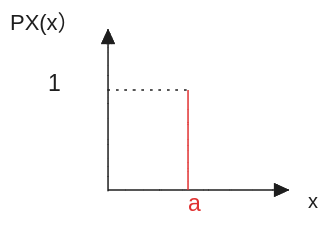

# Unit 4: Discrete random variables

去快餐店吃饭，会赠送一个figure,一共有7种类型。每次会随机给你其中的一个，现在你需要区多少次才能收集到全部的figure。

在本单元中，我们将介绍随机变量(random variables)，重点是离散情况。我们通过概率质量函数(probability mass functions.)来描述它们的分布。我们还将介绍期望(expectations)和方差(variances)、它们的一些性质以及独立性的概念。我们将结合各种常见的随机变量来说明这些概念。

作如下的实验，从一个班级之中挑选一名学生，我们想要知道这名学生的性别。实验结束之后，可以得到实验的结果。但除了性别之外，我们还能够得到其他与要求的实验的输出并不相同的报告——身高，体重.....
类似与这样的量，与实验的结果相关但并不一致，称为随机变量(Random variable)。

主题：

## Lec. 5: Probability mass functions and expectations

### Definition of random variables

样本空间是5名学生，每当确定选择一名学生时，就能够得到他们的身高和体重。
也就是说，在这个概率实验中，事件是某一名学生的选择，一旦确定了，与他相关的量（身高和体重也就确定了）。

W代表着体重，H代表着身高，可以将其抽象成一个process或者function，某一个学生是一个输入，输出就是一个具体的值，

所以random variables实际上就是一个函数，他的定义域是样本空间，值域是与样本空间中的事件相关联的量，是一个数值。

当将随机变量组合在一起时，能够创建全新的随机变量，

图示表示的是一种身体指数，使用体重和身高来衡量当前的健康水平。B的定义域同样来自样本空间，因为每当确定某一名学生，相应的身高体重也就确定，健康指数也就确定了。

**随机变量能够接收的输入有两种——离散的和连续的。**
例如，如果你的随机变量是连续抛掷10次硬币中正面出现的次数，这是一个离散随机变量，取值范围是0到10。如果你的随机变量是某件事发生的时间测量，而且你的计时器具有无限的精度，那么计时器会报告一个实数，我们将得到一个连续随机变量。

### Probability mass functions

随机变量的输出也会受到样本空间中的事件发生的概率而有所不同。事件发生的概率越高，相对应的随机变量的输出的出现概率也会越高。

图示，

事件a，b的经过随机变量$X$映射之后，有相同的输出5$(x=5)$。
那么，$x=5$是原样本空间的一个事件（因为元素来源于样本空间：a,b），他表示实验结果经过$X$映射之后是5的事件。这个事件的概率表示成$\displaystyle \mathbf{P_X}(5)= \frac{1}{2}$，其中以$X$为下标是为了区分不同随机变量的概率（$\mathbf{P_Y},\mathbf{P_Z}\cdots$）。
推广为一般形式：$\displaystyle \mathbf{P_X}(x)= \mathbf{P}(X=x)= \mathbf{P}(\{\omega \in \varOmega \  s.t. \ \mathbf{X}(\omega)=x\})$。
$\mathbf{P_X}(x)$就是probability mass function——PMF。

概率质量函数的属性：$\displaystyle \mathbf{P_X}(x) \geq 0; \  \sum_{x}\mathbf{P_X(x)= 1}$，概率质量函数他所表示的就是概率，因此必须遵守概率的规范。

#### 概率质量函数的计算

掷两次四面体的 :game_die:，假设每一个面出现的概率都是相同的，可能的结果如下图

此处第一次:game_die:子和第二次值:game_die:分别用$X \ Y$表示，表示:game_die:的数值，这其实也是随机变量（将其视作直接对应的映射）。方格中的值用$Z$表示，存在$Z= X+Y$。这是通过组合原本的随机变量生成一个新的随机变量。

$\displaystyle \mathbf{P_Z}(z)$是对于所有的z的结果而言。

* 找到所有可能的结果
* 将对应的概率相加（离散均匀分布）
所以，
$$
\mathbf{P_Z}(2)= \mathbf{P}(Z=2)=\frac{1}{16} \\
\mathbf{P_Z}(3)= \mathbf{P}(Z=3)=\frac{2}{16} \\
$$

### Bernoulli and indicator random variables

#### 最简单的随机变量：伯努利随机变量

随机变量$X$，如下表示
$$
X= \begin{cases}
   1 \  with\  parameter \ P \\
   0 \  with\  parameter \ 1-P
\end{cases}
$$
$X$的取值结果只有两种0和1,这两个结果的分布受参数P的影响，以PMF的形式展示：
$$
\begin{cases}
&\mathbf{P_X}(1)= p \\
&\mathbf{P_X}(0)=1-p
\end{cases}
$$

$\mathbf{P_x}(x)$图像：
 
伯努利随机变量出现的场景：

* 模拟试验（二元实验，只有两种结果），其结果只能是“成功/失败”，“头部/尾部”等相互对立的结果。
* 当需要建立事件与和随机变量之间的联系
  * 
  * 将样本空间划分为事件$A$和$A^c$,当实验的结果属于$A$时，取值为0；反之，取值1。这样的随机变量被称作indicator random variable（$\mathbf{I_A}$）。
  * 其PMF与事件A存在关系：$\displaystyle \mathbf{P_{I_A}}(1)=\mathbf{P}({I_A}=1)=\mathbf{P}(A)$，$\mathbf{I_A}=1$，则事件A发生。
  * 由此可见indicator随机变量就是伯努利随机变量（也不全是，前者表示实验只有两种结果，后者表示事件是否发生，并不关心事件的结果是什么），**参数P实际就是事件A发生的概率**
  * indicator random variable 能够将事件的操作转化为对随机变量的操作

### Uniform random variables

本节主体旨在介绍更多的随机变量

#### Discreate uniform random variables

在一组实验中假设所有的事件都是等概率的，即没有理由认为一个事件比另一个事件更有概率发生。

假设在一个范围中随机取整数$[a,b]$,a b 也是整数。随机变量$X(\omega)= \omega$,其PMF如下，

实验中的所有的结果实际与随机变量的值一致，任何特定的值发生的概率都是$\displaystyle \frac{1}{b-a+1}$。

离散均匀随机变量被两个参数所决定，$a$ and $b$。

这个随机变量在现实世界中表示什么？它模拟的是一种情况，我们有一系列可能的值，而且完全不知道哪个值比其他值更有可能出现。举个例子，假设你看着你的数字时钟，然后看时间。它显示的时间是11:52:26。

假设你只看秒数。秒数的读数取值在0到59之间。因此有60个可能的值。如果你随机选择一个时间来看你的时钟，没有理由认为某个读数比其他读数更可能出现。所有的读数应该是等可能的，并且每一个读数的概率都是1/60。

此处存在一个特殊情况，当$a=b$时，只有一种可能会发生

实际上此时随机变量是一个常数，他没有随机性，但在数学上我们仍然可以将其视为一个随机变量。

### Binomial random variables

实验：进行$n$次独立的抛 🪙实验，$\mathbf{P}(Heads)= p$。
以下是进行三次实验的tree图，随机变量$X=$实验结果是head的数量

计算$X=2$时，发生的概率
$$
\begin{aligned}
\mathbf{P_X}(2)&= \mathbf{P}(X=2) \\
&= \mathbf{P}(HHT) + \mathbf{P}(HTH) + \mathbf{P}(THH) \\
&= 3 \cdot p^2(1-p) = {3 \choose 2}p^2(1-p)
\end{aligned}
$$
最后可以将结果转化成所熟悉的counting形式。此处的新变化是，不再以传统的概率形式表示（即$P(A)$），而是以PMF的形式。

归纳为一般情况：$\displaystyle \mathbf{P_X}(k)= {n \choose k}p^k(1-p)^{n-k}, \qquad k= \{0,1,2,3,\cdots n \}$。

以下是PMF的图示，n表示掷:coin:的次数，p表示头部朝上的概率，横轴是二项式随机变量的输出，纵轴是对应的PMF的值

第一行，表示的是一个公平的硬币的投掷情况，当投掷的次数为100次时，最有可能发生的状况是在35到65之间，其他的情况发生的次数很少。

第二行，表示的是一个公平的硬币的投掷情况，当投掷的次数为100次时，20次之后的情况很少发生。

图中可以看到，在$n$的次数少时，一些可能性很高的情况之后会变得到很少。

### Geometric random variables
parameter p: $0 < p \leq 1$

实验：无限次投掷一枚 :coin:，每次头部朝上的概率是固定的$\mathbf{P}(head)= p$。

样本空间：由H和T组成的无限的序列（$TTTTTH...,TTTTHHH...,...$）

随机变量$X$：第一次出现头部，抛硬币的次数。

建模：模拟了等待某件事的发生。一直进行实验，直到出现想要的结果。

生活：客户是否在特定的秒数内出现在商店里。

$$
\begin{aligned}
   \mathbf{P_X}(k)&= \mathbf{P}(X=k) \\
   &=\mathbf{P}(TTT...T_{k-1}H_k) \\
   &= (1-p)^{k-1}p \qquad k= 1,2,3,\cdots
\end{aligned}
$$
此处的$k$表示的是“success”出现在第几次的实验中，即第几次在抛出:coin:出现head，并且$k$只能够是正整数。

这个实验可能出现一种特殊情况，即永远不会出现head，
$$
\mathbf{P_X}(\infin)= \mathbf{P}(X= \infin)=(1-p)^{\infin - 1}(p)\rightarrow 0 \times p= 0
$$，所以永远不会看到任何头的概率等于0，这意味着我们可以忽略这个特定的结果

作为这一点的一个附带结果，不同可能的k值的概率之和将等于1，因为我们确定随机变量将取一个有限的值。所以当我们对所有可能的有限值的概率求和时，这个和将等于1。

### Expectation

随机变量的期望，也可以叫做随机变量均值。
期望通过展示一个单一的平均值从而描述随机变量的“概括情况”。

实验：假设在街机房玩🥭机，玩1000次，设随机变量为$X$：表示获得的 💲：
$$
X= \begin{cases}
   1 \quad \frac{2}{10} \\
   2 \quad \frac{5}{10} \\
   4 \quad \frac{3}{10}
\end{cases}
$$

如果将概率解释为频率（frequence），那么1000次后能够获得的 💲的平均值：
$\displaystyle \frac{1 \times 200 + 2 \times 500 + 4 \times 300 }{1000}= 1 \times \frac{2}{10}+2 \times \frac{5}{10} + 4 \times \frac{3}{10}= 2.4$

上述是以两种形式来表示平均收益，即期望值。

由此，期望的一般形式：$\displaystyle \mathbf{E}[X]=\sum_x x\times \mathbf{P_X}(x)$ 

期望公式的解释：对一个独立实验进行多次所得到平均值。

此处有一个需要注意的点：
>如果我们处理的是取值在离散但无限集合中的随机变量，这个求和将是一个无限求和或无限级数。总会有一个问题，即无限级数是否有一个良定义的极限。为了确保它有一个良定义的极限，我们需要假设这个无限级数是绝对收敛的，也就是说，如果我们用它们的绝对值替换x，那么我们正在添加的这些正数或非负数的和将是有限的（$\displaystyle \sum_x x \times \mathbf{P_X}(x) < \infin$）。因此，这是一个我们需要的技术条件，以确保这个期望值是一个良定义且有限的数量。

#### Expectation example

##### Expectation of a Bernoulli r.v.

$$
x= \begin{cases}
  1,\, W.P. \qquad p \\
  0,\, W.P. \qquad 1-p \\
\end{cases}
$$
计算他的期望: $\displaystyle \mathbf{E}[x]= 1\times p + 0 \times (1-p)= p$

如果$X$是事件A的indicator R.V.，$X=I_A$，$X=1$ iff 事件$A$发生，则期望
$\displaystyle \mathbf{E}[x]=1 \times \mathbf{P_X}(1) + 0 \times \mathbf{P_X}(0)= 1 \times \mathbf{P}(A) +0 \times \mathbf{P}(A^c)= \mathbf{P}(A)=p$
对于indicator V.R.来说，$\displaystyle \mathbf{E}(I_A)=P(A)$，也就是说 indicator V.R.的期望值就是这个事件发生的概率。

##### Exception of a uniform
* uniform on $\displaystyle 1,2,3 \dots n$

$\displaystyle \mathbf{E}(X)= \frac{1}{n + 1}(1 + 2 + 3 + 4 + \dots n)= \frac{1}{1 + n} \times (1+2+3+ \cdots n)= \frac{1}{1+n} \times \frac{(1+n)n}{2}= \frac{n}{2}$

由此可见，均匀分布的期望值是他的中点（如果将纵轴想象成有质量的黑线，那么它的期望就是质量的重心）。

##### Exception as a population average

假设我们有一个包含n名学生的班级，并且第i名学生的体重是一些数xi。我们进行一个概率实验，在这个实验中，我们随机选择一个学生，每个学生被选择的概率都是相等的。我们感兴趣的随机变量X是被选中学生的体重。为了简化起见，我们将假设xi都是不同的。

$\displaystyle \mathbf{P_X}(x_i)= \frac{1}{n}$
$\displaystyle \mathbf{E}(x)=\sum_{i}x_i\frac{1}{n}= \frac{1}{n}\sum_{i}{x_i}$
在这个实验中，期望值可以被视作是一个群体的真正的平均体重，但在之前的论述中，我们将期望视作是大量重复实验的平均值。此处我们谈论了两种不同的类型的平均值，有两种解释。

### Elementary properties of expectation

以下是随机变量的一些自然的性质
* if $x \geq 0, \,then \qquad \mathbf{P_X}(x) \geq 0$
* if $a \leq X \leq b, then \qquad a \leq \mathbf{E}(X) \leq b$
* if $c$ is a constant, $E[c] = c$

### The expected value rule

已知，随机变量$X$，随机变量$Y= g(X)$,计算这个新值的期望。

方法一：
$\displaystyle \mathbf{P_Y}(2)=0 \qquad \mathbf{P_Y}(3)=(0.1+0.2) \qquad \mathbf{P_Y}(4)=(0.3 + 0.4) \qquad \mathbf{P_Y}(5)=0$

使用定义计算：$\displaystyle \sum_{y}{y}{\mathbf{P_Y}(y)}$

方法二（over on x for average）：
$3 \times 0.1 + 3 \times 0.2 + 4 \times 0.3 + 4 \times 0.4$

$\displaystyle \mathbf{E}(Y)=\mathbf{E}(g(x))=\sum_{x}{\mathbf{P_X}(x)g(x)}$

proof:

对于一个特定的y值，存在与之相关联的x值。固定一个y，对相关联的x计算后,继续下一个y。
$\displaystyle \sum_{x}{\mathbf{P_X}(x)g(x)}=\sum_{y}\sum_{x: y=g(x)}{\mathbf{P_X}(x)g(x)}= \sum_{y} \sum_{x: y=g(x)}y\mathbf{P_X}(x) = \sum_y y\sum_{x:y=g(x)}\mathbf{P_X}(x)$，因为固定了y，对所有导致了这个y的x的概率求和,得出的就是y发生的概率$=\displaystyle \sum_y y \mathbf{P_Y}(y)= \mathbf{E[y]}$。
之所以可以将y移动到第一个求和的外面，主要是因为此时这个y是一个固定值。
两种方法的等式是相同的，证明方法二是正确的。

Note: 
* $\displaystyle \mathbf{E[x^2]}= \sum_x x^2\mathbf{P_X(x)}$
* **一般来说 $\mathbf{E[g(x)]} \ne \mathbf{g(E[x])}$**

### Linearity of expectations

* R.V : $X, Y= aX + b$
* $\displaystyle \mathbf{E[Y]}= \mathbf{\sum_x g(x)}P_X(x)=\mathbf{\sum_x (x+b)}P_X(x)= a\sum_x xP_X(x) + b\sum_x P_X= a\mathbf{E(x)} + b$
* 这个法则只对线性函数正确的。
