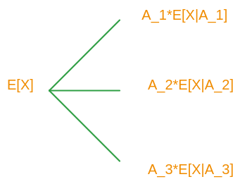

# Unit 4: Discrete random variables
## 

* Variance and its properties
  * Variance of the Bernoulli and uniform PMFs
* Conditioning a r.v. on an event
  * Conditional PMF, mean, variance
  * Total expectation theorem
* Geometric PMF
  * Memorylessness
  * Mean value
* Multiple random variables
  * Joint and marginal PMFs
  * Expected value rule
  * Linearity of expectations
* The mean of the binomial PMF

### Variance—— a measure of the spread of PMF

distanve from the mran
假设有两个算计变量，red和blue，他们有相同的均质（mean）—— $\mathbf{E[X]}=\mu$，随机变量的值与其期望之差。

* one point **distance from the mean:** $\displaystyle |X - \mu|$
图中的红线和蓝线是PMF的值，轴上的点是随机变量的输出。

* Average distance from mean
  $\mathbf{E[X - \mu]}= \mathbf{E[X]} - \mu = \mu - \mu= 0$

  由于，from the distance 是0，所以没办法获得信息。在数学上一般使用绝对值或者平方来表示（用平方更好）。

* Defination: $var(X)= E[(X- \mu)^2]$

* How to conclude the variance ,**$\displaystyle var(X)= \mathbf{E[g(x)]}= \sum_x g(x)P_X(x)$**:
    use expection value rule ,$$
      \mathbf(g(x))= (X - \mu)  \\
        \mathbf{E}[(X - \mu)^2]= \sum_{x}(x - \mu)^2 \mathbf{P_X}(x)
    $$

方差在某些方面有一些难以解释——因为使用了平方，他的单位是错误的（x= ？/m，结果的单位是 $/m^2$），更加直观的概念是标准差（stand deviation）

* $\displaystyle \sigma_X= \sqrt{var(x)}$

### property of variance

* Notation: $\displaystyle \mu = \mathbf{E}[X]$
* $Y= X + b$

$$
\begin{aligned}
v&= \mathbf{E}(Y)=\mathbf{E}(X + b)= \mathbf{E}(X) + b \\
var(Y)&=E[(Y - v)^2] \\
&= \mathbf{E}[(X + b - (\mu + b))^2]\\
&= \mathbf{E}[(X - \mu)^2]
\end{aligned}
$$
可以发现，当随机变量添加一个常量时，Variance并不会改变。从图形上看，只是将PMF向左或者向右平移，输出的点与期望的差值并没有改变。

* $Y=aX$

$$
\begin{aligned}
 v &= \mathbf{E}[Y] =  \mathbf{E}[aX]= a\mathbf{E}[X] \\
 var(Y)&= \mathbf{E}[(Y - v)^2] \\
 &= \mathbf{E}[(aX-a\mu)^2] \\
 &= \mathbf{E}[a^2(X - \mu)^2] \\
 &= a^2\mathbf{E}[(X - \mu)^2]
\end{aligned}
$$
此时可以发现，将一个随机变量乘以$a$，方差将乘以$a$的平方。

**所以存在：$var(aX+b)= a^2var(X)$**

==快速计算Variance公式：$var(x)= E[X^2] - (E[X])^2$==

A derivation that does not rely on this linearity property, goes as follows: This expression is verified as follows:

$\displaystyle var(x)= $
$=\displaystyle \sum _{x}\big (x-{\bf E}[X]\big )^2p_ X(x)$
$=\displaystyle \sum _{x}\Big(x^2-2x{\bf E}[X]+\big ({\bf E}[X]\big )^2\Big)p_ X(x)$
$=\displaystyle \sum _{x}x^2p_ X(x)-2{\bf E}[X]\sum _{x}xp_ X(x)+\big ({\bf E}[X]\big )^2\sum _{x}p_ X (x)$
$=\displaystyle  {\bf E}[X^2]-2\big ({\bf E}[X]\big )^2+\big ({\bf E}[X]\big )^2$
$=\displaystyle {\bf E}[X^2]-\big ({\bf E}[X]\big )^2.$

## Variance of the Bernoulli and the uniform

计算常见算计变量的方差

### Bernoulli

$X=\displaystyle \begin{cases}
  1 \qquad p \\
   0 \qquad 1-p
\end{cases}$

1. 适用方差定义 + 期望rule
$\displaystyle \mu = \mathbf{E}[X]= p$
  $\displaystyle var(x)= \mathbf{E}[(X - \mu)^2]= \sum_x (x-\mu)^2P_X(x)=(1-p)^2p + (0 -p)^2(1-p)= p + p^3 -2p^2 + p^2 - p^3= p - p^2 $

2. 使用quick formula
$\displaystyle var(x)= \mathbf{E}[x^2]- (\mathbf{E}[x])^2$
$\displaystyle 1^2 = 1 \quad 0^2= 0 \rightarrow x=x^2 \, , x\in \{1,0\} $
$\displaystyle var(x)= \mathbf{E}[x] - (\mathbf{E}[x])^2 = p - p^2 = p(1-p)$

使用表达式，$p(1-p)$作出图像,

伯努利随机变量的方差形式对p有一个有趣的依赖关系。p乘以1减去p是一个抛物线。当p为0或1时，它是0。它具有这个特定的形状，这个抛物线的峰值出现在p等于1/2的时候，此时方差为1/4。

**方差是衡量随机变量不确定性或者说随机性的量**
当一枚硬币投掷时，如果是公平的，即$p = 1$，他是最随机的，硬币的方差在最公平的时候随机性最高。
但是当为1,和0时，方差为0,此时结果是确定的，完全不随机。
从期望的角度来说，期望就是根据已值的情况，所显示的最有可能的结果（因为按照概率的比重），所以当随机变量的值与期望差别越来越大时，越说明距期望的结果越远，也就越随机。

### Uniform

$\displaystyle var(X)= \mathbf{E}[x^2] - (\mathbf{E}[X])^2 = \frac{1}{n+ 1}(1^2 + 2^2 + 3^2  + \cdots n^2) - (\frac{n}{2})^2$

$= \displaystyle \frac{1}{n + 1}(\frac{1}{6}n(n + 1)(2n + 1))- (\frac{n}{2})^2= \frac{1}{12}n(n+2)$

对于一般的形式，

第一幅图像和第二幅图像有什么区别?
我们令$n = b - a$,第二幅图可以视作是第一幅图的随机变量添加了一个常数。如果一个随机变量取值为0,那么第二个PMF中他所表是的就是a，为1就是$a+1$.

所以这个偏移后的PMF是与随机变量等于原始随机变量加上一个常数相对应的PMF。但我们知道加上一个常数不会改变方差。因此，只要我们做出n等于b减去a的对应，这个PMF的方差将与原始PMF的方差相同。

所以在之前推导的公式中进行这个替换，我们得到 $\displaystyle var(x)= \frac{1}{12}(b-a)(b-a + 2)$。

## Conditional PMFs and expectations given an event

* condition on an event A. use conditional  prbabilities

assume $P(A) \geq 0$
|normal| condition|
|---|---|
|$\displaystyle \mathbf{P_X}= \mathbf{P}(X=x)$|$\mathbf{P_{X\mid A}}(x)=\mathbf{P_{X \mid A}}(X=x \mid A)$|
|$\displaystyle \sum_x \mathbf{P_X}(x)=1$|$\displaystyle \sum_x \mathbf{P_{X \mid A}}(x)= 1$
|$\displaystyle \mathbf{E}[X]= \sum_x x\mathbf{P_X}(x)$|$\displaystyle \mathbf{E}[X \mid A]=\sum_x x\mathbf{P_X}(x \mid A)$|
|$\displaystyle \mathbf{E}[g(X)]= \sum_x g(x)\mathbf{P_X}(x)$|$\displaystyle \mathbf{E}[g(X) \mid A]= \sum_x g(x)\mathbf{P_{X \mid A}}(x)$

condition example

随机变量$X$均匀分布，

$\displaystyle \mathbf{E}[x]= 2.5$
$\displaystyle var(x)= \frac{1}{12}(4-1)(4-1+2)= \frac{5}{4} $

假设现在$A$表示大于或者等于2的事件

$\displaystyle \mathbf{E}[X \mid A]= \frac{1}{4}(2 + 3+ 4)= \frac{9}{4}$

$\displaystyle var(X)= \frac{1}{12}(4 - 2)(4 -2 + 2)= \frac{2}{3}$

比较两个事件的方差，条件概率的方差比非条件的值要小。
因为随机变量的方差反映的是随机性，当已经知道事件A发生时，那么随机变量$X$可选的范围就变少了（如果两个事件是独立的，可能就不一样了），他的随机性就减少了。

**总之，处理条件PMF、条件期望和条件方差时并没有什么真正的不同。它们就像普通的PMF、期望和方差一样，只是我们必须在整个过程中使用条件概率，而不是原始概率。**

### Conditional variance

最早对于条件岁间变量的例子中，通过计算方差，发现值比原来的小。但在这个例子中，确实比原来的大。

以下是staff给出的一些解释：

>Variance describes the average variation from the mean accross the whole sample space. When you are comparing the so called "uncertainty" between two r.v. defined in the same sample space, variance is a usually valid measurement of uncertainty.

>However, sometimes variance is not a good choice for measuring the uncertainty and this problem is a good example. In this example, Y and Y|B are in different sample space and using variance to describe uncertainty is not appropriate.

>Also, how to define "uncertainty" matters. In this problem, you can say that knowing that B occured reduces the uncertainty, because Y can take 3 possible values and Y|B can only take 2 values. In this sense, the possible outcome is reduced and therefore uncertainty is reduced. However, variance is not the right metric to measure the uncertainty described above.

对于均匀分布的快速计算方差的公式，有使用的亚要求：
**对于均匀随机变量，各值之间的步长必须为 1。**

## Total expectation theorem

图示是事件b的tree，$\displaystyle \mathbf{P}(B)= \mathbf{P}(A_1)\mathbf{P}(B | A_1)+\mathbf{P}(A_2)\mathbf{P}(B | A_2) + \mathbf{P}(A_3)\mathbf{P}(B | A_3)$

现在令$\displaystyle B= \{X=x\}$

现在，

$\displaystyle \mathbf{P_{X}}[x]= \mathbf{P}(A_1)\mathbf{P_{X \mid A_1}}(x)+\mathbf{P}(A_2)\mathbf{P_{X \mid A_2}}(x)+\mathbf{P}(A_3)\mathbf{P_{X \mid A_3}}(x)$

$\displaystyle \sum_x x\mathbf{P_{X}}[x]= x\mathbf{P}(A_1)\mathbf{P_{X \mid A_1}}(x)+x\mathbf{P}(A_2)\mathbf{P_{X \mid A_2}}(x)+x\mathbf{P}(A_3)\mathbf{P_{X \mid A_3}}(x)$

$x$可以是所有的$X$的值，也就是对于每一个$x$($x_1 \quad x_2 \quad \cdots x_n$),有上面的式子成立。

$\displaystyle \mathbf{E}[X]= \sum_x x\mathbf{P_{X}(x)}= \mathbf{P}(A_1)\sum_x x \mathbf{P_{X \mid A_1}}(x)+ \mathbf{P}(A_2)\sum_x x\mathbf{P_{X \mid A_2}}(x) + \cdots + \mathbf{P}(A_n)\sum_x x \mathbf{P_{X \mid A_2}}(X)$

上面这个式子就是使用所有的情况相加再合并同类项得出来的。
或者在等式两边同时乘上x和取加和符号，依然可以创建出上式子。

$\sum_x \mathbf{P_{X \mid A_1}}(x)$ 表示的是$\displaystyle \mathbf{E}[X \mid A_1]$

所以有，
**Total Exception Theorem**
==$\displaystyle \mathbf{E}[X]= \mathbf{P}(A_1)\mathbf{E}[X \mid A_1]+ \mathbf{P}(A_2)\mathbf{E}[X \mid A_2]+ \cdots + \mathbf{P}(A_n)\mathbf{E}[X \mid A_n]$==

随机变量,在每一种情况下（$A_1 \, A_2, \cdots A_n$）都有一个特定的**条件期望值**
由此构建出来以下模型，

我们考虑所有这些情况。根据它们各自的概率进行加权，然后将它们加起来以找到X的期望值。因此，我们可以分而治之。我们可以用希望地在每种可能情况下进行更简单的计算来取代对随机变量的期望值进行复杂的计算。

### total expection example 

$E[X]$=$P(A)E[X \mid A_1]+ P(A_2)E[X \mid A_2]$

$\displaystyle P(A_1)= \frac{1}{3}$
$\displaystyle P(A_2)= \frac{2}{3}$
$\displaystyle E[X \mid A_1]= \frac{1}{3} * 0 + \frac{1}{3} * 1 + \frac{1}{3} * 2=1$
$\displaystyle E[X \mid A_2]= \frac{2}{9}*6  + \frac{2}{9} * 7  + \frac{2}{9} * 8=7$
$\displaystyle E[X]= \frac{1}{3} * 1 + \frac{2}{3} * 7$

分解完之后，每个事件单独来看是均润分布，可以在单独事件中直接使用均匀分布计算单独的期望，再聚合。total exception理论将这个问题拆解再合并。

## Geometric PMF, memorylessness, and expectation

假设随机变量$X$：独立的投掷 🪙次数，直到第一次出现头；$\displaystyle \mathbf{P}(H)= p

PMF $\displaystyle \mathbf{P_X}(k)= (1-p)^{k -1}p \qquad,k=1,2,\cdots n$

### memorylessness

定义：
  第一次硬币投掷的结果是反面，剩下的投掷硬币符合几何情况(Geometric)。即第一次的结果并没有影响之后的结果。

这里的意思是，将出第一次之后的情况视作一个新的随机变量$\displaystyle X - 1$,他是符合几何变量的情况的。

投掷一枚硬币，假设第一次是反面，之后继续投，直到出现头部朝上。

在这个条件值中，已经知道第一次是反面，概率可以表示为$\displaystyle \mathbf{P}(X -1 \mid X > 1)$，$X > 1$表明投掷的次数超过1（也就是说第一次投掷肯定是反面朝上）。$X - 1$表明的head出现在第 $ X - 1$次。

$X - 1$依然是n关于参数$p$的几何关系,
$\displaystyle \mathbf{P_{X - 1 \mid X > 1}}(X -1 )= \mathbf{P}(X - 1 \mid x > 1) = (1 - p)^{X - 1}p= \mathbf{P_X}(X)$

使用一个实际例子
==$\displaystyle \mathbf{P_{x-1 \mid X > 1}}(3) = \mathbf{P}(X - 1 = 3 \mid X > 1)= \mathbf{P}(T_2T_3H_4\mid T1)= P(T_2T_3H_4)= (1-p)^2p= \mathbf{P_X}(3)$==

由此可以得出结论:
==$\displaystyle \mathbf{P_{X -1\mid x > 1}}(k) = \mathbf{P_X}(k)$== 

==$\displaystyle \mathbf{P_{X -n\mid x > n}}(X-n = k) = \mathbf{P_X}(k)$== 
也就是说前面的n次实验都是没有效果的，是无用功（挺符合几何分布的意义）。

### the mean of the geomrtric

$承接上文，计算\mathbf{E}[X]$
如果直接使用定义计算，需要计算无限和，这是表较困难的,$\displaystyle \mathbf{E}[X] = \sum_x^{\infin} x\mathbf{P_X}(x)$
但是可以将整个期望分成两部分，

一次投掷就出现head和超过一次才出现head.
$\displaystyle \mathbf{E}[X]= \mathbf{E}[x + 1 - 1]= \mathbf{E}[X - 1] + 1$   [期望的线性性质]。

$\displaystyle  \mathbf{E}[X - 1] + 1 = 1 + p\mathbf{E}[X - 1 \mid X= 1] +(1-p) \mathbf{E}[X - 1 \mid X > 1]\\ 
= 1 + 0 + (1-p)\mathbf{E}[X] \\
=  1 + (1-p)\mathbf{E}[X]$  <-- $\displaystyle \mathbf{E}[X - 1 \mid X > 1] = \mathbf{E}[X]$ -->

$\displaystyle \mathbf{E}[X]= \mathbf{E}[X](1-p) + 1$

==$\displaystyle \mathbf{E}[X]= \frac{1}{p}$==

在这个公式推导的过程中，首先利用期望的线性性质将$\mathbf{E}[X]$转化为$\mathbf{E}[X - 1]  + 1$，随后利用之前i推导出的例子，$X - 1 \mid X > 1 $ 与原本的随机变量是等效的$X$，符合几何分布，所以可以推出两者之间的期望值是等效的。

从期望的表达式可以看出来，当$p$越小，表明我们需要等待很久head事件才会发生1。

Note: The variance of a geometric random variable with parameter $p$ is equal to $(1-p)/p^2$. This is shown in the “Additional theoretical material".

### Exercise: Memorylessness of the geometric

Let $X$ be a geometric random variable, and assume that $Var(X)= 5$ .

What is the conditional variance $\textsf{Var}(X-4\mid X>4)$?
soluton:
a. The conditional distribution of $X - 4 $ given $X > 4$ is the same geometric PMF that describes the distribution of $X$. Hence  $ \textsf{Var}(X-4\mid X>4)=\textsf{Var}(X)=5 $ .

因为$X - 4 \mid X = 4$,当$X = 1, 2, 3 $时，这些情况是不可能出现的，所以此时，随机变量的值不存在这些，根据期望和方差的定义，不会进入到计算之中。

## Joint PMFs and the expected value rule

之前的普通的PMFi只是告诉我们单一的ii随机变量的信息。如果现在有两个单一的PMF，我们只能够获取两个随机变量单独的信息，因为单独的PMF不能够告诉我们随机变量i只之间有什么关系。
nu如果我么想要回答$P(X =  Y)$这样涉及到ihi两个随机变量之间的关系，要使用$Joint PMF$

### Joint PMF
他的定义是：$P_{X,Y}=P(X = X \,and \, Y= Y)$这个p表示概率质量函数，下标告诉我们所涉及的随机变量，这是一个带有两个参数的函数，根据(x,y)不同的取值给出不同的概率值。

如果$X，Y$是有限集，分布构成以下的图示：

$\displaystyle P_{X,Y}(1,3)= \frac{1}{3}$

他有如下的属性，所有的项的概率相加等于一：$\displaystyle \sum_x \sum_y P_{X,Y}(x,y) = 1$

如果我们得到了joint PMF,那么就可以通过ta来获取边缘PMF（Marginal）。

边缘概率质量函数（Marginal PMF）是关于单个随机变量的概率质量函数。我们如何找到它们呢？联合概率质量函数包含了关于这两个随机变量的所有信息，因此它应该足够我们回答任何问题。

如果我们想找到$P_X(4)=?$，o只需要找到图中的$x=4$取得所有纵轴上的坐标之和，结果为：$\displaystyle \frac{2}{20} + \frac{1}{20}= \frac{3}{20}$

对于Y来说也同理，如果较计算$P_Y(2)=?$

$\displaystyle \frac{1}{20} + \frac{3}{20}+ \frac{1}{20}= \frac{7}{20}$，

由此可以推导出公式：

$\displaystyle P_X(x)= \sum_y P_{X,Y}(x,y)$
$\displaystyle P_Y(y)= \sum_x P_{X,Y}(x,y)$

#### More than two random varibles

由上面的式子可以继续扩展到更多的随机变量，

$\displaystyle P_{X,Y,Z}(x,y,z)= P(X=x \, and \,Y=y \, and \, Z=z )$

#### Function of multiple random varibales

ass:
  $\displaystyle z= g(x,y)$
PMF: $\displaystyle P_Z(Z)= P_Z(g(x,y))= P(Z=z)= P(g(X,Y)=z)=\sum_{(x,y):g(x,y)=z}P_{X,Y}(x,y)$

根据期望的定义：$\displaystyle E[Z]=\sum_z zP_Z(z)= \sum_y\sum_{x}g(x,y)P_{X,Y}(x,y)$

### Linearity of expectations and the mean of the binomial

对于单个随机变量的期望，存在他的线性性质。但是对于有多个随机变量，他的线性性质是怎么样的？

$$
\begin{align*}
 g(X,Y)&= X + Y \\
 E[g(X,Y)]&= E[X + Y] \\
 &= \sum_x \sum_y (x + y)P_{X,Y}(x,y) \\
 &= \sum_x \sum_y x P_{X,Y}(x,y) + \sum_x \sum_y  yP_{X,Y}(x,y) \\
&= \sum_x x\sum_y P_{X,Y}(x,y) + \sum_y y\sum_x  P_{X,Y}(x,y) \\
&= \sum_x xP_{X}(x) + \sum_y yP_{Y}(y) \\
&= E[X]+ E[Y]
\end{align*}
$$

所以两个随机变量的期望的线性性质：$E[X + Y]=E[X] + E[Y]$
由此我们可以推理出更多的随机变量的期望的线性性质：
$\displaystyle E[aX+bY+cZ+\cdots + mN]\\
= E[aX] + E[bY] + E[cZ] + \cdots + E[mN]\\ 
= aE[X] + bE[Y] + cE[Z] + \cdots + mE[N]$

#### The mean of the binomal
这是对多个随机变量的期望的线性性质的使用的例子。

假设随机变量X，他满足二项式分布参数为P,N。
$X$表示的是在n次独立试验中成功的次数。

i如果直接通过定义式计算：
$\displaystyle E[X]= \sum_{k=0}^{n}k \times p^k(1 - p)^{n-k}$

**这里使用indivator varible 来加速简化计算过程。**

假设随机变量$x_i$，他表示的是第i次试验结果，
* if $x_i= 1$，他表示的是第i次试验成功。
* if $x_i= 0$，表示的是第i次试验失败。

那么$X = X_1 + X_2 + X_3 + \cdots + X_n$。
X就是要计算n次试验成功的次数,$X_i$在成功时表示为1,失败时表示为0。

那么X的期望：
$E[X]= E[X_1 +X_2 +X_3+\cdots +X_n ]$
$E[X]= E[X_1] +E[X_2] +E[X_3]+\cdots +E[X_n ]$
$E[X]= p + p + p + \cdots + p = np$

二项分布的期望
==$\displaystyle E[X] = np$==

