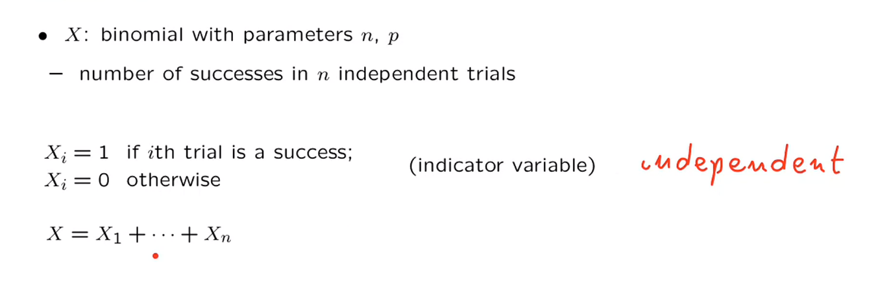
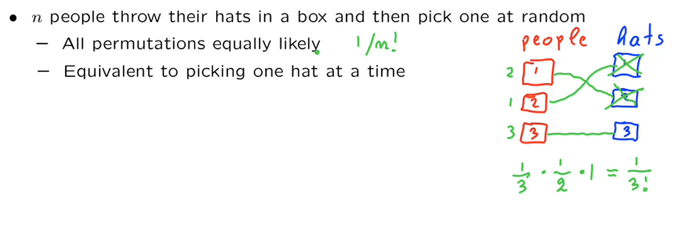

# Unit 4: Discrete random variables

## Lec. 7: Conditioning on a random variable; Independence of r.v.'s

* Conditional PMFs
  * Conditional expectations
  * Total expectation theorem
* Independence of r.v.’s
  * Expectation properties
  * Variance properties
* The variance of the binomial
* The hat problem: mean and variance

### Conditional PMFs

一般情况的条件概率模型如下(用小写是为了x表示具体的一种情况):
$\displaystyle P_{X \mid A}(x)=P(X=x \mid A)$

Note: The notation $p_{X|A}(x\, |\, A)$ should be $p_{X|A}(x)$ .

>This is because A is an event not a random variable. And for consistency, we can't make A an argument of the pmf function since the pmf can only take a random variable as an argument per definition. Moreover, Events are normal sets and can only be a unique outcome anytime that event occurs, but the random variable could take more than one values, which are denoted by the small x.

假设事件A也是也是一个随机变量：$A=\{Y=y\}$,那么有多个随机变量的条件概率模型是：
$\displaystyle P_{X \mid Y}(x \mid y )= P(X = x \mid Y = y)= \frac{P(X=x,Y=y)}{P(Y=y)}$

将这种形式转化成PMF的形式，引出了多个条件变量的条件概率的定义(conditional PMF)：
$\displaystyle P_{X \mid Y}(X, Y)=\frac{P_{X,Y}(x,y)}{P_Y(y)}$，这个定义式要求$P_Y(y)大于0$

以下是一个示例：

* $Y=2, \quad P_Y(2)= 0 + \frac{1}{20}+ \frac{3}{20}+ \frac{1}{20}=\frac{5}{20}= \frac{1}{4}$
* $ P_{X \mid Y}(1 \mid 2)= 0$
* $ P_{X \mid Y}(2 \mid 2)= \frac {\frac{1}{20}}{\frac{1}{4}}= \frac{1}{5}$

归纳formula：

* $\displaystyle P_{X,Y}(x,y)= P_Y(y)P_{X \mid Y}(x \mid y)$
  * $ \displaystyle P_{X,Y}(2,2)=P_Y(2)P_{X \mid Y}(2 \mid 2)= \frac{1}{4} \times \frac{1}{5}= \frac{1}{20}$

* $\displaystyle P_{X,Y}(x,y)= P_X(x)P_{Y \mid X}(y \mid x)$

#### Conditional PMFs involving more than two r.v.'s

* Self-explanatory notion

  * $\displaystyle P_{X \mid Y,Z}(x \mid y,z)= P(X=x \mid Y = y,Z =z)= \frac{P(X=x,Y=y,Z=z)}{P(Y=y,Z=z)} = \frac{P_{X,Y,Z}(x,y,z)}{P_{Y,Z}(y,z)} $

  * $\displaystyle P_{X,Y \mid Z}(x,y \mid z)= \frac{P(Z=z)}{P(X=x,Y=y)}= \frac{P_{Z}(z)}{P_{X,Y}(x,y)}$

* Multiplication Rules
  * $\displaystyle P_{X,Y,Z}(x,y,z)=P_{X}(x)P_{Y \mid X}(y)P_{Z \mid X,Y}(z \mid x,y)$
  * 他的推导过程源自将多个参数的条件概率的事件换成条件变量。

##### exercise

$\displaystyle {\sum _x p_{X,Y\mid Z}(x,y\mid z)=1}
$

solution:

False. The left-hand side is a function of $y$ , whereas the right-hand side is not.

### Conditional expectation and the total expectation theorem

#### condition expectation

一般的条件概率期望：$\displaystyle E[X \mid A]= \sum_x xP_{X \mid A}(x \mid A)$

假设A为$\displaystyle \{Y=y\}$，那么当A是一个条件变量的时候：
$\displaystyle E[X \mid A]= E[X \mid Y = y]=\sum_{x}xP_{X \mid Y}(x\mid y)$

$\displaystyle E[ g(x)\mid A]= E[g(x) \mid Y = y]=\sum_{x}g(x)P_{X \mid Y}(x\mid y)$

#### Total probability and expectation theorms

* $\displaystyle A_1,A_2,A_3, \cdots,A_n,$ partiton of $\displaystyle \varOmega$

* $P_X(x)= P(A_1)P_{X \mid A_1}(x) +P(A_2) P_{X \mid A_2}(x) +P(A_3) P_{X \mid A_3}(x) + \cdots +P(A_n) P_{X \mid A_n}(x)$

$A = \{Y=y\}$

$\displaystyle P_X(x)= \sum_{y}P_Y(y)P_{X \mid Y}(x \mid y) $

* $\displaystyle E[X]= \sum_x xP(x)= \displaystyle P(A_1)E[X \mid A_1] + P(A_2)E[X \mid A_2] +\cdots + P(A_n)E[X \mid A_n] \\
= \sum_y P_Y(y)E[X \mid Y=y] $

以上的公式假设将样本空间划分成有限的离散的集合。但是如果是将其划分为无限的集合之中以上的结论实际上仍然是存在的。
Total probability 可以使用加法定理证明，但期望超出了这门课的范围。

#### Exercise: The expected value rule with conditioning
* $\displaystyle {{\bf E}[g(X,Y)\mid Y=2]}$
* $p_{X,Y\mid Y}(x,2\mid 2)=\mathbf{P}(X=x, Y=2\mid Y=2)=\mathbf{P}(X=x\mid Y=2)=p_{X\mid Y}(x\mid 2),
$

If Y equals to particular number, say $Y=y_0$, then $P_{X,Y}(x,y_0)$ is almost equal to the conditional probability $P(X=x|Y=y_0)
$, except that:

you always have$\sum_{all \ x}P(X=x|Y=y_0) = 1$
 
but $\sum_{all \ x}p_{XY}(x, y_0)$ is not necessarily equal to 1.

$\displaystyle {{\bf E}[g(X,Y)\mid Y=2]} =\sum_x \sum_y g(x,y)p_{X,Y \mid Y=2}(x,y \mid Y =2) = \sum_x g(x,2)P_{X \mid Y}(x \mid Y=2)$

### Independence of random variables

通常情况下，事件的独立性：$\displaystyle P(A \cap B)= P(A)P(B)$

一个事件和随机变量：$P(X =x \quad and \quad B)= P(X=x)P(B)$,for all x

两个随机变量：$P(X=x \quad and \quad Y=y)= P(X=x)P(Y=y)$,for all x,y
它等效于$\displaystyle P_{X,Y}(X,Y)=P_X(X)P_Y(Y)$,for all x,y
* $\displaystyle P_{X \mid Y}(x \mid y)=P_X(x)$
* $\displaystyle P_{Y \mid X}(y \mid x)=P_Y(y)$

对于三个随机变量：$P_{X,Y,Z}(x,y,z)=P_X(x)P_Y(y)P_Z(z)$,for all x,y,z

独立性的直观解释是什么呢？它意味着关于某些随机变量的信息不会改变你对其他随机变量的概率的信念。任何条件概率和条件概率质量函数都将与无条件概率相同。在现实世界中，独立性模型描述了每个随机变量是以一种分离的方式生成的，即在单独的概率实验中生成。这些概率实验彼此不相互作用，并且没有共同的不确定性来源。

假设随机变量 $\displaystyle X$ 在给定 $\displaystyle Y=y$ 的条件下的概率质量函数（PMF）对于所有满足 $\displaystyle p_{Y}(y)>0$ 的 $\displaystyle y$ 都是相同的。这是否足以保证独立性？

### Example: independence and condition independence

如图所示，能够判断随机变量$X \,Y$相互独立吗？

这里采取直观的方法来解释，对于$X$的边缘PMF，$X = 1, \quad P_X(1)=3/20$，假设$Y=1$，那么$P_{X\mid Y}(1 \mid 1)=0$。

在已经知道$Y=1$发生时，$X= 1$发生的概率由$\frac{3}{20}$变为0。Y会对X的belifs产生影响，所以是非独立的。

现在假设$X \leq 2 \quad and \quad Y \geq 3$,那么在这个假设下是否是独立的。

>  In this case, we are talking about conditional probability, which should also follows the probability axiom and therefore need to satisfy the property that sum up to 1.

由图可知，$P_{X,Y}(x,y)=P_X(x)P_Y(y)$，所以在这种情况下，X和Y存在独立性,X不会给任何关于Y的信息。

### Independence and expectations

* 一般来说并不存在直接的关系：$E[g(X,Y)] \neq g(E[X],E[Y])$

期望一般有如下性质：
* $E[aX + b]= aE[X] + b$
* $E[X + Y + Z] = E[X] + E[Y] + E[Z]$ always true。

但是，如果$X \,Y$是独立的：$E[XY]=E[X]E[Y]$
$g(X) \, and \, h(Y)$也是独立的：$E[g(X)h(Y)]=E[g(X)]E[h(Y)]$

**Prove**：
令$g(x,y)=xy\qquad E[g(X,Y)]$

$E[g(X,Y)]= \sum_x \sum_y xyP_{X,Y}(x,y)$

$P_{X,Y}(X,Y)=P_X(X)P_Y(Y)$, because it's independence.

$E[g(X,Y)]= \sum_x xP_X(X)\sum_y y P_Y(Y)=E[X]E[Y]$

### Independence, variances, and the binomial variance

方差所具有的性质：$Var(aX)=a^2Var(X) \qquad Var(X + b)= Var(X)$

一般情况下，和的方差不能拆封成两个方差的和：$Var(X + Y) \neq Var(X) + Var(Y)$

但是当X和Y相互是独立时，这个关系是成立的。

**Prove:**

假设$E[X]=0 \quad E[Y]=0$，只是为了方便运算。

X和Y是相互独立的，所以存在$E[XY]=E[X]E[Y]$。

$Var(X + Y)=E[(X + Y - 0)^2] = E[X^2 - 2XY + Y^2]= E[X^2] + E[Y^2]  + E[2XY]$，这个式子的推导来源于每一项的定义和拆分技巧。

$E[(X - 0)^2]=Var(X)$

$E[(Y - 0)^2]=Var(Y)$

所以原式为：$Var(X) + Var(Y) + 0 $

由此可以推出：$Var(X + Y )=Var(X) + Var(Y) $

Example：

- if X = Y: $Var(X + Y)=Var(2X)=4Var(X)$ 利用方差的普通的属性。

- if X = -Y: $Var(X + Y)= Var(0)= 0$

- if X,Y independence : $Var(X - 3Y)=Var(X) + Var(-3Y) = Var(X) + 9Var(Y)$

#### Variance of the binomial

根据上面推导的关系，可以将n个独立的二项式实验拆分成一个一个小实验。那么计算方差的方法可以简化为：$Var(X)=Var(X_1) + Var(X_2) + Var(X_3) + \cdots + Var(X_n) = n Var(X_1)=np(1-p)$s

### The hat problem

n个人n个帽子，将帽子的分配以序列的方式展现，每一种排序等可能性，所以如果有n个人，就会有n！个排列。

第二种分析的模型是：第一个人从n个帽子中选择一个，第二个人从n-1个人选择一个，同n样可以获得相同的结果。

此处我们选择的是第一种模型。

定义X：正确的人取得自己帽子的数量。

#### 计算$X$的期望：

倘若i直接使用期望的定义计算：$\displaystyle E[X]= \sum_x x P_X(x)$，在计算X单独输出的值的概率时，需要分别单独计算，在数值较大时很困难。

将$X$拆分成：$X_1,X_2,X_3,X_4, \cdots,X_n$

$X_i$为第i次试验的indicator R.V.,若取得正确的帽子则输出为1,错误则输出为0。
indivator R.V.的期望是p。

在此处使用期望的线性性质：$E[X]=E[X_1] + E[X_2] + E[X_3]+ \cdots + E[X_n]$

$P_{X_i}(x)$概率的来源：

* 这里针对帽子进行排序。
* 对于第i次试验,固定这个位置，对于其他的n - 1个位置排序有$(n-1)!$种情况,总共会有$n！$种情况,所以存在$\displaystyle P_{X_i}(1)= \frac{n-1!}{n!} = \frac{1}{n}$。
* 对于任意的i,他的概率都满足上式，所有全都是$\displaystyle \frac{1}{n}$

由此可以计算出$\displaystyle E[X_i]=\frac{1}{n} \qquad E[X]=n * \frac{1}{n}=1$

>When the first slot of hat is fixed, there is n-1 choices for 2nd slot. But since the first slot will change to every possible hat, we still have n all  choices for 2nd slot and the same for i-th slot. 
>The assignments of the hats compose the complete permutations of the hats which is our sample space with size $n!$ . For each position i, considering all assignments (sequences), each hat will appear there (at i-th position in all assignments/sequences) with $n!/n = (n-1)!$ times and this is same for all s. Assume all permutations have same probability, the probability of having particular hat is then $(n-1)!/n! = 1/n$ . This is calculated by counting the number of assignments/sequences which have the particular hat at i-th position($(n-1)!$calculated above)divided by the total number of the assignments (n!). Therefore $E[X_i] = E[X_1] = 1/n$.
>If $n!/n$ is not obvious to you, you can also count the assignments which have particular hat at i-th position with the following thought: fix i-th position and change the order of all other positions and you will get the same $(n-1)!$.

>这段材料讨论了关于“帽子问题”的问题。在这个问题中，有n个人，每个人都有一顶帽子，然后帽子被随机洗牌分配给这些人。文章试图解释每个人得到自己帽子的期望概率。
文章首先考虑了每个位置上帽子的分配情况。当第一个位置上的帽子被确定后，第二个位置上有n-1种选择。但由于第一个位置的帽子会变化到每个可能的帽子，第二个位置仍然有n种选择，第i个位置也是如此。这意味着每个位置上的帽子选择是对称的。
接下来，文章考虑了所有帽子分配的情况，构成了帽子的完整排列，作为样本空间，大小为n!。对于每个位置i，考虑所有的分配（序列），每个帽子将会出现在那里（在所有分配/序列的第i个位置上）$n!/n = (n-1)!$次，对所有的s都是一样的。假设所有的排列具有相同的概率，那么拥有特定帽子的概率就是$(n-1)!/n! = 1/n$。这是通过计算具有特定帽子在第i个位置的分配/序列的数量（上面计算得到的$(n-1)!$）除以总分配数（n!）来计算的。因此，$E[X_i] = E[X_1] = 1/n$，表示每个人得到自己帽子的期望概率是1/n。
文章最后指出，如果$n!/n$对你来说不是很明显，你还可以通过以下思路计算在第i个位置上有特定帽子的分配数：固定第i个位置，并改变所有其他位置的顺序，你将得到相同的$(n-1)!$。这是因为在这个操作下，只有第i个位置上的帽子在变化位置，其他位置上的帽子是不变的，所以共有$(n-1)!$种不同的排列方式。

#### The Variance in hat problem

此处如果可以证明随机变量$X_i$是相互独立的，那么ao就可以使用独立性下随机变量方差的性质做出上面类似期望的处理。

假设帽子的数量是2,如果我们知道第一个人取得的帽子是自己的，那么第二个人娶得帽子就一定是自己的。否定也是一样的情况。

对于n的情况，假设我们已经得知n-1所有的取得的i帽子的情况，也会出现上述同样的问题，所以据此可以判断，$X_i$并不是独立的。

对于计算方差，一般使用简化式计算通常会比较方便：$Var(X)=E[X^2]-(E[X]^2)$

* $X = X_1 + X_2 + X_3 + \cdots + X_n $
* $\displaystyle X^2 = \sum_{i} X_{i}^2 + \sum_{i,j: i \neq j} X_i X_j$，项数分别是n和 $n^2 - n$
* $X_i = 1 \, or \,0$

$\displaystyle E[X^2] =E[\sum_{i} X_{i}^2 + \sum_{i,j: i \neq j} X_i X_j ] $，利用线性性质，拆分成n个平方项期望和$n^2 - n$个$X_iX_j$期望。

因为$X_i$是Bonuli V.B.,$X_i$等效于$X_i ^2$
$\displaystyle E[X_i ^2] = E[X_i]=1 \times P_{X_i}(1) = \frac{1}{n}$

$\displaystyle E[X_i X_j]= 1 \times P_{X_i,X_j}(1,1) = P(X_i=1 \, X_j=1)= P(X_i = 1)P(X_j=1 \mid X_i=1) = \frac{1}{n} \times \frac{1}{n - 1}$

一个人得到自己的帽子的概率是1/n。在给定第一个人得到自己的帽子的情况下，第二个人面临的情况是有n-1顶可用的帽子。其中一顶是那个人的帽子。因此，第二个人也会选择自己的帽子的概率是1除以n-1。

现在，我们已经可以计算X的平方的期望值了。X的平方的期望值由n个期望值的和组成，每个期望值都等于1/n，再加上很多期望值，因为我们有很多项，每一项都是1/n乘以1除以n-1。我们看到这里有一些相互抵消的部分。我们得到了抵消，得到了1加1，等于2。

另一方面，我们有这个需要减去的项。我们之前找到过X的期望值等于1。所以我们需要减去1。我们问题的最终答案是X的方差也等于1。

综合以上，$Var(X) = 2 - 1 = 1$

**summary**

在这个问题中，我们看到我们可以处理相当复杂的模型，但是通过将它们分解成更易处理的部分，首先将随机变量X分解成不同的随机变量的和，然后将其平方并将其分解成许多不同的项，然后逐一考虑每一项，我们通常可以得到解决问题的解答或答案，而这些问题在其他情况下可能会非常困难。