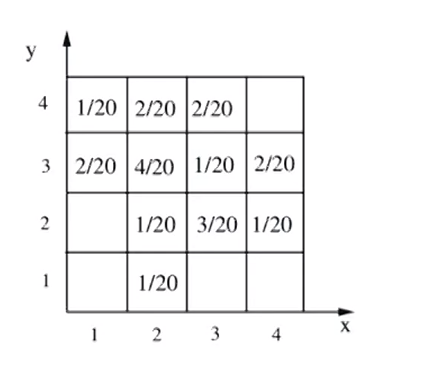
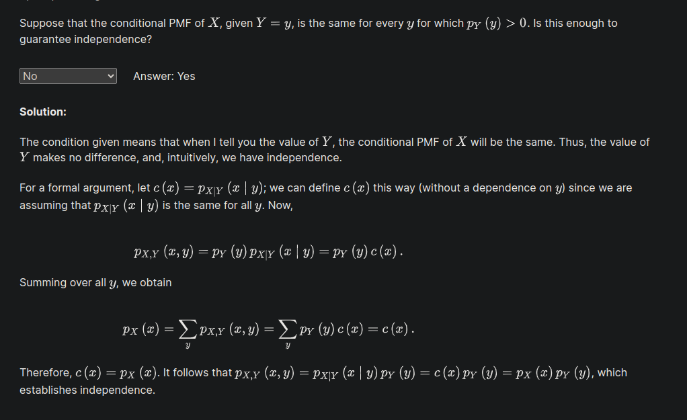
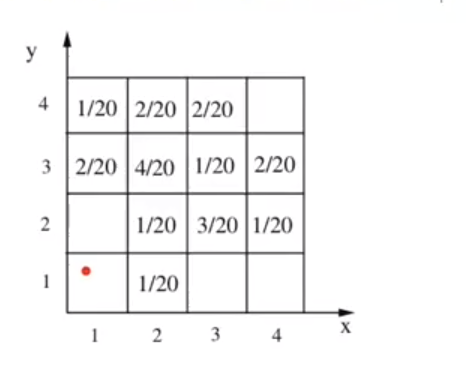
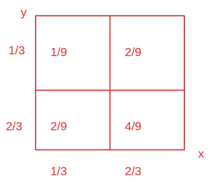

# Unit 4: Discrete random variables

## Lec. 7: Conditioning on a random variable; Independence of r.v.'s

* Conditional PMFs
  * Conditional expectations
  * Total expectation theorem
* Independence of r.v.’s
  * Expectation properties
  * Variance properties
* The variance of the binomial
* The hat problem: mean and variance

### Conditional PMFs

一般情况的条件概率模型如下(用小写是为了x表示具体的一种情况):
$\displaystyle P_{X \mid A}(x)=P(X=x \mid A)$

Note: The notation $p_{X|A}(x\, |\, A)$ should be $p_{X|A}(x)$ .

>This is because A is an event not a random variable. And for consistency, we can't make A an argument of the pmf function since the pmf can only take a random variable as an argument per definition. Moreover, Events are normal sets and can only be a unique outcome anytime that event occurs, but the random variable could take more than one values, which are denoted by the small x.

假设事件A也是也是一个随机变量：$A=\{Y=y\}$,那么有多个随机变量的条件概率模型是：
$\displaystyle P_{X \mid Y}(x \mid y )= P(X = x \mid Y = y)= \frac{P(X=x,Y=y)}{P(Y=y)}$

将这种形式转化成PMF的形式，引出了多个条件变量的条件概率的定义(conditional PMF)：
$\displaystyle P_{X \mid Y}(X, Y)=\frac{P_{X,Y}(x,y)}{P_Y(y)}$，这个定义式要求$P_Y(y)大于0$

以下是一个示例：

* $Y=2, \quad P_Y(2)= 0 + \frac{1}{20}+ \frac{3}{20}+ \frac{1}{20}=\frac{5}{20}= \frac{1}{4}$
* $ P_{X \mid Y}(1 \mid 2)= 0$
* $ P_{X \mid Y}(2 \mid 2)= \frac {\frac{1}{20}}{\frac{1}{4}}= \frac{1}{5}$

归纳formula：

* $\displaystyle P_{X,Y}(x,y)= P_Y(y)P_{X \mid Y}(x \mid y)$
  * $ \displaystyle P_{X,Y}(2,2)=P_Y(2)P_{X \mid Y}(2 \mid 2)= \frac{1}{4} \times \frac{1}{5}= \frac{1}{20}$

* $\displaystyle P_{X,Y}(x,y)= P_X(x)P_{Y \mid X}(y \mid x)$

#### Conditional PMFs involving more than two r.v.'s

* Self-explanatory notion

  * $\displaystyle P_{X \mid Y,Z}(x \mid y,z)= P(X=x \mid Y = y,Z =z)= \frac{P(X=x,Y=y,Z=z)}{P(Y=y,Z=z)} = \frac{P_{X,Y,Z}(x,y,z)}{P_{Y,Z}(y,z)} $

  * $\displaystyle P_{X,Y \mid Z}(x,y \mid z)= \frac{P(Z=z)}{P(X=x,Y=y)}= \frac{P_{Z}(z)}{P_{X,Y}(x,y)}$

* Multiplication Rules
  * $\displaystyle P_{X,Y,Z}(x,y,z)=P_{X}(x)P_{Y \mid X}(y)P_{Z \mid X,Y}(z \mid x,y)$
  * 他的推导过程源自将多个参数的条件概率的事件换成条件变量。

##### exercise

$\displaystyle {\sum _x p_{X,Y\mid Z}(x,y\mid z)=1}
$

solution:

False. The left-hand side is a function of $y$ , whereas the right-hand side is not.

### Conditional expectation and the total expectation theorem

#### condition expectation

一般的条件概率期望：$\displaystyle E[X \mid A]= \sum_x xP_{X \mid A}(x \mid A)$

假设A为$\displaystyle \{Y=y\}$，那么当A是一个条件变量的时候：
$\displaystyle E[X \mid A]= E[X \mid Y = y]=\sum_{x}xP_{X \mid Y}(x\mid y)$

$\displaystyle E[ g(x)\mid A]= E[g(x) \mid Y = y]=\sum_{x}g(x)P_{X \mid Y}(x\mid y)$

#### Total probability and expectation theorms

* $\displaystyle A_1,A_2,A_3, \cdots,A_n,$ partiton of $\displaystyle \varOmega$

* $P_X(x)= P(A_1)P_{X \mid A_1}(x) +P(A_2) P_{X \mid A_2}(x) +P(A_3) P_{X \mid A_3}(x) + \cdots +P(A_n) P_{X \mid A_n}(x)$

$A = \{Y=y\}$

$\displaystyle P_X(x)= \sum_{y}P_Y(y)P_{X \mid Y}(x \mid y) $

* $\displaystyle E[X]= \sum_x xP(x)= \displaystyle P(A_1)E[X \mid A_1] + P(A_2)E[X \mid A_2] +\cdots + P(A_n)E[X \mid A_n] \\
= \sum_y P_Y(y)E[X \mid Y=y] $

以上的公式假设将样本空间划分成有限的离散的集合。但是如果是将其划分为无限的集合之中以上的结论实际上仍然是存在的。
Total probability 可以使用加法定理证明，但期望超出了这门课的范围。

#### Exercise: The expected value rule with conditioning
* $\displaystyle {{\bf E}[g(X,Y)\mid Y=2]}$
* $p_{X,Y\mid Y}(x,2\mid 2)=\mathbf{P}(X=x, Y=2\mid Y=2)=\mathbf{P}(X=x\mid Y=2)=p_{X\mid Y}(x\mid 2),
$

If Y equals to particular number, say $Y=y_0$, then $P_{X,Y}(x,y_0)$ is almost equal to the conditional probability $P(X=x|Y=y_0)
$, except that:

you always have$\sum_{all \ x}P(X=x|Y=y_0) = 1$
 
but $\sum_{all \ x}p_{XY}(x, y_0)$ is not necessarily equal to 1.

$\displaystyle {{\bf E}[g(X,Y)\mid Y=2]} =\sum_x \sum_y g(x,y)p_{X,Y \mid Y=2}(x,y \mid Y =2) = \sum_x g(x,2)P_{X \mid Y}(x \mid Y=2)$

### Independence of random variables

通常情况下，事件的独立性：$\displaystyle P(A \cap B)= P(A)P(B)$

一个事件和随机变量：$P(X =x \quad and \quad B)= P(X=x)P(B)$,for all x

两个随机变量：$P(X=x \quad and \quad Y=y)= P(X=x)P(Y=y)$,for all x,y
它等效于$\displaystyle P_{X,Y}(X,Y)=P_X(X)P_Y(Y)$,for all x,y
* $\displaystyle P_{X \mid Y}(x \mid y)=P_X(x)$
* $\displaystyle P_{Y \mid X}(y \mid x)=P_Y(y)$

对于三个随机变量：$P_{X,Y,Z}(x,y,z)=P_X(x)P_Y(y)P_Z(z)$,for all x,y,z

独立性的直观解释是什么呢？它意味着关于某些随机变量的信息不会改变你对其他随机变量的概率的信念。任何条件概率和条件概率质量函数都将与无条件概率相同。在现实世界中，独立性模型描述了每个随机变量是以一种分离的方式生成的，即在单独的概率实验中生成。这些概率实验彼此不相互作用，并且没有共同的不确定性来源。

假设随机变量 $\displaystyle X$ 在给定 $\displaystyle Y=y$ 的条件下的概率质量函数（PMF）对于所有满足 $\displaystyle p_{Y}(y)>0$ 的 $\displaystyle y$ 都是相同的。这是否足以保证独立性？

### Example: independence and condition independence

如图所示，能够判断随机变量$X \,Y$相互独立吗？

这里采取直观的方法来解释，对于$X$的边缘PMF，$X = 1, \quad P_X(1)=3/20$，假设$Y=1$，那么$P_{X\mid Y}(1 \mid 1)=0$。

在已经知道$Y=1$发生时，$X= 1$发生的概率由$\frac{3}{20}$变为0。Y会对X的belifs产生影响，所以是非独立的。

现在假设$X \leq 2 \quad and \quad Y \geq 3$,那么在这个假设下是否是独立的。

>  In this case, we are talking about conditional probability, which should also follows the probability axiom and therefore need to satisfy the property that sum up to 1.

由图可知，$P_{X,Y}(x,y)=P_X(x)P_Y(y)$，所以在这种情况下，X和Y存在独立性,X不会给任何关于Y的信息。

### Independence and expectations

* 一般来说并不存在直接的关系：$E[g(X,Y)] \neq g(E[X],E[Y])$

期望一般有如下性质：
* $E[aX + b]= aE[X] + b$
* $E[X + Y + Z] = E[X] + E[Y] + E[Z]$ always true。

但是，如果$X \,Y$是独立的：$E[XY]=E[X]E[Y]$
$g(x) \, and \, h(Y)$也是独立的：$E[g(X)h(Y)]=E[g(X)]E[h(Y)]$

Prove：
令$g(x,y)=xy\qquad E[g(X,Y)]$
