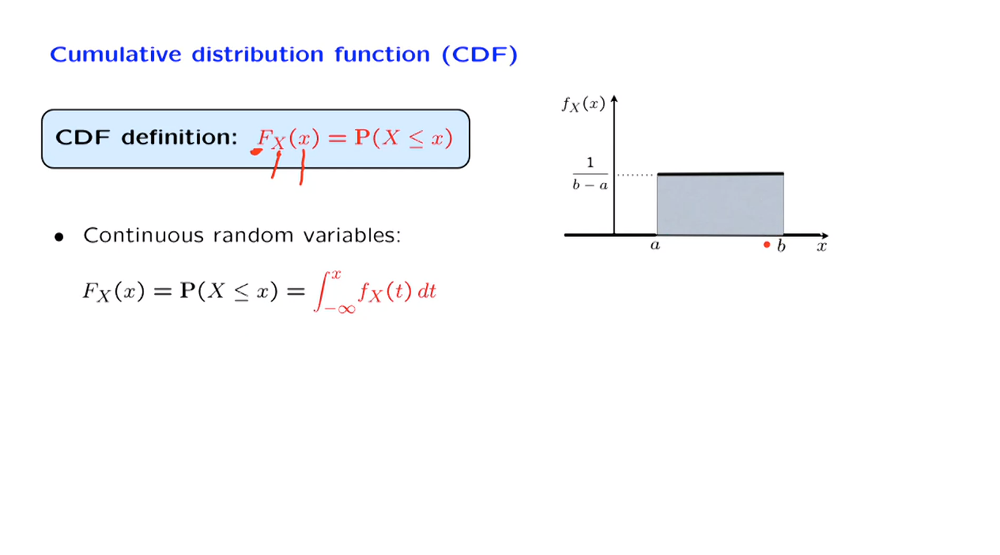

# Unit 5: Continuous random variables

## Unit overview

In this unit, we introduce continuous random variables and their description in terms of probability density functions. We develop analogs of all the concepts and properties that we introduced for the discrete case. We conclude with the development of several versions of the Bayes rule.

## Lec. 8: Probability density functions

### overview

Probability density functions
 Properties
* Examples
* Expectation and its properties
– The expected value rule
– Linearity
• Variance and its properties
• Uniform and exponential random variables
• Cumulative distribution functions
• Normal random variables
– Expectation and variance
– Linearity properties
– Using tables to calculate probabilities

### PDFs

#### PDF对比PMF的描述

离散随机变量的取值是在一个离散的集合中，可能的值被分配的概率总和为1，概率质量函数（PMF）告诉我们每个值被分配的确切概率。

如果是离散的分布，根据概率可加性，就等与$[a,b]$之间所有点的概率之和。也就是左图中所有的bars的高度值和。如果这之中是连续的，则相当于将这之中的空档填满。

PMF将离散随机变量的每一个值赋予了相应的概率，bars的高度就是mass，这是一个点的mass。
而在连续的情况，随机变量的取值是一个区域不再是一些零散的点。整体的概率依然是1,只是现在需要将1分配到所有的可取的点上，也就是某一个区域上，这个分配并不是均匀的，如图像所示，这里引入了密度的想法，PDF描述的是每一个点的概率密度。

阴影部分表示的就是$X$的概率，离散中是单个的和，而在连续之中就是面积。
可以将概率类比为雪的降落，整个实数线上都有一磅的雪。PDF 告诉我们在特定点上积累的雪的高度。然后，我们通过计算曲线下的面积来计算整个区间上积累的雪的总重量。从数学上来说，曲线下的面积就是一个积分。因此，X 落在该区间内的概率等于在该特定区间上的 PDF 的积分。

连续随机变量是一种其概率可以根据一个 PDF 描述的随机变量，根据这种类型的公式。一个重要的点是，一个随机变量取值在一个连续集合上并不足以使其成为我们所称的连续随机变量。对于连续随机变量，我们需要更多的条件，即它可以由一个 PDF 描述，该类型的公式是有效的。
#### PDF具有的属性

类比PMF，首先概率是非负的，所有PMF必然也是非负的。其次PMF的取所有的值之和必然是1,将$a= -\infin \quad b= \infin$，所得积分和是1。

#### PDF的含义

想要计算如图的概率，根据可加定理，分别求出概率，在相加。
左图同时还展示了这个过程中，样本空间发生的变化。整体是最外围的样本空间，但是每一个区间构成了以潜在的样本空间。当我们谈论 X 在一些数字 a 和 b 之间取值的概率时，我们实际上是在谈论那些导致 X 的值位于该特定区间内的结果的概率。这就是概率的含义。
另一方面，一旦我们知道了一个 PDF，我们可以完全忽略底层的样本空间$(-\infin,\infin )$。我们可以通过只使用 PDF 进行我们感兴趣的任何计算$(a,b)$。

取一个变量$\delta$，使用微积分的观点，$P(a \leq x \leq a + \delta)$，等于一个小矩形的面积。这提供了一种解释：$f_X(a)$为单位长度的密度。

PDF 不是概率，而是密度。单位是(概率\单位长度)。如果单位长度的概率有限且长度 delta 趋近于 0，我们将得到概率为 0。更正式地说，如果我们将 b 设置为与 a 相同，我们将得到 X 等于特定点 a 的概率，对应于一个长度为0的区间上的积分，结果将为0。此处得到一个结论：连续随机变量中任何特定点的概率都是0。

一个区间中的无限的点的累加将会具有正概率？
这也正是普通长度概念中发生的情况。单个点的长度为0，但通过将许多点组合在一起，我们可以创建一个具有正长度的集合。

利用可加性公理，随机变量在一个区间内取值的概率等于随机变量取值为 a 的概率加上随机变量取值为 b 的概率，再加上随机变量在 a 和 b 之间的概率。根据我们的讨论，第一个项等于0，第二个项也等于0。因此，我们得出结论，闭区间的概率与开区间的概率相同。在计算概率时，是否包括端点并不重要$P(a \leq x \leq b)=P(a < x < b)$

### Uniform and piecewise constant PDFs  

这是一个连续均匀随机变量的例子,对比离散随型：
1. 连续和离散的均匀模型中，高度都是相同的，但表示的意义不相同。
2. 离散的值是介于a，b之间的整数值，但连续是其之间的所有值。

连续之中，如果在$a,b$之间取等长的区域，那么这两个区域的概率是相同的。直观地说，均匀随机变量模拟了以下情况。我们知道随机变量的数值将在 a 和 b 之间。但我们什么都不知道了。我们没有理由相信某些位置比其他位置更可能。从这个意义上说，均匀随机变量模拟了完全不确定的情况。
总体的面积代表着概率，是1。

最后，这是一个更一般的概率密度函数，它是分段常数的。需要注意的一件事是，特别地，这告诉我们概率密度函数不一定是连续函数。它们可以具有不连续性。当然，为了使这个函数成为一个合法的概率密度函数，曲线下的总面积，即这里的矩形的面积之和，必须等于 1。

对于分段常数的概率密度函数，我们可以相对容易地计算事件的概率。例如，如果您想找到这个特定区间的概率，这个区域的面积实际上由两部分组成。我们计算这两个矩形的面积，将它们相加，这就给出了这个特定区间的总概率。

### Means and Variances

离散的期望与连续的期望定义上是保持一致的，都是计算加权的值的和。
所不同的是，离散使用的是的PMF，而连续用的是密度（PDF），求和使用积分替换。

期望的直觉意义在两种环境下依然是相同的——代表了在多次重复的实验中期望出现的值的平均值。
另一个在离散和连续情况下都成立的直观解释是，期望对应于概率分布的重心。在图中以红点和箭头标识出来。如果恰好分布，即 PMF 或 PDF 恰好对称于某一点，那么该点将等于期望值。

离散期望的加权是用PMF，连续的加权是PDF。

另外不做特殊说明，一般认为随机变量的期望是收敛的。为了使这个积分有意义，我们需要做出这样的假设，即根据密度加权的小 x 的绝对值的积分会得到一个有限的结果。除非我们明确说了不同的事情，我们总是假设我们正在处理满足这个条件的随机变量。因此，期望在数学上是被很好地定义的。

#### 期望的属性

除了定义上的表达的差别，其他基本上是一致的。

#### 方差的属性

### Mean and variance of the uniform

计算连续和离散均匀分布的期望会发现两者的值是相同的（按照图中的情况），都是$\frac{a+b}{2}$，通过公式计算方差为$\displaystyle \frac{(b-a)^2}{12}$，标准差为$\displaystyle \frac{b-a}{12}$。

通过最后的结果可以发现，均匀连续分布的标准差只与$b \quad a$的值有关，其差值越大，标准差就越大，即标准差捕捉了特定分布的宽度。

### Exponential random variables

此处引入了一个新的随机变量——指数随机变量。在离散的分布中有一个与它对应的分布——几何分布。前者可以看作是后者的延伸。

指数随机变量的图像如左图所示，在负数部分，概率密度是0，即不可能发生。同时$\lambda$取值的大小也会影响图像的起点位置和衰减的速度：$\lambda$越大，起点位置越高，但相应的衰减的越快。

#### 指数随机变量的概率的计算

此处需要计算$\displaystyle \int_a^\infin{\lambda e^{-\lambda x}d}x$。对于形如$\displaystyle \int {e^{ax}d}x$积分可得$\displaystyle \frac{1}{a} e^{ax}$。用$a= -\lambda$替换，最后计算可得到表达式$\displaystyle e^{-\lambda a}$。
此处如果，将$a=0$，表达式的值是1。

计算完成概率之后，开始计算期望。
使用期望的定义，$\displaystyle E[X]= \int _0^\infin x f_x(x)dx$

图中给出的期望值与离散的几何分布的期望值的形式非常类似。

#### 模拟的现实
指数随机变量被用来模拟许多重要的现实世界现象。通常，它模拟了我们必须等待某事发生的时间。在离散情况下，几何随机变量模拟了我们首次看到成功的时间。在连续情况下，指数可以用来模拟顾客到达的时间、灯泡烧坏的时间、机器损坏的时间、您收到电子邮件的时间，或者甚至是流星坠落到您家的时间。

### Cumulative distribution functions

在上一节的讨论之中，已经发现离散和连续有很多的东西是保持一致的，比如期望的线性性质。这使得我们想要找到一种描述离散和连续分布的方法，使得不需要离散和连续。

以上就是CDF诞生的目的，称之为累积分布函数。它是一个单参数函数，给出随机变量取小于或等于这个特定小 x 的值的概率。总是使用大写 F 来表示 CDF。并且总会有一些下标来指示我们正在谈论哪个随机变量。

CDF 的美妙之处在于它只涉及概率，这是一个无论我们处理什么类型的随机变量都有明确定义的概念。因此，特别是如果 X 是一个连续随机变量，X 小于或等于某个数字的概率，就是从负无穷到那个数字的范围内的 PDF 的积分。

以上是一个连续的均匀分布的随机随机变量的PDF的图像，下方是对因的CMF的图像。对于x落在a之前，ab中间，b之后分别对应着$f_x$的面积为：0,部分，1。

CDF之所以很有用，是因为一旦我们知道随机变量的 CDF，我们就有足够的信息来计算任何我们可能想要计算的内容。

对b点求导，得到的刚好是f中的$a,b$之间的值。

根据图像关系，F与f实际上就是求导和积分。对F求导就是f，f积分就是F。对于定义在$(3,4)$间的连续均匀分布，这个等式是因为概率的可加性属性。这个事件被分解为两个可能的事件。要么 x 小于等于 3，要么 x 大于 3 但小于等于 4。
但是现在我们认识到，如果我们知道随机变量的 CDF，那么我们就知道这个数量。我们也知道这个数量，这使我们能够计算这个数量。

f与F只有在F有导数才是成立的。

#### 有PMF描述的离散随机变量

尝试计算相应的 CDF($F_x$)。小于这个数字的概率，例如，等于 0。一直到 1，获得随机变量值小于那个的概率是 0。
但是，如果让 x 等于 1，那么我们正在谈论的是随机变量取小于或等于 1 的值的概率。因为这包括值 1，所以这个概率将等于 1/4。这意味着一旦我们到达这一点，CDF 的值变为 1/4。
在这一点，CDF 跳了一下。在 1，CDF 的值等于 1/4。就在 1 之前，CDF 的值等于 0。现在 x 等于 2，左边的概率是多少？在这种情况下，这个概率仍然是 1/4。
在这个区间内，随着我们继续向内移动，概率没有变化。所以 CDF 保持不变，直到某一点我们到达值为 3。在这一点，随机变量取小于或等于 3 的概率将是一个 3 的概率加上一个 1 的概率，变为 3/4。
对于此区间内的任何其他 x，随机变量取小于这个数字的概率将保持在 1/4 加 1/2，所以 CDF 保持不变。在此点，小于等于 4 的概率，此概率变为 1。所以 CDF 再次跳至值为 1。

**对于离散随机变量，CDF 的形式就是一个阶梯函数。它从 0 开始，最终达到 1。它在 PMF 分配正质量的地方跳跃。跳跃的大小恰好等于 PMF 的相应值。&&**

#### General CDF properties

#### Exercise

### Normal random variables

#### 正态分布标准形式

解释标准正态分布PDF：
1. 首先整体是以e为底的指数函数。
2. $\displaystyle \frac{-x^2}{2}$，随着X绝对值的增大，整体是增大的。取负数，则向两边延伸是缩小（蓝色部分）。
3. 常数部分：$\displaystyle \int _{-\infin}^{\infin}e^{\frac{-x^2}{2}}dx = \sqrt{2 \pi}$ 为了使得概率是1，添加常数部分。

期望和方差

标准正太本身是关于$x=0$对称的，所以$\displaystyle E[x]=0$

方差为1

#### 正态分布的一般形式

指数部分关于$\mu$对称。

为了更好地理解σ在这个PDF中的作用，让我们考虑σ很小的情况，看看图片会如何改变。当σ很小时，我们绘制二次函数，σ很小意味着这个二次函数变得更大，所以它上升得更快，我们得到一个更窄的二次函数。在这种情况下，负指数将会迅速下降。因此，当σ很小时，我们得到的PDF是一个更窄的PDF，这会反映在方差也较小的属性中。

#### 正态分布的线性函数

有一个特殊情况需要注意。假设a等于0。在这种情况下，随机变量Y只是等于b。它是一个常数随机变量。它没有概率密度函数（PDF）。它是一个退化的离散随机变量。

那么这个事实是否正确，Y也是正态分布的？嗯，我们将采用这个约定。当我们有一个离散随机变量，它是常数，它取一个常数值。我们可以将其视为正态的特殊退化情况，均值等于b，方差等于0。即使它是离散的，而不是连续的，我们仍将把它视为正态随机变量的一种退化类型，并通过采用这个约定，无论a是否等于0，一个正态随机变量的线性函数总是正态分布的。

### Calculation of normal probabilities

标准正态的累积分布函数的简写表示，$\displaystyle \phi$

如果我们想要计算Φ（-2）的值怎么办？从图上看，这是一个标准正态分布。这是-2。我们希望计算这个概率。

在表格中没有直接给我们这个概率，但我们可以这样论证。正态PDF是对称的。因此，如果我们看2，那么这里的概率，即Φ（-2），与那个尾部的概率是相同的。那个尾部的概率是多少？是1，即曲线下的整体面积，减去曲线在达到值2时的面积。因此，这个数量将与Φ（-2）相同。而这个我们现在可以从表格中得到。它是1减去——让我们看看，2在这里。是1减去0.9772。

标准正态表格为标准正态随机变量提供了与其相关的概率。

#### 对于非标准化的正态分布的概率计算

 

一个通用的技巧，可以应用于随机变量，步骤如下。让我们定义一个新的随机变量Y，如下所示。Y衡量的是X距离均值的距离。但由于我们除以标准差σ，它以标准偏差的单位衡量这个距离。因此，如果Y等于3，这意味着X距离均值3个标准偏差。一般来说，Y衡量你距离均值有多少个标准偏差。这个随机变量有什么特性呢？Y的期望值将等于0，因为我们有X并且我们正在减去X的均值。所以这个项的期望值等于0。

那方差呢？每当我们将一个随机变量乘以一个常数时，方差会乘以该常数的平方。所以我们得到这个表达式。但是X的方差是σ的平方。所以这等于1。所以从X出发，我们获得了一个与之紧密相关的随机变量Y，它具有均值0和单位方差。

如果恰好X是一个正态随机变量，那么Y将会是一个标准正态随机变量。因此，我们成功地将X与一个标准正态随机变量相关联。也许您可以将这个表达式重写为这个形式，X等于μ加σY，其中Y现在是一个标准正态随机变量。因此，与其计算与X相关的计算，我们可以尝试以Y为基础进行计算。而且对于Y，我们有可用的表格。让我们看一个示例，演示如何做到这一点。

计算与一般正态随机变量相关的概率的方法是将我们想要计算的事件表达为标准正态随机变量。然后使用标准正态表格。让我们看看如何用示例来说明这一点。

#### 示例

假设X服从均值为6，方差为4的正态分布，因此标准差σ等于2。并且假设我们想要计算X落在2和8之间的概率。下面是我们的做法。

这个事件与X减去6的值在2减去6和8减去6之间的事件相同。这个事件与我们最初感兴趣的事件是相同的。我们还可以将这个不等式的两边都除以标准差。现在，感兴趣的事件已经以这种形式被表达出来。

但此时我们认识到，这是X减去μ除以σ的形式。因此，这里的随机变量是一个标准正态随机变量。因此，X落在2和8之间的概率与标准正态随机变量（称为Y）在这些数值之间的概率相同，即-4除以2，即-2，然后Y小于1。

现在我们可以使用标准正态表格来计算这个概率。这里是1，这里是-2。我们想要找到标准正态落在这个范围内的概率。这是它小于1的概率。但是我们需要减去那个尾部的概率，以便只剩下这个中间区域。

因此，这是Y小于1的概率减去Y小于-2的概率。最后，正如我们之前讨论过的，Y小于-2的概率是1减去Y小于或等于2的概率。

现在我们可以去正态表格中，找到我们感兴趣的值，即Y小于1的概率，Y小于2的概率，然后将这些代入。这就给出了我们所需的概率。再次强调，关键的步骤是将感兴趣的事件，通过减去均值并除以标准差，在等价的形式下表达出来，但现在涉及到一个标准正态随机变量。然后最终使用标准正态表格。

