# Unit 5: Continuous random variables

## Lec. 9: Conditioning on an event; Multiple r.v.'s

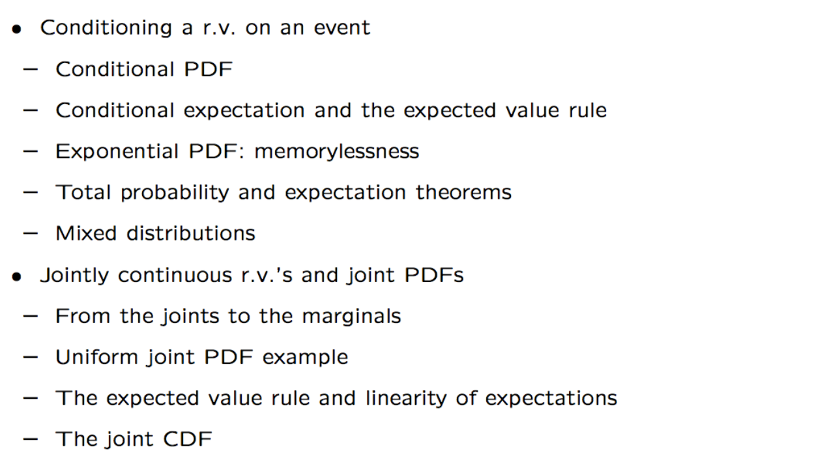

### Conditioning a continuous random variable on an event

#### Conditional PDF, given an event

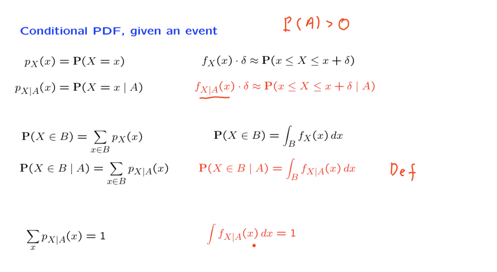

类比离散条件随机变量，可以的出条件PDF的定义。
PDF的表达式后面都有一个$\delta$,表示一小段区间。
一个事件B的概率就是这个这个事件中所有可能的值的概率值和。对应PDF就是某一个具体区间的积分。
由此根据类比可以得到conditional PDF def。条件概率密度函数是一个允许我们通过在事件或感兴趣的集合上积分这个函数来计算概率的函数。在已经知道了事件A发生之后，依然要保持概率值和是1,因为之外的可能的取值（区间）发生的概率是0。

#### 事件A发生下的，有关X的PDF

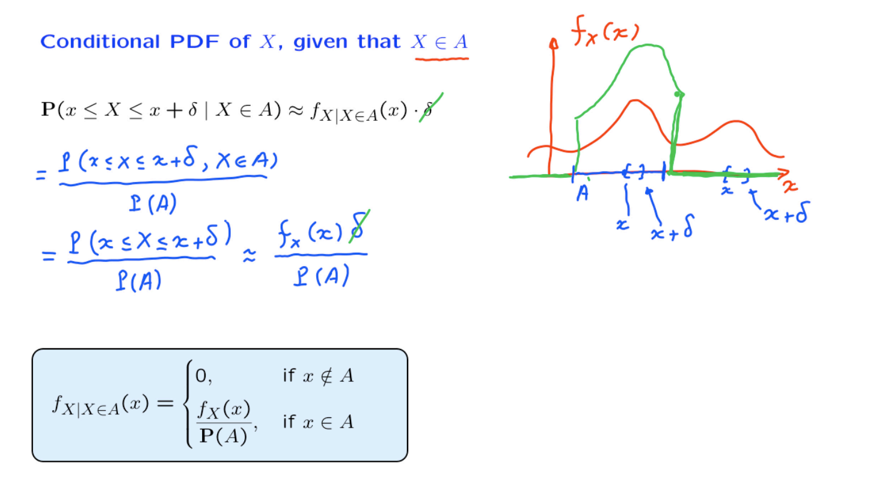

根据右边表达式simple，等式两边cancle $\delta$。
PDF的条件密度表达式分为两种情况，$P(A)$的意义就是保证将A区间积分之后概率是1。

#### 条件的期望
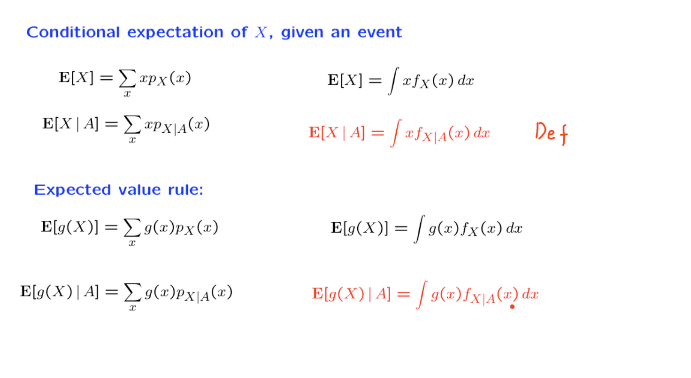

#### Summary

总结一下，在连续情况下进行条件约束与离散情况相比，并没有真正的不同之处。我们只是将求和替换为积分。并且将PMFs替换为PDFs。

### Conditioning example

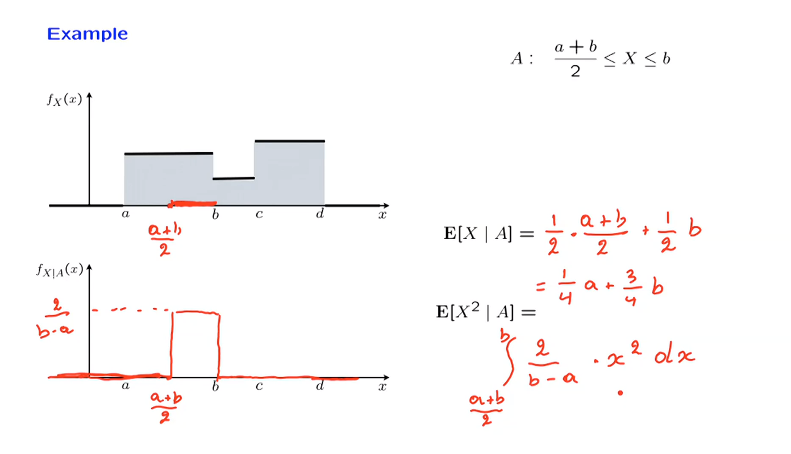

图中的例子是分段的连续的均匀分布，事件A如图所标识。假设事件A发生，那么条件PDF将变为第二副图的形式。
因为要维持概率为1,在事件A必然发生的前提下，底边长度变短，相应的高度就要变长。
$E[x \mid A]$使用了简化的均匀分布的公式，而对于$E[X^2 \mid A]$根据定义，用积分计算。

### Memorylessness of the exponential PDF

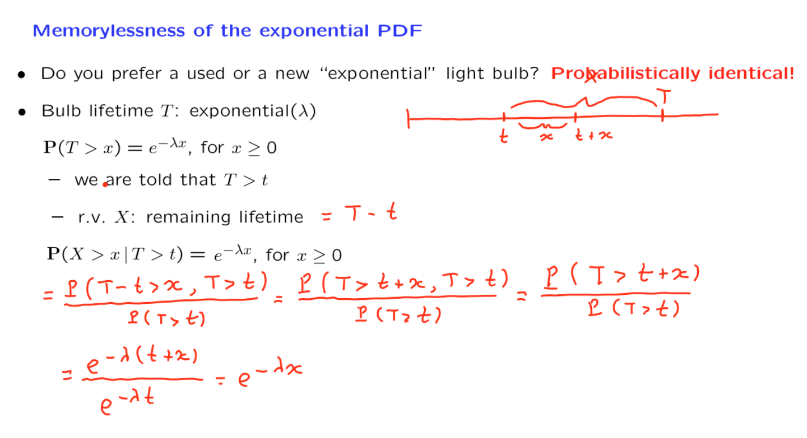

指数分布所具有的特性—— memorylessness，从公式推导上看，因为在条件概率之下，发生一个事件的分布依然是概率分布，且相应的概率表达式与非条件下的概率表达式相同$\displaystyle P(X > x \mid T > t) = P(T > x)$，这两者的表达式是相同的。
推导式运用了条件概率的定义：$\displaystyle \frac{P(A \cap B)}{P(B)} = P(A \mid B)$，正是在这个变换下发现条件和非条件的表达式相同，遂确定了memorylessness的性质。

电灯泡的使用寿命是一个指数分布$e^{-\lambda x}$，在使用$t$的时间之后，剩下能够使用的时间设置一个新的随机变量$X=T-t$。

现在研究在使用$t$的时间之后，灯泡还能继续使用$x$时间的概率(x > 0)，即$P(X > x \mid T > t)$

$P(T > t) = e^{ -\lambda x}$，根据图示过程最后可得$e^{-\lambda x}$。

这个结果表示，在使用$t$的时间之后， 💡还能继续使用超过x的时间的概率是$e^{- \lambda x}$。这与直接计算灯泡能够使用超过$x$的时间的概率是相同的。

也就是说 💡不记得他已经使用过了$t$的时间。

--- 
T: 💡总使用时间；
X：💡使用t的时间之后，继续使用的时间。

$\displaystyle P(X>x \mid T>t)$: 使用t单位时间后，继续使用x的时间。
$\displaystyle P(T>x)$: 使用x单位时间。
由T和X的含义可以得到：$\displaystyle P(X>x \mid T>t) = P(T > t + x)$
再利用条件概率的定义，最后可以推导出: $\displaystyle \frac{P(X>x \mid T>t)}{P(T>t)} = e^{-\lambda x }$

而$\displaystyle P(T>x) = e^{-\lambda x }$  

已经使用了t的时间的 💡，继续再使用x的时间和一个灯泡使用x的时间的分布是相同的。条件分布和非条件分布表示的分布相同。

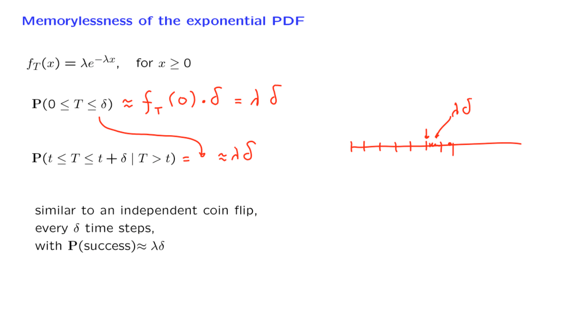

根据上文中推导出的expoential memorylessness的性质，可以得出一个新的结论。
它是：
指数分布下，一个事件在已经发生另一个事件的前提下的概率，与这个事件单独发生的概率是相同的。

无论灯泡已经存在多长时间，下一个delta时间单位内，它都有一个lambda乘以delta的烧毁概率。一种思考这种情况的方法是将时间间隔分成长度为delta的小间隔。只要灯泡还活着，如果在这一点上它还活着，它在接下来的长度为delta的间隔内烧毁的概率就是lambda乘以delta。这就像抛硬币一样。在每个delta时间步骤中，都有一个lambda乘以delta的概率，即这个硬币翻转中会有一个成功的情况，其中成功表示灯泡实际上会烧毁，而指数随机变量则对应于直到第一个成功发生的总时间经过。

从这个意义上说，指数随机变量是离散时间设置中第一个成功发生的时间的紧密类比。

> memoryless the ideas are briliant! I think this memorylessness come from the fact ( and you correctly pointed out), is rate of decay is the same, no matter what is the starting point of decay, a property of power operation, rather than property coming from probability side( my wording maybe not that accurate).

### Total probability and expectation theorems

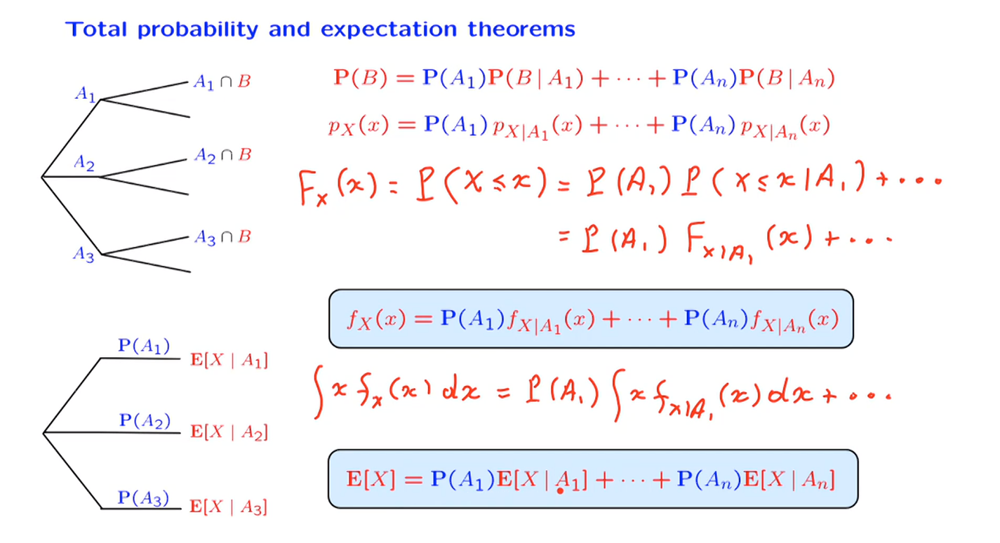

将第一个式子两边同时取积分就是第二个式子，特定事件之外的值的概率是0。

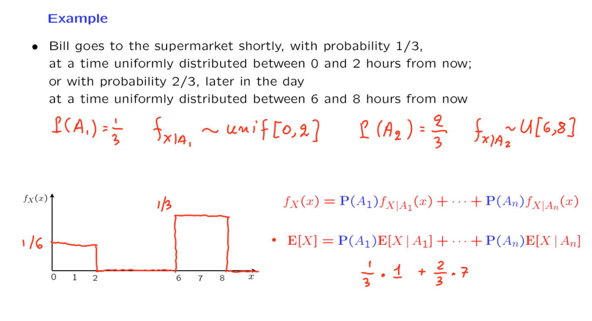

早上，Bill醒来并想去超市。有两种情况。以1/3的概率，会发生第一个情景。在那种情况下，Bill将在从现在开始的0到2个小时之间均匀分布的时间内去超市。因此，在这种情况下，X的条件PDF在区间0到2上是均匀的。

还有第二个情景，Bill会长时间地打个盹，会在一天后面的时间去超市。那种情况的概率是2/3。在这种情况下，X的条件PDF将在6到8之间的范围上是均匀的。根据密度的总概率定理，随机变量X（即他去超市的时间）的密度由两部分组成。一部分是在0到2之间的均匀分布。这个均匀分布通常会有1/2的高度。另一方面，它会被相应的概率加权，即1/3。因此，我们得到了一个在这里高度为1/6的部分。

在另一种情况下，条件密度是在6到8之间的均匀分布。这个均匀分布的高度再次是1/2，但会乘以一个因子2/3。这导致了我们在这里有的这个项的高度为1/3。这就是Bill去超市的时间的PDF的形式。

现在我们最终可以使用总期望定理。在这两种情况下，条件期望可以如下找到。在一个情况下，我们有一个在0到2之间的均匀分布。因此，条件期望是1，然后乘以相应的概率，即1/3。在第二种情况下，概率为2/3，条件期望是这个均匀分布的中点，即7。这给了我们他去的时间的期望值。

### Mixed random variables

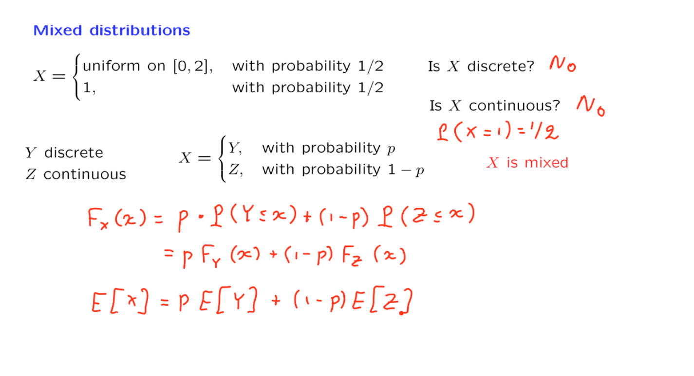

在这个例子中$X$既不是连续的随机变量（在1处的概率是$\frac{1}{2}$），也不是离散的，有一段区间中是均匀分布的。
概率和期望的计算使用total probability and expection theorems进行计算。

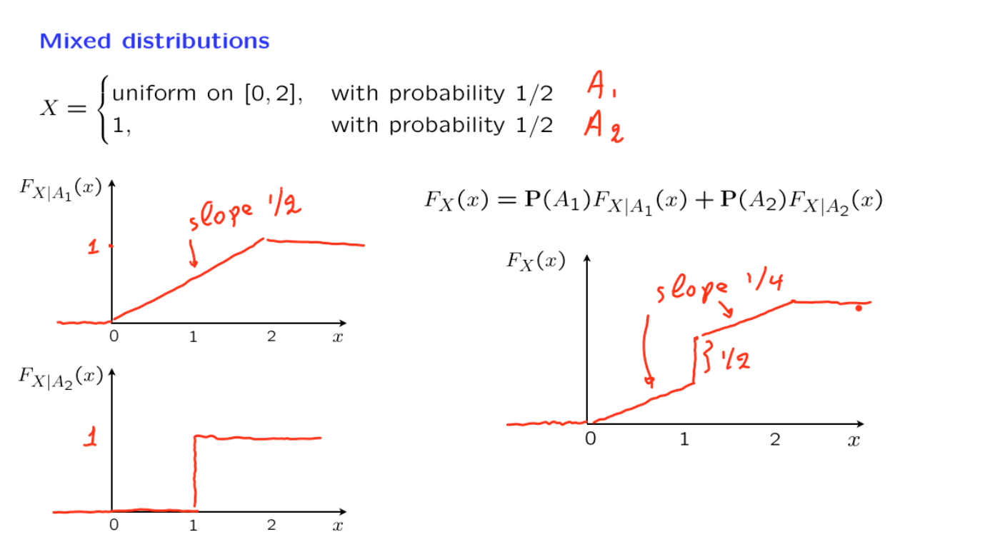

$A_1\quad A_2$单独的CMF很好理解。

使用总概率定理，它告诉我们混合随机变量的CDF将是第一个情景下的CDF的1/2加上第二个情景下的CDF的1/2。

所以我们取图1的1/2和那个图2的1/2并将它们相加。我们得到的是一个函数，现在以1/4的斜率上升。然后我们有一个跳跃(x=1时，$A_2$的概率为$1/2$)，跳跃的大小将等于1/2。然后它以1/4的斜率继续，直到达到这个值。在那之后，它保持平稳。

### Joint PDFs

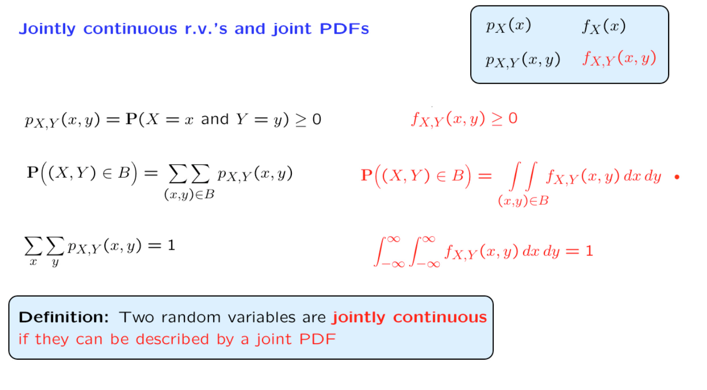

仿照离散的联合概率，可以用积分形式改写连续PDF。

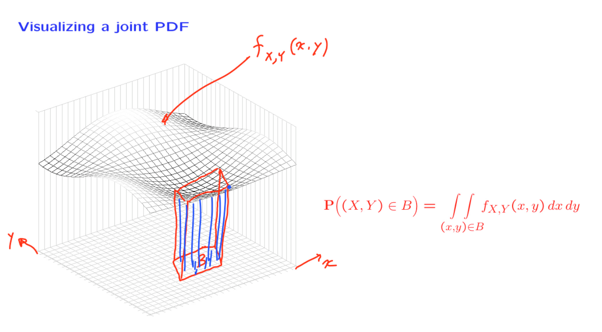

PDF刻画的是密度，二重积分算出的体积则就代表着联合概率。

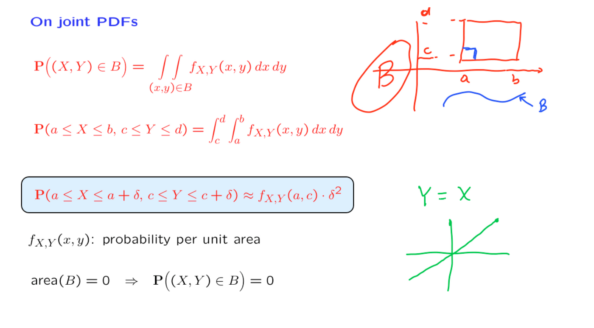

集合B可以是任何形状，图中选为矩形出于便于计算的考量。

对这个特定矩形的双重积分可以写成这样的形式：首先对一个变量从A积分到B，然后对y的所有可能值从C积分到D。

特别有趣的是我们处理一个小矩形的情况，比如这个。一个边长为$ \delta$ 的矩形，其中$ \delta$是一个很小数。在这种情况下，双重积分，也就是位于该矩形上方的体积，更容易计算。它等于我们要积分的函数在矩形的某个点的值（比如取角落的点），乘以矩形的面积，即$\delta$的平方。因此，我们可以根据小矩形的概率解释联合概率密度函数。

对于单一连续随机变量的情况，我们知道任何单个点的概率为0。对于两个联合连续随机变量的情况也是如此。

如果你取一个面积为0的集合B。例如，一个曲线。假设这条曲线就是整个集合B。那么，位于该曲线上方的联合概率密度函数下方的体积将等于0。因此，面积为0的集合具有0的概率。这是联合连续随机变量的特征之一。

一个具体的情况。假设X是一个连续随机变量，而Y是另一个随机变量，它恰好等于X。由于X是连续随机变量，Y也是连续随机变量。然而，在这种情况下，我们可以确定实验的结果将落在x等于y的线上。所有的概率都位于一条线上，而一条线的面积为0。这是不是表示概率落在了一条线上?

这仅仅意味着X和Y不是联合连续的。它们每个都是连续的，但在一起它们不是联合连续的。从本质上讲，联合连续性不仅要求每个随机变量本身是连续的。对于联合连续性，我们希望概率在两个维度上真正分布。概率不允许集中在一维集合上。另一方面，在这个例子中，概率集中在一个一维集合上。我们没有联合连续性。

### From the joint to the marginal

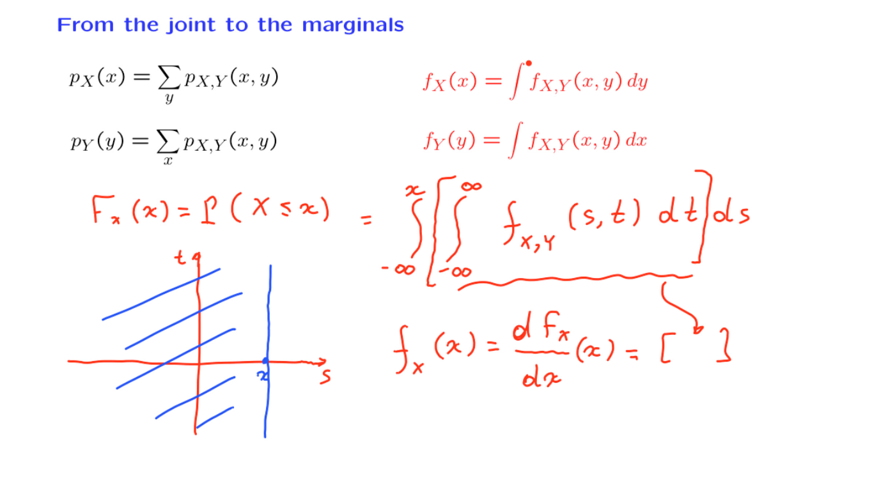

根据离散formula，用积分替换，得出连续的marginals 表达式。

要找到X的概率密度，我们所需做的就是对X的累积分布函数进行微分。

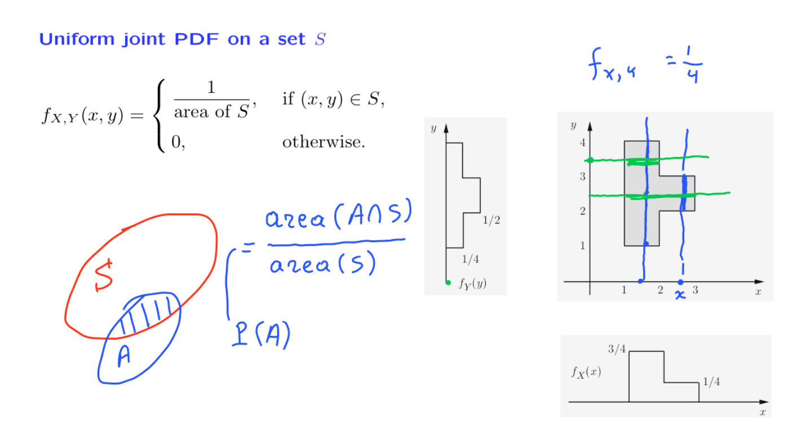

体积表示概率，则必然是1。
均匀分布概率密度是一致的，即高是一致的，所以A的概率就可以转换成是有效面积占总的有效面积之比。

一个具体的例子。假设我们在特定的集合S上有一个均匀概率密度函数。这个集合的面积等于4。它由四个相邻排列的单位矩形组成。因此，在这个例子中，联合概率密度函数的高度将是1/4。它在该集合上是1/4，在该集合外当然是0。

可以找到某个特定x处的边缘概率密度函数。我们可以固定x的特定值。为了找到边缘概率密度函数的值，我们需要沿着那条特定线对y进行积分。积分只会对那个片段产生贡献 $\displaystyle \int _2 ^3 {\frac{1}{4}}dy$

对于左边的蓝线作$\displaystyle \int _1 ^4 {\frac{1}{4}}dy$

对y也是相同的积分。

### Continuous analogs of various properties

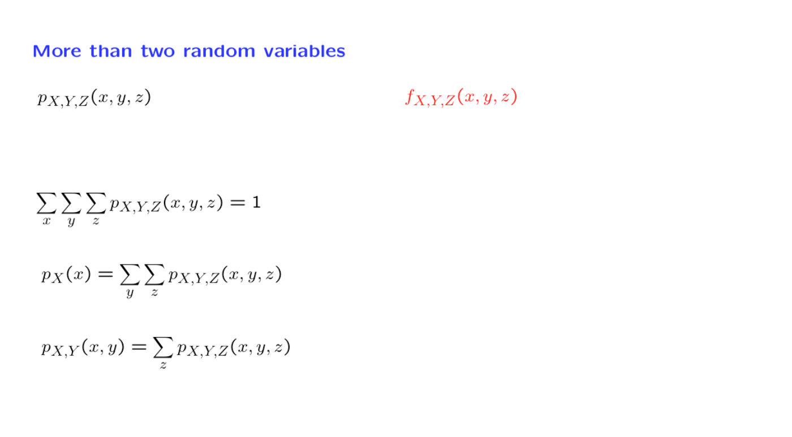

可以通过对该三维集合进行联合概率密度函数的积分来计算该三维集合的概率。在这里，我们的所有其他公式都有类似的情况，我们遵循通常的方法。求和变为积分，概率质量函数被概率密度函数取代。

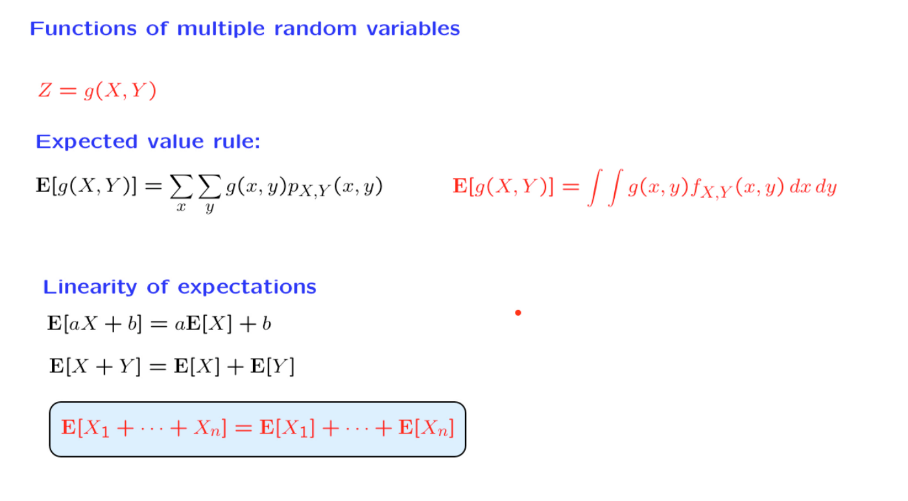

处理的随机变量被定义为联合连续随机变量的函数时，我们可以使用与离散情况中相同形式的期望值规则。使用期望值规则，我们可以再次建立期望值的通常线性性质。

所以这里绝对没有意外。推导要么非常直接，要么完全遵循与离散情况中完全相同的论证线路，只是符号稍有变化。

### Joint CDFs

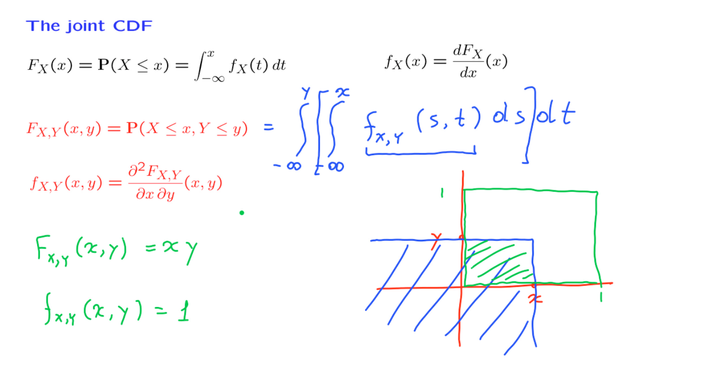

CDF的导数是PDF，通过微分和积分两者可以相互转化。

联合CDF是对多个变量的微分。

假设我们在单位正方形上有一个均匀分布。因此，概率密度函数在这个绿色正方形上等于1，否则等于0。在这个例子中，如果我们选择一些x和y，使得xy对在矩形内，蓝色区域的概率将只是那个小矩形的概率，因为外部的一切都具有零概率。