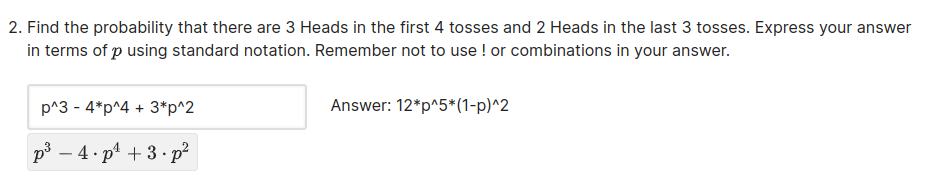
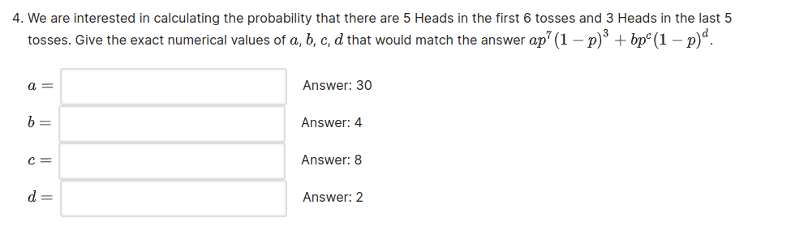
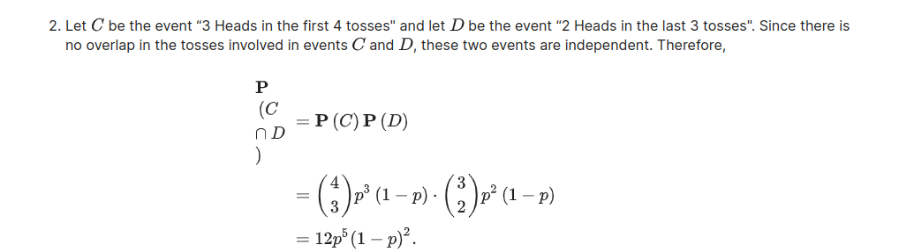
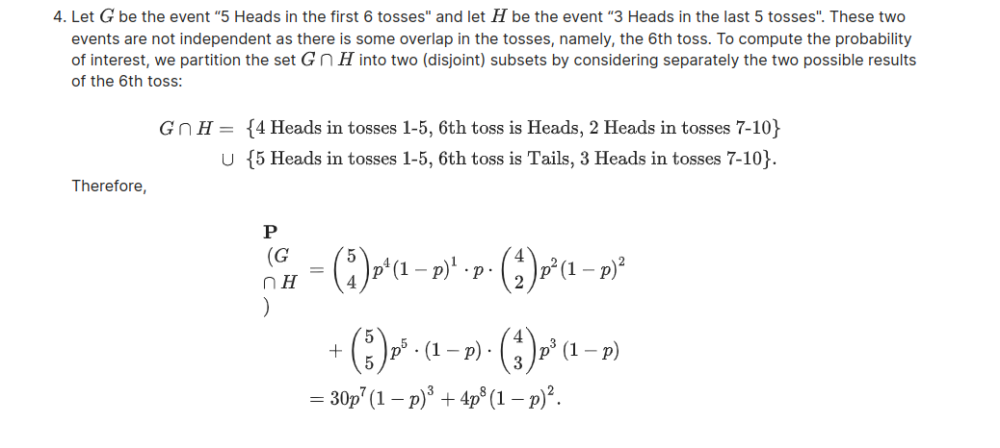
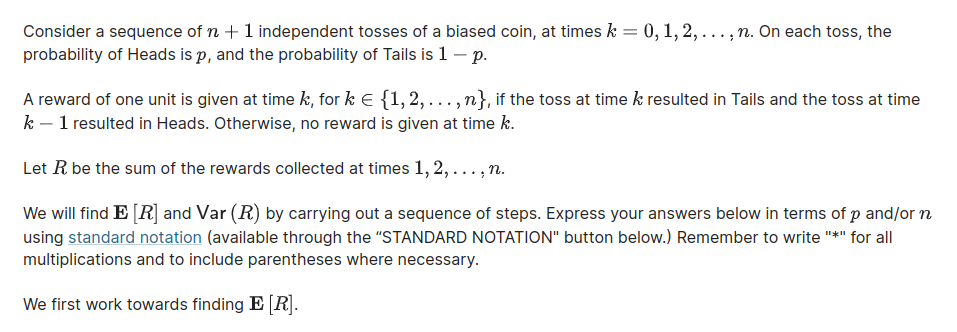
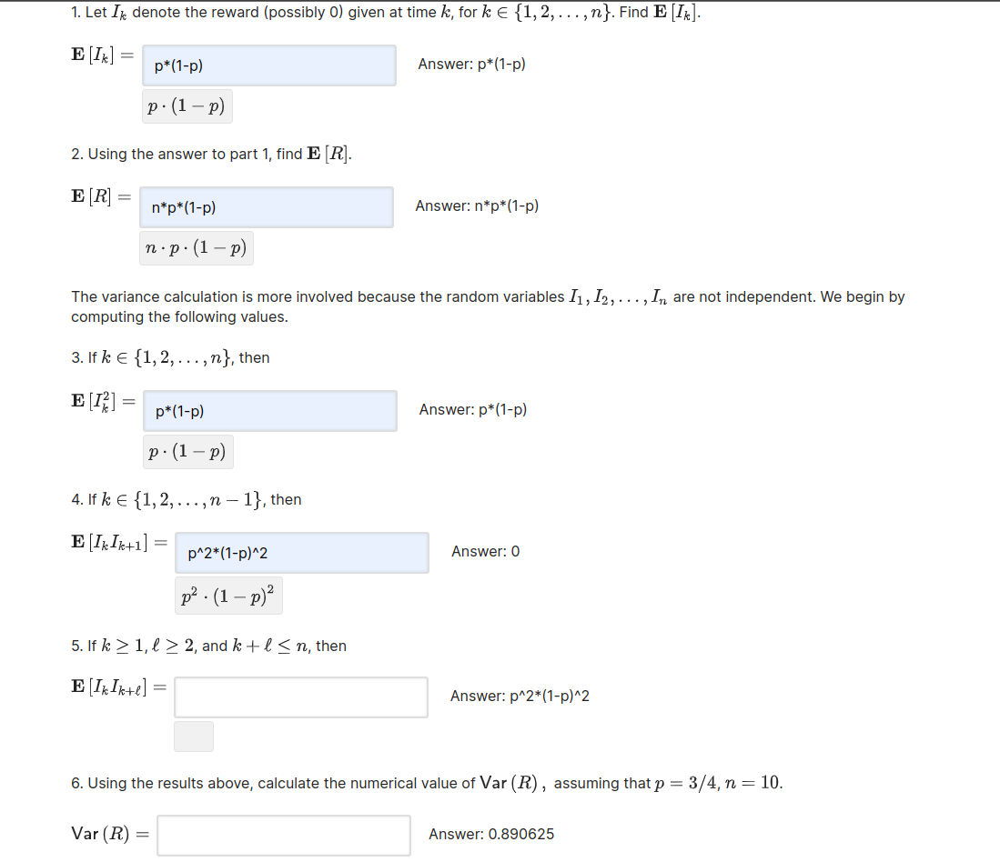
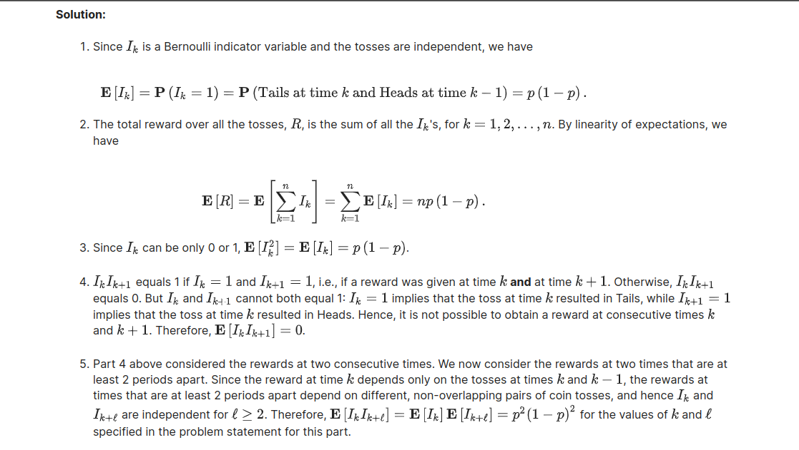
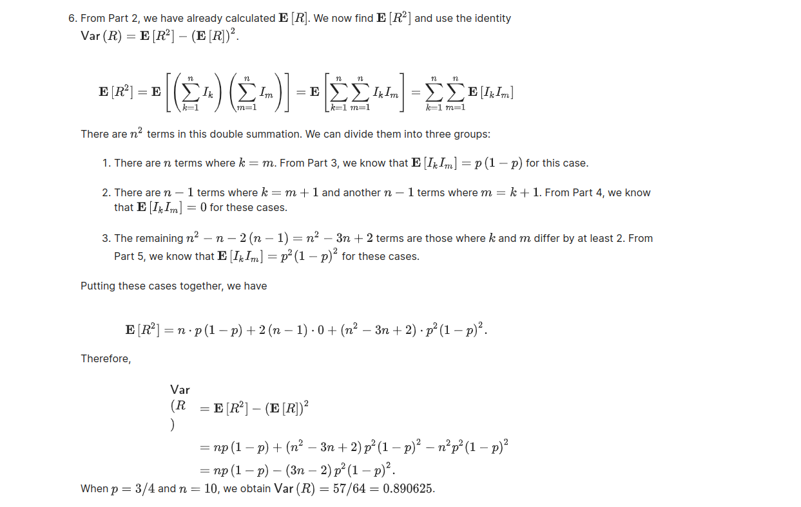
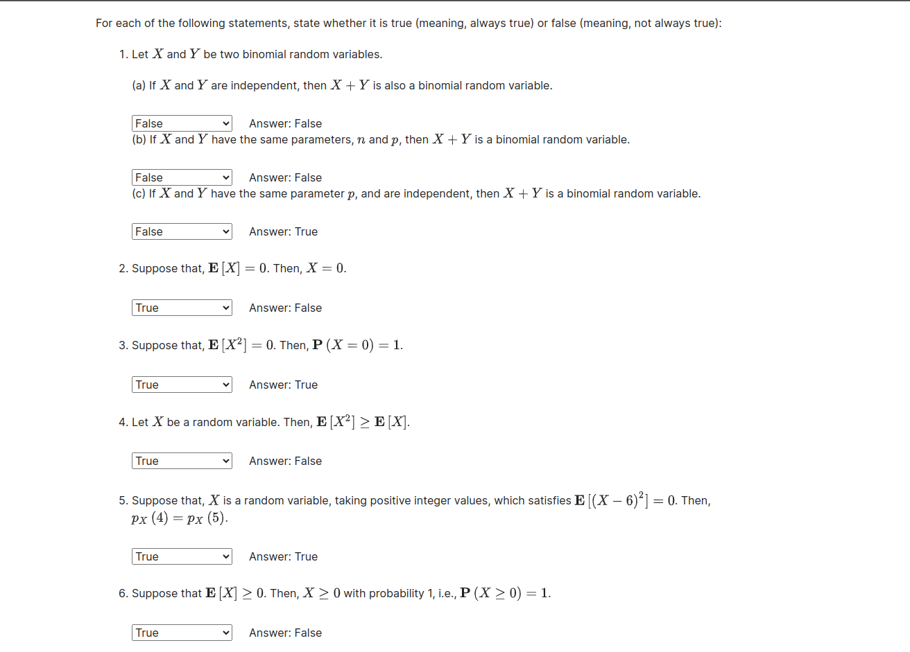
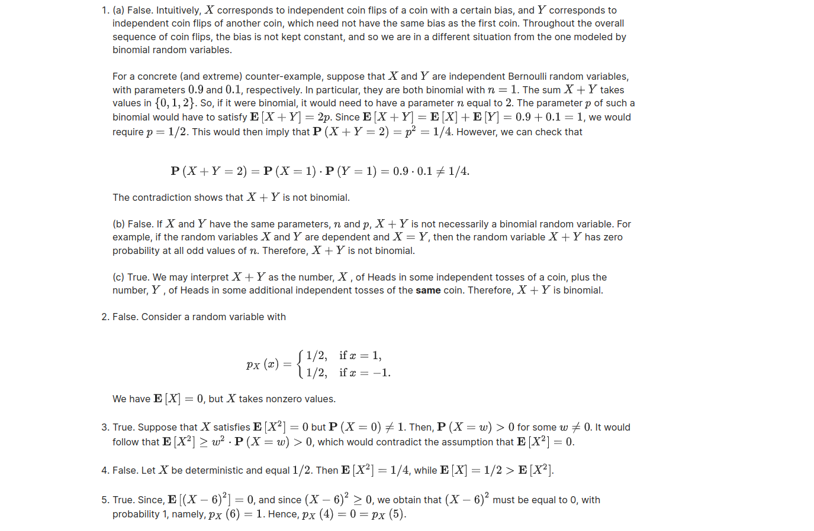

# Unit 4: Discrete random variables/Problem Set 4

## Problem 1. Tosses of a biased coin

Consider 10 independent tosses of a biased coin with the probability of Heads at each toss equal to $p$ , where $0 < p < 1$.

solution:

## Problem 5. Indicator variables

solution:

## Problem 6. True or False

solution:

