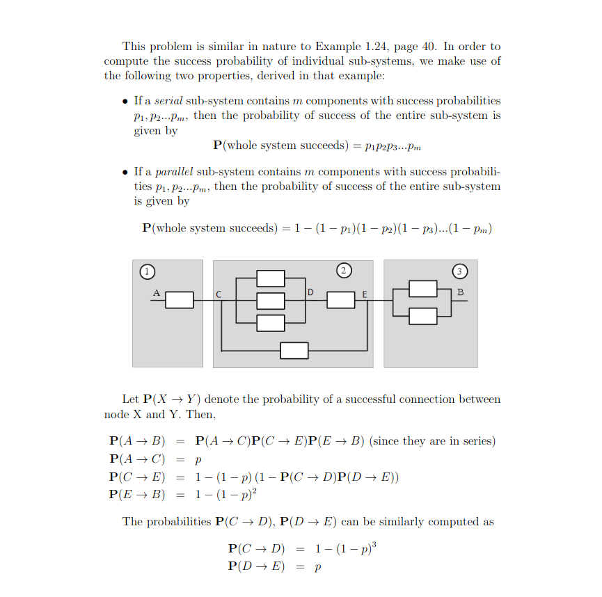

# Solved problems

## Conditional probability example

Conditional probability example. We roll two fair 6-sided dice. Each one of the 36 possible outcomes is assumed to be equally likely.

(a) Find the probability that doubles are rolled (i.e., both dice have the same number).

(b) Given that the roll results in a sum of 4 or less, find the conditional probability that doubles are rolled.

(c) Find the probability that at least one die roll is a 6.

(d) Given that the two dice land on different numbers, find the conditional probability that at least one die roll is a 6.

solution:

summary:

* 当样本空间是discret且每一个样本元素都是等可能性，考虑使用discret unifor law

* condition probability在计算相对的概率时并不会改变原有关系的frequence。

## A chess tournament problem

This year's Belmont chess champion is to be selected by the following procedure. Bo and Ci, the leading challengers, first play a two-game match. If one of them wins both games, he gets to play a two-game second round with Al, the current champion. Al retains his championship unless a second round is required and the challenger beats Al in both games. If Al wins the initial game of the second round, no more games are played.

Furthermore, we know the following:
 The probability that Bo will beat Ci in any particular game is 0.6.
 The probability that Al will beat Bo in any particular game is 0.5.
 The probability that Al will beat Ci in any particular game is 0.7.

Assume no tie games are possible and all games are independent.

1. Determine the a priori probabilities that
(a) the second round will be required.
(b) Bo will win the first round.
(c) Al will retain his championship this year.

2. Given that the second round is required, determine the conditional probabilities that
(a) Bo is the surviving challenger.
(b) Al retains his championship.

3. Given that the second round was required and that it comprised only one game, what is the conditional probability that it was Bo who won the first round?

solution:

summary:

* 善用tree，能够使问题变得简单。你能够更直接关注到你感兴趣的事件而不用关注其他的事件

## A coin tossing puzzle

 A coin is tossed twice. Alice claims that the event of getting two Heads is at least as likely if we know that the first toss is Heads than if we know that at least one of the tosses is Heads. Is she right? Does it make a difference if the coin is fair or unfair? How can we generalize Alice's reasoning?

根据题意：

* A：第一次投掷硬币是正面。
* B：第二次投掷硬币是正面。
* $\mathbf{P}(A\cap B\mid A) \geq \mathbf{P}(A\cap B\mid A\cup B)$

证明： $\mathbf{P}(A\cap B\mid A) \geq \mathbf{P}(A\cap B\mid A\cup B)$
$$
\begin{aligned}
&P(A\cap B\mid A)= \frac{P((A\cap B)\cap A)}{P(A)} = \frac{P(A\cap B)}{P(A)} \\
&P(A\cap B\mid A\cup B) = \frac{P((A\cap B)\cap (A\cup B))}{P(A\cup B)}=\frac{P(A\cap B)}{P(A\cup B)} \\
&P(A) \leq P(A\cup B)
\end{aligned}
$$
由此可以证明假设是正确的。

推广：

* $C = A\cap B$
* $D = A$
* $E = A\cup B$
* $D\subset C\subset E$

$P(C\mid D) \geq P(C\mid E)$
这很直观，因为给定的范围越小，那么包含在其中的事件发生的概率就越大。

solution：

## The Monty Hall problem

This is a much discussed puzzle, based on an old American game show. You are told that a prize is equally likely to be found behind any one of three closed doors in front of you. You point to one of the doors. A friend opens for you one of the remaining two doors, after making sure that the prize is not behind it. At this point, you can stick to your initial choice, or switch to the other unopened door. You win the prize if it lies behind your final choice of a door. Consider the following strategies:

* Stick to your initial choice.

* Switch to the other unopened door.

* You first point to door 1. If door 2 is opened, you do not switch. If door 3 is opened, you switch.

Which is the best strategy?

solution：
For a written solution and discussion of this problem, see Example 1.12, on p. 27 of the text.

## A random walker

A random walker. Imagine a drunk tightrope walker, who manages to keep his balance, but takes a step forward with probability P and 1- p takes a step back with probability .

(a) What is the probability that after two steps, the tightrope walker will be at the same place on the rope as where he started?

(b) What is the probability that after three steps, the tightrope walker will be one step forward from where he started?

(c) Given that after three steps he has managed to move ahead one step, what is the probability that the first step he took was a step forward?

Solution:

## Communication over a noisy channel

A source transmits a message (a string of symbols) over a noisy communication channel. Each symbol is 0 or 1 with probability p and 1-p, respectively,$\epsilon_0 $and $\epsilon_1$ is received incorrectly with probability  and , respectively (see the figure below). Errors in different symbol transmissions are independent.

(a) What is the probability that the Kth symbol is received correctly?

(b) What is the probability that the string of symbols 1011  is received correctly?

(c) In an effort to improve reliability, each symbol is transmitted three times and the received string is decoded by majority rule. In other words, a 0 (or 1) is transmitted as 000 (or 111 , respectively), and it is decoded at the receiver as a 0's (or 1's ) if and only if the received three-symbol string contains at least two 's (or 's, respectively). What is the probability that a  is correctly decoded?

(d) For what values  of $\epsilon_0$ is there an improvement in the probability of correct decoding of a 0 when the scheme of part (c) is used?

(e) Suppose that the scheme of part (c) is used. What is the probability that a symbol was 0 given that the received string is 101 ?

solution:

## Network reliability

An electrical system consists of identical components, each of which is operational with probability p , independent of other components. The components are connected in three subsystems, as shown in the figure. The system is operational if there is a path that starts at point A , ends at point B , and consists of operational components. What is the probability of this happening?

solution:

summary:

* 使用独立性，能够将一个复杂的系统拆分成简单的组件，分别考
