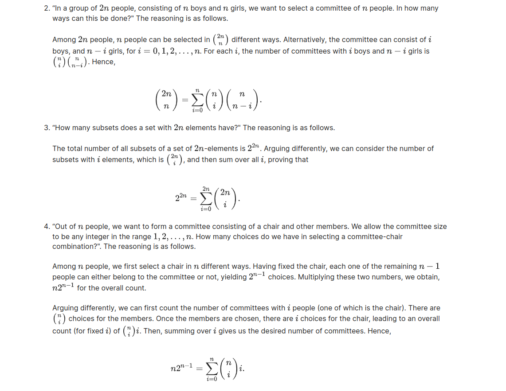

# Unit3: Counting / Solved problems

## The birthday problem

Consider n people who are attending a party. We assume that every person has an equal probability of being born on any day during the year, independently of everyone else, and ignore the additional complication presented by leap years (i.e., nobody is born on February 29). What is the probability that each person has a distinct birthday?

1. assume
2. solve
   * 每一个人有365种生日选择,n个人一共的选择$\displaystyle 365^n$
   * 生日不能相同，则依次有如下的选择：365,364,363,$\cdots$,365-n+1
   * $\displaystyle \frac{365*364*363*\cdots*(365-n+1)}{365^n}= \frac{1}{365^n}$

* 右侧图像比左侧图像京都更高。
* 由图可知，大概有23个人时，完全没有相同生日的人的概率是50%
* 但到120人之后，绝对不相同的概率是$10^{-10}$

## Rooks on a chessboard

Eight rooks are placed in distinct squares of an 8 x 8  chessboard, with all possible placements being equally likely. Find the probability that all the rooks are safe from one another, i.e., that there is no row or column with more than one rook

assume：

* discreate uniform law：$\displaystyle P(A)= \frac{P(number \quad A)}{P(total number \quad event)}$

counting principle example：
制作一份三明治

* 第一部,选择面包：
    1. 黑面包
    2. 白面包
* 第二步,选择肉食：
    1. 火腿
    2. 培根
    3. 鸡蛋

那么一共有多少种三明治：$2*3=6$
所谓的计数原则：即将一件事物分为多个阶段，每一个阶段有若干的选择，阶段之间使用积，阶段之中使用和。最后统计出所有可行的方案数。

此问题之中：

1. 每一个Rook棋子同行同列都无法放上其他的Rook棋子（需要安全）
2. 棋盘上的每一个位置都是等概率

那么，让8个Rook棋子安全的概率 $\displaystyle P(safty)= \frac{number \quad safty}{number \quad all}$

process:

$$
total= 65*64*63*\cdots*57 = \frac{64!}{56!} \\
P(safty)= \frac{(64)(49)(36)\cdots (4)(1)}{total}
$$

solution:

## Hypergeometric probabilities

An urn contains n balls, out of which exactly m  are red. We select K  of the balls at random, without replacement (i.e., selected balls are not put back into the urn before the next selection). What is the probability that i of the selected balls are red?

有图所分析：

* 作出假设，此时符合discreate uniform law $\displaystyle P(A)= \frac{number\quad of \quad A}{|\varOmega|}$
* $\displaystyle |\varOmega|=  {n \choose k}$
* 取得红球的事件：$\displaystyle {m \choose i}{{n-m} \choose {k-i}}$
* 由discreate uniform law,$\displaystyle P(red)= \frac{{m \choose i}{{n-m} \choose {k-i}}}{{n \choose k}}$

##

An urn contains balls of r different colors. We draw n balls, with different draws being independent. For any given draw, there is a probability $P_i$ ,$i=1 ,2 \cdots r$, of getting a ball of color $i$ . Here, the $P_i$'s are nonnegative numbers that sum to 1.

Let $n_1$,...,$n_r$  be nonnegative integers that sum to n . What is the probability that we obtain exactly $n_i$  balls of color i , for each $i=1,2,\cdots r$?

* 不同颜色的球：$i=1,2,3,\cdots r$
* 选择某种颜色的球的概率：$p_i$
* 能够抓取球的总数是n，某一种颜色的球是$n_i$

首选考虑简单的情况，假设球的颜色只有两种w，b。那么，取得球的概率是：$\displaystyle \mathbf{n \choose n_1} \mathbf{P_1}^{n_1}\mathbf{P_2}^{n_2}$。

设$p_1$的概率是p，则$p_2$的概率是1-p，设$n_1= k,n_2=n-k$，则上式：$\displaystyle \mathbf{n \choose k} \mathbf{P}^{k}\mathbf{(1-P)}^{n-k}$

现在考虑三种颜色的情况，对应的概率$\mathbf{P}_{1,2,3}$,对应的取得每一种球的数量: $n_1 + n_2 + n_3= n$。

r=3,n=7（假设）。

7次取球的序列：1 1 3 1 2 2 1

颜色1的球有4个，颜色2的球有2个，颜色3的球有一个,可以计算出此序列的概率：$\mathbf{P(the \quad sequence)}= P_1^{4}P_2^{2}P_3^{1}$

现在需要计算出所有满足序列的数量，如下图所示

所以，调换顺序总共有：${7 \choose 4}{3 \choose 2}{1 \choose 1}$，即将四个红色的球放入选择的四个槽，2个蓝色的球放入剩下的三个槽:

**由此可见，不是将两个同种颜色的球区分成不一样，而是取同种颜色球的顺序，此处的$7 \choose 4$的对象是图中的槽**

槽也就是所说的子集，在这个问题中实际上是:

先将n（总共取球的数量）{1,2,3,4,...n} partition为{$n_1$},{$n_2$}...{$n_r$},再排序（此处不是将$n_1$放置到对应下标的槽，再在具体的槽内部排序）。

$\displaystyle \mathbf{P}(get \quad type(n_1, n_2, n_3,\cdots n_r))= \frac{n!}{n_1!n_2!n_3!\cdots n_r!}P_1^{n_1}P_2^{n_2}\cdots P_r^{n_r}$

此处的时间发生的数量：${\displaystyle \dbinom{n}{n_1}\dbinom{n-n_1}{n_2}\cdots\dbinom{n-n_1-n_2-\cdots n_{r-1}}{n_r}}= \frac{n!}{n_1!n_2!n_3!\cdots n_r!}$

由此我们建立了一个新的模型，在这个模型中，可以研究在可重复的实验里，基于一种可能的实验结果（$n_1或者n_2 \cdots$），计算符合的数量。

solution:

---

##

Binomial identities (i.e., identities involving binomial coefficients) can often be proved via a counting interpretation. For each of the binomial identities given below, select the counting problem that can be used to prove it.

Hint: You may find it useful to review the lecture exercise on counting committees before attempting the problem.

(You need to answer all 4 questions before you can submit.)

* $\displaystyle n\binom {2n}{n}= \displaystyle 2n\binom {2n-1}{n-1}$
  * “Out of 2n people, we want to choose a committee of n people, one of whom will be its chair. In how many different ways can this be done?" The reasoning is as follows.

  * Among 2n people, we can select n people in $ \binom{2n}{n}$ different ways. Having selected  such people, a chair can be selected in  different ways, leading to an overall count of $n\binom {2n}{n}$. Arguing alternatively, we can first select a chair in 2n different ways, and then, among the remaining 2n -1 people, n-1 people can be selected in $\binom{2n-1}{n-1}$  different ways. Thus, the overall count is $2n\binom {2n-1}{n-1}$, proving that,

* $\displaystyle \binom {2n}{n} = \displaystyle \sum *{i=0}^ n \binom {n}{i}^2 =\displaystyle \sum*{i=0}^ n \binom {n}{i}\binom {n}{n-i}
$
* $\displaystyle 2^{2n} =\displaystyle \sum _{i=0}^{2n} \binom {2n}{i}
$
* $\displaystyle n2^{n-1} = \displaystyle \sum _{i=0}^ n \binom {n}{i}i
$

solution:
    

## Hats in a box

Each one of $n$  persons, indexed by $1, 2, \ldots , n
$ , has a clean hat and throws it into a box. The persons then pick hats from the box, at random. Every assignment of the hats to the persons is equally likely. In an equivalent model, each person picks a hat, one at a time, in the order of their index, with each one of the remaining hats being equally likely to be picked. Find the probability of the following events.

Problem:

1. Every person gets his or her own hat back.
2. Each one of persons $1, \ldots , m$  gets his or her own hat back,where 1\leq m \leq n.
3. Each one of persons$ 1, \dots , m $gets back a hat belonging to one of the last m persons (persons $ n-m+1, \ldots , n
$ ), where $1\leq m\leq n$ .

Now assume, in addition, that every hat thrown into the box has probability p of getting dirty (independently of what happens to the other hats or who has dropped or picked it up). Find the probability that:

4. Persons $1, \ldots , m$  will pick up clean hats.
5. Exactly m persons will pick up clean hats.

