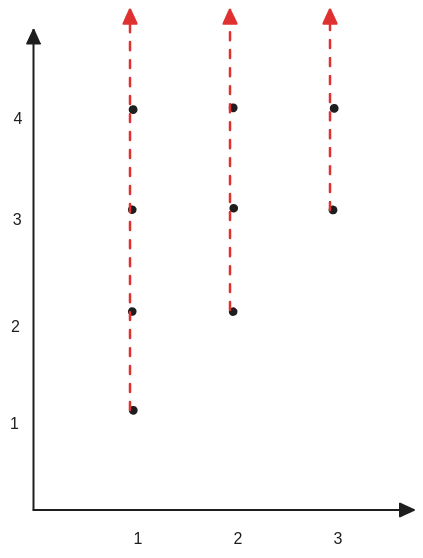
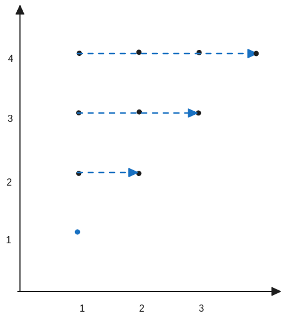
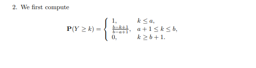
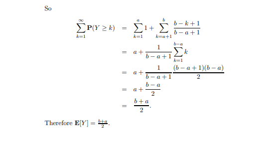
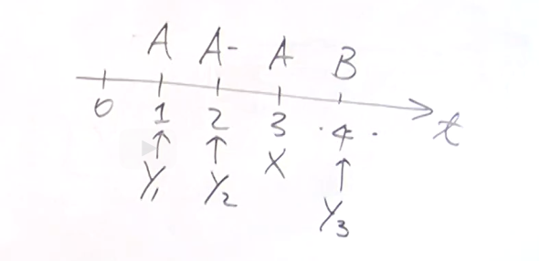
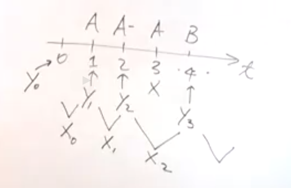
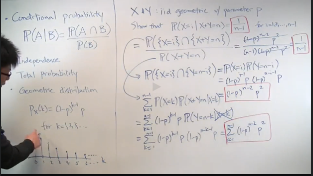
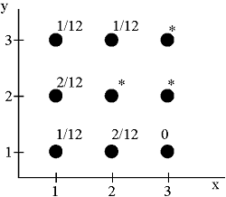

# Unit 4: Discrete random variables/Solved problems

## From tail probabilities to expectations.

1. Let $X$ be a random variable that takes nonnegative integer values. Show that

$\displaystyle {\bf E}[X]=\sum _{k=1}^{\infty }\mathbf{P}(X\geq k).
$
 
Hint: Express the right-hand side of the above formula as a double summation then interchange the order of the summations.

2. Use the formula in the previous part to find the expectation of a random variable  whose PMF is defined as follows:

 $p_ Y(y)= \frac{1}{b-a+1}, \qquad y=a,a+1,\ldots ,b
$
where  $a$and $b$ are nonnegative integers with $b > a$. Note that for $y = a,a+1,\ldots ,b$,  $p_ Y(y)$does not depend explicitly on  since it is a uniform PMF.

对于第一个问题：
1. 设随机变量$X$为非负的随机变量。
2. $\displaystyle E[X]=\sum _{k=1}^{\infin}k P _{X}(k) $，这是期望的标准定义。
3. 以下图示中的纵轴表示$i$，横轴表示的是$，这是一个单一变量的随机变量。

对于计算这样的期望，这里映入另一种方法：
* 计算,可以得出我们所需要的期望的结果，$\displaystyle {\bf E}[X]=\sum _{k=1}^{\infty }\mathbf{P}(X\geq k).$

$\displaystyle \sum _{k=1}^{\infty }\mathbf{P}(X\geq k)= \sum_ {k=1} ^{\infin}\sum _{i=k} ^{\infin}  {\bf P}_X(i)$

$\displaystyle \sum_ {k=1} ^{\infin}\sum _{i=k} ^{\infin} {\bf P}_X(i) = \sum _{i=1} ^{ \infin } \sum _{k=1} ^{i} {\bf P}_X(i)=\sum _{i=1} ^{ \infin } [\sum _{k=1} ^{i} {\bf P}_X(i)]=\sum _{i=1} ^{ \infin }  i{\bf P}_X(i)$

上述公式首先将竖直方向上的求和改换为水平方向上的求和。当$i=1$时，所求的就是一个$P_X(1)$之和。当$i=2$时，所求的就是两个$P_X(2)$之和，k在此只是用来控制累加的次数，依次类推。因为自始至终，内循环求和的值与k的取值没有关系。因此内循环之中就是单一值的副本之和。

此处需要注意数学中求和符号的意义，它在意义上与编程中的for循环是相类似的。

我们最后得出的式子与一开始定义的期望的标准式子是相同的（只是一个用k表示，一个用i表示），所以有如下的等式关系：

$\displaystyle \sum_ {k=1} ^{\infin} P(X \geq k) =\sum _{i=1} ^{ \infin }  i{\bf P}_X(i)=E[X] $

这里使用 tail probability代替了常规的概率。之所以叫tail，是因为它只取单一变量的PMF的一部分，想象水平方向上的PMF,截取一点的右侧部分。

> 这实际上是这类随机变量计算期望值的另一种方法。
这个技巧的关键在于将事情写出来，然后进行巧妙的求和变换。
那么为什么这个方法有用呢？
可能情况是，根据随机变量的定义方式，也许这种计算期望值的方式比使用标准定义更容易。
所以拥有多种解决同一个问题的方法是很有用的。

### (b)

第二部分（b），在这一部分中，我们将会在一个特定的随机变量上运用这个新的公式。

第二项中的计算使用两均匀分布的期望的性质。

## Coupon collector problem

Coupon collector problem. A particular professor is known for his arbitrary grading policies. Each paper receives a grade from the set $\{ A, A-, B+, B, B-, C+\}
$, with equal probability, independently of other papers. How many papers do you expect to hand in before you receive each possible grade at least once?

这个问题描述如下：
现在我们想要收集paper的全部等级，此处假设有6种，$K=6$。设置随机变量$Y$，表示某个等级第一次出现当前paper的总数。如下图所分布，

$Y_1$表示第一次出现等级Aa时，当前的论文数是1。在$Y_2$与$Y_3$i之间因为等级$A$已经出现过了，所以它不是一个有效的量。

现在我们想要知道当我们收集到所有的所有的等级的期望是多少？即$\displaystyle E[Y_6]$

到目前为止，这个表示法在解决问题上并没有帮助，只是以不同的方式陈述问题。
事实证明，从以下由Y推导出的变量来看，会更容易。

设置一个新的随机变量$X_i=Y_{i + 1} - Y_{i}$，

用文字来说，在获得$i$个新等级后，$Xi$是直到获得第$i+1$个新等级所需的论文数量。

如果想要获得随机变量$Y_6$，则存在$\displaystyle Y_6= \sum _{i =0} ^5 X_i$，期望值为$\displaystyle E[Y_6]=E[\sum_{i = 0} ^5 X_i]$

对于每一个$X_i$是否发生都有一个固定的概率值$P$。一个单独的$X_i$就是符合几何分布的。
$X_1= Y_2 - Y_1$，在当前的context下，等级A已经收集到了，那么$X_1$的发生意味着收集到了等级$A-$，也就是说，我们是在等待这个事件的发生，他的概率是$\displaystyle p=\frac{6 - 1}{6} = \frac{5}{6}$，因为已经收集到了第一个等级，所以之后的每出现一次等级除了第一个等级之外都可能成为第二个等级，因此会有上述的概率。

而对于一个是几何分布的随机变量，他的期望是$\displaystyle \frac{1}{p}$。

因此计算出$Y_6$的期望是：$\displaystyle E[X_0] + E[X_1] + E[X_2] + E[X_3] + E[X_4] + E[X_5] = 1 + \frac{6}{5} + \frac{6}{4} + \frac{6}{3} + \frac{6}{2} + \frac{6}{1} = 14.7 $

如果更进一步，在本题中假设$K = 6$可以被指定为任意符合实际的值。
那么对于$Y_k$都可以将其拆分成$X_{k - 1}$个子随机变量的求和式子。有趣的是，事实证明这个量有一个渐近表达式，实际上大约等于k乘以自然对数k。这就是称为收集优惠券问题的缩放定律，它实际上表示我们需要大约k乘以log(k)次尝试才能收集到所有的k个优惠券。

$\displaystyle E[Y_k]= \sum _{i=1} ^{k - 1} \frac{1}{i} = K \lg K$

## Conditioning example

* Conditional probability
条件概率的作用是减小universe

Conditioning example. Suppose that $X$ and  $Y$ are independent, identically distributed, geometric random variables with parameter $p$. Show that
$\mathbf{P}(X=i \mid X+Y=n)=\frac{1}{n-1}, \qquad $ for $i=1,2,\ldots ,n-1$

 

证明的过程是机械地运用性质，值得注意的点是：

1. 无论 $i$ 如何变化，最终的概率与它的值没有关系。
2. $X$ 和 $Y$是几何分布的，但是最终的结果却更像是均匀分布的。

可以这样想，在假设$X + Y = n$的前提之下，如果一方的发生的概率较小，那么另一方就会使发生的概率是增大的。假设现在$n=10 \quad X = 1$，$X \quad Y$是两个同学投掷硬币。$X$第一次就投掷为正面是一个概率较大的事件，$Y$投掷9次才能够出现正面是一个小概率事件。假设在正常情况下，因为两者独立所以概率只是乘积。但现在是在条件概率之下，相当于将原来的universe减小，$X$投掷次数为1是可能能的事件,那么$Y = 9$的，就成为了更加可能的事件。

这两者的组合，以及它们同时发生，使得无论如何，你仍然得到相同的概率。
这就是在这种情况下为什么会产生更像均匀分布的直观感觉。

## Joint PMF drill 2

Joint PMF drill #2. Random variables $X$ and $Y$ can take any value in the set $\{ 1,2,3\}$. We are given the following information about their joint PMF, where the entries indicated by a * are left unspecified:

4. Is there a choice for the unspecified entries that would make $X$ and $y$ independent?

Let $B$ be the event that $X \neq 2$ and $Y \neq 2$. We are told that conditioned on $B$, the random variables $Y$ and  $X$are independent.

5. What is $p_{X,Y}(2,2)$? (If there is not enough information to determine the answer, say so.)
6. What is $p_{X,Y \mid B}(2,2)$? (If there is not enough information to determine the answer, say so.)

对于第四题，本质上是用来检测对于独立性的理解。
什么是独立性? $Y$有一个预先的值，他可以是其是否发生的概率。如果我告诉你当前$X$发生了，那么这并不会改变一开始对于$Y$的预计值。
结合本题，可以观察到一个特殊的点$(3,1)$，这个点发生的概率是0。当被告知$X=3$，我们就会知道$Y$不可能会是1。但是当$X=1$时，$Y$可以有$\displaystyle \frac{1}{4}$的概率是1。也就是说$X$影响到了$Y$。
应此不会存在能够使$Y \quad X$独立的情况。

对于第5和第6同样是对于独立性的思考。

根据之前的题设，在事件$B$之中$X$和$Y$是独立的。观察$(1,1)，(1,2)$点。由独立性的定义式，根据这个题目有：$P_{X,Y}(x,y)=P_X(x)P_Y(y) \quad P(Y \mid X = x)= P_Y(y) $

结合之前提到的两个点有这两个等式$\displaystyle \frac{P_{X,Y}(1,1)}{P_X(1)}=P_Y(1) \quad \frac{P_{X,Y}(1,2)}{P_X(1)}=P_Y(2)$

将这两个式子相除化简可得$\displaystyle \frac{P_{X,Y}(1,2)}{P_{X,Y}(1,1)}=\frac{P_Y(2)}{P_Y(1)}=\frac{2}{1}$

同样的道理可得$\displaystyle \frac{P_{X,Y}(2,2)}{P_{X,Y}(2,1)}=\frac{P_Y(2)}{P_Y(1)}=\frac{2}{1}$

所以$\displaystyle P_{X,Y}(2,2)=\frac{4}{12}$

>再次强调，我们得到这个答案的方法是我们需要使得在事件B的条件下，X和Y是有条件独立的。如果这个值不是4，那么Y的相对频率等于2比1的条件下，从这里得到的相对频率将与那边不同。因此，如果你观察X等于3，Y等于2的结果只能是2或3。但是如果你观察X等于1，Y可以是1、2或3。所以实际上，无论星星在哪里，X总是会告诉你关于Y的信息。因此，问题(d)的答案是否定的。所以让我们放一个带有感叹号的“否”。

这里解释一下为什么判断多个变量的joint PMF是否是独立采用所谓的“相对频率“而不是绝对的概率。以下是多变量的条件概率的定义式子
$\displaystyle P_{X \mid Y}(x \mid y )= P(X = x \mid Y = y)= \frac{P(X=x,Y=y)}{P(Y=y)}$

## Indicator variables: the problem of joint lives

Indicator variables: the problem of joint lives. Consider $2m$ persons forming $m$ couples who live together at a given time. Suppose that at some later time, the probability of each person being alive is p,independently of other persons. At that later time, let $A$ be the number of persons that are alive and let $B$ be the number of couples in which both partners are alive. For any number of total surviving persons a, find ${\bf E}[S\mid A=a]$.