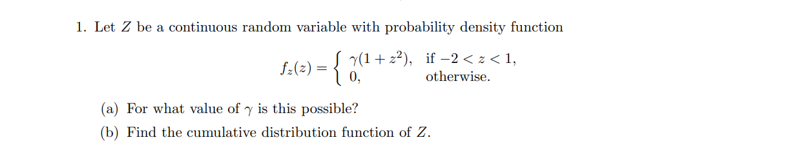
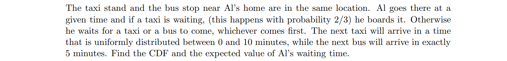
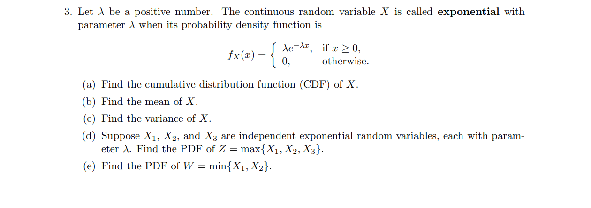
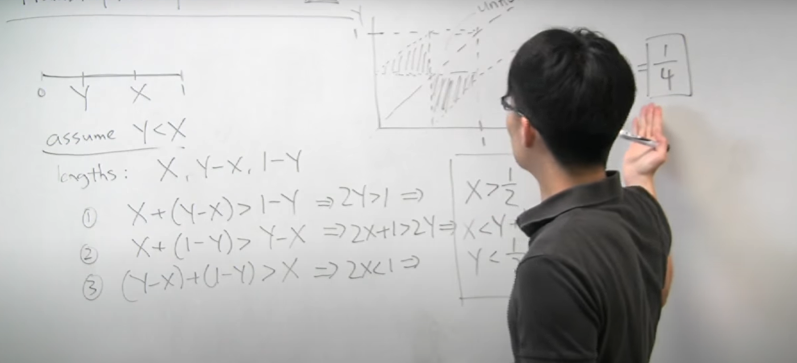
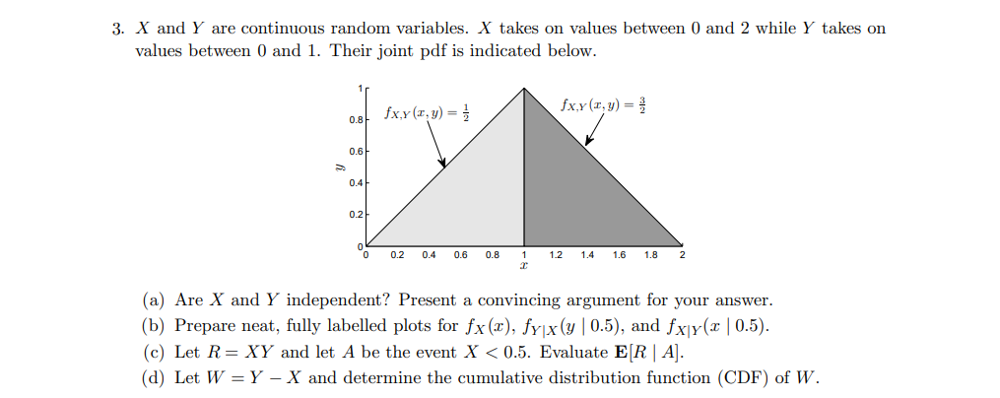
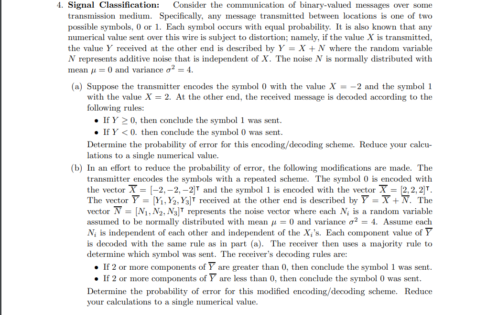
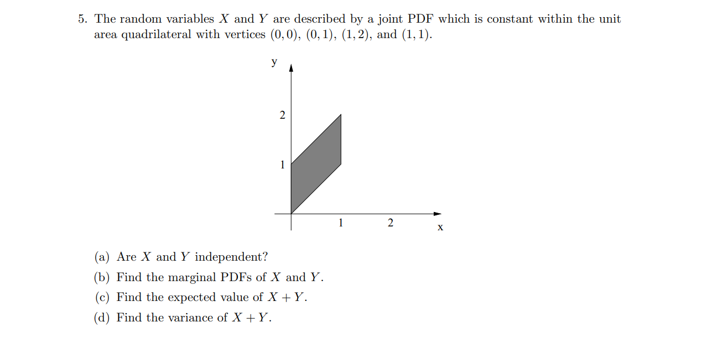

# Unit 5: Continuous random variables

## Calculating a Cumulative Distribution Function (CDF)

PDF 告诉了我们有关随机变量的信息。
PDF必须保证对整体积分为1，因为密度必须为1。
计算时忽略密度为0的地方。
保证CDF的完整性。

## A Mixed Distribution Example

计算混合的分布，使用tree strucuture。我竟然完全没有用，还先画出了分布。一旦分情况讨论，用事件来标注，例如$\displaystyle B_1 B_2$。
这里需要使用total expection
total probability theorm
在分析$\displaystyle B_2$时：等待taxi，再求处于这个事件中的等待时间时，概率发生了改变，上界由10变为5，成了条件分布。
CDF表示的是小于某一个值的概率，他不一定是连续的。

## Mean and Variance of the Exponential

推到expoential的CDF要使用part 积分。
一般求取PDF先求CDF，然后再取导数。
思考事件的角度，一个事件可以等效于另一个事件：
$\displaystyle \max{(X_1,X_2,X_3)} < z $ 等效于$\displaystyle X_1 < z ,X_2 < z,X_3 < z$

## Exponential Random Variable is Memoryless.

The time T until a new light bulb burns out is an exponential random variable with parameter
λ. Ariadne turns the light on, leaves the room, and when she returns, t time units later, finds
that the bulb is still on, which corresponds to the event A = {T > t}. Let X be the additional
time until the bulb burns out. What is the conditional CDF of X, given the event A?

lect9中有相同的题目，本质利用memorylessness的性质。

## Uniform Probabilities on a Triangle

Let the random variables X and Y have a joint PDF which is uniform over the triangle with
vertices (0, 0), (0, 1), and (1, 0).
(a) Find the joint PDF of X and Y .
(b) Find the marginal PDF of Y .
(c) Find the conditional PDF of X given Y .
(d) Find E[X | Y = y], and use the total expectation theorem to find E[X] in terms of E[Y ].
(e) Use the symmetry of the problem to find the value of E[X]. 

当你拥有joint PDF时，你拥有了计算所有量的能力。
当你画出margin y的图像后，你会发现y值越小，他的密度越大。这是因为在joint density中y越小，对应有越多的x值。当联合的图像坍缩到y轴上时，对应的有关x的和就越大。
margin 坍塌，condition 切片
对于均匀分布，期望是中间值，这也是一个好的验证结果的手段。
law of iterated

在计算期望E[X]时，主要使用了total expection，并借用对称性，有结论：$\displaystyle E[X] = E[Y]$来求取期望。

## Probability that Three Pieces Form a Triangle

We have a stick of unit length, and we break it into three pieces. We choose randomly and
independently two points on the stick using a uniform PDF, and we break the stick at these
points. What is the probability that the three pieces we are left with can form a triangle? 

因为我们并不清楚X与Y的位置的先后，所以文中采用分情况讨论的策略

## The Absent Minded Professor

An absent-minded professor schedules two student appointments for the same time. The appointment durations are independent and exponentially distributed with mean thirty minutes.
The first student arrives on time, but the second student arrives five minutes late. What is the
expected value of the time between the arrival of the first student and the departure of the second
student? 

* expoention varibale : E[X] = $\displaystyle \frac{1}{\lambda}$

* memorylessness : 无论在指数分布的任何一点处“弹出”，在此之后的分布与一个新的指数分布是一样的。

* 分情况讨论，简化分析：第一个学生的会话时间是否大于5。
* 将感兴趣的设为随机变量。
* 关键点之一是：要利用memorylessness的性质计算出当第一个学生的会话时间长于5分钟时，此时的期望时间是多少。

##  joint pdf for trigle

##  Signal Classification 

Consider the communication of binary-valued messages over some transmission medium. Specifically, any message transmitted between locations is one of two
possible symbols, 0 or 1. Each symbol occurs with equal probability. It is also known that any
numerical value sent over this wire is subject to distortion; namely, if the value X is transmitted,
the value Y received at the other end is described by Y = X + N where the random variable
N represents additive noise that is independent of X. The noise N is normally distributed with
mean µ = 0 and variance σ2 = 4.

1) Suppose the transmitter encodes the symbol 0 with the value X = −2 and the symbol 1
with the value X = 2. At the other end, the received message is decoded according to the
following rules:

* If Y ≥ 0, then conclude the symbol 1 was sent.
* If Y < 0. then conclude the symbol 0 was sent.
Determine the probability of error for this encoding/decoding scheme. Reduce your calculations to a single numerical value.

2) In an effort to reduce the probability of error, the following modifications are made. The transmitter encodes the symbols with a repeated scheme. The symbol 0 is encoded with the vector X = [−2, −2, −2]⊺ and the symbol 1 is encoded with the vector X = [2, 2, 2]⊺. The vector Y = [Y1, Y2, Y3]⊺ received at the other end is described by Y = X + N. The vector N = [N1, N2, N3]⊺ represents the noise vector where each $N_i$ is a random variable assumed to be normally distributed with mean µ = 0 and variance σ2 = 4. Assume each $N_i$ is independent of each other and independent of the Xi’s. Each component value of Y is decoded with the same rule as in part (a). The receiver then uses a majority rule to determine which symbol was sent. The receiver’s decoding rules are:

* If 2 or more components of Y are greater than 0, then conclude the symbol 1 was sent.
* If 2 or more components of Y are less than 0, then conclude the symbol 0 was sent.

Determine the probability of error for this modified encoding/decoding scheme. Reduce
your calculations to a single numerical value.

## X and Y joiny PDF is parallelogram

* (a)判断两个随机变量是否是独立的，使用一个直观的方法就是观察joint distribution。看是否可以找到一个特殊的位置：当规定一个随机变量处于一个值时，能够使另一个随机变量的取值发生变化，比如概率为0。在本题之中当令$\displaystyle X \geq \frac{1}{2}$时，可以看到$\displaystyle Y \geq \frac{1}{2}$，其他的区域Y取值的可能性为0。而当X在0处时，Y是可以去低于$\displaystyle \frac{1}{2}$的地方。
* (b)对于Y分情况来计算marginal PDF。当$\displaystyle Y \in [0,1]$，此时固定y，对X积分，积分的范围是从0到y。当$\displaystyle Y \in [1,2]$，做相同操作，X积分的范围是y-1到2。
* $\displaystyle E[X + Y] = E[X] +E[Y]$，这个性质并不依赖独立性，他是通用的一个性质。

