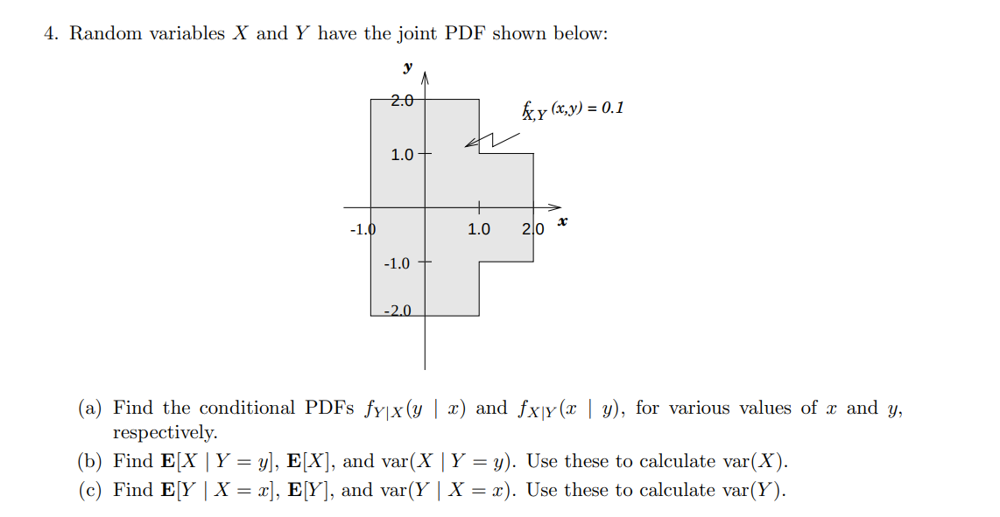

# Unit 6: Further topics on random variables

## The Difference of Two Independent Exponential Random Variables

* Convolution
* X - Y的取值可能是正的也可能是负的，所以$\displaystyle Z = X - Y$需要分情况讨论。
* $\displaystyle P(X = 1) = p(-X = -1) \to f_{-Y}(Z - X) = f_Y(X - Z)$
* 利用对称性简化计算。
* 另一种思路就是直接计算所有可能的点的概率，利用joint PDF。

## The Sum of Discrete and Continuous Random Variables

Let X be a discrete random variable with PMF pX and let Y be a continuous random variable,independent from X, with PDF $f_Y$. Derive a formula for the PDF of the random variable X +Y. 

* 使用了total probability theorm
* 基本策略：对CDF求导$\displaystyle \to$ PDF
* 计算$\displaystyle \sum_X P_X(x)$,如果X取一个无限值，则需要另外的假设，材料中没有给出。
* 本题等效于卷积的计算公式推导。

## Law of Iterated

* $E[X \mid Y] = g(y)$
我们之所以将$E[X \mid Y] = g(y)$，是因为E[]本质上是一个常量。结合lect12中的例子可以知道，y本质上是我们分组的标准，当个y某一个值时，我们对应的将按照这个值取出了一部分的X，然后求这一部分x的期望。这也是条件变量在现实中的应用，在大多数的场景下，它对应着分组。所以我们可以将 $E[X \mid Y]$视作是关于y的常量。

$
\begin{aligned}
E[E[X \mid Y]] 
&= \sum_Y g(Y)P_Y(y) \\ 
&= \sum_Y  \sum_X xP(X \mid Y)P_Y(y) \\
&= \sum_X x \sum_Y P(X \mid Y)P_Y(y) \xrightarrow[total\quad probability]{} \sum_X xP(x) \\
&= E[X]  
\end{aligned}
$  

* $var(X) = E [var(X|Y)] + var (E[X|Y])$
这个表达式:law of total variance

$ var(X) = E[X^2]-E[X]^2$
$ var(X \mid Y) = E[X^2 \mid Y]-E[X \mid Y]^2$
$var(E[X \mid Y]) = E[E[X \mid Y]^2]-E[E[X \mid Y]]^2$

$\displaystyle \begin{aligned}
  E[var(X \mid Y)] 
  &= E[E[X^2 \mid Y]-E[X \mid Y]^2]  \\
  &= E[X^2] - E[E[X \mid Y]^2]
\end{aligned}$

由两个表达式加和可以推导出 law of total variance

* $E[X]$是一个常量
* $E[X \mid Y]$是一个一个关于Y的变量。$\displaystyle E[X \mid Y = 1] $他等效于g(Y) $\displaystyle g(1)$。因为Y是一个随机变量，所以$\displaystyle g(Y)$也是一个随机变量。

## The Variance in the Stick Breaking Problem

law of iterated expectations and law of total variance 帮助你计算E[X]和var(X)。通过使用condition的思想是的将X的期望和方差能够落脚在已知情况之上，分阶段计算。
一个重要的点是：需要着重考虑条件Y，因为如果Y的选取结果不当，对解决问题会没有帮助，这也是需要通过练习着重训练的点。

一个计算技巧：

$var(X) = E[X^2] - (E[X])^2$，利用这个表达式可以简便求E[X^2]

## Widgets and Crates

这道题的特点是：他有非常清晰的层次，因此很容易能够从底层向上层构建条件来简化计算。

注意点：T= $\displaystyle \sum_1^N X_i$ N是随机变量。

## Using the Conditional Expectation and Variance

The random variables X and Y are described by a joint PDF which is constant within the unit area quadrilateral with vertices (0, 0), (0, 1), (1, 2), and (1, 1). Use the law of total variance to find the variance of X + Y .

* 使用 total variance，既可以一X作为条件，也可以以Y作为条件。
* $E[X + Y \mid X] = E[Y] + X$，将X视作是一个常量(虽然他是一个变量，但意义发生了变化，对这个变量作常数处理：$E[x + Y \mid X = x]$)
* $\displaystyle var(X + Y \mid X) = var(Y)$
* X和Y的联合分布是均匀分布，那么条件分布并不会改变这种分布，所以X或者Y的分布依然是均匀分布。

## A Random Number of Coin Flips

(a) You roll a fair six-sided die, and then you flip a fair coin the number of times shown by the
die. Find the expected value and the variance of the number of heads obtained.
(b) Repeat part (a) for the case where you roll two dice, instead of one.

在计算离散的均匀分布时，一个简便的计算公式：$ var(N) = \frac{(b-a)(b - a + 2)}{12}$

在计算 b部分时，因为有两个🎲，所以可以通过将这个实验拆解成两个单独的实验以此可以让计算简便。

## A Coin with Random Bias

We toss n times a biased coin whose probability of heads, denoted by
q, is the value of a random variable Q with given mean µ and positive variance σ2. Let Xi be a Bernoulli random variable that models the outcome of the ith toss (i.e., Xi =1 if the ith toss is a head). We assume that X1,...,Xn are conditionally independent, given Q = q. Let X be the number of heads obtained in the n tosses.
(a) Use the law of iterated expectations to find E[Xi] and E[X].
(b) Find cov(Xi, Xj ). Are X1,...,Xn independent?
(c) Use the law of total variance to find var(X). Verify your answer using the covariance result of part (b). 

* $ var(X) = var(X_1 + X_2 +X_3 + \dots + X_1 ) = var + cov $,他的推导可以设置$E[X_i] = 0$ 
* 计算b部分时，对i和j的讨论需要分情况：i = j or $ i != j $
* 对于bernoulli X, var(X) = p(1- p), E[X] = p
* 计算$var(X) = var(X_1 + X_2 +X_3 + \cdots+ X_n )$有两种计算思路，一种是利用total variance of law , 另一种是使用 $ var(X_1 + X_2 +X_3 + \cdots+ X_n ) = var + cov$

## k-sided fair die

Consider n independent tosses of a k-sided fair die. Let Xi be the number of tosses that result in i.
(a) Are X1 and X2 uncorrelated, positively correlated, or negatively correlated? Give a one-line
justification.
(b) Compute the covariance cov(X1, X2) of X1 and X2.

* E[A_tB_s] = 0,if t = s.
因为当t=s时，意味着这是同一次的投掷筛子，你可以列出所有可能的结果，有四种，三种可能的值是0,一种可能的值不为0,但是发生的概率是0.

## total variance 

* 在计算 var(X)，使用total variance: var(X) = E[var(X | Y)] + var(E[X | Y])
* 在计算 var(E[X | Y])时，用方差的定义计算，然后乘以当前条件的概率：$\frac{2}{10}(0 - \frac{3}{10})^2 + \frac{6}{10}(\frac{1}{2} - \frac{3}{10})^2 +\frac{2}{10}(0 - \frac{3}{10})^2$
* 以X或者Y作为条件时，这个条件满足的概率在均匀分布下指的是面积而不是长度：$\displaystyle 2 \leq y \leq 1$，这个条件的概率是 $\displaystyle \frac{2}{10}$
* 条件方差也可以使用定义式来计算：$\displaystyle E[(Y - E[Y \mid X])^2 \mid X] $
* 注意运用对称属性：对于Y，如果关于X轴对称，求积分为偶数方，那么可以直接简化运算。

## wombat club  

The wombat club has N members, where N is a random variable with PMF
pN (n) = p n−1(1 − p) for n = 1, 2, 3, . . ..
On the second Tuesday night of every month, the club holds a meeting. Each wombat member
attends the meeting with probability q, independently of all the other members. If a wombat
attends the meeting, then it brings an amount of money, M, which is a continuous random
variable with PDF
fM(m) = λe−λm for m ≥ 0.

N, M, and whether each wombat member attends are all independent. Determine:

(a) The expectation and variance of the number of wombats showing up to the meeting.
(b) The expectation and variance for the total amount of money brought to the meeting.

## G1

(a) Let X1, X2, . . . , Xn, Xn+1, . . . , X2n be independent and identically distributed random variables.
Find
E[X1 | X1 + X2 + . . . + Xn = x0],
where x0 is a constant.
(b) Define
Sk = X1 + X2 + . . . + Xk, 1 ≤ k ≤ 2n.
Find
E[X1 | Sn = sn, Sn+1 = sn+1, . . . , S2n = s2n],
where sn, sn+1, . . . , s2n are constants