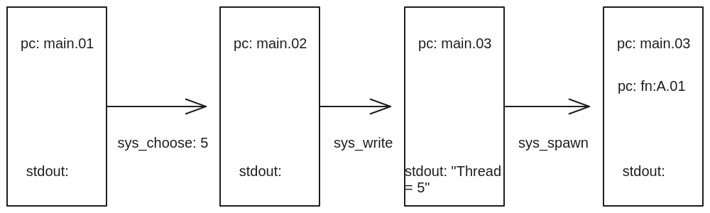
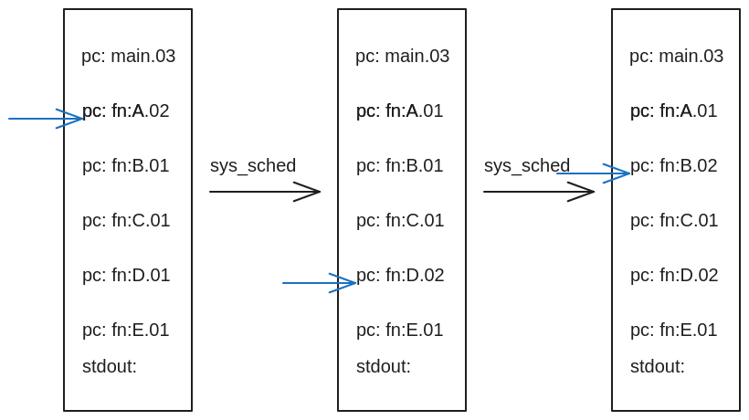

# Python 建模操作系统

## 操作系统 “玩具”：设计与实现

### 50行代码实现

应用程序 = Python代码 + 系统调用
操作系统 = 系统调用的实现 + “假想”的IO设备

简单操作系统的“系统调用”API

* choose(xs): 返回 xs 中的一个随机选项
* write(s): 输出字符串 s
* spawn(fn): 创建一个可运行的状态机 fn
* sched(): 随机切换到任意状态机执行

除此之外，所有的代码都是确定 (deterministic) 的纯粹计算

* 允许使用 list, dict 等数据结构

```python
count = 0

def Tprint(name):
    global count
    for i in range(3):
        count += 1
        sys_write(f'#{count:02} Hello from {name}{i+1}\n')
        sys_sched()

def main():
    n = sys_choose([3, 4, 5])
    sys_write(f'#Thread = {n}\n')
    for name in 'ABCDE'[:n]:
        sys_spawn(Tprint, name)
    sys_sched()
```

main 程序执行状态：



* 程序是执行指令的状态机，当将“视野”放大就能看见更多的状态（标准输出...）。OS就是这个更大状态机器的管理者。



* sys_sched切换状态机（线程）
* 线程和进程之间的区别：
  * 线程之间是共享内存的（对应全局变量 count）。
  * 进程之间的内存是彼此隔离的对（应Tprint(name)函数中的局部变量。）
“文件描述符”指向操作系统一个对象的指针。

#### 实现系统调用

有些 “系统调用” 的实现是显而易见的

```python

def sys_write(s): print(s)
def sys_choose(xs): return random.choice(xs)
def sys_spawn(t): runnables.append(t)
```

* sys_spawn的实现可以将创建的状态机对象放入到一个链表中。

有些就困难了

```python
def sys_sched():
    raise NotImplementedError('No idea how')
```

* 线程的切换需要我们能够保存当前所有状态机的状态，再将执行的指针指向选择的状态机，恢复他的运行状态。

使用Python的好处
天生具有实现线程切换的机制

Generator objects (无栈协程/轻量级线程/...)

```python3
def numbers():
    i = 0
    while True:
        ret = yield f'{i:b}'  # “封存” 状态机状态
        i += ret
```

使用方法：

```python
n = numbers()  # 封存状态机初始状态
n.send(None)  # 恢复封存的状态
n.send(0)  # 恢复封存的状态 (并传入返回值)
完美适合我们实现操作系统玩具 (os-model.py)
```

* 使用numbers()会生成一个generator，每一个generator的实例都是彼此独立并且会保存当前的状态。可以使用这个函数生成的个线程，并手动执行send()模拟线程的切换。
* send()方法是生成器对象的一个方法，它与next()函数类似，用于恢复生成器的执行，并向生成器发送一个值。不同于next()只能将None发送给生成器，send()可以将任意值发送给生成器作为yield表达式的结果。生成器会继续执行，并将send()方法的参数作为yield表达式的结果。
* 真实的操作系统会借助硬件（时钟的中断）每隔一段时间强行打断正在执行的程序（单cpu），并切换到另一个程序，并且他能够查看每一个程序的状态（像极了考试时老师走到你面前看你的卷子）。

真实的操作系统的系统调用

```c
void sys_write(const char *s) { printf("%s", s); }
void sys_sched() { usleep(rand() % 10000); }
int sys_choose(int x) { return rand() % x; }

void sys_spawn(void *(*fn)(void *), void *args) {
    pthread_create(&threads[nthreads++], NULL, fn, args);
}
```

### 500line-model

一个更 “全面” 的操作系统模型
进程 + 线程 + 终端 + 存储 (崩溃一致性)

系统调用/Linux 对应 行为

```python
sys_spawn(fn)/pthread_create 创建从 fn 开始执行的线程
sys_fork()/fork 创建当前状态机的完整复制
sys_sched()/定时被动调用 切换到随机的线程/进程执行
sys_choose(xs)/rand 返回一个 xs 中的随机的选择
sys_write(s)/printf 向调试终端输出字符串 s
sys_bread(k)/read 读取虚拟设磁盘块 k 的数据
sys_bwrite(k, v)/write 向虚拟磁盘块 k 写入数据 v
sys_sync()/sync 将所有向虚拟磁盘的数据写入落盘
sys_crash()/长按电源按键 模拟系统崩溃
```
