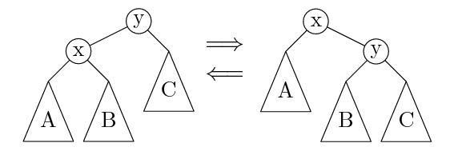

# 8. 调试理论与实践

## 调试的哲♂学

------

``` text
机器永远是对的
不管是 crash 了，Wrong Answer 了，还是虚拟机神秘重启，都是自己背锅

未测代码永远是错的
你以为最不可能出 bug 的地方，往往 bug 就在那躺着
```

软件有两层含义：

* 他是真实世界的投影：现实的需求
* 他是一个计算过程的精确描述（数学）：具体的实现

两者均是bug的来源。

### 调试困难的根本原因

程序员因为写:shit: (fault),导致程序出现bug。但最后能够被看见的确实failure，即报错的信息。程序是状态机，在fault与failure之间往往有很多的状态error（错误的状态），导致两者之间并不会有明显的联系，这也是为什么很难通过failure发现bug。

### 调试理论

```text
调试理论：
如果我们能判定任意程序状态的正确性，那么给定一个 failure，
我们可以通过二分查找定位到第一个 error 的状态，此时的代码就是 fault (bug)。
```


利用调试理论，我们只要找到一个状态的节点，判断他是否是正确的，再利用二分查找就能够确定error发生的地方。

调试理论之所以看起来不太有用，是因为当涉及到较为复杂的结构时，很难去判断当前程序状态的正确性，比如在实现B+tree的时候插入或者删除（需要回收）的时候，很难判断中间某个状态是不是正确的（插入一万条数据,你想要知道第5000次插入形成的节点的结构是不是正确的？）。

### 实际调试

实际中的调试：观察状态机执行 (trace) 的某个侧面

* 缩小错误状态 (error) 可能产生的位置
* 作出适当的假设
* 再进行细粒度的定位和诊断

最重要的两个工具

* printf → 自定义 log 的 trace
  * 灵活可控、能快速定位问题大概位置、适用于大型软件
  * 无法精确定位、大量的 logs 管理起来比较麻烦（你需要还一种变量或者以另一种数据结构来进行打印。
* gdb → 指令/语句级 trace
  * 精确、指令级定位、任意查看程序内部状态
  * 耗费大量时间

**调试理论给了大家在遇到 “任何问题” 时候 self-check 的列表:**

1. 是怎样的程序 (状态机) 在运行？
2. 我们遇到了怎样的 failure？
3. 我们能从状态机的运行中从易到难得到什么信息？
4. 如何二分检查这些信息和 error 之间的关联？

## 调试理论实践

------

Debug (fault localization) 的基本理论回顾：

Fault (程序/输入/配置错) → Error → Failure (可观测)
绝大部分工具的 Failure 都有 “原因报告”
因此能帮助你快速定位 fault
man perror：标准库有打印 error message 的函数

如果问题不能帮你定位到 fault/error？

**出错原因报告不准确或不够详细**
**程序执行的过程不够详细**
既然我们有需求，那别人肯定也会有这个需求 一定有信息能帮助我们!

一个标准的解决流程是: 打开日志。根据日志结合调试理论。

## GDB入门

------

GDB: 最常用的命令在 [gdb cheat sheeet](./res/lect8/gdb-cheat-sheet.pdf)

打印贴在电脑前，调试时候看一遍，很快就大致记住了
想要更好的体验？

* GDB 本身也是一个编程语言
  * 它甚至支持 Python
  * 我们可以执行一些初始化代码 (-x)
* 库函数也是代码
  * directory 命令增加源码路径
  * GDB 有许多前端
    * cgdb, pwndbg, vscode, ...
* RTFM - M 比 ChatGPT 好用在于它不需要 prompt 且全面

## 调试理论的实际应用(again)

### 判断代码好坏的三个标准

* 不言自明
  * 即需求和实现相适应（specification）
* 不言自证
  * 代码本身提供了证明正确性的手段—— **assert**

### 调试理论最重要的应用

**写出隐含的假设**
缩短逻辑链条

  ```text
  断言的意义：
    将代码中的隐藏的specification表示出来
    1. Fault -> Error （靠测试）
    2. Error -> Fault （依靠断言）
      Error暴露的状态越晚，越难调试（中间状态越多）
      追溯导致assert failure的变量值（slice）通常可以快速定位bug
  ```

**例子**


```c
// 结构约束
assert(u->parent == u ||
       u->parent->left  == u ||
       u->parent->right == u);
assert(!u->left  || u->left->parent  == u);
assert(!u->right || u->right->parent == u);

// 数值约束
assert(!u->left  || u->left->val  < u->val);
assert(!u->right || u->right->val > u->val);
```

### 更多的断言

每一次指针访问时，都增加一个断言

```c
int *ref(int *a, int i) {
  return &a[i];
}

void foo() {
  int arr[64];
  *ref(arr, 64) = 1; // bug
}
```

一个神奇的编译选项

* -fsanitize=address
* Address Sanitizer; asan “动态程序分析”

Sanitizer 是一类重要的 “动态程序分析”。所谓动态，就是指观察程序的运行 (即状态机的执行)。动态分析能给出许多程序有趣的性质，包括性能和功能性的 bugs。相应地，也有静态程序分析，即不在实际的环境中运行程序，就能对程序的行为作出预测——编译器和编译优化就是一类重要的静态分析。

## Take-away Messages

调试理论：bug 是如何发生的？

* Fault → (测试) → Error → (断言) → Failure
* 调试一切问题的 checklist
  1. 是怎样的程序 (状态机) 在运行？
  2. 我们遇到了怎样的 failure？
  3. 我们能从状态机的运行中从易到难得到什么信息？
  4. 如何二分检查这些信息和 error 之间的关联？

残酷的现实和难听的本质

* 道理都懂，但出 bug 了，还是不知道怎么办？一句难听的话：你对代码的关键部分还不熟悉。 根据调试理论，你还不知道如何判定程序状态是否正确，或是对如何简化程序状态还没有经验：

  * 编程基础不牢固
  * 对项目代码不理解
  * 最根本的原因：抱有 “我不理解这个也行” 的侥幸心理。
