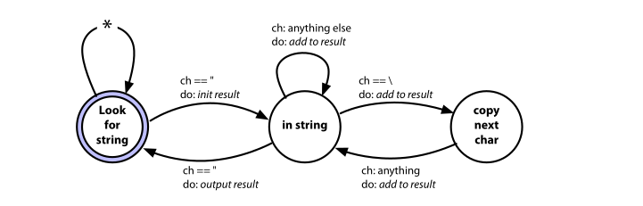

# Bend, or Break

The Theme is about writing reversible decisions code.

## Decoupling

* Train wrecks—chains of method calls
* Globalization—the dangers of static things
* Inheritance—why subclassing is dangerous

topic of how to keep separate concepts separate, decreasing coupling.

### Tell, Don’t Ask

* 高度耦合：代码的不同部分之间高度耦合，需要了解许多细节才能理解和维护代码。
* 隐式知识：代码中存在大量隐式的知识，维护者需要知道各个对象之间的关系和操作，这使得未来的更改变得困难。
* 缺乏责任划分：总计信息对象(totals)应该负责管理总计信息，但实际上它只是一个容器，任何人都可以查询和更新其字段。

不因该将类仅仅视作一个容器，他是一个管理者。

```java
public void applyDiscount(customer, order_id, discount) {
 totals = customer
 .orders
 .find(order_id)
 .getTotals();
 totals.grandTotal = totals.grandTotal - discount;
 totals.discount = discount;
}
```

这里的核心的原则是，我们不应该根据对象的状态来做决策。这么做会使得封装的好处丧失，让类的实现暴露


```java
public void applyDiscount(customer, order_id, discount) {
customer
.orders
.find(order_id)
.getTotals()
.applyDiscount(discount);
}
```

所以首先删除了关于totals对象的操作,customer自己去修改totals。

其次，我们不应该从对象中获取，然后再去查找，我们应该直接拿到我们想要的

```java
public void applyDiscount(customer, order_id, discount) {
customer
.findOrder(order_id)
.getTotals()
.applyDiscount(discount);
}
```

同样的，我们不应该知道order用一个单独的对象来存储totals，所以因该删除掉。

```java
public void applyDiscount(customer, order_id, discount) {
customer
.findOrder(order_id)
.applyDiscount(discount);
}
```

### The Law of Demeter

### Don’t Chain Method Calls

### Chains and Pipelines

### The Evils of Globalization


## Juggling the Real World

different strategies to help manage and react events

* Finite State Machines
* The Observer Pattern
* Publish/Subscribe
* Reactive Programming and Streams

### Finite State Machines

```Ruby
TRANSITIONS = {
    initial: {header: :reading},
    reading: {data: :reading, trailer: :done},
}
state = :initial
while state != :done && state != :error
    msg = get_next_message()
    state = TRANSITIONS[state][msg.msg_type] || :error
end

```



* in string and copy next char 他们最主要的区别就是：当字符串中有"，前者会直接结束，输出结果，后者则是恢复到in string。这也是为什么要有一个next char。


```Ruby
TRANSITIONS = {
# current       new state       action to take
#---------------------------------------------------------
look_for_string: {
'"'         => [ :in_string,       :start_new_string ],
:default    => [ :look_for_string, :ignore ],
},

in_string: {
'"'         => [ :look_for_string,  :finish_current_string ],
'\\'        => [ :copy_next_char,   :add_current_to_string ],
:default    => [ :in_string,        :add_current_to_string ],
},

copy_next_char: {
:default    => [ :in_string,        :add_current_to_string ],
}
}
```

```Ruby
state = :look_for_string
result = []
while ch = STDIN.getc
    state, action = TRANSITIONS[state][ch] || TRANSITIONS[state][:default]
    case action
    when :ignore
    when :start_new_string
        result = []
    when :add_current_to_string
        result << ch
    when :finish_current_string
        puts result.join
    end
end
```

### The Observer Pattern

```Ruby module Terminator
    CALLBACKS = []
    def self.register(callback)
        CALLBACKS << callback
    end
    def self.exit(exit_status)
        CALLBACKS.each { |callback| callback.(exit_status) }
        exit!(exit_status)
    end
end

Terminator.register(-> (status) { puts "callback 1 sees #{status}" })
Terminator.register(-> (status) { puts "callback 2 sees #{status}" })

Terminator.exit(99)

$ ruby event/observer.rb

callback 1 sees 99
callback 2 sees 99
```

### Publish/Subscribe

solve observer pattern problem:

1. performance neck
2. coupling

it's a message passing system.
decoupling the pubsub and subscribers by abstract communication.

### Reactive Programming, Streams, and Events

example:

* vue.js React

```js
import * as Observable from 'rxjs'
import { logValues }
from "../rxcommon/logger.js"

let animals = Observable.of("ant", "bee", "cat", "dog", "elk")
let ticker = Observable.interval(500)

let combined = Observable.zip(animals, ticker)
combined.subscribe(next => logValues(JSON.stringify(next)))
```

```JS
import * as Observable from 'rxjs'
import { mergeMap }
from 'rxjs/operators'
import { ajax }
from 'rxjs/ajax'
import { logValues }
from "../rxcommon/logger.js"
let users = Observable.of(3, 2, 1)
let result = users.pipe(
mergeMap((user) => ajax.getJSON(`https://reqres.in/api/users/${user}`))
)
result.subscribe(
resp => logValues(JSON.stringify(resp.data)),
err => console.error(JSON.stringify(err))
)
```

### Transforming Programming

It's a coding style more than traditional procedural and object-oriented couple. Taking advantage of function pipelines.

## Inheritance Tax

Inheritance is first appeared in Simula 67 in 1969.

prefix classes :

```Java
link CLASS car;
... implementation of car
link CLASS bicycle;
... implementation of bicycle

```

styles of inheritance:

* Java and C++: inherirance is a way of combining types
* JS and Ruby: inheritance is dynamic organization.


### Problems Using Inheritance to Share Code


top-code: Vehicle 
down: Car

change Vehicle will change Car.

### Problems Using Inheritance to Build Types

* 会导致层的结构越来越复杂，为了表示类与类之间细微的差别。
* 出现多继承问题，即一个类他既可以是A，也可以是B，C......


### Don’t Pay Inheritance Tax

代替inheritance：

* Interfaces and protocols
* Delegation
* Mixins and traits

#### Interfaces and Protocols

Java: Interfaces
other: protocols or traits(different from down)

接口的强大之处：任何实现了了接口的类型与接口是可兼容的。

#### Prefer Interfaces to Express Polymorphism

#### Delegate to Services: Has-A Trumps Is-A

#### Mixins, Traits, Categories, Protocol Extensions

```Ruby
mixin CommonFinders {
    def find(id) { ... }
    def findAll() { ... }
end
class AccountRecord extends BasicRecord with CommonFinders
class OrderRecord extends BasicRecord with CommonFinders
```

本质上这貌似就是组合：

```java

interface CommonFinders {
    void find(int id);
    void findAll();
}

class AccountRecord implements CommonFinders {
    // 实现 CommonFinders 中的方法
    // ...
}

abstract class CommonFinders {
    abstract void find(int id);
    abstract void findAll();
}

class AccountRecord extends CommonFinders {
    // 实现 CommonFinders 中的方法
    // ...
}


interface CommonFinders {
    void find(int id);
    void findAll();
}

class CommonFindersImpl implements CommonFinders {
    // 实现 CommonFinders 中的方法
    // ...
}

class AccountRecord {
    private CommonFinders commonFinders = new CommonFindersImpl();
    // 其他功能
}

```